# 스튜디오 하단 레인 보드 — 목업 4장 + 현재/제안 비교 (2026-09-17)

상태: **사용자 승인 (2026-09-17). 스튜디오 셸 후속 작업은 이 설계를 우선 반영한다.**
상위 문서: [2026-09-15-studio-agent-lanes-design.md](../2026-09-15-studio-agent-lanes-design.md) §11.

## 결론 한 줄

에이전트별 진행 상황은 **하단 덱의 「레인 보드」 표**로 보인다. 왼쪽 레일 「조수」 절에 레인 행을 넣고 덱을 도구 서랍(오버레이)으로 바꾼 §9/§10 배치는 폐기한다.

## 목업

| 파일 | 뷰포트 | 상태 |
| --- | --- | --- |
| `mock-1440-entry.png` | 1440×900 | 진입 직후. 레인 0 → 덱은 한 줄로 접힘 |
| `mock-1440-lanes.png` | 1440×900 | 에이전트 4개 동시(작업 중 2 · 결과 대기 1 · 대기 1) |
| `mock-1440-lane-thread.png` | 1440×900 | 보드에서 시공B 를 눌러 오른쪽에 레인 스레드가 열림 |
| `mock-1280-lanes.png` | 1280×800 | 장면 레일 접힘. 보드는 4레인 그대로(268px) |
| `compare-current-vs-proposed.png` | 2904×948 | 위: 현재(도구 서랍 열림) · 아래: 제안 |

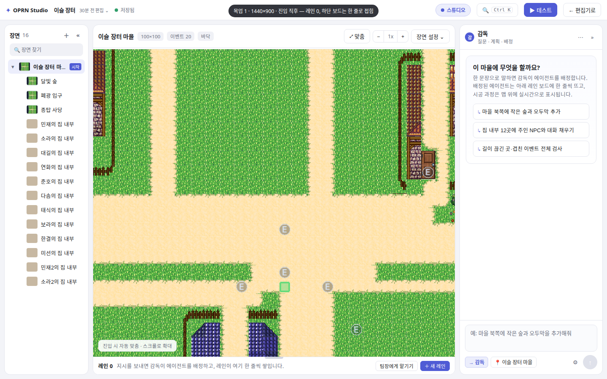
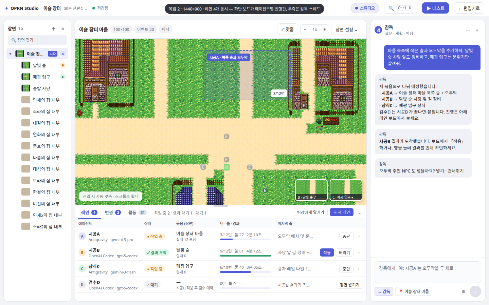
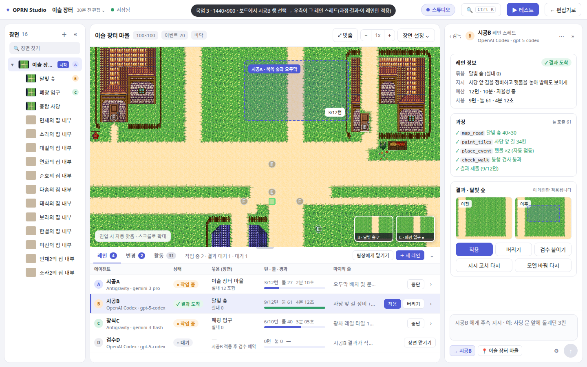
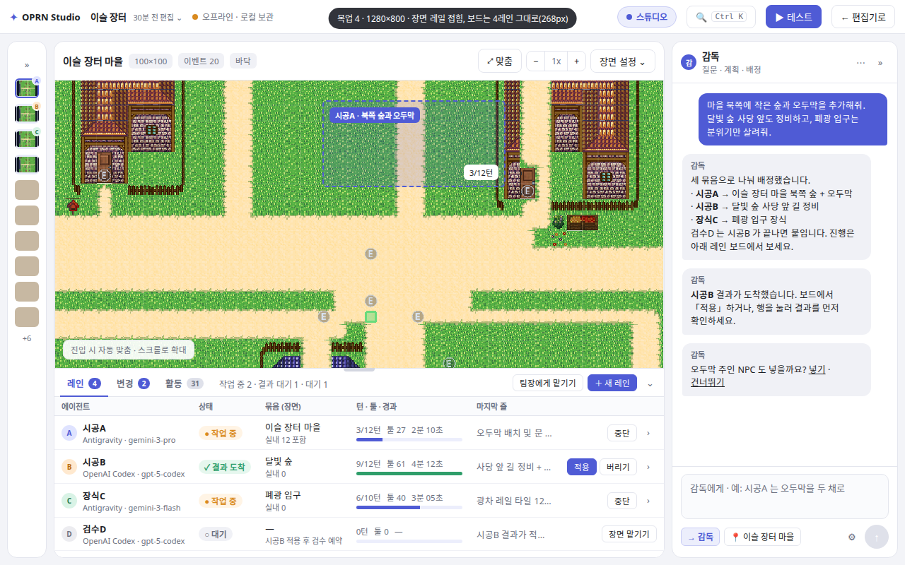
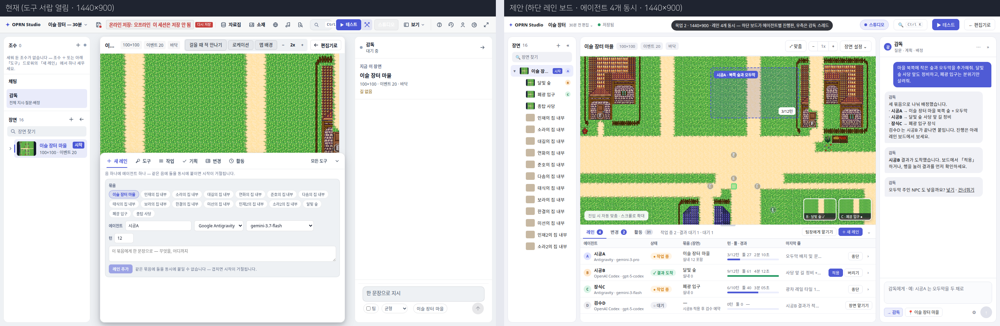

## 배치

```
┌ 장면 레일 ┬────────── 모니터(맵 캔버스) ──────────┬ 오른쪽 스레드 ┐
│ 장면 트리  │ 시공A 고스트(점선 박스)               │ 감독 스레드    │
│ +A/B/C    │ 시공B·장식C 라이브 썸네일             │ 또는 선택 레인 │
│ 배지      │                                      │ 스레드         │
├───────────┴──────────────────────────────────────┴───────────────┤
│ 하단 레인 보드 (그리드 행, 1440: 284px · 1280: 268px)               │
│ [레인 4] [변경 2] [활동 31]   작업 중 2 · 결과 대기 1 · 대기 1        │
│                               [팀장에게 맡기기] [＋ 새 레인] [⌄]      │
│ 에이전트(제공자·모델) │ 상태 │ 묶음(장면) │ 턴·툴·경과 │ 마지막 줄 │ 동작 │
└───────────────────────────────────────────────────────────────────┘
```

### 하단 레인 보드
- **덱은 그리드의 한 행**이다. 오버레이 서랍(`is-deck-overlay`, `is-drawer`)이 아니다. 모니터를 가리지 않는다.
- 탭은 **레인 · 변경 · 활동** 세 개. 도구·소재·기획·새 레인 탭은 덱에서 나간다.
  - 도구 카탈로그 → 기존 「모든 도구」 모달(Ctrl K, `StudioShell.onUseTool` 재사용).
  - 새 레인 폼 → 「＋ 새 레인」 버튼의 팝오버.
- 캡션: `작업 중 N · 결과 대기 N · 대기 N`.
- 표 열: 에이전트(제공자·모델 부제) / 상태 칩 / 묶음(장면) / 턴·툴·경과 + 진행 바 / 마지막 줄(최근 툴 호출 또는 결과 요약) / 동작.
- 행 동작: 작업 중 → **중단**. 결과 도착 → **적용 · 버리기**. 대기 → **장면 맡기기**. 모든 행 끝에 `›` (레인 스레드 열기).
- 레인 0 개: 덱은 한 줄 미니 상태로 접힘. `레인 0 — 지시를 보내면 감독이 에이전트를 배정하고, 레인이 여기 한 줄씩 쌓입니다.`
- 덱 `⌄` 로 접었을 때도 같은 한 줄 미니 상태를 유지한다(작업 중 개수 포함).

### 오른쪽 스레드 (단일 스레드)
- 기본은 감독 스레드. 보드 행이나 `›` 를 누르면 그 레인의 스레드로 바뀐다.
- 레인 스레드 구성: 레인 정보(에이전트·모델·묶음·경과) → 과정(툴 호출 타임라인) → 결과(이전/이후 썸네일) → 동작 **적용 · 버리기 · 검수 붙이기** / **지시 고쳐 다시 · 모델 바꿔 다시**.
- 컴포저 수신자 칩: `→ 감독` 기본, 레인 선택 시 `→ 시공B`. 칩을 눌러 되돌린다.

### 모니터
- 작업 중 레인은 캔버스 위에 **점선 고스트 박스**(레인 이름 + 턴 진행) 로 표시된다.
- 다른 장면에서 작업 중인 레인은 모니터 모서리에 **라이브 썸네일**로 보인다. 썸네일 클릭 → 그 장면으로 전환.

### 왼쪽 장면 레일
- 장면 트리만 남긴다. 레인이 붙은 장면에 A/B/C 배지. §9 의 「조수」 레인 행 절은 제거.
- 1280 에서는 접힌다(미니 레일). 보드는 그대로 4행.

## 목업 데이터 (참고)

| 레인 | 제공자 · 모델 | 상태 | 장면 |
| --- | --- | --- | --- |
| 시공A | Antigravity · gemini-3-pro | 작업 중 3/12턴 | 이슬 장터 마을 |
| 시공B | OpenAI Codex · gpt-5-codex | 결과 도착 | 달빛 숲 |
| 장식C | Antigravity · gemini-3-flash | 작업 중 | 폐광 입구 |
| 검수D | OpenAI Codex · gpt-5-codex | 대기 | — |

레인당 모델 선택은 §5 대로 P0.

## 재렌더

```bash
node docs/superpowers/specs/2026-09-17-studio-lane-board-mockups/render.mjs
```

`mock.html?v=entry|work|lane|narrow` 를 Playwright chromium 으로 찍는다. `map-full.png`·`thumb.png` 는 목업에 쓰인 정적 소재다. 비교 이미지는 실제 스튜디오 스크린샷(`.playwright-mcp/studio-qa/shots/03-deck-open-default.png`, gitignore) 과 `mock-1440-lanes.png` 를 ImageMagick 으로 이어 붙인 것이다.


## 구현 결과

같은 날 구현 PR 의 실화면. `scripts/capture-studio-lane-board.mjs` — 동반 서비스를 로컬 NDJSON 스트리밍 서버로 대체해
레인 3개를 진짜 UI 로 세우고(＋ 새 레인 → 폼 → 레인 추가) 진짜 레인 매니저·고스트 싱크를 통과시킨 캡처다. 모델 호출은 없다.

| | |
|---|---|
| 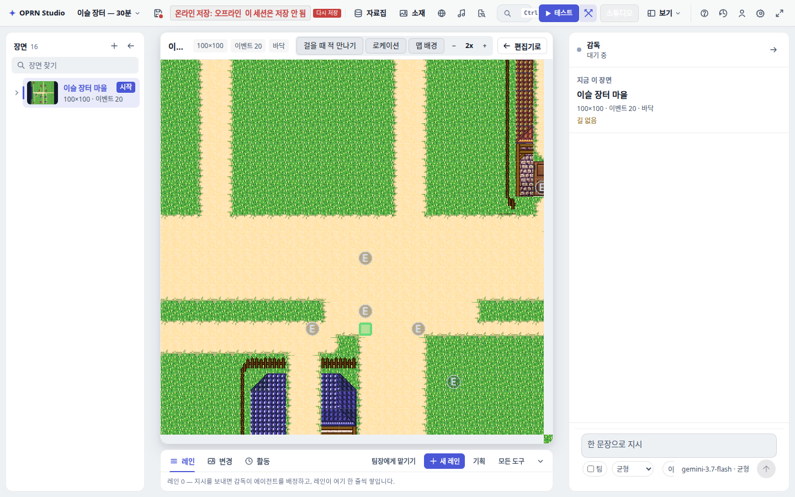 레인 0 — 덱은 한 줄 미니 상태 | 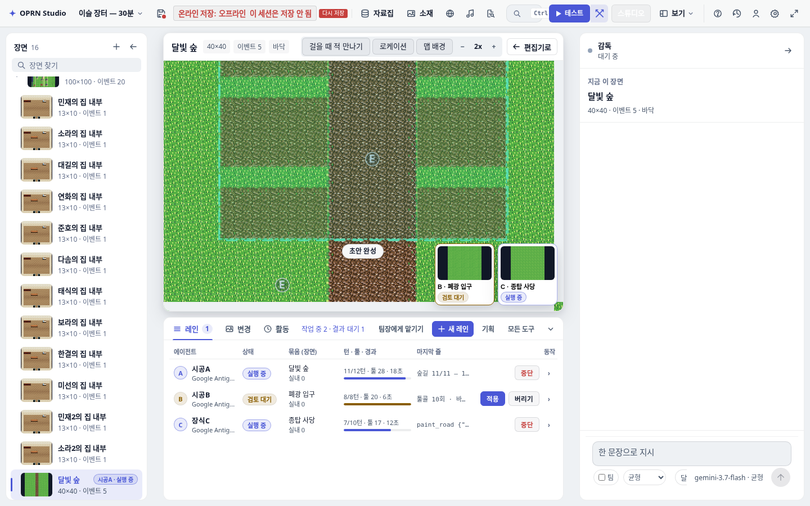 1440 — 작업 중 2 · 결과 대기 1, 달빛 숲 위 시공A 고스트, 모서리에 B·C 썸네일 |
| 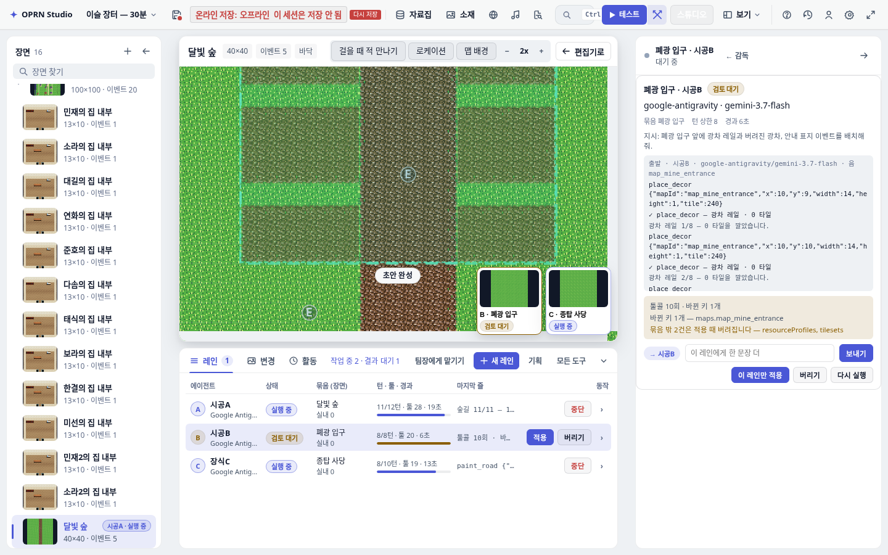 행 클릭 → 오른쪽이 시공B 스레드, 수신자 칩 `→ 시공B`, 이 레인만 적용 | 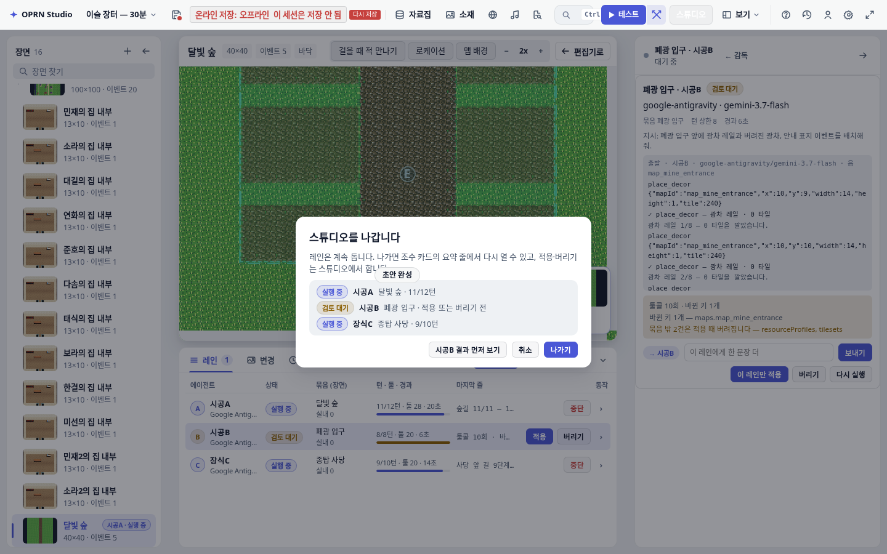 「편집기로」 — 작업 중 레인이 있으면 확인창 |
| 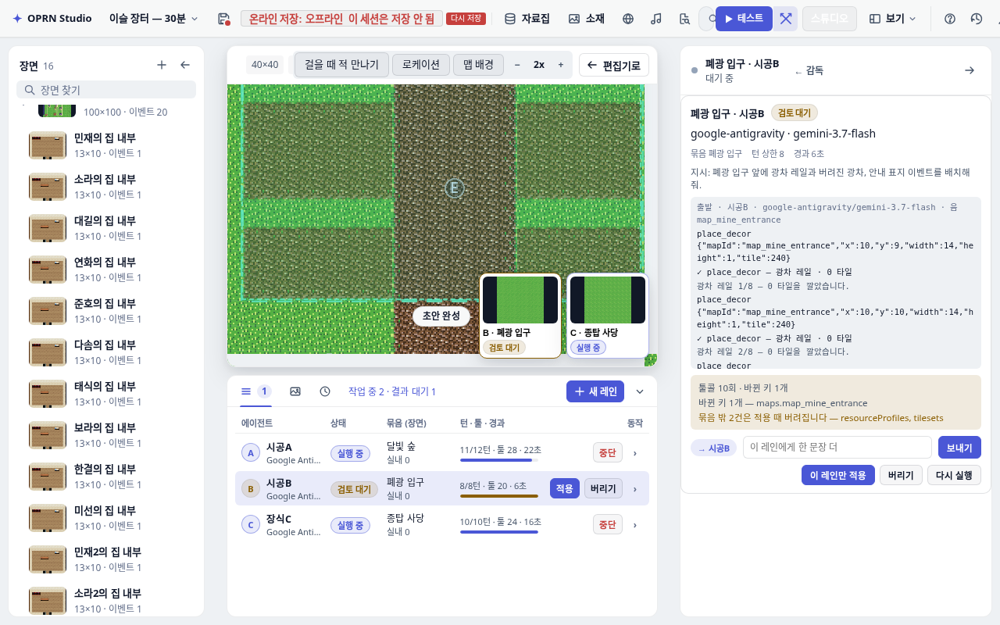 1280 — 마지막 줄 열을 감추고 5열 | 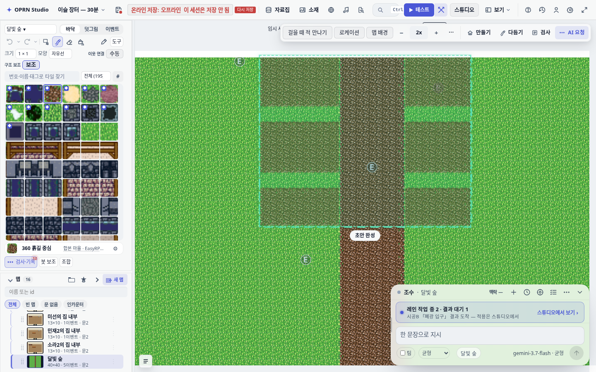 표준 편집기 — 조수 카드 요약 줄 + 캔버스 고스트 |
| 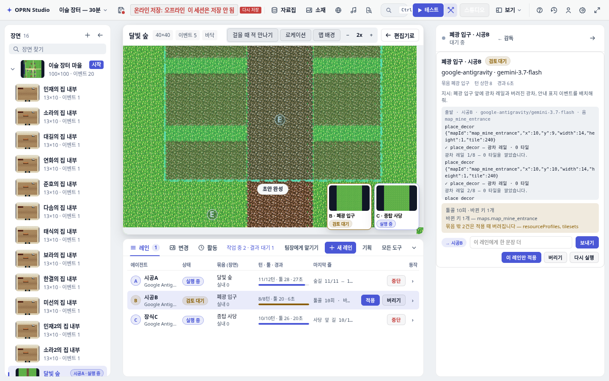 「스튜디오에서 보기」 → 결과 대기 레인 스레드로 바로 | |

목업과 다른 점: 1440 기본 열 폭(장면 252 · 채팅 400)에서 덱이 ≈710px 이라 「마지막 줄」 열이 목업보다 좁다.
표 열 최소 폭을 조여 6열이 다 서게 했고, 660px 아래(1280 기본)에서는 그 열을 감춘다.
