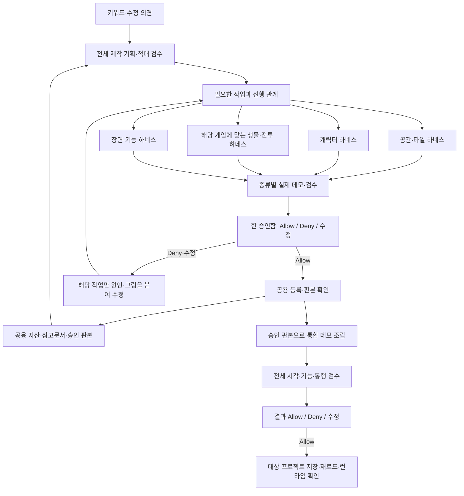

# 키워드 하나에서 전체 제작으로 — 하네스 통합 계약

상태: 사용자 방향 확인 완료, 구현 전 설계. 이 문서는 전체 통합 완료 증거가 아니다.
사용자 확인(2026-10-05): 키워드를 시작점으로 공간·타일·캐릭터·몬스터 등 필요한 제작을
각 전문 하네스에 맡기고, 사용자는 슈퍼하네스 한 화면에서 데모와 Allow/Deny만 본다.

## 사용자 경험

1. 키워드를 입력한다. 필요하면 세계관·화풍·게임 종류를 한 줄로 덧붙인다.
2. 슈퍼하네스가 기존 공용 재료를 조사하고 전체 제작 기획을 적대적으로 검수한다.
3. 필요한 제작을 전문 하네스에 배정한다. 공통 재료는 여러 공간이 함께 쓴다.
4. 실제 배치 예시·걷기 GIF·전투 예시·장면 데모가 한 승인함에 모인다.
5. 사용자는 Allow / Deny / 수정 의견을 남긴다. 어느 하네스에 전달할지는 시스템이 판단한다.
6. 승인한 원본의 정확한 판본을 공용 자산으로 등록하고, 그 판본을 사용해 전체 데모를 조립한다.
7. 결과의 Allow 이후 대상 프로젝트에 저장하고 같은 저장소에서 재로드·런타임 확인을 한다.

사용자가 후보 번호, 하네스 종류, JSON 경로, 수리 분류, 등록 스크립트를 고르지 않는다.
개별 작업과 전체 제작의 상태를 구분한다. 한 타일 제작 실패로 키워드나 다른 공간을 폐기하지 않는다.

## 현재 코드에서 확인된 연결과 결손

| 구간 | 확인된 현재 상태 | 필요한 연결 |
| --- | --- | --- |
| 키워드 → 공간 목록 | keyword_seeds.py, 6개 제안/미완료 12개에서 보충 대기 | 전체 제작 기획과 공통 재료 소유권 |
| 공간 → 기획·재료 검수 | sh.py의 plan/survey/material-review | 공용 재료 재사용과 모든 제작 종류에 대한 작업 분배 |
| 부족한 그림 → native 실행 | art_execution.py: interior-props, modern-chipset만 직접 실행 | 나머지 하네스별 실행·상태·결과·승인·등록 어댑터 |
| native → 데모 | art_demo.py의 원본 해시를 확인한 무배율 조립 | 인물·전투·장면별 실제 시연과 통합 시연 |
| 데모 Allow → 다음 단계 | space_decisions.py에 선택 저장, art_choices.py에서 설치 영수증 읽기 | 일반적인 설치 영수증 작성자와 등록/재조사 스케줄러 |
| 하네스 목록 | _core/registry.ts에 등록된 10종 | 동일 레지스트리에서 실행 능력과 결과 전달 계약도 읽기 |
| 에디터 공방 | workshopHarnesses의 editorUi+workshop 필터; 현재 실내 기물 | 통합 제작과 동일한 작업·승인함에 연결 |
| 다른 하네스의 공용 결과 | shared-content.sqlite의 charset-actor-kept, worldmap-human-selected, oprn-hand-interior-harness 등 | 해당 판본을 제작 기획·재료 조사·조립 입력까지 전달 |

CLI가 있거나 같은 서버에 화면이 있다는 사실만으로 자동 실행/등록 가능 상태라고 표시하지 않는다.
작업 프로세스 종료, native 검사 통과, 사용자 승인, 공용 등록, 프로젝트 설치는 각각 별도 사실이다.

## 구조와 소유권

- 슈퍼하네스: 전체 기획, 작업 의존 관계, 실행 자리, 공통 진행, 승인 요청, 등록/조립 연결.
- 전문 하네스: 자기 시드·화풍·모델·제작기·검사·원본·선택 저장소. 기존 규칙과 데이터 유지.
- 공용 라이브러리: 승인된 자산의 출처·판본·참고문서와 재사용 가능한 등록 형태.
- 프로젝트 호스트: 실제 설치 대상과 저장/재로드. 공용 등록을 프로젝트 설치라고 표시하지 않는다.

공용 작업 원장은 sh.sqlite에 둔다. 각 native DB를 합치지 않는다. 외부 상태는 읽어서 반영하며,
선택 쓰기는 해당 하네스의 공식 선택 API/CLI로만 전달한다.

## 실행 어댑터가 제공해야 하는 계약

각 하네스의 manifest에 범위/산출물/연결 능력을 선언한다. Python 실행기를 위해 같은
registry에서 JSON을 생성한다. 두 번째 수동 하네스 목록을 만들지 않는다.

| 기능 | 입력 | 반환 및 필수 근거 |
| --- | --- | --- |
| canHandle | 산출물 종류, 장르, 시대, 투영, 요구사항 | 처리 가능/불가와 구체 사유. 범위 밖 우회 금지 |
| prepare | 작업 id, 기획 판본, 참고 원본, 격리 경로 | native 요청, 검수할 도면, 입력 해시. 생성 시작과 분리 |
| start | 검수된 입력, 멱등 키, 승인된 모델 설정 | native 작업 id, 원본 저장소, 실행 소유자 |
| observe | native 작업 id | 실제 단계, 완료 수, 최근 출력, 오류, 그림 목록 |
| demo | 현재 원본/검수 해시 | 실제 시연 파일, 사용한 원본 목록, 시연 종류 |
| decide | 사용자 결정, 원본 및 데모 해시, 수정 의견 | native 저장소에 저장 후 다시 읽은 결정 영수증 |
| publish | 유효한 Allow와 native 검수 | 공용 library id/revision, 재조회 결과, 자산/참고문서 바인딩 |
| install | 공용 판본, 대상 project id/host | 저장·재로드·실제 동작 확인 영수증 |

`start` 타임아웃은 곧바로 실패 재실행하지 않는다. native 작업 id를 먼저 조회하고
동일 멱등 키의 기존 요청을 찾아 중복 생성/과금을 막는다. 응답 형식 오류도 원본 결과를 보존한다.
선택·설치·공용 게시 작업을 모델의 완료 문장으로 인증하지 않는다.

## 작업과 전달물

공통 작업에는 productionId(키워드 제작 묶음), taskId, capability/harnessId, nativeRunId,
inputFingerprint, dependsOn, status, retryCount, artifactRefs, decisionRef,
publicationRef, installationRef를 둔다. native 동작에 필요한 비밀 설정은 원장에 넣지 않는다.

상태는 queued → preparing → reviewing-input → producing → reviewing-artifact →
awaiting-user → publishing → available → assembling → reviewing-demo 순서로 표현한다.
작업 종류에 필요 없는 단계는 근거와 함께 생략한다. runtime-verified는 프로젝트 정본
재로드와 실제 게임 확인을 모두 갖춘 최종 결과만 사용한다.

별도 대기 사유: dependency, capacity, provider-backoff, user-decision,
adapter-missing, project-target-missing. 원인 없는 ‘막힘’이나 모두 같은 ‘실행 중’으로 합치지 않는다.

전달물은 파일 경로만 넘기지 않는다. 산출물 종류, SHA-256, 투영/셀 크기, 장르/세계관,
레이어/충돌/상태/프레임 계약, 검수 근거, 결정 영수증, 공용 library/revision을 함께 묶는다.
소비자는 원본이 바뀌면 자기 검수/데모/설치 근거를 오래된 것으로 표시하고 필요한 부분만 다시 만든다.

## 하네스별 범위와 연결 순서

| 담당 | 사용할 하네스 | 지켜야 하는 경계 |
| --- | --- | --- |
| 공간 설계·조립 | super-harness와 기존 공간 도구 | 모든 재료가 준비되기 전 빈 재료로 완성 처리 금지 |
| 가구·소품 | interior-props | 3/4·레이어·문 상태·공용 기물 바인딩 |
| 현대 구조물·차량 | modern-chipset | 승인된 모델과 시대, 시설 전체 조립 검수 |
| 일본 도시 재료 | jp-city | jp_city/modern3 전용, 사람 선택과 번들 등록 |
| 조선 공간·재료 | joseon-baram | 조선 팔레트·조각/지도 관문, 원본 해시 판정 |
| 인물·걷기 | charset-actor | 12프레임 원본·GIF·결손 검사·사람의 현재 해시 선택 |
| 월드맵 장소 아이콘 | worldmap-icons | 월드맵 투영·칸 번호 고정·사람 선택·공용 게시 |
| 수집형 몬스터 | monster-collect-species | monster-collect 장르만. 일반 전투 생물과 혼용 금지 |
| 관계 중심 첫 장면 | romance-scene | story-cutscene 범위, 양쪽 선택·취소·재대화·종료 검사 |
| 조수 도구 수행 검증 | assistant-capability | 제작 자산으로 취급하지 않음. 연결된 도구 실행 증거 확인 |

다른 체크아웃에만 있는 추가 하네스(예: battle-monster)는 먼저 정식 registry와
그 장르/산출물 계약을 확인해야 한다. 프로세스가 떠 있다는 이유로 정식 지원 목록에 넣지 않는다.
일반 전투 생물, 음악, 효과 등 등록된 전용 경로가 없는 요구는 구현 과제로 표시하고
공간용 타일 하네스나 수집형 몬스터 하네스에 억지로 배정하지 않는다.

## 해리포터 제작 묶음 적용

현재 생성된 12개 공간의 id·기획·작업을 그대로 해당 제작 묶음에 연결한다. 재발견/중복 실행하지 않는다.
새 전체 기획은 각 공간의 필요를 비교해 석재 벽·책장·조명·학교 인물 등 공통 요구를 합친다.
전체 기획과 개별 공간 기획이 어긋나면 의존 입력을 명시하고 영향받는 부분만 다시 검수한다.
인물 외형은 걷기 GIF에서, 소품은 배치 장면에서, 전투 생물은 해당 전투 형식에서 판단하도록 한다.
필요가 확인되지 않은 몬스터/연애 장면 등을 목록을 채우기 위해 생성하지 않는다.

한 공간의 책장 FAIL은 책장 수정만, 문 방향/접합 FAIL은 배치 수정부터 시작한다.
같은 가구를 공유하는 여러 공간이 수정 전 판본을 사용 중이면 해당 공간들의 최종 반영만 기다린다.
무관한 캐릭터/다른 공간 제작은 계속한다. 서로 다른 하네스도 공통 실행 상한을 공유한다.

## 구현 순서와 완료 판단

1. 공통 manifest/작업 원장/상태·영수증 계약. 기존 데이터에 id 연결만 추가하는 비파괴 이관.
2. 실내 기물·현대 칩셋의 현재 실행 경로를 어댑터로 감싸서 동작을 보존.
3. Allow → native 결정 저장 → 공용 등록 → 재료 재조사 → 통합 데모 전달을 먼저 연결.
4. 캐릭터·월드맵·세계관별 타일·장르별 장면을 어댑터 단위로 추가. 각 추가가 같은 승인함으로 들어옴을 확인.
5. 키워드 전체 기획과 필요한 제작 분배를 연결하고 기존 해리포터 묶음을 이관.
6. 에디터 공방이 같은 제작 묶음·승인함·공용 자료를 조회하게 연결.
7. 대상 프로젝트에 승인 결과를 저장하고 재로드·런타임 확인. 대상이 없으면 그 부분만 대기 사유 명시.

완료 근거는 반드시 실제 경로에서 확보한다:
- 한 키워드에서 최소 2종 전문 하네스 작업이 연결되고, 재시작 뒤에도 같은 작업/선택을 유지.
- 한 화면에서 서로 다른 종류의 실제 데모를 보고 Allow/Deny가 각각 native 저장소에 반영.
- Allow한 현재 해시만 공용에 등록되고, 등록된 같은 판본이 실제 조립 입력으로 전달.
- 한 작업의 FAIL/429/Deny가 다른 독립 작업을 멈추거나 기존 결과를 지우지 않음.
- 원본 변경 시 오래된 승인을 재사용하지 않음. 재전송으로 같은 native 작업을 중복 생성하지 않음.
- 최종 프로젝트의 저장 대상·project id·재로드 및 게임 화면 근거가 존재.

자동 검증 명령 실행은 AGENTS.md의 세션 제한을 따른다. 이 설계에 검증 항목이 있다는 사실은
전체 gates/vitest/typecheck 실행 허가가 아니다. 실제 사용자 선택을 점검용으로 조작하지 않는다.
