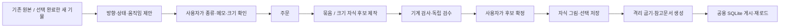

# 기물 파생 — 다음 에이전트의 설계·구현 계약

2026-10-04 사용자 요청으로 만든 인수인계 정본. 실행·복구는 [운영 절차](interior-prop-derivations-operations.md),
상위 화면과 기존 공간 하네스의 경계는 [슈퍼하네싱 통합](super-harness-integration.md)을 함께 읽는다.
이 문서는 16px 실내 기물의 **서버 하네스**를 다룬다. 캐릭터·몬스터·차량 하네스는 별도다.

현재 기물·공간 서비스는 [슈퍼하네싱 통합 문서](super-harness-integration.md)의 18315 한 서비스로 운영한다.

## 1. 사용자가 결정한 제품 흐름

원래 요청: 이미 만든 의자 등에 방향 4개, 움직이는 모션, 다른 크기도 필요하다는 것.
이어진 선택은 **자동 제안 → 사람이 체크를 더하거나 빼기 → 주문 → 후보를 사람이 고르기**였다.
자동 제안을 자동 주문·자동 선택으로 바꾸지 않는다. 크기는 기본 체크하지 않는다.
사용자는 선택한 기물이 공용 DB에 자동으로 들어가길 요청했고, 이름은 **슈퍼하네싱**으로 정했다.



검수 통과는 취향의 합격 보증이 아니다. 에이전트가 사람 대신 후보를 골라서는 안 된다.
그림은 해당 하네스로 만들며, 문서를 읽었다는 이유로 직접 새 도트를 그리지 않는다.

## 2. 세 계층과 현재 완료 범위

| 계층 | 구현·저장 | 실제 동작 |
|---|---|---|
| 서버 기물 제작 | Python `harness.py`·`api.py`, `picks.sqlite`·`harness.sqlite`, 체크아웃의 후보 파일 | 네 종류 파생·부분 재그림·자동 제안·공용 자동 게시 |
| 에디터 공방 | `editor/runner.ts` 등, 브라우저 IndexedDB `oprn-workshop` | 사용자 계정 모델로 기물 제작; 서버 파생/공용 게시와 같은 저장 경로가 아님 |
| 기존 공간 슈퍼하네스 | 별도 `super-harness` 실행기와 개념 DB | 통합 화면으로 연결; 기획·재료·지도·조수 검수는 자체 gate |

`/harness`는 통합 입구, `/harness/props`는 기물 단독 화면이다.
기물 쪽 확정 → 공용 게시까지 구현됐다. 기존 공간 실행기의 survey 자동 수신·설치는 남아 있다.
상위 화면의 네 탭이 서버·DB·작업 대기열 이관을 뜻하지는 않는다.
공용 게시도 앱 번들 릴리스나 git 머지를 대신하지 않는다.

## 3. 수정할 때 찾을 파일

| 변경 목적 | 먼저 읽을 파일·함수 |
|---|---|
| 추천 조건·가족 중복 제거 | `src/harnesses/interior-props/derive.py`: `suggest`, `suggestions`, `_use`, `_stem` |
| 방향·상태·모션의 정의 | 같은 파일: `make_set`, `_facing_slots`, `_layout`, `_seed` |
| 크기 자식 | 같은 파일: `make_size`; `scripts/content/hand-interior-pick/common.py`: `resize_spec` |
| 파생 작업지시서·검수 | `derive.brief_lines`, `derive.review_text`, `brief.make`, `harness._top_gate` |
| 원본/다른 칸 화소 고정 | `derive.lock_check`; `harness.py`의 후보 검사 경로 |
| 확정 후 자식 저장 | `api.decide`, `derive.slice_pick`, `_write_pick_image`, `picks_db.apply` |
| API 주문·부분 재그림 | `api.derive_order`, `api.draw`; `harness.draw` |
| 사용자 화면 | `web/index.html`: `renderSuggestions`, 파생 창·칸 이름표·움직임 미리보기·부분 재그림 |
| 모션 재로드·신규 등록 | `install_picks._loop_frames`, `_plan`, `variant_meta`; `new_items.register` |
| 시트·속도·중복 제거 | `scripts/content/hand-interior/build_tileset.py`: `Sheet.add`, `item_frames`, 기물 `cut` 경로 |
| 공용 게시·번호 보존 | `shared_publish.py`; `publish_shared.mjs`; `scripts/lib/sharedContentSqlite.ts` |
| 공용 킷 배치·분류 | `src/editor/panels/spatialCatalog.ts`; `list_spatial_designs`·`stamp_object` 구현 |
| 통합 화면·자료 전달 | `web/super.html`, `super_bridge.py` |

경로를 더 찾으려면 `rg`를 쓴다. wiki 전체나 후보 그림 전체를 한 번에 읽지 않는다.

## 4. 정본 데이터와 파일 관계

| 자료 | 소유·용도 | 삭제/이동 시 영향 |
|---|---|---|
| `$HIP_DB` 또는 `$HIP_DATA/picks.sqlite` | 실제 사용자 선택, 이벤트·현재 상태 | 선택 정본 손실. JSON만으로 전체 이력을 대체할 수 없음 |
| `$PROP_HARNESS_DATA/harness.sqlite` | 판·일꾼·검수·사용자 피드백 | 진행·판 번호·출발 경로·피드백 손실 |
| `tiledata/hand-interior/new/items.json` | 새 원본 및 파생 자식 정의 | DB에 선택이 남아도 기물을 못 찾음 |
| `tiledata/hand-interior/new/sets.json` | 하네스 전용 파생 묶음·칸 좌표 | 묶음 분할·검사·관계를 복원할 수 없음 |
| `tiledata/hand-interior/pick/candidates/<slug>/` | 후보 pxgrid·팔레트·PNG·모션 띠·크기 명세 | DB의 선택 이름만 남음; 굽기 실패/누락 |
| `tiledata/hand-interior/pick/picks.json` | SQLite에서 내보낸 굽기 입력 | 직접 고쳐도 다음 export가 DB 상태로 덮음 |
| `$PROP_HARNESS_DATA/rounds/h<N>/` | 판별 작업지시서·기준·검수 자료·부분 재그림 lock | 현재 후보를 만든 근거·판별 출발 그림 손실 |
| `$PROP_HARNESS_DATA/shared-publish.sqlite` | 최신 선택판의 내구성 있는 게시 대기열 | 진행/재시도 상태 손실; 선택 정본은 별도로 남음 |
| `$PROP_HARNESS_DATA/baselines/<revision>/` | 게시판별 사양·시트·예제 칸 | 다음 굽기에서 기존 번호를 안전하게 고정할 수 없음 |
| 호스트 `shared-content.sqlite` | 다른 프로젝트가 쓰는 공용 라이브러리·이전 판본 | 해당 호스트의 공용 팩 손실 |
| `src/assets/handInteriorSpec.json`·타일셋 JSON·시트·참고 JSON | 굽기 산출물 또는 앱 번들 | 현재 선택 DB와 항상 같은 판본이라고 가정하면 안 됨 |
| `derived.sqlite` | 상태 gzip·테두리 차이 캐시 | 재생성 가능; 선택 정본 아님 |

DB 경로를 바꾸는 환경 변수와 후보 경로를 분리해서 이해한다.
`PROP_HARNESS_DATA`만 바꿔도 후보·items·sets와 선택 DB는 같은 기존 대상을 쓸 수 있다.
단순히 새 워크트리나 새 브라우저를 열었다고 콘텐츠가 격리되는 것은 아니다.

## 5. ID·원본·묶음·자식의 계약

| 종류 | 묶음 ID | 설치할 자식 ID | 설치 형태 |
|---|---|---|---|
| `facing` | `chair S #facing` | 크기가 맞는 기존 `chair E/N/W`, 없으면 `<원본> ~E/N/W` 등 | 방향별 별도 기물 |
| `state` | `royal chest #state-open` | `royal chest ~open` | 상대 상태 별도 기물 |
| `loop` | `lava brazier #loop` | `lava brazier ~motion` | 한 기물에 반복 애니메이션 |
| `size` | 묶음 없음 | `armchair ~2x2` | 다른 크기의 별도 기물 |

묶음은 **제작·검수용**이다. 묶음 전체를 게임 기물이나 공간 킷으로 굽지 않는다.
원본 칸은 그림이 고정된 참고 칸이며, 확정 시 그 칸을 원본 선택으로 다시 쓰지 않는다.
방향 가족의 기존 E/N/W를 재사용하면 그 기물의 선택은 사용자가 확정한 새 그림으로 바뀐다.
각 방향을 언제나 신규 ID로 만드는 구현은 현재 계약과 다르다.

ID는 영문 접미사를 사용한다. `slug()`가 한글과 구두점을 지우거나 정규화하므로,
보이는 이름이 달라도 후보 디렉터리가 충돌할 수 있다. 새 ID와 **slug 둘 다** 중복을 확인한다.
기본 상태 접미사: 열림=open, 닫힘=closed, 켬=on, 끔=off, 앉음=sat, 누움=lying,
깨짐=broken, 빔=empty, 가득=full. 기타 상태는 문자 코드 합의 `%1000`인 `alt<N>`이며 충돌 가능성이 있다.
새 상태 종류를 추가할 때 이 값에 고유성을 기대하지 않는다.

자식 정의·메타에는 `parent`, `derive`, `slot`을 남긴다.
모션 정의는 `setId`, `animation:{frames,ms}`도 가진다.
굽기 후 `handInteriorSpec.json.objects`의 자식과 `derivationSets`에 선택된 묶음 관계가 남는다.
관계 존재와 해당 그림이 현재 공용에 게시됐다는 사실은 서로 따로 확인한다.

## 6. 자동 제안 규칙

`GET /api/harness/suggestions`는 읽기 전용이다. 모델 호출·주문·사용자 선택을 만들지 않는다.

- 대상: 기존 원본 및 non-v5 후보를 고른 새 원본. 묶음·`parent`가 있는 자식은 재추천하지 않는다.
- 쓰임새는 새 항목 `use`, 없으면 앱 사양 `handInteriorSpec.json`의 `use`에서 읽는다.
- 방향: `kind=floor`만 가능. sit/sleep 또는 실제 방향 짝이 있으면 기본 추천.
  wall/hang/flat을 임의로 돌리지 않는다.
- 상태: open/switch 또는 꺼진 불빛이면 추천. flat도 open/switch 용도면 가능.
  `states.others`의 상대 상태를 우선한다. 열린 상자 → 닫힘, 꺼진 불빛 → 켬.
- 모션: 켜진 light 용도이며 현재 atlas 프레임이 1이면 추천. 이미 움직이는 기물은 기본 추천 제외.
- 크기: 창에서 사용자가 추가한다. 기본값은 대략 두 배, UI/API의 범위는 가로·세로 각 1~8칸.
- 방향 가족은 S/E/N/W 순으로 존재하는 첫 원본만 제안한다. `pew E2`처럼 길이 접미사가 있으면 일반 가족으로 합치지 않는다.
- 상태 `group`이 다른 원본을 가리키면 그 가족 대표에서만 제안한다.
- 이미 주문한 종류는 기본 체크에서 빼고 상태를 표시한다. 사용자가 다시 체크하면 새 판을 주문할 수 있다.

기존 주문 상태: queued/running → drawing, 사용자 선택 있음 → done, 성공 후보 있음 → ready,
실행 기록만 있고 성공 후보 없음 → failed, 판/실행이 아직 없음 → ordered.
이 목록의 done은 사용자 선택 상태이며 공용 게시 성공 상태와 같은 값이 아니다.

## 7. 묶음 형식과 방향 기하

`sets.json` 최상위는 `{about, sets:[...]}`.
한 묶음은 `id/name_ko/parent/derive/kind/category/canvas/footprint/description/use/tags/slots/ms/created/note`를 가진다.
칸은 `key/label/w/h/x/y/child/locked/foot`이며 방향 칸에는 `see`도 있다.
좌표·크기는 **화소**, `foot`은 **16px 타일 칸 수**다. footprint와 그림 캔버스를 혼용하지 않는다.

실제 시드 `chair S #facing`은 64×16px, S/E/N/W 각 16×16px, x=0/16/32/48, y=0,
S만 locked=true이며 `child="chair S"`다. 이를 모든 가구의 고정 크기라고 일반화하지 않는다.

방향 칸은 원본 방향에서 시작하여 S/E/N/W 순서를 순환한다.
발밑이 fw×fh, 원본 캔버스 W×H일 때 솟음은 `max(0,H-fh*16)`.
원본과 90도 다른 축의 방향은 가로=fh×16, 세로=fw×16+솟음, footprint=[fh,fw]다.
기존 짝 ID라도 그 캔버스가 맞지 않으면 새 자식 `<원본> ~<방향>`을 사용한다.
칸마다 높이가 다를 수 있어 `_layout`은 가장 높은 칸 기준으로 **바닥을 맞추고** 가로로 붙인다.
캔버스 전체는 16의 배수여야 한다.

카메라는 남쪽 위, 빛은 왼쪽 위로 고정한다. 동·서를 단순 좌우 반전하면 광원이 뒤집히므로 안 된다.
북쪽 그림은 등받이/뒤판이 앞에 보이는 뒷모습이며, 같은 물건의 재료·장식·비례를 유지한다.

## 8. seed·부분 재그림·검수

`make_set`이 현재 고른 원본을 읽어 `candidates/<묶음 slug>/seed.png`를 만든다.
방향의 고정 칸만 채우고, 상태·모션은 같은 크기 칸에 원본을 복사하여 바뀌는 부분만 그리게 한다.
작업자 한 명이 한 후보의 **모든 칸**을 그린다. 방향마다 독립 호출로 나누면 한 벌의 화풍이 어긋난다.

`POST /api/harness/draw`의 `{ids:[묶음ID],base:"h<N>-A",slot:"E"}`는 해당 칸만 다시 그린다.
base가 있어야 하고 slot은 locked=false인 실제 칸이어야 한다.
판별 작업지시서 디렉터리의 `lock.json`은 `{base,slot}`.
`derive.lock_check`는 원본 칸을 seed와 비교하고, 수정 대상 밖의 칸은 base 후보와 RGBA 화소로 비교한다.
빈 칸도 실패다. 기존 판과 다른 칸이 달라졌으면 생성 실패 이유를 다음 시도에 넘긴다.

검수는 묶음의 고정 원본 칸을 판정 대상에서 제외한다.
일반 가구의 절대 꼭대기 면 행 수를 전체 묶음에 그대로 적용하지 않는다.
파생 칸의 시점·윗면 두께는 **원본 칸과 비교**한다. 원본 자체가 얇다는 이유로 파생 주문 전체를 탈락시키지 않는다.
같은 물건이 아니면 STYLE, 방향/상태/움직임이 읽히지 않으면 READ, 시점이 잘못되면 FRONT.
모션 몸통의 고정·상태의 변경 영역·루프 경계 자연스러움은 검수 지시와 사람의 판단도 필요하다.
현재 결정적 lock 검사는 모든 몸통 화소를 별도 마스크로 증명하는 검사가 아니다.

## 9. 크기 파생과 기존 크기 변경은 다르다

`make_size`는 기존 기물을 보존하고 `<원본> ~WxH` 자식을 만든다.
출발 후보는 `<후보>@<원본ID>`이며 `brief.base_src`가 다른 기물의 그림으로 해석한다.
새 칸 수에 맞게 다시 그린다. 이미지를 늘려서 픽셀 크기를 키우는 요청으로 바꾸지 않는다.
발밑 깊이가 있는 기물은 원래 솟음을 보존한다. 걸이처럼 깊이 0이면 footprint.h=0이고 그림 높이만 바뀐다.
깊이 2칸 이상이면 꼭대기 면 최소 행 수, 큰 깊은 기물이면 blockout 명세도 `resize_spec`으로 만든다.

기존 「다시 뽑기」 메모에 `2x2`를 쓰는 경로는 **해당 기물의 resize.json을 바꾸는 경로**다.
별도 자식을 원하는 경우 파생 창의 크기를 주문한다. 두 기능을 안내·API·복구에서 혼동하지 않는다.

## 10. 확정·자식 저장의 실제 순서

`api.decide`는 후보 파일 존재, 현재 판, 동일 확정 중복을 확인한다(오래된/중복 확정은 409).
묶음 후보일 때 `derive.slice_pick`이 먼저 자식 파일과 선택을 저장하고, 그 뒤 부모 묶음 선택·피드백을 기록한다.
자식 저장 예외가 나면 부모의 완료 기록까지 진행하지 않아 같은 후보로 재시도할 수 있다.

**전체가 하나의 트랜잭션인 것은 아니다.** 파일·items/sets JSON·자식별 선택 DB·부모 피드백 DB가 나뉘어 있다.
중간 실패 시 앞쪽 자식의 선택/파일이 이미 남을 수 있다. 원본 전체를 수동으로 되돌리지 말고 상태를 대조한다.
현재 코드에는 방향/상태 자식이 없거나 캔버스가 다르면 그 칸을 건너뛰는 경로도 있다.
성공 응답의 children 목록과 필요한 비고정 칸을 대조한다. 부분 결과를 모든 파생의 완전 저장으로 보고하지 않는다.

자식 후보 이름은 선택 이름의 첫 점 앞(`choice.split('.')[0]`)이며,
자식 폴더에 `.png`, `.pxg`, 그 자식 그림용 `.pal`을 쓴다.
자식 선택의 client는 web, note/feedback에 원본 묶음과 판 번호를 남긴다.
`picks_db.apply` 한 호출은 events 추가와 current 갱신을 같은 SQLite 트랜잭션으로 저장한다.
DB 커밋 후 export 실패는 사용자 선택 자체의 취소가 아니다. 다음 export/시작에서 복구한다.
「지금 그대로」 keep은 피드백이며 기존 선택을 v5로 되돌리는 명령이 아니다.

## 11. 모션 저장·재로드·패킹

모션은 기본 **4프레임, 프레임 간격 150ms**, 전체 주기 600ms다. f0가 고정 원본이다.
선택 전에는 `~motion` 자식을 등록하지 않고, 확정 시 생성한다.
첫 프레임을 일반 후보 파일로, 전체 가로 띠를 `<후보>.loop.png`로 저장한다.

```json
{"version":1,"frames":4,"ms":150,"width":16,"height":16,"sha256":"RGBA 원시 띠 화소 바이트의 SHA-256"}
```

이는 `<후보>.loop.json`의 형식 예시다. width/height는 실제 프레임 크기이며 16으로 고정하지 않는다.
hash는 **PNG 파일 바이트의 해시가 아니다**. Pillow RGBA `strip.tobytes()`의 해시다.
공용 자료 ZIP의 receipt는 각 파일 바이트 해시이므로 계산 대상이 다르다.
묶음 `picked`에는 choice/child/at도 남긴다.

`install_picks._loop_frames`는 version, 프레임 수(2~12), 양의 정수 ms, 자식 animation 명세,
프레임 크기, 띠 크기, RGBA 해시, 첫 프레임과 일반 후보의 화소 일치를 확인한다.
`new_items.register`는 검증한 모든 프레임과 `frame_ms`를 등록한다.
띠 손상·누락을 정지 그림으로 대체하지 않는다. 굽기 skipped 사유가 남고 공용 게시 검사가 실패한다.

시트의 animated cell은 `animationStrips`의 fps=`1000/ms`다. 150ms를 임의로 10fps에 맞추지 않는다.
모든 프레임이 같은 칸은 정지 칸으로 합친다.
움직이는 칸의 중복 키는 모든 프레임 화소·통행 분류·fps를 포함한다.
화소가 같아도 속도가 다르면 같은 strip으로 합치면 안 된다.
앱 번들의 기존 12프레임 애니메이션 경로를 네 프레임 파생에 그대로 적용하지 않는다.

## 12. 공용 등록과 안정적인 칸 번호

선택 확정 후 `queue_shared_publish`가 내구성 대기열을 요청한다.
옛 `/api/pick`, `/api/revert`, 서버 시작 및 30초 watchdog도 같은 게시 경로를 확인한다.
선택의 choice/variants에서 지문을 만들며 여러 확정은 3초 동안 합친다.
단일 파일 lock으로 한 게시 일꾼만 실행하고, 실패는 60초 뒤 재시도한다.
상태는 idle/queued/publishing/done/error. 새 선택이 빌드 중 들어오면 다음 판으로 이어진다.

현재 선택판을 `/tmp/oprn-prop-publish-*`의 격리 스냅샷으로 복사해 굽는다.
이전 게시 revision의 baseline을 먼저 덮어 기존 칸 번호를 고정하고, 선택된 후보와 모션 부속 파일을 복사한다.
필요한 baseline이 없으면 멈춘다. 라이브 시트나 사용자가 보고 있는 후보를 굽기 출력으로 덮지 않는다.
`build_tileset.py`의 예제 맵 검사 → `prepare-references.mts` → `publish_shared.mjs` 순서다.
선택 단품/파생/함께 쓰기 변형의 적용 누락, 구조/화소/통행/도달 검사 실패는 게시 실패다.

게시 라이브러리는 `oprn-hand-interior-harness`, 타일셋은 `shared_hand_interior_harness`.
그림, structureKits, 사전·배치 지침·참고 이미지가 함께 저장된다.
`projectDefaults:true`라 같은 호스트의 새/기존 프로젝트가 공용 목록을 읽을 때 설치된다.
이미 열린 프로젝트는 다시 열어 최신 목록을 읽는다. 다른 호스트로 자동 복제되는 기능은 아니다.
기물 배치는 `list_spatial_designs({kind:"object",query})`로 찾은 실제
`kit:shared_hand_interior_harness/shared_hand-interior:<기물 ID>`를 `stamp_object.objectId`로 사용한다.
고정 번들의 `build_hand_interior_room` 인자/칸 번호와 섞지 않는다.

게시 전에 `baselines/<새 revision>/`에 spec/tileset/시트/예제 칸을 보존한다.
SQLite 게시에는 이전 revision과 비교하는 CAS를 쓰고, 저장 후 같은 행을 새로 읽어 해시를 확인한다.
공용 자료 API는 그 실제 행을 읽으며 후보 폴더나 오래된 receipt만 보고 성공을 선언하지 않는다.

## 13. 다음 작업의 한계·우선순위

다음 에이전트는 아래를 구현 완료로 오해하지 않는다.

1. **파일·여러 DB를 아우르는 원자성/복구 저널 없음.** 부분 저장을 탐지하는 저널과 재실행 가능한 단계가 다음 후보다.
2. **원본 판본 고정 부족.** 같은 묶음을 재주문하면 sets 정의와 공용 seed를 다시 쓴다.
   lock 검사도 현재 seed를 읽으므로 원본 변경 후 옛 판을 재검수하면 기준이 달라질 수 있다.
   판별 seed·부모 화소 해시·geometry를 고정하고 변경된 원본의 기존 파생을 구분하는 설계가 필요하다.
3. **JSON 갱신 잠금은 서버 프로세스 밖까지 보장하지 않음.** DRAW_LOCK은 프로세스 내부이며 묶음 정의 생성은 그 앞에서 수행된다.
   두 서버/스크립트가 같은 items/sets/candidates를 동시에 저작하지 않는다.
4. **재주문이 기존 자식 정의를 갱신하지 않음.** `_add_items`는 같은 ID면 건너뛴다.
   크기·프레임 간격·상태 정의를 바꿀 때 새 정의와 기존 선택/파일을 함께 이관해야 한다.
5. **요청 전체 사전 검증 부족.** 여러 종류 주문에서 뒤쪽 size가 잘못돼도 앞쪽 묶음 정의가 이미 저장될 수 있다.
   HTTP 400이 파일을 전혀 바꾸지 않았다는 뜻이라고 가정하지 않는다.
6. **픽셀 의미 검수에는 한계가 있음.** 몸통 고정 마스크/광원/북쪽 방향/사용 가능한 이벤트 상태를 모두 기계적으로 증명하지 않는다.
   상대 상태 그림이 생겼다고 게임 이벤트가 자동으로 작성되는 것은 아니다.
7. **공간 하네스 자동 수신·설치 미연결.** 기존 재료 gate의 실제 파일·시대·독립 검수를 유지하며 연결한다.
8. **이 호스트의 공용 게시와 앱 공용 번들 배포는 별개.** 신규 호스트에서 같은 그림을 쓰려면 실제 팩·자료 이관이나 번들 릴리스가 필요하다.

새 종류를 추가할 때 ID/slug, 제안, make, 작업지시서, 기계 검사, 독립 검수, UI,
선택 분할/저장, 재로드, 굽기, 메타/참고문서, 공용 게시·기존 번호 보존까지 함께 검토한다.
한 단계만 추가하고 완료로 보고하지 않는다.

## 14. 이어받는 에이전트의 시작·완료 기준

시작: 실제 서비스의 WorkingDirectory와 DB 경로 확인 → 이 문서 → 운영 절차 → 필요한 소스 함수만 읽기.
선택·후보가 없는 새 체크아웃을 라이브 정본의 대체물로 간주하지 않는다.
현재 사용자 선택이나 대기열에 영향을 주는 재시작·복구·재주문은 기존 작업과 맞물리는지 먼저 확인한다.

완료 보고는 층별 근거를 구분한다: 코드/문서 커밋, 주문·후보, 실제 사용자 선택,
자식 파일 재로드, 시트 패킹, 공용 행 저장·재로드, 새/기존 프로젝트 load, 게임 재생.
앞 단계의 통과로 뒤 단계를 추정하지 않는다. 정확한 판/원본/공용 revision/저장 대상/증거 경로를 남긴다.
사용자가 명시하지 않은 gates/vitest/전체 typecheck는 실행하지 않는다(AGENTS hard rule).
검증 때문에 유료 그림 주문이나 사람 대신 선택을 하지 않는다.

## 15. 기존 근거와 세션 연혁

Claude 원래 대화 `e72c6899-6a1a-4ddc-8531-b17fcd5e50e8`에서 흐름 C(제안+확인), 묶음+부분 재그림을 선택했다.
로그는 해당 호스트의 `.claude/projects/...`에 있는 세션 자료이며 배포 파일이 아니다.
로그를 찾기 어려우면 이 문서의 결정과 실제 코드를 우선하고, 프로젝트 기록 조회는 AGENTS의 SQLite/IndexedDB 경로를 따른다.

| 증거 폴더 | 확인한 범위 | 해석의 한계 |
|---|---|---|
| `verify-shots/interior-derive-motion/` | 방향/모션 후보 UI, 격리 모션 저장·타이밍·중복·메타 패킹 | 실제 사용자에게 새 후보를 골라준 증거가 아님; 출하 런타임 QA는 별도 |
| `verify-shots/interior-prop-shared-publish/` | 610선택·748기물 당시 공용 SQLite 저장/재로드, 새/기존 증명용 프로젝트 저장·재로드 | 사용자 실 프로젝트를 수정한 것이 아님; 숫자는 그 판본의 값 |
| `verify-shots/interior-prop-suggestions/` | 자동 제안/상태 기본 체크/기존 주문 표시, POST 0, 선택 이벤트 유지 | 자동 제안이 실제 주문을 생성했다는 근거가 아님 |
| `verify-shots/super-harness-integration/` | 네 탭·90개 개념·주문서·759공용 킷 당시 자료 해시·오프라인 표시 | 공간 survey 자동 수신·설치 완료의 근거가 아님 |

초기 파생 주문은 의자 S 방향·왕실 상자 열림·용암 화로 모션·안락의자 2×2.
현재 개수·후보 번호·판본은 사용자의 진행으로 바뀐다. 고정 숫자로 정상 여부를 판정하지 않는다.
