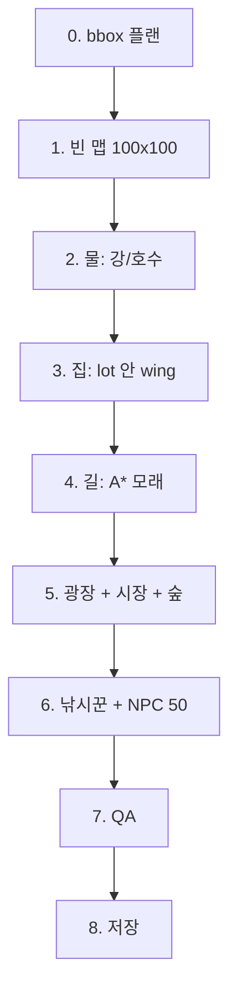

# 큰 마을 생성 흐름 (쉽게)

100×100 **「큰 강호 장터 마을」** 이 어떻게 만들어지는지, 코드 기준으로 순서만 정리한다.

목표: **어디를 고치면 뭐가 바뀌는지** 한눈에 보이게 하기.

---

## 내장 AI 시공 순서 (2026-09-12, 아래 과거 하네스 순서보다 우선)

사용자 지정 정본은 **집 → 길 → 나무 → 호수·마당·맵 꾸미기**다.
`author_village`, `buildVillageDomain`, 설계서 미리보기와 정주지 지역 시공이 같은 본체를 탄다.

- 계획에서 수역·대로 자리를 예약하지만 타일은 칠하지 않는다. 집 외형·문·실내·벽 장식은
  집 단계에서 완결·봉인한다. 다음으로 광장·대로·집 진입로를 만든다.
- `village/decor.ts`의 `placeVillageTrees`는 독립 나무 단계다. 수역 예정지와 집 앞마당은
  `village/reservedAreas.ts`로 제외하며, 분할된 영역을 나무 전체가 벗어나지 않는다.
- `villageTerrainPass.ts`는 `trees`와 `water` 단계를 받는다. 숲과 수역의 겹친 예약은
  숲에서 제외한다. 합성 숲의 바닥 장식·작은 물웅덩이도 최종 단계로 미룬다.
  마지막 수역이 기존 길·나무를 덮으려 하면 `village-water-conflict`로 거부한다.
- `village/decoration.ts`의 `finishVillageDecoration`은 울타리·마당·소품·대형 맵 조경을
  담당한다. 각 단계는 기존 완성 집 보호 검사를 유지한다.
- 멀티턴 세션은 `settlement → forest_conifer → forest_big → water → decoration → critique → look`.
  필요 없는 물·숲은 생략한다. 모델이 물 먼저 순서를 보내도 `normalizeVillagePlan`이
  이 순서로 정규화하고 경고한다. 마당 꾸미기 입력은 세션의 detached memory로 이어진다.
  **작업 세션은 원래 프로젝트 JSON 저장 대상이 아니다.** 완성된 맵은 기존 저장 경로를 탄다.
- AI 도구 설명과 컨텍스트도 같은 순서를 안내한다. `build_village` 결과의 `buildStages`는
  네 단계의 이름을 제공한다.

검증: `test/villageBuildStages.test.ts`는 실제 등록 도구에서 순서·예약지 비점유·집 보존,
AI 초안 간 꾸미기 이월과 완성 맵 직렬화를 검사한다. 관련 회귀는
`villageBuilder`, `houseProtectionLifecycle`, `villageDesign`, `forestDensity`,
`villageProducerProtection`, `authorVillageFacade`다. 이는 엔진 계약 fixture이며 새 데모 저작이 아니다.

## 저장된 건물 오브젝트로 마을 만들기 (2026-09-12)

`author_village.houseObjectIds`는 canonical 라이브러리에 저장된 **건물 외형 후보**다.
`housePlans[i].objectId`로 집별 형태를 고정할 수도 있다. AI는 오브젝트를 검색한 뒤
실제 ID를 전달한다. 생략하면 기존 파라미터 집 경로를 유지한다. `interior` 생략 시
오브젝트 경로는 false이며, true는 거부한다. 외형의 3·4층을 실내 지도 수로 추측하지 않는다.

- `village/objectHouses.ts`는 `snapshotGraphic`으로 원본 타일을 읽어 크기가 다른 필지를
  배치한다. 지붕·벽·문은 재해석/재색칠하지 않는다. 모든 116/146 현관에 저장된 앵커가
  있어야 하며, 빈 외형 셀만 통과하는 중정 통로를 먼저 계산한다. 이 통로와 공용 대문은
  후속 길 정리에서도 보존한다. 같은 배치에서 구형 집 템플릿과 섞거나 고정 외형 설계서와
  충돌하면 실패한다. 크기 생략 시 실제 외형·마당 면적과 광장 최소 폭을 함께 계산한다.
- 필지는 수역·대로·광장·기존 기물과 겹치지 않는다. `exact`는 전량, `best-effort`는
  기존 facade와 같은 85%/최소 4채 하한을 만족해야 한다. 용량 부족은 전체 초안 롤백이다.
- `roads.ts`는 공용 대문에서 이미 연결된 길까지 장애물을 피하는 경로를 만든다.
  `market.ts`는 완결된 가판 조각과 상품을 놓고 중앙 통로·손님이 서는 칸을 비워 둔다.
  `lakeside.ts`는 길 단계에서 쉼터를 연결하고, 물을 칠한 뒤 접근을 막지 않는 벤치를 놓는다.
  오브젝트 경로에서 기존 대형 조경의 별도 호수·눈밭·지하 계단은 추가하지 않는다.
- 최종 QA는 원본 외형 셀, 모든 현관의 사유 통로, 시작점부터 현관·가판·쉼터의 **착지 칸**까지
  실제 `canMove` 도달성을 검사한다. `checkReachability`의 인접 허용 판정만으로 통과시키지 않는다.
  호수에 닿은 마을 모래길도 실제 출입 앵커가 있으면 도로 성분으로 센다.
- `MapLayoutRegion.objectExterior`에 원본 ID/revision, 현관 앞, 사유 통로를 저장한다.
  이는 완성 맵의 출처 메타데이터다. **새 spatial occurrence나 갱신 가능한 장소 인스턴스는 아니다.**
  canonical 라이브러리/기존 occurrence를 변경하지 않으며, 기존 owned binding에 걸친 시공은 거부한다.
  실제 실내·층간 연결은 공간·장소 시공으로 따로 저작한다.

검증: `villageObjectHouses`, `villageLakesideAccess`, `villageMarketDisplays`,
`villageTreeCompletion`, `authorVillageFacade`, `villageBuildStages` 6파일과 기존 시작점 복원 후
접근성을 재검사하는 회귀 사례를 검증한다.
실제 저작은 `scripts/publish-object-village.mts --apply`로 등록 도구 실행 → CAS 저장 →
전체 Supabase 재로드 일치를 확인한다. 기존 저장 마을을 자동 재생성하지 않는다.
편집기 그림은 `scripts/capture-authored-village.mjs`, 출하 플레이어 검증은
`scripts/qa/prepare-object-village-walks.mts` 후 `npm run qa:runtime -- --scenario object-village`다.

## 작은 집 중심의 조밀한 마을 (2026-09-13)

저장된 집 후보와 함께 `composition:"compact"`를 전달한다. AI 문맥에도 이 선택을 안내한다.
일반 주택은 외형 **10×10 이하**, 큰집은 **전체 최대 2채**, 모든 외형은 **15×15 이하**다.
`compactComposition.ts`는 이름 대신 실제 raster의 크기와 통나무 벽 칩
102~104 / 132~134 / 162~164를 검사한다. 모든 레이어에서 검사하며 자동 후보에서는 부적합 집을 제외한다.
일반집은 고유 형태를 먼저 사용하고 이후 작은 면적에 가중치를 주되 반복 상한을 둔다.

사용자가 집별로 고정한 부적합 외형이나 큰집 3채 이상은 오류로 돌려준다. 기존 라이브러리는 보존한다.

- `objectHouses.ts`: 집 양옆·뒤 1칸, 앞 2칸의 필지 여유를 두고 1칸 단위로 배치한다.
  16×10 장터, 대로, 미래 수역과 겹치지 않으며 큰 외형부터 계획하고 작은 집으로 빈자리를 채운다.
  크기를 생략하면 필터를 통과한 실제 선택 집과 공용 공간을 기준으로 계산한다.
- `organicLake.ts`: 집을 찍기 전에 비대칭 수역의 **정확한 셀 마스크**를 예약한다.
  도로를 피해 가로로 긴 연결 실루엣(가로/세로 1.8 이상, 면적 3.5~8%)을 찾으며,
  금지 셀을 잘라 구멍을 만들지 않는다.
  집·길·나무 뒤에 같은 마스크를 칠하고, 집·이벤트·공간 소유 영역·기존 기물을 만나면 원자적으로 거부한다.
- `compactVegetation.ts`: 길 단계 뒤 완결된 2×2 활엽수 / 1×2 침엽수를 외곽과 내부 숲에 심는다.
  물·마당·출입구·이벤트 몸체·이동 착지를 보존한다. 마지막 장식 단계에서 243 계열 키큰 풀을
  연결된 패치로 칠하고 실제 `builtin_tall_grass` 오토타일로 가장자리를 연결한다. 꽃은 상단 레이어다.
- 새 소형 외형 12종의 원본 저작은 `scripts/lib/compactVillageHouses.mts`에 있다.
  1층 6종·2층 4종 일반 주택과 회관/여관 2종이며, 회벽·석벽 및 연결된 지붕 조각을 조립한다.
  `scripts/publish-compact-village.mts --apply`는 실제 `upsert_spatial_design` / `author_village`
  도구를 실행하고 Supabase CAS 저장·재로드까지 수행한다. 새 맵이 이미 있으면 재생성하지 않는다.

검증 파일은 `villageCompactComposition`, `villageOrganicLake`, `compactVillageVegetation`이다.
최종 원격 검증 스크립트는 저장 시의 canonical SHA와 독립 재로드의 서버 SHA, 모든 맵·공간 문서·
마을 타일셋을 비교한다. 다른 역사적 타일셋의 priority 기본값 정규화 차이를 원격 쓰기로 보정하지 않는다.
근거는 `.omo/evidence/compact-village/`에 둔다. **등록된 도구의 직접 호출 검증이며, LLM 자연어
세션에서 오브젝트 검색부터 저장까지 자율 수행했다고 주장하지 않는다.**

## 과거 대형 하네스 순서

```
자리 잡기(plan) → 맵 → 물 → 집(다양) → 구불 길 → 시장 하네스 → 울타리 → 나무·소품 → NPC → QA → 저장
```

**타일을 먼저 막 깔지 않는다.**  
먼저 사각형(bbox)으로 “여기 집, 여기 시장”을 정하고, 그다음에 실제로 찍는다.

> AI 경로 메모 (2026-09-04): 위 순서는 100×100 bbox 하네스 전용이다. AI `author_village` / `build_village`는 다르다. 지금은 스케치 후보(`sketchHouseSites`)를 먼저 뽑고 집을 찍은 뒤 길을 잇는다. Phase 2 순서는 sketch sites → houses/house-owned finishing → metadata + local snapshots → roads다.
>
> AI `build_village` 대로 (2026-09-05): 72칸 이상 맵의 자연형 골격은 이제 곡선이다. 명시적인 `street-grid`는 직선 밴드를 유지한다. `villageBoulevardPath`가 시드 고정 경유점을 잡고, 집 예약과 길 칠하기는 `boulevardCells` 한 칸 함수를 같이 쓴다.

---

## AI tree placement and completed houses (2026-09-05)

`placeVillageDecor` and the terrain forest pass delegate to `runScatterObject`.
Its tree candidates now reserve occupied upper cells and impassable lower terrain
across the **entire tree footprint**, while allowing canopy-over-lower-trunk
forest overlap. Recorded house geometry is always excluded, including empty
cells; `avoidProtected:false` does not waive house ownership.

This prevents the producer defect seen at `map_existing (28,8)`: conifer 260 was
placed over house lower tile 76, with trunk 290 at `(28,9)` erasing fence 409.
Placement cleanup removed the invalid canopy but left the trunk, and the runner
recreated the canopy after the completed-house snapshot. The fix rejects that
whole candidate before painting; it does not restore house tiles or change the
runner invariant. Phase 2 moves village registration before roads and environmental work.

Coverage: `villageTreePlacement.test.ts` checks both scatter packers and valid
forest overlap; `villageProducerProtection.test.ts` compares completion snapshots
with accepted output for ordinary and 100x100 snow villages through toolRunner.

The scatter painter preserves a previously painted canopy when a later origin
writes a lower trunk. Planning allows cross-layer overlap, so calling the ground
replacement helper there used to erase companions in random-order batches
(2026-09-12: the 128×128 object village had 48 conifer and 6 broadleaf errors).
Adding grass backing to an empty canopy cell also preserves the new upper tile.
`village/treeCompletion.ts` provides `completeVillageTrees(project, map, area)`
for the final environmental stage after placement cleanup and before audit. It
completes vertical and horizontal tree companions using the unchanged hard rules,
including authored diagonal alternatives. All writes are planned atomically;
owned geometry, roads, water, stacks and area boundaries cause
`village-tree-completion-conflict`, rather than being overwritten. If a later prop
occupies a lost 1×2-tree canopy, only its unattached trunk is removed; broadleaf
conflicts fail without deleting a half tree. Existing props are preserved. It does not
enable project-wide runner repair. Coverage: `villageTreeCompletion.test.ts`;
read-only actual-map evidence: `scripts/verify-village-tree-completion.mts`.

## Phase 2 construction boundary (2026-09-06)

- Finish house doors/roof/deck/banners/signs and linked interiors, register once,
  then keep immutable invocation-local snapshots across roads, fences, terrain,
  decor, landscape, cleanup, NPCs, and snow. Validate after each stage, including
  road retry sub-stages, before any restoration can hide damage.
- House-owned shop signs use empty upper cells over actual kit walls inside the
  sealed bbox. Door cells and existing windows, banners and ladders are retained;
  no free wall means no sign, not an unprotected yard placement or later repair.
- External-road component repair, audit and door proximity share
  `environmentalRoadAt`. Road-valued tiles owned by houses/decks/human stamps are
  preserved without becoming street components. Genuine external disconnection
  still fails the unchanged connectivity gate.
- All existing layout regions survive registration with unique IDs. Existing
  houses/human stamp geometry excludes candidates and environmental writers;
  the accepted start cannot become a new house. The full bbox/ridge and recorded
  deck ladder are protected, not the yard. A retry does not retain discarded
  attempt snapshots in project-wide state.
- Fill skips owned lower/upper/stack cells and neighbor reshaping, reports
  `skipped.structure` and final `mutatedCells`, and retains both-layer role fallback.
  Forest preflights direct floor/bush/feather/puddle/undergrowth writes and entire
  tree footprints, including an ungrouped trunk's later repair canopy.
- The Phase 1 atomic invariant, exact/best-effort count rules, road connectivity,
  live/region/cluster application guards and human editing remain unchanged.
- `houseProtectionLifecycle` proves real-stage corruption rejection, six kits,
  multiwing/deck/linked doors, snow, reload and discarded retries.
  `villageHouseProtection` observes direct writes (restoration cannot satisfy it).
  `.omo/evidence/house-protection/p2/exercise.mts` runs real `author_house` → reload
  → `author_village` → reload → fill/forest → rejected erase on 50x50 and 100x100.

## 관련 파일

| 역할 | 파일 |
|------|------|
| 자리 잡기 (bbox 플랜) | `src/project/defaults/largeVillageBboxPlan.ts` |
| 실제 시공 (물·집·길·NPC) | `src/project/defaults/largeRiverMarketVillageBuild.ts` |
| 단계 로그 / ASCII | `src/project/defaults/largeVillageBuildLog.ts` |
| 강제 빌드+저장 (100×100) | `scripts/force-save-large-village.mts` |
| 강제 빌드+저장 (50×50, 맵 1장만) | `scripts/force-save-village-50.mts` |
| 길↔집 진단 | `scripts/diagnose-road-through-house.mts` |
| 결과 로그 | `output/evidence/large-river-market-village/` · `village-50-harness/` |
| 열어볼 프로젝트 ID | `rpg-zzu-large-river-market` (100) / **`rpg-zzu-village-50`** (50) |

갤러리 프로젝트(`rpg-zzu-house-template-gallery`)에도 같이 저장하지만,  
**브라우저에 예전 「호수 마을」 탭이 열려 있으면 자동저장이 덮어쓸 수 있다.**  
확인은 전용 ID를 연 뒤 하드 리프레시하는 편이 안전하다.

---

## 전체 그림



로그에도 같은 순서로 단계가 남는다: `S01 plan` … `S11 qa` … `save`.

---

## 단계별 설명

### 0단계 — 자리 잡기 (`planLargeVillageBboxes`)

**타일은 아직 안 찍는다.** 종이 위에 네모만 그린다.

1. **고정 기물** (거의 안 움직임)
   - 서쪽 강, 남쪽 강
   - 북동 호수
   - 동쪽 숲 띠
2. **건조 구역 dry**  
   물·숲 뺀 “마을 지을 수 있는 땅”
3. dry 안에 **광장 → 시장** 자리를 잡고
4. 남은 칸에 **집 롯(lot)** 을 격자 후보에서 골라 채움  
   - lot 기본: 10×9, 집 사이 gap 2  
   - 목표: 집 20채  
   - 겹치면 시드 바꿔 최대 ~50번 재시도  
   - 완벽한 플랜이 안 나오면 **가장 나은 것(best-effort)** 으로 진행
5. **도로 앵커** 좌표만 미리 찍음  
   (광장 중심, 시장 입구, 호수 가, 서/남 부두)

ASCII 로그: `00-plan-bbox.txt`  
- `H`=집 롯, `P`=광장, `M`=시장, `L`=호수, `~`=강

```
중요한 구분
  lot  = 집 “필지” (마당 포함 네모)
  wing = lot 안쪽에 실제로 짓는 건물 (여백 1칸 안쪽)
```

---

### 1단계 — 맵 생성

- 빈 프로젝트 + 타일셋 하네스
- `create_map` → 100×100, 이름 **큰 강호 장터 마을**
- 맵 ID: `map_large_river_market_village`

---

### 2단계 — 물

플랜에 있는 강/호수 bbox만 `fill_region`으로 채움.

- 강: 사각형
- 호수: 원형 마스크

ASCII: `01-after-water.txt`

---

### 3단계 — 집 (다양화)

각 **lot**마다:

1. lot 안쪽에 **wing** — 폭·높이·좌우 오프셋을 RNG로 섞음 (5~8 × 6~7)
2. `build_house_kit`  
   - 키트: bright-plaster / blue-stone (엔진에 2종뿐 → **크기·창문 간격**으로 차이)
   - 창문 spacing 1~3 순환  
   - 내부 맵·문 이벤트 없음
3. 문·문 앞 기록 → 길·울타리용

ASCII: `02-after-houses.txt`

---

### 4단계 — 구불구불 길

**집 다음에 길.** wing만 차단.

```
① 간선: 광장↔시장 / 부두 / 호수
   - A* + 비용 노이즈 + 옆길 경유점 (windyAstar)
② 문 스퍼: 문 앞 → 가장 가까운 기존 길
```

- 벽 옆 칸 비용↑ (골목 기피)
- 모래 경로 + 남 1칸, 마지막 오토타일
- ASCII: `H` 집 / `R` 길 / `X` 집 안 길(버그)

---

### 5단계 — 광장 + 시장 하네스

상점가 빌드에서 이식 (천막 타일 411–443 금지):

- 목재 데크 전체: body **222** + edge **228/229/230/192** + 남단 base **223**
- 남단 upper 난간 468–470 + 중앙 입구 3칸
- 카운터 234–236 + shop 이벤트 + 옆 NPC 잡담
- 상자·과일·꽃 (천막 없음)

---

### 6단계 — 울타리 + 마당 (집과 별 개념)

- **울타리 ≠ 집.** 일부 집만 울타리 (~55%)
- 울타리는 **필지(lot) 둘레**, 건물은 안쪽에 두고 **마당 1~2칸** (특히 문 앞)
- 문 앞 남쪽 3칸 게이트 / 모래·물 위 울타리 금지
- 마당·소품·지형 하네스:
  - **길 위 소품 금지**
  - **장작** = 집 앞만
  - **의자/벤치** = 길 옆, **드묾** (50맵 2~3쌍, 100맵 3~5쌍)
  - **울타리 필지 보호**: 울타리 집 lot 내부는 길·나무·NPC·벤치 침범 금지 (남쪽 게이트 3칸만 개방)
  - **나무**: 침엽 1×2 + **활엽 2×2**, **숲** 고밀도 격자 채움
  - **강**: **sin 곡선** 수역
  - **집 필지**: 크기 혼합 배치 (`HOUSE_LOT_SIZES_SMALL/LARGE`, 7×7~12×10). 동일 격자 폐지.
  - **집 형태**: rect / ㄱ(L) / ㄴ(J) / ㅁ·ㄷ(U) / tall — 가용 공간 내 **사용 횟수 분산** + 필지 여백(slack)
  - **키트/울타리**: blue-stone·bright-plaster 교대 분산, 필지≥9 시 울타리 목표 채수
  - **마당 테마**: garden / workshop / storage / pathside / minimal
  - **시장**: 상점가와 동일 나무 데크 하네스(222+edges+223) + 카운터. 천막(411–443) 사용 금지
  - **숲**: 동쪽 밴드 **sin 곡선** 척추 + **2×2 활엽 주력**, 1×2 침엽 희소
  - **layoutPlan**: 시공 후 `GameMap.layoutPlan`에 bbox 설계도 저장 (집/시장/숲/강 라벨·kit·door). 쿼리: `findLayoutRegions`
  - **맵 PNG 캡처**: 큰 맵 배율 자동 조절, 배경 채움, 이벤트 마커, dataUrl DOM 과부하 방지

---

### 7단계 — 나무·마을 소품

`place_props` 여러 밴드 (동쪽 숲만이 아님):

- 동 숲, 호수 서/남, 서 강둑, 남 강둑, 북단, 중앙 틈
- 광장 꽃·벤치
- 실패 시 호수/강 가 **수동 침엽수** 보강

ASCII: `04-after-market.txt`

---

### 8단계 — NPC

- 호수 가 **낚시꾼** 1명
- 통행 가능한 칸에 주민 채워 **총 50명** 전후
- 시작 위치 = 광장 중앙(막히면 광장 안 다른 칸)

ASCII: `05-final.txt`

---

### 9단계 — QA (품질 게이트)

대략 이런 걸 본다:

| 검사 | 의미 |
|------|------|
| size100 | 100×100 |
| planOk / housesEnough | 집 수 충분 |
| noPlanOverlap | 플랜 네모 겹침 없음 |
| water / fisher / market | 물·낚시·상점 있음 |
| npcsEnough | NPC 대략 50 |
| startPassable | 시작점 걸을 수 있음 |
| **noRoadThroughHouse** | **건물 wing 안에 모래 0칸** |

주의:

- QA 통과 ≠ “예쁜 마을”
- 예전에는 “lot 안 모래”를 세서 착시와 안 맞았고,  
  지금은 **wing(건물)** 기준이다.
- 집 사이 골목 길, 듬성듬성함 등은 QA 밖이다.

---

### 10단계 — 저장

`scripts/force-save-large-village.mts` 가:

1. 시공
2. `rpg-zzu-large-river-market` 저장 + 검증
3. 갤러리 프로젝트에도 저장 + 3.5초 후 덮어쓰기 여부 확인
4. `HANDOFF.json`, `README_OPEN_THIS.txt` 작성

---

## 데이터 개념 3개만 기억하기

```
┌──────── lot (필지 10×9) ────────┐
│  (여백 1)                        │
│    ┌──── wing (건물 8×7) ────┐  │
│    │  지붕/벽/문              │  │
│    │           [문]           │  │
│    └──────────────────────────┘  │
│              [문 앞]  ← 길 연결   │
└──────────────────────────────────┘
```

1. **lot** — 플랜 단계의 집 자리 (겹침 방지 단위)
2. **wing** — 실제로 찍히는 건물 + 길이 **절대 못 지나가는** 단위
3. **road anchor / 문 앞** — 길을 붙이는 점

---

## 예전에 자주 깨지던 이유 (로직 이슈)

| 증상 | 원인 (요약) |
|------|-------------|
| 길이 집을 가로지름 | 직선 `paint_road` / lot 무시 경로 — **build_village는 houseBlocked 마스크로 집 칸 스킵 + 성분 재연결**. AI 가 직접 부르는 `paint_road`/`lay_path` 도 `src/editor/tools/roadObstacles.ts` 로 같은 보호를 받는다 |
| QA는 PASS인데 화면은 이상 | 집·길을 둘 다 `#`로 찍음, 검사 기준이 느슨 |
| 길이 집 사이에 끼어 보임 | lot 전체 차단 + 모든 문→광장 거미줄 |
| 집이 20채 안 됨 | houseGap을 키우면 dry 공간 부족 |
| 에디터에 호수 마을만 보임 | 다른 프로젝트 탭 자동저장이 갤러리 덮음 |
| 집 안에 문이 이상 / 내부맵 | `interior:false`, `doorEvent:false` 로 완화 (현재) |

---

## 로그 읽는 법

폴더: `output/evidence/large-river-market-village/`

| 파일 | 언제 |
|------|------|
| `00-plan-bbox.txt` | 자리만 |
| `01-after-water.txt` | 물 후 |
| `02-after-houses.txt` | 집 후 |
| `03-after-roads.txt` | 길 후 ← **길/집 문제 볼 때** |
| `05-final.txt` | 최종 |
| `build.log` | 사람 읽기용 타임라인 |
| `build.jsonl` | 이벤트 전체 |
| `report.json` | QA·요약 |

`03`에서 **`X`가 보이면** 길이 건물 안을 침범한 것이다.  
`H`와 `R`이 옆칸에 있는 것은 “벽 옆 골목”이지, 건물을 뚫은 것은 아니다.

---

## 다시 만들 때

```bash
npx tsx scripts/force-save-large-village.mts
```

선택 진단:

```bash
npx tsx scripts/diagnose-road-through-house.mts
```

에디터: 프로젝트 **`rpg-zzu-large-river-market`** 열고 하드 리프레시.

---

## 고칠 때 어디를 만지나

| 바꾸고 싶은 것 | 손댈 곳 |
|----------------|---------|
| 집 개수·간격·lot 크기 | `largeVillageBboxPlan.ts` DEFAULTS |
| 강/호수/광장/시장 위치 | 같은 파일 고정 bbox / plaza·market 배치 |
| 집 모양·문 | `largeRiverMarketVillageBuild.ts` 집 루프 + `build_house_kit` |
| 길이 집을 피하는지 | `buildRoadBlockedSet`, `astarAvoid`, `paintSandPath` |
| 길이 너무 많음/거미줄 | 간선 목록, 문 스퍼→nearest 로직 |
| QA 기준 | `runQa` |
| 로그 파일 | `LargeVillageBuildLog` |

---

## 아직 약한 부분 (솔직히)

- **예쁜 마을 알고리즘이 아님** — 예전 설명은 격자 lot + A* 모래 연결이었으나 지금은 다르다. 집 후보는 격자 폴백을 남겨두되, `sketchHouseSites`(poisson/cluster, seed-stable)를 먼저 쓰는 유기적 후보가 기본이다. 간선은 T-branch 계약을 유지한 채 다리당 내부 경유점 하나를 더 얻는다. 관련 파일은 `src/editor/tools/village/sketch.ts`, `houses.ts`, `roads.ts`, `builder.ts`다.
- 집 간격 2칸이면 벽 옆 길이 **시각적으로 답답**할 수 있음
- gap을 키우면 20채가 안 들어가 best-effort로 떨어짐
- 시장·광장 장식은 스탬프 위주
- “플레이어가 자연스럽게 걷는 동선” 디자인 단계는 아직 얕음

다음 개선 후보 (참고):

1. 집 **블록 단위** 외곽 순환로 먼저 → 문만 짧은 진입로  
2. lot gap과 도로 폭을 한 세트로 설계  
3. QA에 “벽 밀착 도로 비율” 같은 **시각 품질** 지표 추가  
4. 플랜 실패 시 gap/lot 자동 완화 피드백

---

## 관련 위키

- 에디터 전반: `openwiki/editor-workflows.md` (slim index → topic pages: `editor-pre-edit-routing.md`, `editor-event-authoring.md`, `editor-event-commands.md`, `editor-database.md`, `editor-ai-panel.md`, `editor-workflows-misc.md`)
- 검증 습관: `openwiki/testing.md`
- 이 문서: `openwiki/large-village-generation.md`

---

## author_village 스코프 계약 (2026-09-04 적대 리뷰 반영)

- 살아 있는 기존 맵(비기본 타일·이벤트 있음)은 bounds 또는 target.fullMap:true 없이 전체 재시공이 거부된다(village-requires-scope). 빈 맵은 그대로 전체 시공.
- 허용 맵 집합은 빌더 자기신고가 아니라 베이스라인 diff에서 독립 계산한다 — 문 transfer가 가리키지 않는 미연결 맵은 스코프 위반.
- 스코프 비교는 키 순서 안정 직렬화다.
- NPC 수는 하한 90%(최소 2명 관용)로 판정한다. best-effort 집 수는 4채 이하에서 exact와 같다.
- 기존 맵 bounds 하한 16·맵 전체 하한 20·새 맵 20×20 이상. new 타깃의 plannedMap은 생략 가능(생략하면 target 값).
- 길 재시도 리포트가 warnings에 기계 가독으로 남는다(시도·침범 추이·잔존 분류).

## 대로 병합 검증 (2026-09-05)

시드 곡선 대로는 자연형 배치에 적용한다. 명시적 `settlementLayout: "street-grid"`는 예약과 시공 모두 직선 밴드를 사용해 격자 전면과 집 수를 유지한다. `authorVillageFacade.test.ts`의 100×100 눈 도시·집 20채·NPC 50명 계약과 `villageBoulevard.test.ts`의 곡선 연결성을 함께 검증한다.
