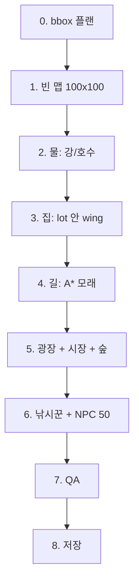

# 큰 마을 생성 흐름 (쉽게)

100×100 **「큰 강호 장터 마을」** 이 어떻게 만들어지는지, 코드 기준으로 순서만 정리한다.

목표: **어디를 고치면 뭐가 바뀌는지** 한눈에 보이게 하기.

---

## 한 줄 요약

```
자리 잡기(plan) → 맵 → 물 → 집(다양) → 구불 길 → 시장 하네스 → 울타리 → 나무·소품 → NPC → QA → 저장
```

**타일을 먼저 막 깔지 않는다.**  
먼저 사각형(bbox)으로 “여기 집, 여기 시장”을 정하고, 그다음에 실제로 찍는다.

> AI 경로 메모 (2026-09-04): 위 순서는 100×100 bbox 하네스 전용이다. AI `author_village` / `build_village`는 다르다. 지금은 스케치 후보(`sketchHouseSites`)를 먼저 뽑고 집을 찍은 뒤 길을 잇는다. 즉 sketch sites → houses → roads다.
>
> AI `build_village` 대로 (2026-09-05): 72칸 이상 맵의 골격은 이제 곡선이다. `villageBoulevardPath`가 시드 고정 경유점을 잡고, 집 예약과 길 칠하기는 `boulevardCells` 한 칸 함수를 같이 쓴다.

---

## 관련 파일

| 역할 | 파일 |
|------|------|
| 자리 잡기 (bbox 플랜) | `src/project/defaults/largeVillageBboxPlan.ts` |
| 실제 시공 (물·집·길·NPC) | `src/project/defaults/largeRiverMarketVillageBuild.ts` |
| 단계 로그 / ASCII | `src/project/defaults/largeVillageBuildLog.ts` |
| 강제 빌드+저장 (100×100) | `scripts/force-save-large-village.mts` |
| 강제 빌드+저장 (50×50, 맵 1장만) | `scripts/force-save-village-50.mts` |
| 길↔집 진단 | `scripts/diagnose-road-through-house.mts` |
| 결과 로그 | `output/evidence/large-river-market-village/` · `village-50-harness/` |
| 열어볼 프로젝트 ID | `rpg-zzu-large-river-market` (100) / **`rpg-zzu-village-50`** (50) |

갤러리 프로젝트(`rpg-zzu-house-template-gallery`)에도 같이 저장하지만,  
**브라우저에 예전 「호수 마을」 탭이 열려 있으면 자동저장이 덮어쓸 수 있다.**  
확인은 전용 ID를 연 뒤 하드 리프레시하는 편이 안전하다.

---

## 전체 그림



로그에도 같은 순서로 단계가 남는다: `S01 plan` … `S11 qa` … `save`.

---

## 단계별 설명

### 0단계 — 자리 잡기 (`planLargeVillageBboxes`)

**타일은 아직 안 찍는다.** 종이 위에 네모만 그린다.

1. **고정 기물** (거의 안 움직임)
   - 서쪽 강, 남쪽 강
   - 북동 호수
   - 동쪽 숲 띠
2. **건조 구역 dry**  
   물·숲 뺀 “마을 지을 수 있는 땅”
3. dry 안에 **광장 → 시장** 자리를 잡고
4. 남은 칸에 **집 롯(lot)** 을 격자 후보에서 골라 채움  
   - lot 기본: 10×9, 집 사이 gap 2  
   - 목표: 집 20채  
   - 겹치면 시드 바꿔 최대 ~50번 재시도  
   - 완벽한 플랜이 안 나오면 **가장 나은 것(best-effort)** 으로 진행
5. **도로 앵커** 좌표만 미리 찍음  
   (광장 중심, 시장 입구, 호수 가, 서/남 부두)

ASCII 로그: `00-plan-bbox.txt`  
- `H`=집 롯, `P`=광장, `M`=시장, `L`=호수, `~`=강

```
중요한 구분
  lot  = 집 “필지” (마당 포함 네모)
  wing = lot 안쪽에 실제로 짓는 건물 (여백 1칸 안쪽)
```

---

### 1단계 — 맵 생성

- 빈 프로젝트 + 타일셋 하네스
- `create_map` → 100×100, 이름 **큰 강호 장터 마을**
- 맵 ID: `map_large_river_market_village`

---

### 2단계 — 물

플랜에 있는 강/호수 bbox만 `fill_region`으로 채움.

- 강: 사각형
- 호수: 원형 마스크

ASCII: `01-after-water.txt`

---

### 3단계 — 집 (다양화)

각 **lot**마다:

1. lot 안쪽에 **wing** — 폭·높이·좌우 오프셋을 RNG로 섞음 (5~8 × 6~7)
2. `build_house_kit`  
   - 키트: bright-plaster / blue-stone (엔진에 2종뿐 → **크기·창문 간격**으로 차이)
   - 창문 spacing 1~3 순환  
   - 내부 맵·문 이벤트 없음
3. 문·문 앞 기록 → 길·울타리용

ASCII: `02-after-houses.txt`

---

### 4단계 — 구불구불 길

**집 다음에 길.** wing만 차단.

```
① 간선: 광장↔시장 / 부두 / 호수
   - A* + 비용 노이즈 + 옆길 경유점 (windyAstar)
② 문 스퍼: 문 앞 → 가장 가까운 기존 길
```

- 벽 옆 칸 비용↑ (골목 기피)
- 모래 경로 + 남 1칸, 마지막 오토타일
- ASCII: `H` 집 / `R` 길 / `X` 집 안 길(버그)

---

### 5단계 — 광장 + 시장 하네스

상점가 빌드에서 이식 (천막 타일 411–443 금지):

- 목재 데크 전체: body **222** + edge **228/229/230/192** + 남단 base **223**
- 남단 upper 난간 468–470 + 중앙 입구 3칸
- 카운터 234–236 + shop 이벤트 + 옆 NPC 잡담
- 상자·과일·꽃 (천막 없음)

---

### 6단계 — 울타리 + 마당 (집과 별 개념)

- **울타리 ≠ 집.** 일부 집만 울타리 (~55%)
- 울타리는 **필지(lot) 둘레**, 건물은 안쪽에 두고 **마당 1~2칸** (특히 문 앞)
- 문 앞 남쪽 3칸 게이트 / 모래·물 위 울타리 금지
- 마당·소품·지형 하네스:
  - **길 위 소품 금지**
  - **장작** = 집 앞만
  - **의자/벤치** = 길 옆, **드묾** (50맵 2~3쌍, 100맵 3~5쌍)
  - **울타리 필지 보호**: 울타리 집 lot 내부는 길·나무·NPC·벤치 침범 금지 (남쪽 게이트 3칸만 개방)
  - **나무**: 침엽 1×2 + **활엽 2×2**, **숲** 고밀도 격자 채움
  - **강**: **sin 곡선** 수역
  - **집 필지**: 크기 혼합 배치 (`HOUSE_LOT_SIZES_SMALL/LARGE`, 7×7~12×10). 동일 격자 폐지.
  - **집 형태**: rect / ㄱ(L) / ㄴ(J) / ㅁ·ㄷ(U) / tall — 가용 공간 내 **사용 횟수 분산** + 필지 여백(slack)
  - **키트/울타리**: blue-stone·bright-plaster 교대 분산, 필지≥9 시 울타리 목표 채수
  - **마당 테마**: garden / workshop / storage / pathside / minimal
  - **시장**: 상점가와 동일 나무 데크 하네스(222+edges+223) + 카운터. 천막(411–443) 사용 금지
  - **숲**: 동쪽 밴드 **sin 곡선** 척추 + **2×2 활엽 주력**, 1×2 침엽 희소
  - **layoutPlan**: 시공 후 `GameMap.layoutPlan`에 bbox 설계도 저장 (집/시장/숲/강 라벨·kit·door). 쿼리: `findLayoutRegions`
  - **맵 PNG 캡처**: 큰 맵 배율 자동 조절, 배경 채움, 이벤트 마커, dataUrl DOM 과부하 방지

---

### 7단계 — 나무·마을 소품

`place_props` 여러 밴드 (동쪽 숲만이 아님):

- 동 숲, 호수 서/남, 서 강둑, 남 강둑, 북단, 중앙 틈
- 광장 꽃·벤치
- 실패 시 호수/강 가 **수동 침엽수** 보강

ASCII: `04-after-market.txt`

---

### 8단계 — NPC

- 호수 가 **낚시꾼** 1명
- 통행 가능한 칸에 주민 채워 **총 50명** 전후
- 시작 위치 = 광장 중앙(막히면 광장 안 다른 칸)

ASCII: `05-final.txt`

---

### 9단계 — QA (품질 게이트)

대략 이런 걸 본다:

| 검사 | 의미 |
|------|------|
| size100 | 100×100 |
| planOk / housesEnough | 집 수 충분 |
| noPlanOverlap | 플랜 네모 겹침 없음 |
| water / fisher / market | 물·낚시·상점 있음 |
| npcsEnough | NPC 대략 50 |
| startPassable | 시작점 걸을 수 있음 |
| **noRoadThroughHouse** | **건물 wing 안에 모래 0칸** |

주의:

- QA 통과 ≠ “예쁜 마을”
- 예전에는 “lot 안 모래”를 세서 착시와 안 맞았고,  
  지금은 **wing(건물)** 기준이다.
- 집 사이 골목 길, 듬성듬성함 등은 QA 밖이다.

---

### 10단계 — 저장

`scripts/force-save-large-village.mts` 가:

1. 시공
2. `rpg-zzu-large-river-market` 저장 + 검증
3. 갤러리 프로젝트에도 저장 + 3.5초 후 덮어쓰기 여부 확인
4. `HANDOFF.json`, `README_OPEN_THIS.txt` 작성

---

## 데이터 개념 3개만 기억하기

```
┌──────── lot (필지 10×9) ────────┐
│  (여백 1)                        │
│    ┌──── wing (건물 8×7) ────┐  │
│    │  지붕/벽/문              │  │
│    │           [문]           │  │
│    └──────────────────────────┘  │
│              [문 앞]  ← 길 연결   │
└──────────────────────────────────┘
```

1. **lot** — 플랜 단계의 집 자리 (겹침 방지 단위)
2. **wing** — 실제로 찍히는 건물 + 길이 **절대 못 지나가는** 단위
3. **road anchor / 문 앞** — 길을 붙이는 점

---

## 예전에 자주 깨지던 이유 (로직 이슈)

| 증상 | 원인 (요약) |
|------|-------------|
| 길이 집을 가로지름 | 직선 `paint_road` / lot 무시 경로 — **build_village는 houseBlocked 마스크로 집 칸 스킵 + 성분 재연결**. AI 가 직접 부르는 `paint_road`/`lay_path` 도 `src/editor/tools/roadObstacles.ts` 로 같은 보호를 받는다 |
| QA는 PASS인데 화면은 이상 | 집·길을 둘 다 `#`로 찍음, 검사 기준이 느슨 |
| 길이 집 사이에 끼어 보임 | lot 전체 차단 + 모든 문→광장 거미줄 |
| 집이 20채 안 됨 | houseGap을 키우면 dry 공간 부족 |
| 에디터에 호수 마을만 보임 | 다른 프로젝트 탭 자동저장이 갤러리 덮음 |
| 집 안에 문이 이상 / 내부맵 | `interior:false`, `doorEvent:false` 로 완화 (현재) |

---

## 로그 읽는 법

폴더: `output/evidence/large-river-market-village/`

| 파일 | 언제 |
|------|------|
| `00-plan-bbox.txt` | 자리만 |
| `01-after-water.txt` | 물 후 |
| `02-after-houses.txt` | 집 후 |
| `03-after-roads.txt` | 길 후 ← **길/집 문제 볼 때** |
| `05-final.txt` | 최종 |
| `build.log` | 사람 읽기용 타임라인 |
| `build.jsonl` | 이벤트 전체 |
| `report.json` | QA·요약 |

`03`에서 **`X`가 보이면** 길이 건물 안을 침범한 것이다.  
`H`와 `R`이 옆칸에 있는 것은 “벽 옆 골목”이지, 건물을 뚫은 것은 아니다.

---

## 다시 만들 때

```bash
npx tsx scripts/force-save-large-village.mts
```

선택 진단:

```bash
npx tsx scripts/diagnose-road-through-house.mts
```

에디터: 프로젝트 **`rpg-zzu-large-river-market`** 열고 하드 리프레시.

---

## 고칠 때 어디를 만지나

| 바꾸고 싶은 것 | 손댈 곳 |
|----------------|---------|
| 집 개수·간격·lot 크기 | `largeVillageBboxPlan.ts` DEFAULTS |
| 강/호수/광장/시장 위치 | 같은 파일 고정 bbox / plaza·market 배치 |
| 집 모양·문 | `largeRiverMarketVillageBuild.ts` 집 루프 + `build_house_kit` |
| 길이 집을 피하는지 | `buildRoadBlockedSet`, `astarAvoid`, `paintSandPath` |
| 길이 너무 많음/거미줄 | 간선 목록, 문 스퍼→nearest 로직 |
| QA 기준 | `runQa` |
| 로그 파일 | `LargeVillageBuildLog` |

---

## 아직 약한 부분 (솔직히)

- **예쁜 마을 알고리즘이 아님** — 예전 설명은 격자 lot + A* 모래 연결이었으나 지금은 다르다. 집 후보는 격자 폴백을 남겨두되, `sketchHouseSites`(poisson/cluster, seed-stable)를 먼저 쓰는 유기적 후보가 기본이다. 간선은 T-branch 계약을 유지한 채 다리당 내부 경유점 하나를 더 얻는다. 관련 파일은 `src/editor/tools/village/sketch.ts`, `houses.ts`, `roads.ts`, `builder.ts`다.
- 집 간격 2칸이면 벽 옆 길이 **시각적으로 답답**할 수 있음
- gap을 키우면 20채가 안 들어가 best-effort로 떨어짐
- 시장·광장 장식은 스탬프 위주
- “플레이어가 자연스럽게 걷는 동선” 디자인 단계는 아직 얕음

다음 개선 후보 (참고):

1. 집 **블록 단위** 외곽 순환로 먼저 → 문만 짧은 진입로  
2. lot gap과 도로 폭을 한 세트로 설계  
3. QA에 “벽 밀착 도로 비율” 같은 **시각 품질** 지표 추가  
4. 플랜 실패 시 gap/lot 자동 완화 피드백

---

## 관련 위키

- 에디터 전반: `openwiki/editor-workflows.md` (slim index → topic pages: `editor-pre-edit-routing.md`, `editor-event-authoring.md`, `editor-event-commands.md`, `editor-database.md`, `editor-ai-panel.md`, `editor-workflows-misc.md`)
- 검증 습관: `openwiki/testing.md`
- 이 문서: `openwiki/large-village-generation.md`

---

## author_village 스코프 계약 (2026-09-04 적대 리뷰 반영)

- 살아 있는 기존 맵(비기본 타일·이벤트 있음)은 bounds 또는 target.fullMap:true 없이 전체 재시공이 거부된다(village-requires-scope). 빈 맵은 그대로 전체 시공.
- 허용 맵 집합은 빌더 자기신고가 아니라 베이스라인 diff에서 독립 계산한다 — 문 transfer가 가리키지 않는 미연결 맵은 스코프 위반.
- 스코프 비교는 키 순서 안정 직렬화다.
- NPC 수는 하한 90%(최소 2명 관용)로 판정한다. best-effort 집 수는 4채 이하에서 exact와 같다.
- 기존 맵 bounds 하한 16·맵 전체 하한 20·새 맵 20×20 이상. new 타깃의 plannedMap은 생략 가능(생략하면 target 값).
- 길 재시도 리포트가 warnings에 기계 가독으로 남는다(시도·침범 추이·잔존 분류).
