# Slates 전체 구역 재검토 — 생성 문서

[핵심 학습 기록](slates-structure-learning.md). 아래 범위는 v2의 모든 1232슬롯을 덮는다. 구역 분류와 모든 타일의 조립 검증을 혼동하지 않는다.

## 기본 잔디 (grass)

원본 32px 좌표: [0,0,4,4].

중심 57, 변·모서리 분리. 초록 단색처럼 보여도 픽셀 결이 있으므로 임의 늘리기/회전 금지.

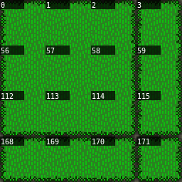

관련 표본: gate, wall-step, cemetery, tower, projecting-house, raised-garden, inn, roof-junction, stairs, cave, falls, bridge, shore, terraced-court, forecourt, planter, roof-deep, stairs-long.

## 모래 바닥 (sand)

원본 32px 좌표: [4,0,4,4].

중심 61. 모래길과 해안의 파도띠는 별개. 참고의 길은 노란 물결무늬 바닥도 사용하므로 단색 모래만 반복하면 질감이 달라진다.

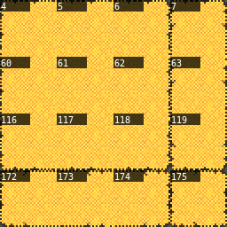

관련 표본: gate, raised-garden, well-court, bridge.

## 흙 바닥 (earth)

원본 32px 좌표: [8,0,4,4].

중심 65. 갈색 점무늬는 흙이다. 명도가 비슷하다는 이유로 그림자 대신 사용하지 않는다.

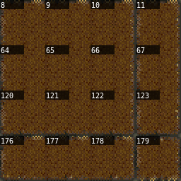

관련 표본: inn, ship-large.

## 석재 포장 (paving)

원본 32px 좌표: [12,0,4,4].

중심 69. 줄눈 위상은 16px 반칸에서도 유지. 계단 위아래 착지와 기단 내부를 함께 맞춘다.

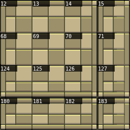

관련 표본: wall, wall-step, cemetery, church, projecting-house, market, inn, terraced-court, water-arches, parapet-corner, castle-facade, forecourt, planter, wall-long.

## 무성한 잔디 (wild-grass)

원본 32px 좌표: [0,4,4,6].

기본 잔디보다 촘촘한 결. 가운데 면/가장자리를 따로 보고 기본 잔디와 무작위 체커보드 혼합 금지.

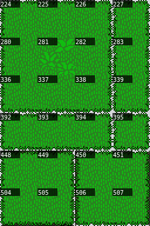

관련 표본: cemetery, raised-garden, inn, roof-junction, stairs, cave, shore, roof-deep, stairs-long.

## 석축 띠 (stone-border)

원본 32px 좌표: [4,4,12,2].

4~15열의 가로 석축 세 계열. 기둥/명암/높이를 한 계열 안에서 연결한다.

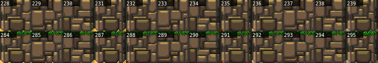

관련 표본: tower, inn, stairs, cave, falls, parapet-corner, stairs-long.

## 잔디 경계 / 빈 받침 (grass-edge)

원본 32px 좌표: [4,6,4,16].

340~1015 부근의 회색으로 보이는 부분은 투명하다. 단순 9분할 외에 오목 모서리·가느다란 연결·좁은 잎 조각이 있다. 아래 바닥을 먼저 배치.

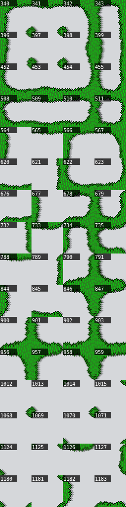

관련 표본: cemetery, projecting-house, raised-garden, inn, roof-junction, stairs, bridge, shore, ship-large, ship-small, water-arches, parapet-corner, forecourt, roof-deep, stairs-long.

## 수련과 선인장 (lily)

원본 32px 좌표: [8,6,4,1].

수련 잎은 물, 선인장은 모래/지면. 하나의 행에 들어 있다고 같은 생태/레이어가 아니다.

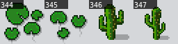

관련 표본: tower, raised-garden, inn, stairs, bridge, water-arches, forecourt, stairs-long.

## 바위 세 변종 (rocks)

원본 32px 좌표: [8,7,4,3].

400대는 물 반사, 456대는 일반, 512대는 이끼 변형. 수중 바위의 파란 받침을 풀밭에 놓지 않는다.

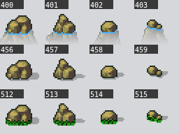

관련 표본: gate, wall-step, cemetery, tower, church, projecting-house, joined-shops, raised-garden, well-court, market, inn, stairs, falls, bridge, terraced-court, parapet-corner, forecourt, planter, stairs-long.

## 검은 반투명 그림자 (shadow)

원본 32px 좌표: [8,10,4,2].

568은 RGBA(0,0,0,64) 전체 그림자. 569~571/624~627은 같은 알파64의 다른 마스크. 어두운 땅이 아니라 원래 바닥 위의 25% 검정 합성이다.

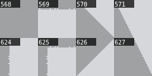

관련 표본: gate, wall-step, tower, church, projecting-house, joined-shops, raised-garden, well-court, inn, roof-junction, stairs, cave, falls, bridge, pier-junction, ship-large, terraced-court, water-arches, parapet-corner, forecourt, planter, roof-deep, stairs-long.

## 포장 연결 조각 (paving-alt)

원본 32px 좌표: [12,6,4,4].

줄눈/경계의 전용 연결 조각. 12~15열 6~9행을 그대로 반복하는 하나의 바닥으로 취급하지 않는다.

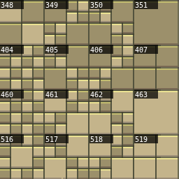

관련 표본: gate, wall, wall-step, cemetery, tower, church, joined-shops, market, inn, terraced-court, water-arches, parapet-corner, castle-facade, forecourt, planter, wall-long.

## 꽃 장식 (flowers)

원본 32px 좌표: [12,10,4,2].

629 흰색/630 노랑/631 보라 소규모 덧그림. 큰 꽃무리는 위 행의 다른 블록이다. 길·입구·벽의 접점을 침범하지 않는다.

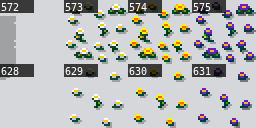

관련 표본: cemetery, tower, projecting-house, joined-shops, raised-garden, inn, stairs, falls, bridge, pier-junction, ship-large, water-arches, parapet-corner, stairs-long.

## 침엽수 군락 (pine-cluster)

원본 32px 좌표: [8,12,4,4].

4×4 군락. 가운데 나무를 잘라 독립 나무처럼 쓰지 않는다. 바깥 실루엣을 독립 침엽수와 이어 숲 가장자리를 만든다.

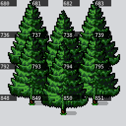

관련 표본: inn, water-arches.

## 활엽수 군락 (leaf-cluster)

원본 32px 좌표: [12,12,4,4].

4×4 군락. 밑동은 여러 위치에 있고 수관은 겹친다. 전체 사각형 막기 대신 바닥 발자국을 따로 설계.

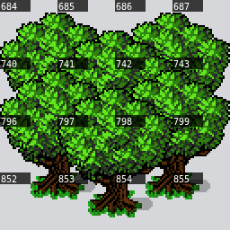

관련 표본: wall, wall-step, cemetery, tower, joined-shops, raised-garden, market, inn, ship-large, parapet-corner, wall-long.

## 수관·묘목·그루터기 (tree-parts)

원본 32px 좌표: [8,16,8,2].

묘목·그루터기와 수관 접점이 혼재한다. 964/965 그루터기는 가지/수관의 꼭대기 조각이 아니다.

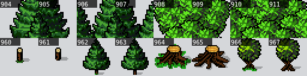

관련 표본: wall-step, cemetery, joined-shops, inn, roof-junction, stairs, ship-large, terraced-court, forecourt, planter, roof-deep, stairs-long.

## 독립 나무 / 덤불 (single-trees)

원본 32px 좌표: [8,18,8,4].

침엽수/활엽수 2×3, 죽은 나무 2×2. 같은 높이의 줄기끼리 연결. 1022/1023 덤불은 죽은 나무 윗행이 아니다.

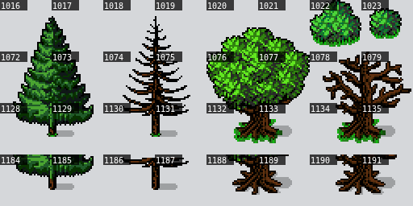

관련 표본: gate, wall-step, church, projecting-house, joined-shops, raised-garden, market, inn, roof-junction, falls, ship-large, ship-small, forecourt, roof-deep.

## 잔디 절벽 (cliff)

원본 32px 좌표: [0,10,4,12].

평평한 잔디 상단, 암벽 전면, 동굴 입구, 하단 마감을 분리. 동굴 검은 부분과 통과 가능한 바닥/전이는 별도다.

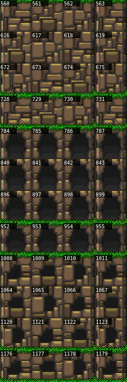

관련 표본: raised-garden, inn, roof-junction, stairs, cave, falls, water-arches, roof-deep, stairs-long.

## 모래 물결 / 해안 (water)

원본 32px 좌표: [16,0,4,12].

(16,4)의 중앙 297은 모래섬. 16~19열에는 해안 파형·순수 물·모래 무늬가 같이 있다. 색과 사용 문맥을 함께 확인.

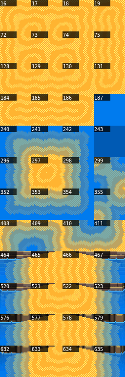

관련 표본: gate, wall-step, cemetery, tower, church, projecting-house, joined-shops, raised-garden, well-court, market, inn, falls, bridge, pier-junction, ship-large, ship-small, water-arches.

## 폭포와 낙수 (falls)

원본 32px 좌표: [16,12,4,2].

688~691 시작, 744~747 물보라. 낙수 시작/끝의 높이를 암벽과 맞추고 반복 면과 끝을 나눈다.

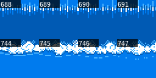

관련 표본: falls, water-arches.

## 수변 석축 (water-wall)

원본 32px 좌표: [16,14,4,4].

800~803 석축/수면, 856~859 잔디 끝/수면, 912~915 포장 끝/수면. 968~971은 기둥과 반사 조각. 같은 받침으로 혼용 금지.

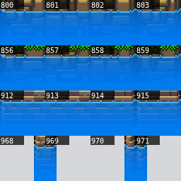

관련 표본: inn, bridge, pier-junction, water-arches.

## 도개교 / 사슬 (drawbridge)

원본 32px 좌표: [16,18,4,4].

사슬의 부착점과 판자 시작/끝을 구분. 화면상 사슬과 열고 닫는 동작은 별개. 다른 통행 상태에는 별도 이벤트가 필요.

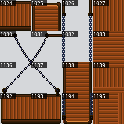

관련 표본: gate, wall-step, joined-shops, inn, ship-small, water-arches.

## 목재 다리 / 부두 (dock)

원본 32px 좌표: [20,0,4,20].

20~23열 0~13행의 판자·계단·기둥과 14~19행의 울타리를 분리. 188~191 가로 보행판, 23/79/135 세로 판자, 860~974 울타리 면, 1028~1031 끝/문, 1084~1087 표지판.

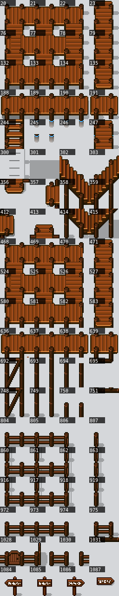

관련 표본: gate, cemetery, tower, projecting-house, joined-shops, raised-garden, inn, roof-junction, stairs, falls, bridge, pier-junction, ship-large, ship-small, water-arches, parapet-corner, forecourt, roof-deep, stairs-long.

## 방향 표지판 (signpost)

원본 32px 좌표: [20,20,4,2].

표지판은 독립 기둥이 붙은 방향별 형태. 길 분기 바깥에 놓고 문/보행선을 막지 않는다.

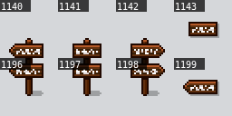

관련 표본: joined-shops, stairs, stairs-long.

## 계단 / 사면 (stairs)

원본 32px 좌표: [24,0,4,22].

24~27열 0~7행은 석재 계단의 직선·V자·옆면. 8행 아래는 잔디/암벽 경사면도 섞이며 922/923/978/979는 우물이다. 큰 직사각을 하나의 계단으로 복사 금지.

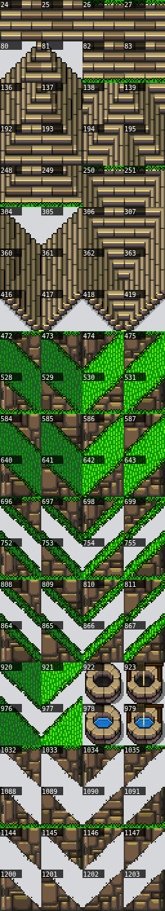

관련 표본: wall-step, cemetery, joined-shops, raised-garden, well-court, market, inn, roof-junction, stairs, falls, bridge, pier-junction, terraced-court, water-arches, forecourt, planter, roof-deep, stairs-long.

## 마른 우물 / 물 우물 (well)

원본 32px 좌표: [26,16,2,2].

922/923 마른 우물, 978/979 물 우물. 각 1칸 변형. 주변 접근 칸을 남긴다.

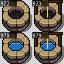

관련 표본: raised-garden, well-court, bridge, pier-junction, terraced-court.

## 목조 골조 / 창 (timber)

원본 32px 좌표: [28,0,4,22].

기둥, 대각 가새, 가로 띠, 창이 별개. 건물 높이를 늘릴 때 창·벽의 몸통을 선택하고 처마/기단은 고정.

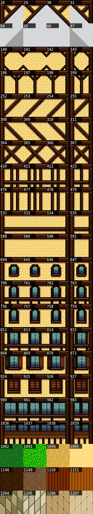

관련 표본: gate, wall-step, cemetery, projecting-house, joined-shops, raised-garden, market, inn, roof-junction, stairs, cave, falls, ship-large, ship-small, terraced-court, water-arches, parapet-corner, forecourt, planter, roof-deep, stairs-long.

## 성탑 변형 (towers)

원본 32px 좌표: [32,0,4,11].

상단 32/33/34는 서로 다른 덮개. 312~315/592~595 푸른 받침은 수면용. 482/483처럼 잔디가 붙은 바닥 마감과 구분.

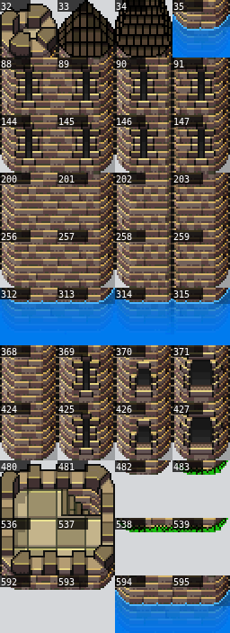

관련 표본: gate, wall, wall-step, cemetery, tower, church, projecting-house, joined-shops, raised-garden, inn, pier-junction, ship-large, terraced-court, water-arches, parapet-corner, castle-facade, planter, wall-long.

## 화단 창 / 돌출층 (balcony)

원본 32px 좌표: [32,11,4,11].

648~651 꽃 창, 704~707 긴 꽃 창, 872~875 돌출층 아랫받침. 창과 받침을 같은 열로 내려온 뒤 1층 벽/문에 연결한다.

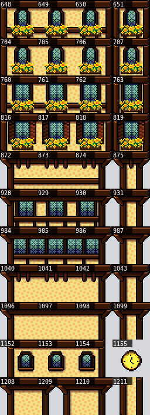

관련 표본: wall-step, projecting-house, joined-shops, market, inn, roof-junction, water-arches, roof-deep.

## 지붕 / 박공 (roof)

원본 32px 좌표: [36,0,4,20].

150/151은 삼각 꼭짓점 계열. 36~39/92~95 등 반복 면으로 깊이를 만들고 앞 박공·처마는 한 번만. 540/541 굴뚝, 542 지붕창, 708~711 가로 띠, 1046~1103 석조 박공을 구분.

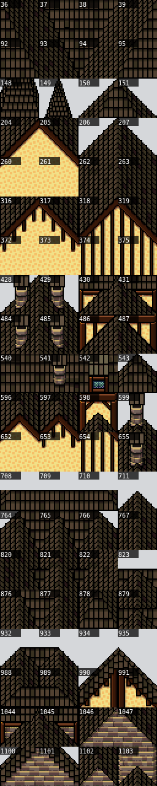

관련 표본: gate, wall-step, tower, church, projecting-house, joined-shops, raised-garden, well-court, market, inn, roof-junction, bridge, castle-facade, roof-deep.

## 횃불 / 작은 장식 (torch)

원본 32px 좌표: [36,20,4,2].

불꽃 높이와 부착 지점이 다른 변형. 성벽 면에 붙이며 그림만으로 조명/애니메이션을 주장하지 않는다.

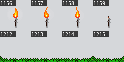

관련 표본: gate, wall, wall-step, cemetery, tower, projecting-house, joined-shops, raised-garden, market, inn, stairs, falls, bridge, ship-small, parapet-corner, forecourt, wall-long, stairs-long.

## 성벽 면 / 아치 (castle-face)

원본 32px 좌표: [40,0,4,10].

40~43열 0~4행의 벽/창, 5~9행의 아치·기둥·끝이 섞인다. 아치 안에 무엇을 비출지(물/길/그늘)를 먼저 결정.

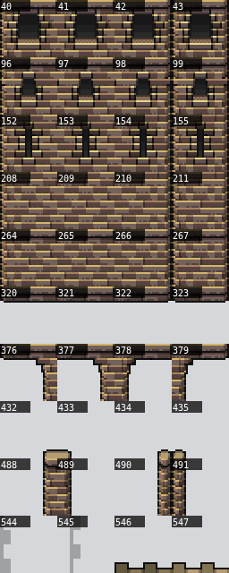

관련 표본: gate, wall, wall-step, cemetery, joined-shops, raised-garden, market, inn, roof-junction, stairs, terraced-court, water-arches, parapet-corner, forecourt, planter, wall-long, roof-deep, stairs-long.

## 성벽 보행로 / 흉벽 (battlement)

원본 32px 좌표: [40,10,4,12].

600~603 위 경계, 656~659 기둥/홈, 712~715 앞 흉벽. 특히 657/658은 빈 보행면이 아니다. 824 이후는 내측/외측 꺾임과 좁은 끝 조각.

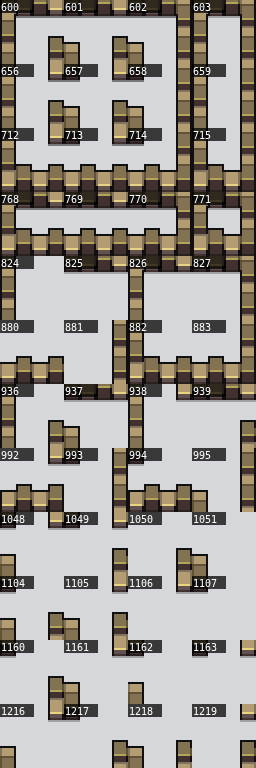

관련 표본: gate, wall, wall-step, cemetery, market, inn, ship-small, terraced-court, water-arches, parapet-corner, castle-facade, forecourt, wall-long.

## 배 / 돛대 / 묘비 (ships)

원본 32px 좌표: [44,0,8,4].

44~51열 0~3행에 선체·돛대·묘비가 혼재. 선수와 선미, 갑판, 마스트는 연결 방향과 높이가 다름. v1과 v2는 열 번호가 다르다.

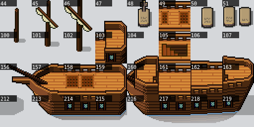

관련 표본: gate, wall-step, cemetery, tower, projecting-house, joined-shops, raised-garden, inn, roof-junction, stairs, falls, shore, pier-junction, ship-large, ship-small, parapet-corner, forecourt, roof-deep, stairs-long.

## 붉은 차양 (red-awning)

원본 32px 좌표: [44,4,4,6].

윗 띠·수직 늘어진 끝·하단 작은 깃을 구분. 가운데 띠만 가로 반복. 창이나 벽을 덮는 높이는 한 줄로 맞춘다.

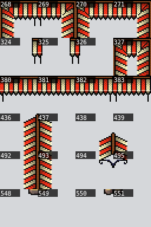

관련 표본: gate, wall-step, projecting-house, joined-shops, market, inn, roof-junction, ship-large, ship-small, terraced-court, water-arches, parapet-corner, castle-facade, roof-deep.

## 마당 포장 테두리 (court-border)

원본 32px 좌표: [44,10,4,6].

661/662/717/718 작은 사각틀, 772~775 긴 가로 테두리, 607/663/719 세로변 등. 투명 내부에는 원하는 지면을 먼저 둔다. 오목 모서리는 별도 조각.

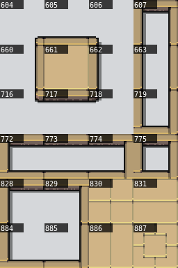

관련 표본: wall-step, tower, church, projecting-house, joined-shops, raised-garden, market, inn, terraced-court, water-arches, parapet-corner, castle-facade, forecourt, planter.

## 문자 간판 (shop-sign)

원본 32px 좌표: [44,16,4,2].

940~943 걸린 글자 간판과 996~999 다른 설치 형태를 구분. INN/Market/SHOP 등 기능 표시는 실제 이벤트와 맞춰야 한다.

관련 표본: 번호판 검토만 수행; 참고 조립 사례 없음.

## 성의 긴 창 (gothic-window)

원본 32px 좌표: [44,18,4,4].

1052~1055 윗부분 → 1108~1111 몸통 → 1164~1167 및1220~1223 아랫부분. 같은 열의 창을 연결하고 가운데만 늘린다.

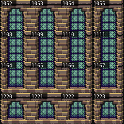

관련 표본: church, inn, water-arches, castle-facade, gothic, window-tall.

## 기둥 / 아케이드 (columns)

원본 32px 좌표: [48,4,4,4].

(48,4)부터 아치/기둥/받침. 기둥 한가운데를 다른 폭 아치 끝에 연결하지 않는다. 수로용 조합은 물이 받침.

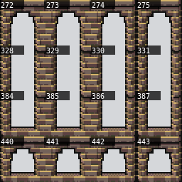

관련 표본: gate, terraced-court, water-arches, castle-facade.

## 철문 / 도르래 (gate)

원본 32px 좌표: [48,8,4,2].

496/497 격자 면과 552/553 도르래, 498~555 부착 기둥을 구분. 문 높이 반복 때 상단 캡/하단 끝을 함께 반복하지 않는다. 참고 성문 내부는 아직 재현 오차가 남아 자동 사용 보류.

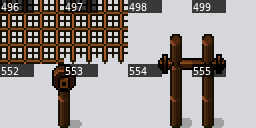

관련 표본: gate, wall-step, cemetery, church, projecting-house, joined-shops, inn, ship-large, ship-small, water-arches, parapet-corner, forecourt.

## 물레방아 (waterwheel)

원본 32px 좌표: [48,10,2,12].

2×3 네 자세: (48,10/13/16/19). 회전 중심과 건물 축·수면 접점이 필요. 모양만 옆에 띄우면 방앗간이 되지 않는다.

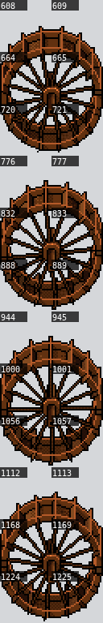

관련 표본: joined-shops, inn, terraced-court, planter, waterwheel-0, waterwheel-1, waterwheel-2, waterwheel-3.

## 풍차 날개 (windmill)

원본 32px 좌표: [50,10,2,8].

2×2 네 자세: (50,10/12/14/16). 날개만의 프레임이며 건물/회전축은 별개. 각 프레임을 한 칸에 겹치지 않는다.

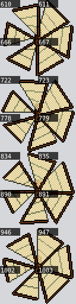

관련 표본: joined-shops, parapet-corner, forecourt, windmill-0, windmill-1, windmill-2, windmill-3.

## 사다리 (ladders)

원본 32px 좌표: [50,18,2,4].

50~51열 18~21행의 폭/끝/중간을 확인. 가로 사다리처럼 회전시키지 않는다. 높이 다른 착지는 별도 통행 설계.

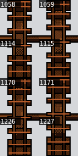

관련 표본: 번호판 검토만 수행; 참고 조립 사례 없음.

## 푸른 차양 / 깃발 (blue-awning)

원본 32px 좌표: [52,4,4,7].

276~391 차양/띠, 444~503 옆으로 늘어진 끝. 556~559 및612~615는 파랑/빨강 방패형 깃발. 같은 애니메이션 프레임이 아니다.

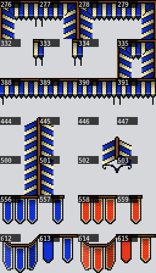

관련 표본: inn, stairs, ship-small, terraced-court, water-arches, parapet-corner, castle-facade, gothic, stairs-long, window-tall.

## 그림 간판 (pictogram)

원본 32px 좌표: [52,11,4,7].

그림 종류(식품/장비/약품/숙박 등)와 걸이 유무 두 축. 해당 상점 입구 곁에 놓고 줄마다 다른 기능을 자동 부여하지 않는다.

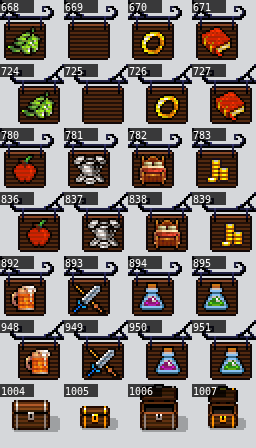

관련 표본: joined-shops, raised-garden, inn.

## 상자·문·벤치·깃발 (small-props)

원본 32px 좌표: [52,18,4,4].

문/문 상태, 상자, 벤치 방향, 깃발을 따로 분류. 벤치1118은 가로, 1117/1119는 세로. 북향처럼 돌리면 광원도 회전하므로 원본 방향 변형을 선택.

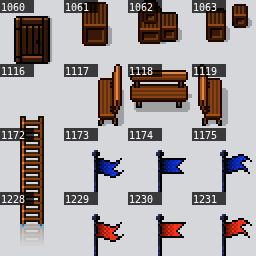

관련 표본: gate, cemetery, tower, church, projecting-house, joined-shops, raised-garden, market, inn, roof-junction, stairs, falls, bridge, pier-junction, ship-small, terraced-court, water-arches, parapet-corner, castle-facade, forecourt, planter, roof-deep, stairs-long.

## 물 / 난간 / 작은 파편 (water-top)

원본 32px 좌표: [52,0,4,4].

52~55 물/작은 물결, 108~111 판매대 4종, 164/165/220/221 작은 지붕 2×2, 166/167/222/223 바닥 소품(작은 물건·검·꽃). 한 개 물 구역으로 분류했던 것은 너무 거칠었다.

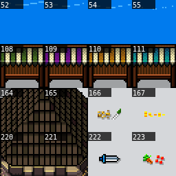

관련 표본: gate, wall-step, cemetery, tower, raised-garden, market, inn, stairs, falls, bridge, shore, pier-junction, ship-large, ship-small, water-arches, parapet-corner, forecourt, stairs-long.

