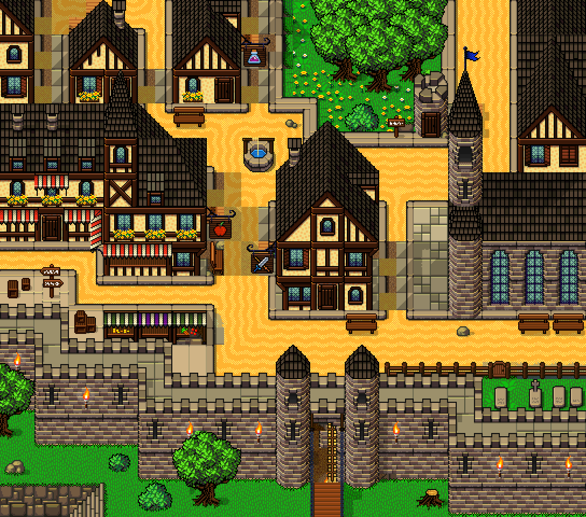
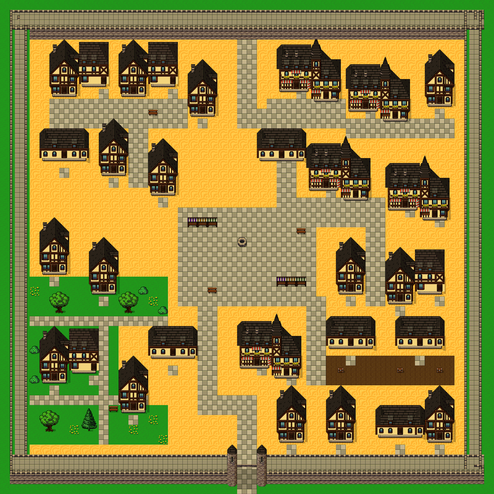
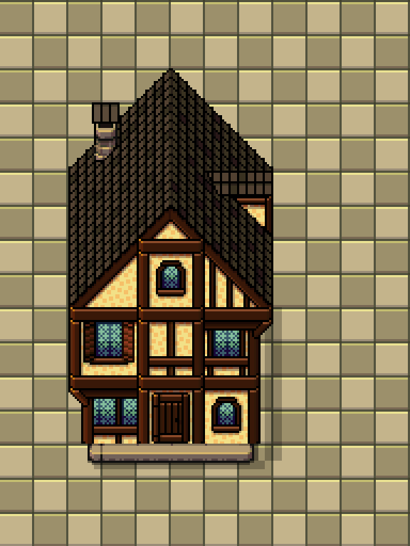
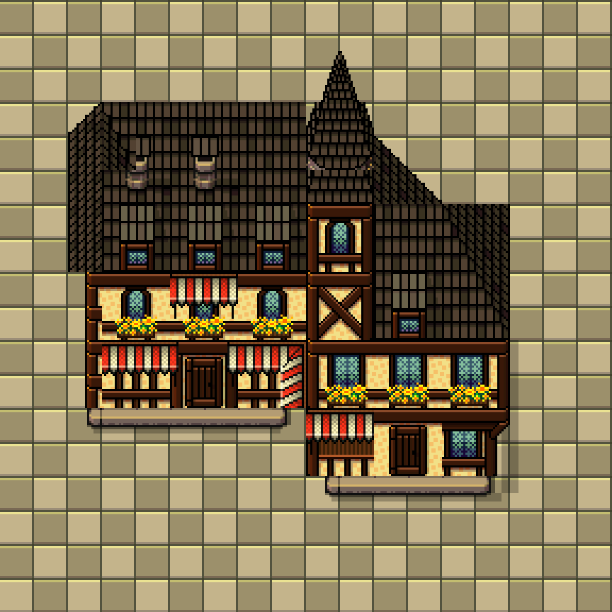
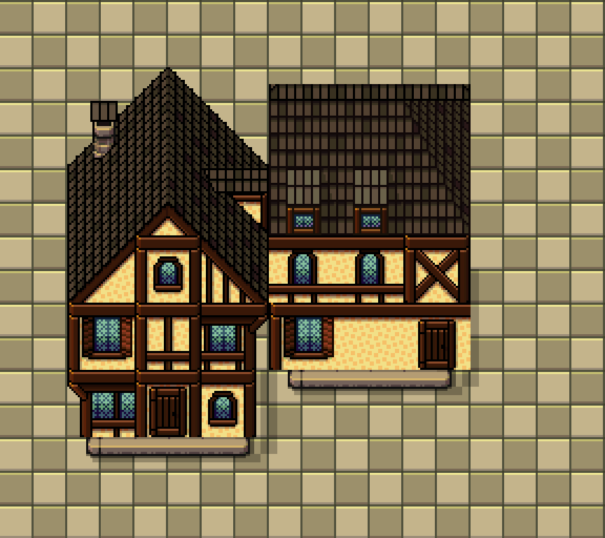
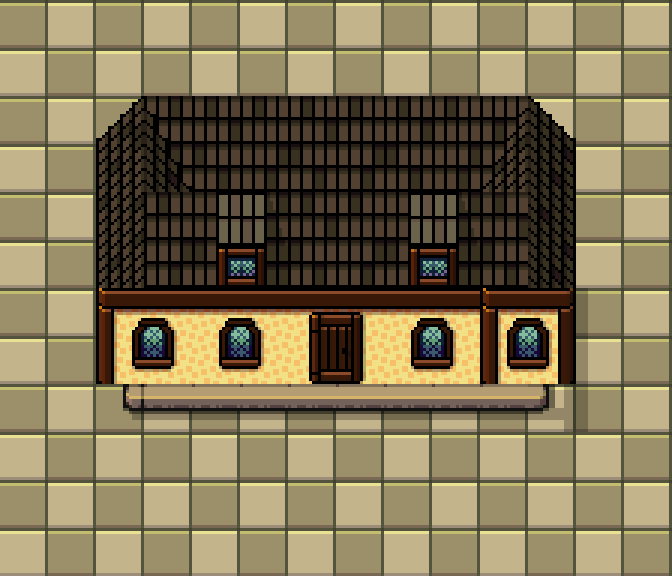

# 촘촘한 Slates 성곽 마을 — v3 필수 저작 계약

사용자 목표는 **집이 서로 가까이 들어찬 성벽 안 도시**다. 넓은 바닥 위에 독립 주택을 흩뿌린 배치는 반려한다. 이 문서가 이전 조립 지침의 권장 밀도보다 우선한다.

## 실패를 반복하지 않는 기준

v2는 26개 건물 모듈, 건축 실루엣 점유율 28.46%, 중앙 광장 14×10칸이었다. 통행과 저장은 성공했지만 사용자가 원하는 밀도에는 실패했다. 집 개수, 도로를 칠한 폭, 통행 성공만으로 완료 판정하지 않는다.

## 이번 50×50 맵의 필수 완료 기준

- 성벽 내부 평가 영역을 배치 전에 고정한다. 기본 `[3,4,44,42]` (단위 32px 셀), 면적 1,848칸. 밀도를 올리려 평가 영역을 줄이지 않는다.
- **건축 실루엣 합집합 50~65%**를 채운다. 원본 foreground alpha를 합성하여 면적을 계산한다. 바닥, 그림자, 나무, 성벽, 모듈 사각 패딩은 건물 면적에서 제외한다. 50% 미달이면 다시 배치한다. 이 값은 새 과제의 설계 조건이며 원본의 정확한 실측값이 아니다.
- 골목의 실제 연속 통행 폭은 기본 1칸, 주거리 2칸이다. 도로 타일만 1칸 칠하고 옆에 5칸의 열린 바닥을 남겨서는 안 된다. **모든 열린 바닥**의 여백을 측정한다.
- 큰 광장은 두지 않는다. 우물·시장 앞 공터는 최대 4×4칸, 작은 정원은 최대 5×5칸으로 각각 한 곳만 허용한다. 빈 공간을 '시장'이라고 이름 붙여 통과시키지 않는다. 그 외 완전히 빈 5×5 사각형은 없어야 한다. 공터·정원 예외 좌표는 배치 전에 고정하고 별도로 보고한다.
- 빈 칸을 덤불로 메워 수치만 맞추지 않는다. 집과 상점이 골목 가장자리를 만든다. 대부분의 주거 구역은 건축과 길이 맞닿고, 한 채마다 넓은 앞마당을 두지 않는다.
- 4종 이상 건물 실루엣을 섞는다. 같은 모듈 3개를 같은 높이에 나란히 반복하지 않는다. 붙은 상점군, 앞선이 1칸 어긋난 주택군, 여관 날개, 낮은 작업장을 섞어 **최소 6개 비정형 건물군**을 만든다. 창·문·지붕을 잘라 겹치는 방식은 금지한다.
- 문 앞 1칸과 성문에서 각 출입구까지 연결된 통로를 보장한다. 빽빽함 때문에 문이 막히면 해당 블록을 재배치한다. 성문을 막았을 때 성벽 밖으로 우회할 수 없어야 한다.
- 전체 50×50 그림뿐 아니라 **17×15칸 부분 확대 3곳**을 제출한다. 참고 그림도 약 17×15칸 범위이므로 동일한 공간 범위로 촘촘함을 비교한다. 전체 지도 축소 그림만으로 평가하지 않는다.

## 이미 배운 건물을 재사용하는 정확한 방법

[조립 모듈 JSON](../docs/experiments/slates-astra-v2/modules.json)은 바닥과 건축 부품을 분리해 저작한 자료다. 기존 전체 지도 배치나 생성기를 베끼지 않고 이 모듈의 원본 사각형 연산을 새 배치로 렌더한다.

`house`, `joined-shops`, `courtyard-inn`, `low-workshop`, `wall-corner`, `open-gate` 6개가 있다. 각 모듈의 `review`, `fixedParts`, `collision`, `anchors`를 읽는다. 일부 지붕 뒷면·성벽 접합은 partial이며 완전 무결한 일반 키트가 아니다. 임의 폭 확대/회전 금지. 새 변형은 고정 끝·반복 가능한 행을 지키고 확대 그림을 검토한다.

`operations`의 source 파일/sourceRect `[sx,sy,w,h]`, destination `[dx,dy]`, drawOrder를 그대로 쓴다. 확대 없이 alpha-over 한다. 배치할 때 `floor` 연산은 버리고 지도 바닥 위에 shadow → foundation → object 순서를 유지한다. `overhead`는 위 레이어·통행 가능으로 별도 처리한다.

대부분 모듈에 32px 비교용 여백이 있다. 지도 몸통의 `(x,y)`를 지정했다면 모듈 원점은 `(x*32-32,y*32-32)`다. 패딩 상자를 필지 크기로 쓰지 않는다. `collision.blockedRects`와 `approaches`는 모듈 원점 기준 32px 좌표이며 똑같이 이동한다. 건물의 실제 실루엣과 문 접근 칸을 함께 고려해 조밀하게 배치한다. 관찰용 배경까지 복사해서는 안 된다.

원본 v2는 56열, v1은 48열이다. 잔디 중심은 57(0은 모서리), 황금색 길 바닥은 16. 큰 나무는 모듈 틈이 아닌 한정된 정원에 두고 밑동만 충돌을 지정한다. 원본 그림에서 얻지 않은 새로운 픽셀 그림을 만들지 않는다.

## 작업 순서와 제출

1. 위 참고 그림, 반례, 사용할 건물 이미지를 실제로 연다. 원본 연산과 접근 좌표를 읽는다.
2. 고정 내부 영역과 작은 예외 공터를 정하고, 건물군/골목을 함께 채운다. 큰 공터를 먼저 만든 후 주변에 집을 흩뿌리지 않는다.
3. 전체 렌더와 17×15 부분 확대를 보고 빈 땅·반복·앞선·기단·문 앞을 교정한다. 면적과 가장 큰 빈 사각형을 산출한다. **밀도 실패는 partial로 종료할 사유가 아니라 다시 배치할 사유다.**
4. 배치 JSON에 building.module, offsetPx, 문 접근, 성문 passageCells/inside/outside, 예외 영역을 기록한다. 32px 타일로 포장한 bundle, 원본 레시피, PNG, 재생성 스크립트, 지표를 제출한다.
5. 감독자가 실제 편집기 렌더·충돌·저장 후 재로드를 확인한다. 최종 그림과 수치 둘 다 만족해야 이번 요청을 완료한다.

출처: Ivan Voirol, CC BY 4.0. 참고 화면은 목표 비교 자료이며 지도에 잘라 붙이는 재료가 아니다.
