# Slates 구조 표본 목록 — 생성 문서

[핵심 학습 기록](slates-structure-learning.md)과 함께 읽는다. 숫자 일치율은 의미/통행 검증 점수가 아니다.

## 성문과 쌍탑 (gate)

- 상태: **사용 보류**. 격자문 왼쪽과 아치 아래의 조각/겹침이 원본과 다르다. 성문 전체 자동 배치 템플릿으로 사용 금지.
- 조립: 탑 지붕 → 둥근 몸통 → 성벽 접합 → 문 격자 → 바닥 순서. 문 통로는 두 탑 사이의 별도 공간이다.
- 주의: 탑 밑을 물 반사 타일로 끝내지 않는다. 닫힌 격자문을 통행 가능으로 표시하지 않는다.
- 출처: ville_0, 사각형 [16,20,7,9], 16px 단위.
- 픽셀 비교: 정확 93.58%, 채널 차이 8 이하 98.42%.

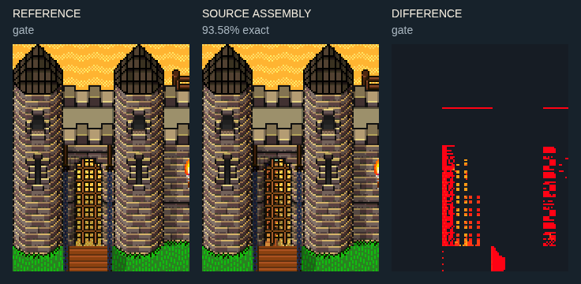

[원본 조각 번호판](images/slates/mastery/gate-parts.png) · 합성 순서와 사각형: catalog.cards[id=gate].patches / sourceParts.

## 직선 성벽의 단면 (wall)

- 상태: **문맥 조립**. 원본 조립 문맥과 남은 차이를 비교판에서 확인. 독립 가변 템플릿 인증은 아님.
- 조립: 뒤 흉벽·위 보행면·앞 흉벽·수직 벽면을 네 띠로 구분한다. 가로 반복은 가운데 면만 늘린다.
- 주의: 흉벽의 기둥/홈 조각을 보행면 전체에 반복하면 빈틈과 장애물이 생긴다.
- 출처: ville_0, 사각형 [2,20,8,5], 16px 단위.
- 픽셀 비교: 정확 98.58%, 채널 차이 8 이하 99.98%.

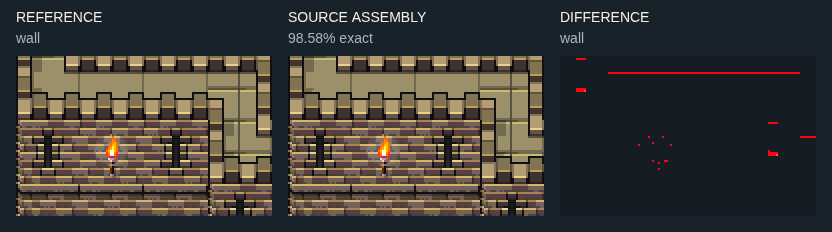

[원본 조각 번호판](images/slates/mastery/wall-parts.png) · 합성 순서와 사각형: catalog.cards[id=wall].patches / sourceParts.

## 높이가 꺾이는 성벽 (wall-step)

- 상태: **문맥 조립**. 원본 조립 문맥과 남은 차이를 비교판에서 확인. 독립 가변 템플릿 인증은 아님.
- 조립: 평면의 꺾임과 전면 벽 높이를 동시에 맞춘다. 안쪽 바닥과 바깥 지면의 높이가 다르다.
- 주의: 직선 벽 하나를 회전하는 방식은 이 시점의 옆면과 조명에 맞지 않는다.
- 출처: ville_0, 사각형 [9,19,5,10], 16px 단위.
- 픽셀 비교: 정확 97.2%, 채널 차이 8 이하 99.19%.

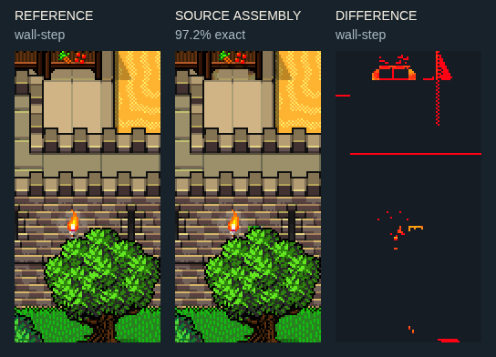

[원본 조각 번호판](images/slates/mastery/wall-step-parts.png) · 합성 순서와 사각형: catalog.cards[id=wall-step].patches / sourceParts.

## 울타리와 묘역 (cemetery)

- 상태: **문맥 조립**. 원본 조립 문맥과 남은 차이를 비교판에서 확인. 독립 가변 템플릿 인증은 아님.
- 조립: 반복 울타리 사이에 출입문을 두고 묘비 앞 한 칸을 남긴다. 묘역 바닥은 성벽 보행면과 별개다.
- 주의: 묘비가 섞인 배 구역을 선체 전체로 오인하지 않는다. 출입문 그림과 문 이벤트를 구분한다.
- 출처: ville_0, 사각형 [23,20,11,5], 16px 단위.
- 픽셀 비교: 정확 94.84%, 채널 차이 8 이하 97.51%.

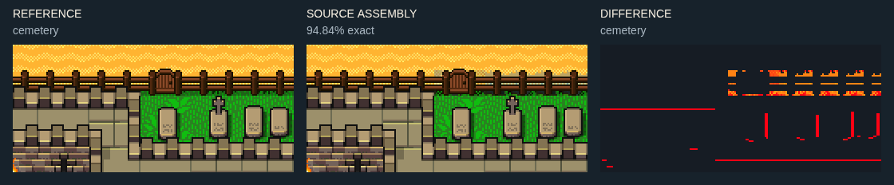

[원본 조각 번호판](images/slates/mastery/cemetery-parts.png) · 합성 순서와 사각형: catalog.cards[id=cemetery].patches / sourceParts.

## 둥근 탑과 긴 첨탑 (tower)

- 상태: **문맥 조립**. 원본 조립 문맥과 남은 차이를 비교판에서 확인. 독립 가변 템플릿 인증은 아님.
- 조립: 한 열짜리 원통 몸통 위에 뾰족 덮개를 얹는다. 둥근 음영은 가로 확장하지 않고 몸통만 세로 반복한다.
- 주의: 각 변형의 상단·기단·수면 반사가 같은 열에 섞여 있다. 모서리 탑 네 방향은 별도 확인 필요.
- 출처: ville_0, 사각형 [24,4,4,12], 16px 단위.
- 픽셀 비교: 정확 97.41%, 채널 차이 8 이하 99.23%.

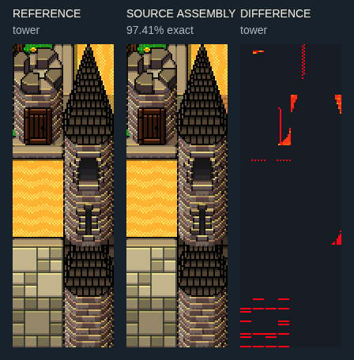

[원본 조각 번호판](images/slates/mastery/tower-parts.png) · 합성 순서와 사각형: catalog.cards[id=tower].patches / sourceParts.

## 높은 석조 건물의 전면 (church)

- 상태: **문맥 조립**. 원본 조립 문맥과 남은 차이를 비교판에서 확인. 독립 가변 템플릿 인증은 아님.
- 조립: 긴 창은 윗부분·중간·밑받침을 수직 연결한다. 석조 벽·기단·문 앞 단차가 하나의 높이 체계를 만든다.
- 주의: 이 잘라낸 예에는 지붕 전체가 없다. 완성 교회 스탬프로 부르지 않는다.
- 출처: ville_0, 사각형 [24,10,10,9], 16px 단위.
- 픽셀 비교: 정확 91.5%, 채널 차이 8 이하 99.99%.

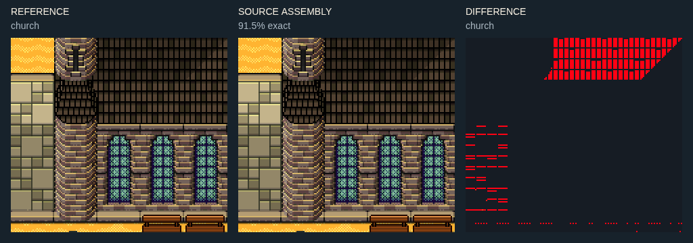

[원본 조각 번호판](images/slates/mastery/church-parts.png) · 합성 순서와 사각형: catalog.cards[id=church].patches / sourceParts.

## 돌출층과 박공이 있는 집 (projecting-house)

- 상태: **일부 확인**. 집 몸체는 확인했으나 오른쪽 기단 바깥 그림자에 차이가 남는다.
- 조립: 뒤 지붕 면, 중앙 돌출 박공, 상층 창, 돌출 받침, 아래 문과 기단을 차례로 읽는다. 옆 간판은 벽보다 바깥에 붙는다.
- 주의: 지붕 폭을 늘리는 것과 지붕 깊이를 늘리는 것은 다르다. 한 개 삼각형으로 대체하지 않는다.
- 출처: ville_0, 사각형 [16,7,7,12], 16px 단위.
- 픽셀 비교: 정확 96.06%, 채널 차이 8 이하 99.24%.

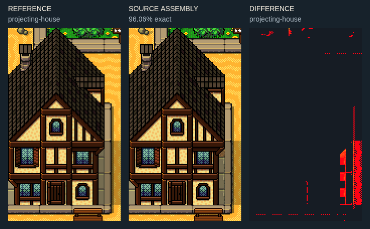

[원본 조각 번호판](images/slates/mastery/projecting-house-parts.png) · 합성 순서와 사각형: catalog.cards[id=projecting-house].patches / sourceParts.

## 연결 상점가와 지붕 접합 (joined-shops)

- 상태: **문맥 조립**. 원본 조립 문맥과 남은 차이를 비교판에서 확인. 독립 가변 템플릿 인증은 아님.
- 조립: 집의 몸통과 지붕 높이를 어긋나게 연결한다. 차양·꽃 창·간판이 각 점포의 입구를 구분한다.
- 주의: 왼쪽 끝 건물은 원본 화면에서 잘려 있다. 연결부 연구용이며 독립 완성 건물은 아니다.
- 출처: ville_0, 사각형 [0,5,13,12], 16px 단위.
- 픽셀 비교: 정확 95.51%, 채널 차이 8 이하 98.76%.

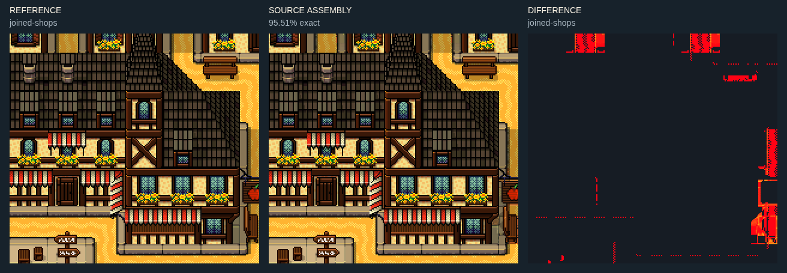

[원본 조각 번호판](images/slates/mastery/joined-shops-parts.png) · 합성 순서와 사각형: catalog.cards[id=joined-shops].patches / sourceParts.

## 기단으로 둘러싼 숲 정원 (raised-garden)

- 상태: **문맥 조립**. 원본 조립 문맥과 남은 차이를 비교판에서 확인. 독립 가변 템플릿 인증은 아님.
- 조립: 숲의 군락을 먼저 하나의 구획으로 잡고 직선·안쪽 모서리·바깥 모서리의 기단을 잇는다.
- 주의: 기단은 장식선이 아니라 구획의 높이/경계다. 문 앞까지 수관을 채우지 않는다.
- 출처: ville_0, 사각형 [15,1,10,8], 16px 단위.
- 픽셀 비교: 정확 90.01%, 채널 차이 8 이하 97.44%.

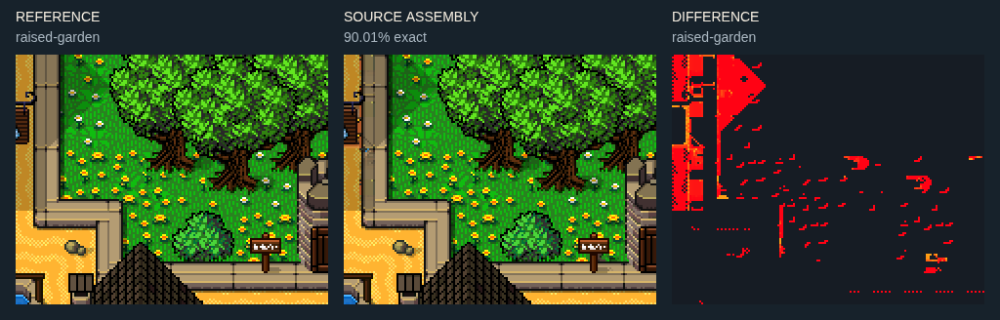

[원본 조각 번호판](images/slates/mastery/raised-garden-parts.png) · 합성 순서와 사각형: catalog.cards[id=raised-garden].patches / sourceParts.

## 우물과 골목의 결절 (well-court)

- 상태: **문맥 조립**. 원본 조립 문맥과 남은 차이를 비교판에서 확인. 독립 가변 템플릿 인증은 아님.
- 조립: 우물 한 칸 주변으로 동서·남북 접근 공간을 둔다. 큰 빈 광장 없이 골목 분기점 자체가 광장이 될 수 있다.
- 주의: 우물 2×2 변형 네 개를 하나의 커다란 우물처럼 놓지 않는다.
- 출처: ville_0, 사각형 [13,7,4,4], 16px 단위.
- 픽셀 비교: 정확 93.92%, 채널 차이 8 이하 100%.

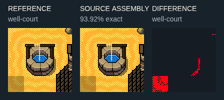

[원본 조각 번호판](images/slates/mastery/well-court-parts.png) · 합성 순서와 사각형: catalog.cards[id=well-court].patches / sourceParts.

## 시장 판매대와 성벽 안뜰 (market)

- 상태: **문맥 조립**. 원본 조립 문맥과 남은 차이를 비교판에서 확인. 독립 가변 템플릿 인증은 아님.
- 조립: 진열대와 상자, 뒤 성벽/앞 보행 공간을 구분한다. 판매대는 차양과 상품색이 다른 독립 종류다.
- 주의: 반복 가능한 것은 가운데 진열면이다. 물건·기둥·양끝을 함께 반복하면 문이 막힌다.
- 출처: ville_0, 사각형 [4,17,8,4], 16px 단위.
- 픽셀 비교: 정확 97.27%, 채널 차이 8 이하 99.24%.

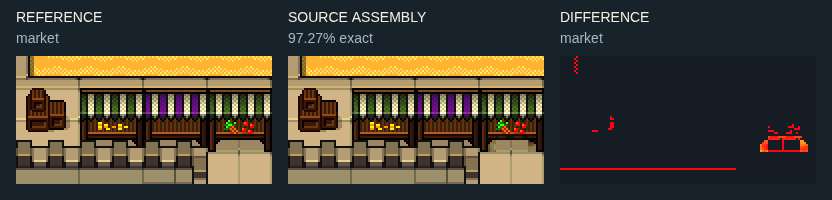

[원본 조각 번호판](images/slates/mastery/market-parts.png) · 합성 순서와 사각형: catalog.cards[id=market].patches / sourceParts.

## 앞동과 옆동이 연결된 여관 (inn)

- 상태: **문맥 조립**. 원본 조립 문맥과 남은 차이를 비교판에서 확인. 독립 가변 템플릿 인증은 아님.
- 조립: 깊은 지붕의 앞동에 낮은 옆동을 붙인다. 공통 기단 안에서 중앙 출입문, 옆 창, 차양, 간판을 배치한다.
- 주의: 표본에는 나무와 지면이 포함돼 있다. 옮길 때 외곽 배경까지 복사된다는 점을 구분한다.
- 출처: NewVersion_0, 사각형 [17,3,14,12], 16px 단위.
- 픽셀 비교: 정확 86.07%, 채널 차이 8 이하 97.58%.

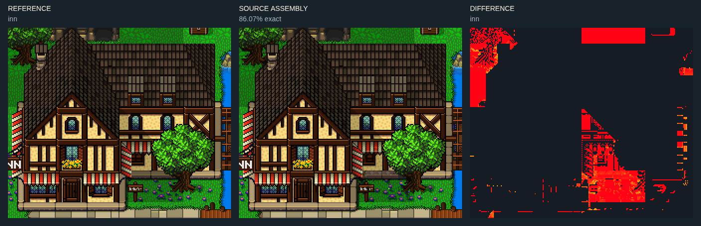

[원본 조각 번호판](images/slates/mastery/inn-parts.png) · 합성 순서와 사각형: catalog.cards[id=inn].patches / sourceParts.

## 깊은 지붕과 지붕창의 접합 (roof-junction)

- 상태: **문맥 조립**. 원본 조립 문맥과 남은 차이를 비교판에서 확인. 독립 가변 템플릿 인증은 아님.
- 조립: 꼭짓점 뒤로 지붕 중앙 면을 세로 반복하고 처마는 마지막에 둔다. 창/굴뚝은 해당 방향의 면 위에 한 번 놓는다.
- 주의: 삼각형을 키우면 앞 박공만 커진다. 참고의 높고 깊은 지붕이 만들어지지 않는다.
- 출처: NewVersion_0, 사각형 [19,3,11,7], 16px 단위.
- 픽셀 비교: 정확 92.18%, 채널 차이 8 이하 99.9%.

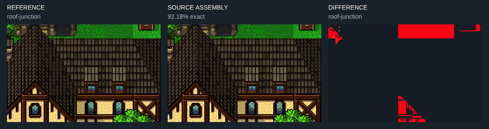

[원본 조각 번호판](images/slates/mastery/roof-junction-parts.png) · 합성 순서와 사각형: catalog.cards[id=roof-junction].patches / sourceParts.

## 절벽 사이의 긴 계단 (stairs)

- 상태: **문맥 조립**. 원본 조립 문맥과 남은 차이를 비교판에서 확인. 독립 가변 템플릿 인증은 아님.
- 조립: 계단 위·아래 지면 높이를 정하고 가운데 디딤판을 반복한다. 양쪽 석축은 같은 높이에서 끝난다.
- 주의: 그림만 계단이어도 이동은 평면이다. 실제 층 전환을 암시한다면 통행/이벤트를 따로 정의한다.
- 출처: NewVersion_0, 사각형 [7,4,7,8], 16px 단위.
- 픽셀 비교: 정확 83.47%, 채널 차이 8 이하 97.61%.

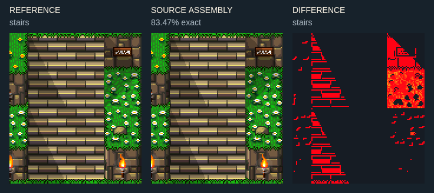

[원본 조각 번호판](images/slates/mastery/stairs-parts.png) · 합성 순서와 사각형: catalog.cards[id=stairs].patches / sourceParts.

## 암벽과 동굴 입구 (cave)

- 상태: **문맥 조립**. 원본 조립 문맥과 남은 차이를 비교판에서 확인. 독립 가변 템플릿 인증은 아님.
- 조립: 풀 상단·암벽 몸통·어두운 입구·입구 앞 지면을 분리한다. 검은 구멍이 바로 전이 이벤트는 아니다.
- 주의: 이 화면 위쪽은 잘려 있다. 암벽의 임의 높이 전체를 검증한 표본은 아니다.
- 출처: NewVersion_0, 사각형 [20,0,8,5], 16px 단위.
- 픽셀 비교: 정확 67.5%, 채널 차이 8 이하 100%.

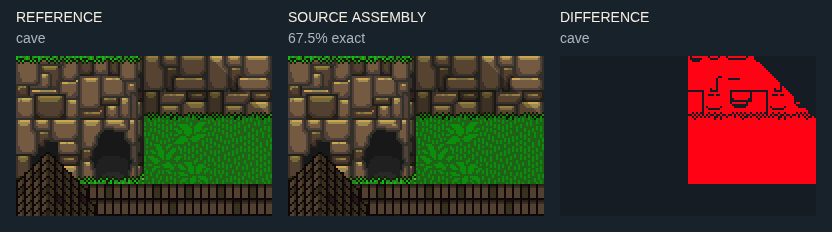

[원본 조각 번호판](images/slates/mastery/cave-parts.png) · 합성 순서와 사각형: catalog.cards[id=cave].patches / sourceParts.

## 좁은 강과 낙수 (falls)

- 상태: **문맥 조립**. 원본 조립 문맥과 남은 차이를 비교판에서 확인. 독립 가변 템플릿 인증은 아님.
- 조립: 위 수면 → 낙수 시작 → 세로 면 → 하단 물보라 순서. 강가의 암벽 높이와 시작/끝을 맞춘다.
- 주의: 물보라를 강 전체에 반복하지 않는다. 정지 자세의 조립 확인이며 애니메이션 검증은 별도다.
- 출처: NewVersion_0, 사각형 [2,5,5,7], 16px 단위.
- 픽셀 비교: 정확 80.58%, 채널 차이 8 이하 99.54%.

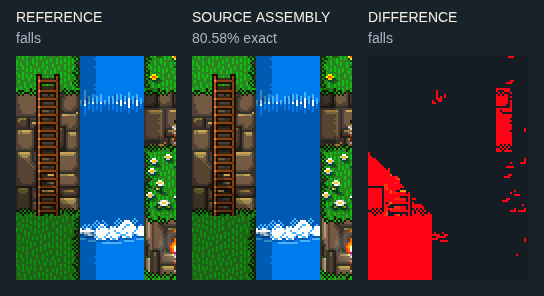

[원본 조각 번호판](images/slates/mastery/falls-parts.png) · 합성 순서와 사각형: catalog.cards[id=falls].patches / sourceParts.

## 가로 목교와 양쪽 강둑 (bridge)

- 상태: **문맥 조립**. 원본 조립 문맥과 남은 차이를 비교판에서 확인. 독립 가변 템플릿 인증은 아님.
- 조립: 육지 접점 두 곳, 물 위 판자, 아래 지지기둥을 연결한다. 원본의 16px 반칸 위상을 유지한다.
- 주의: 부두 격자의 구멍이 있는 칸과 꽉 찬 보행판을 혼동하지 않는다.
- 출처: NewVersion_0, 사각형 [2,2,6,3], 16px 단위.
- 픽셀 비교: 정확 95.07%, 채널 차이 8 이하 98.39%.

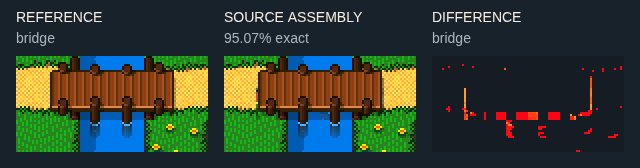

[원본 조각 번호판](images/slates/mastery/bridge-parts.png) · 합성 순서와 사각형: catalog.cards[id=bridge].patches / sourceParts.

## 곡선 해안과 풀밭 접점 (shore)

- 상태: **문맥 조립**. 원본 조립 문맥과 남은 차이를 비교판에서 확인. 독립 가변 템플릿 인증은 아님.
- 조립: 풀→모래→젖은 모래→얕은 물→깊은 물의 띠를 유지한다. 굴곡의 안/밖 모서리를 구분한다.
- 주의: 모래섬 9분할 하나로 모든 오목한 해안을 자동 해결할 수는 없다.
- 출처: NewVersion_0, 사각형 [6,13,10,7], 16px 단위.
- 픽셀 비교: 정확 99.03%, 채널 차이 8 이하 100%.

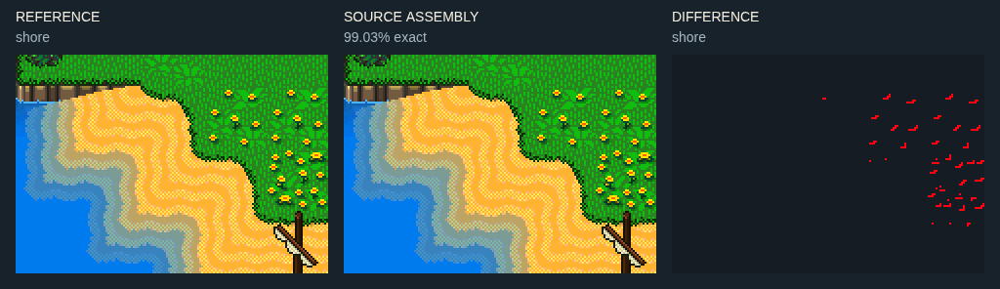

[원본 조각 번호판](images/slates/mastery/shore-parts.png) · 합성 순서와 사각형: catalog.cards[id=shore].patches / sourceParts.

## 대각 부두와 가로 부두 연결 (pier-junction)

- 상태: **문맥 조립**. 원본 조립 문맥과 남은 차이를 비교판에서 확인. 독립 가변 템플릿 인증은 아님.
- 조립: 수직 발판·대각 연결·가로 보행판의 중심선을 연결하고 각 끝의 기둥을 유지한다.
- 주의: 대각 시각 연결이 4방향 이동 연결과 같은지 별도로 확인한다. 표본 통행을 자동 인증하지 않는다.
- 출처: NewVersion_0, 사각형 [6,23,10,6], 16px 단위.
- 픽셀 비교: 정확 93.34%, 채널 차이 8 이하 98.05%.

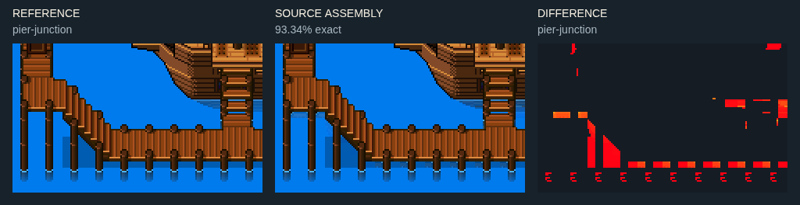

[원본 조각 번호판](images/slates/mastery/pier-junction-parts.png) · 합성 순서와 사각형: catalog.cards[id=pier-junction].patches / sourceParts.

## 큰 배의 선체와 돛대 (ship-large)

- 상태: **문맥 조립**. 원본 조립 문맥과 남은 차이를 비교판에서 확인. 독립 가변 템플릿 인증은 아님.
- 조립: 선수·가운데 갑판·선미를 가로로 잇고 돛대를 위로 세운다. 승선 발판은 선체 위 별도 부재다.
- 주의: 배경에는 육지와 부두도 들어 있다. 선체 타일 그룹과 주변 문맥을 분리해 사용한다.
- 출처: NewVersion_0, 사각형 [10,18,11,8], 16px 단위.
- 픽셀 비교: 정확 95.19%, 채널 차이 8 이하 99.51%.

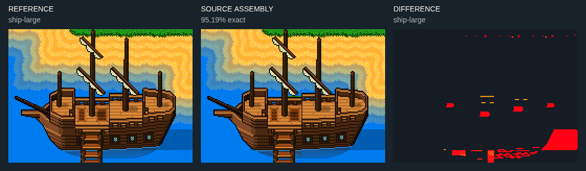

[원본 조각 번호판](images/slates/mastery/ship-large-parts.png) · 합성 순서와 사각형: catalog.cards[id=ship-large].patches / sourceParts.

## 작은 배와 부두 접안 (ship-small)

- 상태: **문맥 조립**. 원본 조립 문맥과 남은 차이를 비교판에서 확인. 독립 가변 템플릿 인증은 아님.
- 조립: 양 끝 곡선과 가운데 갑판을 보존한다. 물 위 그림자는 선체 아래 같은 방향으로 이어진다.
- 주의: 좌우 뒤집기로 선수/선미를 대체하면 광원과 난간 위치가 어긋난다.
- 출처: NewVersion_0, 사각형 [23,20,8,6], 16px 단위.
- 픽셀 비교: 정확 93.5%, 채널 차이 8 이하 98.81%.

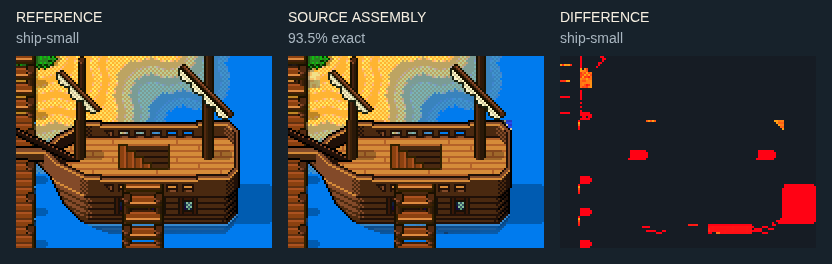

[원본 조각 번호판](images/slates/mastery/ship-small-parts.png) · 합성 순서와 사각형: catalog.cards[id=ship-small].patches / sourceParts.

## 계단으로 둘러싼 입체 중정 (terraced-court)

- 상태: **문맥 조립**. 원본 조립 문맥과 남은 차이를 비교판에서 확인. 독립 가변 템플릿 인증은 아님.
- 조립: 중앙 높인 바닥, 좌우 내려가는 계단, 앞쪽 낮은 보행면을 같은 단차로 연결한다. 모서리에 받침을 둔다.
- 주의: 화면상 겹친 보행면을 같은 평면 길로 취급하면 벽을 통과한다. 연결 지점만 열어야 한다.
- 출처: chateau, 사각형 [9,11,16,14], 16px 단위.
- 픽셀 비교: 정확 97.52%, 채널 차이 8 이하 99.99%.

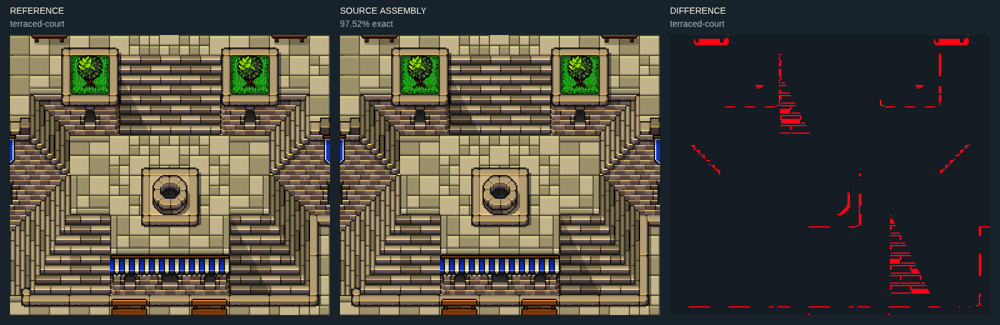

[원본 조각 번호판](images/slates/mastery/terraced-court-parts.png) · 합성 순서와 사각형: catalog.cards[id=terraced-court].patches / sourceParts.

## 수로 아치와 배수 격자 (water-arches)

- 상태: **문맥 조립**. 원본 조립 문맥과 남은 차이를 비교판에서 확인. 독립 가변 템플릿 인증은 아님.
- 조립: 흉벽 위 보행면과 그 아래 아치·기둥·물은 서로 다른 층이다. 격자는 아치의 수면 쪽에 붙는다.
- 주의: 아치의 투명 구멍 아래에는 물이 필요하다. 육지 받침이나 잔디를 기본값으로 두지 않는다.
- 출처: chateau, 사각형 [22,15,10,9], 16px 단위.
- 픽셀 비교: 정확 95.51%, 채널 차이 8 이하 98.93%.

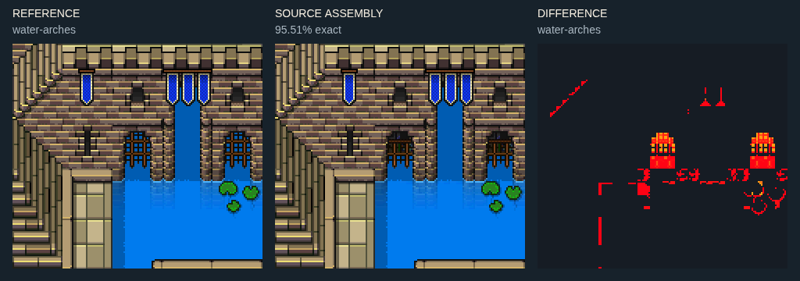

[원본 조각 번호판](images/slates/mastery/water-arches-parts.png) · 합성 순서와 사각형: catalog.cards[id=water-arches].patches / sourceParts.

## 성벽 보행로의 모서리 (parapet-corner)

- 상태: **일부 확인**. 위쪽 벽 뒤 바닥/그림자 접점에 차이가 남는다. 흉벽 자체와 주변 문맥을 분리한다.
- 조립: 끝막음·내측 모서리·전면 흉벽·석조 전면을 구분한다. 보행로 폭은 모서리에서도 유지한다.
- 주의: 가로 흉벽을 90도 회전해 세로 흉벽으로 대신하지 않는다. 원본의 방향별 조각을 쓴다.
- 출처: chateau, 사각형 [0,10,10,7], 16px 단위.
- 픽셀 비교: 정확 92.39%, 채널 차이 8 이하 99.07%.

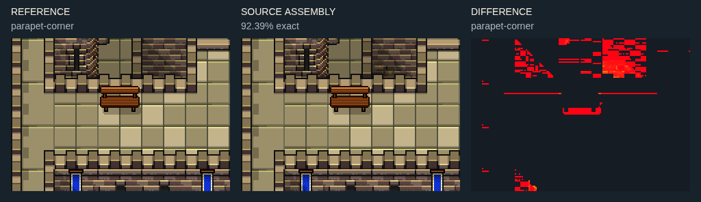

[원본 조각 번호판](images/slates/mastery/parapet-corner-parts.png) · 합성 순서와 사각형: catalog.cards[id=parapet-corner].patches / sourceParts.

## 깃발과 긴 창이 있는 성 전면 (castle-facade)

- 상태: **문맥 조립**. 원본 조립 문맥과 남은 차이를 비교판에서 확인. 독립 가변 템플릿 인증은 아님.
- 조립: 반복 창 사이 석조 기둥을 유지하고 중앙 박공/문으로 대칭축을 만든다. 띠 장식은 한 높이로 이어진다.
- 주의: 상단 지붕이 화면에서 잘렸다. 완성 성 전체가 아닌 전면 조립 문맥이다.
- 출처: chateau, 사각형 [8,0,18,11], 16px 단위.
- 픽셀 비교: 정확 99.71%, 채널 차이 8 이하 100%.

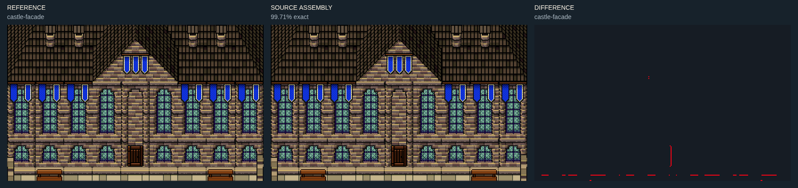

[원본 조각 번호판](images/slates/mastery/castle-facade-parts.png) · 합성 순서와 사각형: catalog.cards[id=castle-facade].patches / sourceParts.

## 긴 창과 깃발의 수직 조합 (gothic)

- 상태: **문맥 조립**. 원본 조립 문맥과 남은 차이를 비교판에서 확인. 독립 가변 템플릿 인증은 아님.
- 조립: 같은 열의 창 상부·중간·하부를 연결한다. 깃발은 창 아래까지 무조건 반복하지 않는다.
- 주의: 창 중간의 반복 가능성과 벽/기단의 고정 끝을 분리한다.
- 출처: chateau, 사각형 [8,4,8,4], 16px 단위.
- 픽셀 비교: 정확 100%, 채널 차이 8 이하 100%.

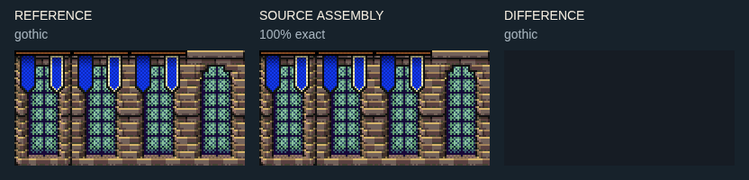

[원본 조각 번호판](images/slates/mastery/gothic-parts.png) · 합성 순서와 사각형: catalog.cards[id=gothic].patches / sourceParts.

## 앞마당과 긴 흉벽 (forecourt)

- 상태: **문맥 조립**. 원본 조립 문맥과 남은 차이를 비교판에서 확인. 독립 가변 템플릿 인증은 아님.
- 조립: 계단에서 나온 길이 넓은 앞마당을 거쳐 흉벽 안쪽을 따라 이어진다. 전면 경계는 바닥과 별도다.
- 주의: 넓은 공간 자체보다 동선과 가장자리 부재의 연속성이 중요하다.
- 출처: chateau, 사각형 [2,24,26,5], 16px 단위.
- 픽셀 비교: 정확 90.92%, 채널 차이 8 이하 99.47%.

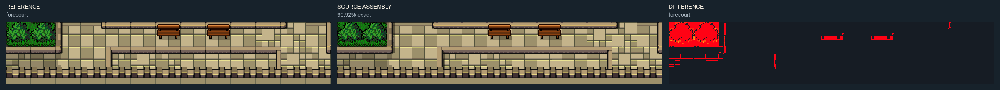

[원본 조각 번호판](images/slates/mastery/forecourt-parts.png) · 합성 순서와 사각형: catalog.cards[id=forecourt].patches / sourceParts.

## 석재 화단과 나무 (planter)

- 상태: **문맥 조립**. 원본 조립 문맥과 남은 차이를 비교판에서 확인. 독립 가변 템플릿 인증은 아님.
- 조립: 석재 사각틀 안에 흙/풀과 나무를 넣는다. 위 테두리 뒤, 앞 테두리 앞이라는 겹침 순서를 지킨다.
- 주의: 그늘의 갈색 오차를 새 흙 표현이라고 정당화하지 않는다. 원본과 다른 픽셀은 오차로 남긴다.
- 출처: chateau, 사각형 [11,11,4,4], 16px 단위.
- 픽셀 비교: 정확 94.51%, 채널 차이 8 이하 99.93%.

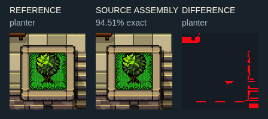

[원본 조각 번호판](images/slates/mastery/planter-parts.png) · 합성 순서와 사각형: catalog.cards[id=planter].patches / sourceParts.

## 성벽 중앙 두 칸 늘리기 (wall-long)

- 상태: **변형 실험**. 중간 성벽 단면을 반복하고 양끝 유지. 전면 벽과 보행면 높이를 함께 유지한 시각 실험.
- 조립: 지붕/탑/모서리를 복사하지 않고 표본 가운데 세로 단면만 가로 반복한다.
- 주의: 반복 결과를 아래 이미지로 검토한다. 원본과의 픽셀 일치율은 적용하지 않는다.
- 출처: ville_0, 사각형 [2,20,8,5], 16px 단위.

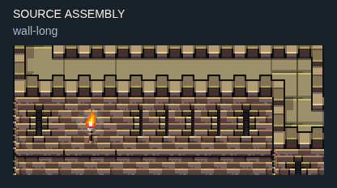

[원본 조각 번호판](images/slates/mastery/wall-long-parts.png) · 합성 순서와 사각형: catalog.cards[id=wall-long].patches / sourceParts.

## 지붕 깊이 한 칸 늘리기 (roof-deep)

- 상태: **변형 실험**. 지붕 면의 깊이 반복 실험. 주변 배경도 반복되므로 독립 가변 건물 생성기로 취급하지 않는다.
- 조립: 뒤 지붕 면의 동일 행만 반복한다. 앞 박공 크기는 유지된다. 주변 나무/그림자도 포함된 문맥 실험이다.
- 주의: 반복 결과를 아래 이미지로 검토한다. 원본과의 픽셀 일치율은 적용하지 않는다.
- 출처: NewVersion_0, 사각형 [19,3,11,7], 16px 단위.

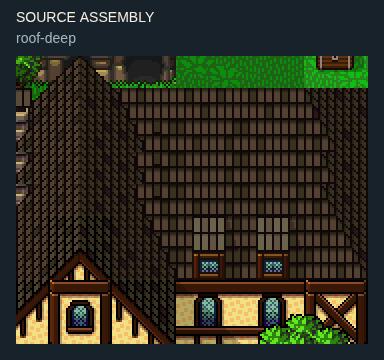

[원본 조각 번호판](images/slates/mastery/roof-deep-parts.png) · 합성 순서와 사각형: catalog.cards[id=roof-deep].patches / sourceParts.

## 계단 디딤판 두 행 늘리기 (stairs-long)

- 상태: **변형 실험**. 계단 행 반복 실험. 옆 꽃/그림자까지 반복되는 배경 포함 표본.
- 조립: 가운데 디딤판 행만 반복하고 시작/끝을 보존한다. 계단 옆 장식도 함께 늘어나는 문맥 표본이다.
- 주의: 반복 결과를 아래 이미지로 검토한다. 원본과의 픽셀 일치율은 적용하지 않는다.
- 출처: NewVersion_0, 사각형 [7,4,7,8], 16px 단위.

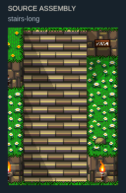

[원본 조각 번호판](images/slates/mastery/stairs-long-parts.png) · 합성 순서와 사각형: catalog.cards[id=stairs-long].patches / sourceParts.

## 긴 창 중간 한 행 늘리기 (window-tall)

- 상태: **변형 실험**. 초기에는 깃발 끝이 중복됐다. 그 행을 제외하고 바로 아래 창 몸통을 반복하도록 수정했다. 문맥 포함 변형 실험이다.
- 조립: 깃발 끝이 있는 행은 보존하고 그 아래 창 몸통 행만 늘린다. 창 위와 하부 띠는 한 번씩 유지한다.
- 주의: 반복 결과를 아래 이미지로 검토한다. 원본과의 픽셀 일치율은 적용하지 않는다.
- 출처: chateau, 사각형 [8,4,8,4], 16px 단위.

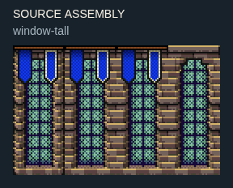

[원본 조각 번호판](images/slates/mastery/window-tall-parts.png) · 합성 순서와 사각형: catalog.cards[id=window-tall].patches / sourceParts.

## 물레방아 자세 1 (waterwheel-0)

- 상태: **원본 블록**. 원본 자세의 고정 블록. 설치/애니메이션은 별도.
- 조립: 2×3 원본 블록 한 개가 한 자세다. 각 자세는 따로 배치하며 다른 자세와 겹치지 않는다.
- 주의: 회전 모양을 확인한 정지 샘플이다. 애니메이션 재생·축 정렬·설치 건물까지 검증한 것은 아니다.
- 출처: atlas-v2, 사각형 [48,10,2,3], 32px 단위.

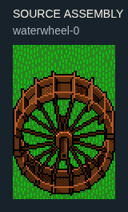

[원본 조각 번호판](images/slates/mastery/waterwheel-0-parts.png) · 합성 순서와 사각형: catalog.cards[id=waterwheel-0].patches / sourceParts.

## 물레방아 자세 2 (waterwheel-1)

- 상태: **원본 블록**. 원본 자세의 고정 블록. 설치/애니메이션은 별도.
- 조립: 2×3 원본 블록 한 개가 한 자세다. 각 자세는 따로 배치하며 다른 자세와 겹치지 않는다.
- 주의: 회전 모양을 확인한 정지 샘플이다. 애니메이션 재생·축 정렬·설치 건물까지 검증한 것은 아니다.
- 출처: atlas-v2, 사각형 [48,13,2,3], 32px 단위.

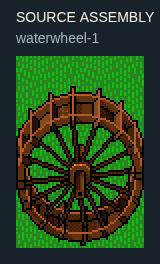

[원본 조각 번호판](images/slates/mastery/waterwheel-1-parts.png) · 합성 순서와 사각형: catalog.cards[id=waterwheel-1].patches / sourceParts.

## 물레방아 자세 3 (waterwheel-2)

- 상태: **원본 블록**. 원본 자세의 고정 블록. 설치/애니메이션은 별도.
- 조립: 2×3 원본 블록 한 개가 한 자세다. 각 자세는 따로 배치하며 다른 자세와 겹치지 않는다.
- 주의: 회전 모양을 확인한 정지 샘플이다. 애니메이션 재생·축 정렬·설치 건물까지 검증한 것은 아니다.
- 출처: atlas-v2, 사각형 [48,16,2,3], 32px 단위.

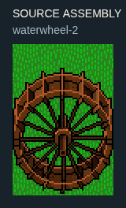

[원본 조각 번호판](images/slates/mastery/waterwheel-2-parts.png) · 합성 순서와 사각형: catalog.cards[id=waterwheel-2].patches / sourceParts.

## 물레방아 자세 4 (waterwheel-3)

- 상태: **원본 블록**. 원본 자세의 고정 블록. 설치/애니메이션은 별도.
- 조립: 2×3 원본 블록 한 개가 한 자세다. 각 자세는 따로 배치하며 다른 자세와 겹치지 않는다.
- 주의: 회전 모양을 확인한 정지 샘플이다. 애니메이션 재생·축 정렬·설치 건물까지 검증한 것은 아니다.
- 출처: atlas-v2, 사각형 [48,19,2,3], 32px 단위.

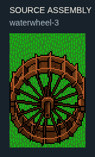

[원본 조각 번호판](images/slates/mastery/waterwheel-3-parts.png) · 합성 순서와 사각형: catalog.cards[id=waterwheel-3].patches / sourceParts.

## 풍차 날개 자세 1 (windmill-0)

- 상태: **원본 블록**. 원본 자세의 고정 블록. 설치/애니메이션은 별도.
- 조립: 2×2 원본 블록 한 개가 한 자세다. 각 자세는 따로 배치하며 다른 자세와 겹치지 않는다.
- 주의: 회전 모양을 확인한 정지 샘플이다. 애니메이션 재생·축 정렬·설치 건물까지 검증한 것은 아니다.
- 출처: atlas-v2, 사각형 [50,10,2,2], 32px 단위.

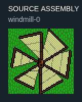

[원본 조각 번호판](images/slates/mastery/windmill-0-parts.png) · 합성 순서와 사각형: catalog.cards[id=windmill-0].patches / sourceParts.

## 풍차 날개 자세 2 (windmill-1)

- 상태: **원본 블록**. 원본 자세의 고정 블록. 설치/애니메이션은 별도.
- 조립: 2×2 원본 블록 한 개가 한 자세다. 각 자세는 따로 배치하며 다른 자세와 겹치지 않는다.
- 주의: 회전 모양을 확인한 정지 샘플이다. 애니메이션 재생·축 정렬·설치 건물까지 검증한 것은 아니다.
- 출처: atlas-v2, 사각형 [50,12,2,2], 32px 단위.

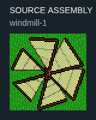

[원본 조각 번호판](images/slates/mastery/windmill-1-parts.png) · 합성 순서와 사각형: catalog.cards[id=windmill-1].patches / sourceParts.

## 풍차 날개 자세 3 (windmill-2)

- 상태: **원본 블록**. 원본 자세의 고정 블록. 설치/애니메이션은 별도.
- 조립: 2×2 원본 블록 한 개가 한 자세다. 각 자세는 따로 배치하며 다른 자세와 겹치지 않는다.
- 주의: 회전 모양을 확인한 정지 샘플이다. 애니메이션 재생·축 정렬·설치 건물까지 검증한 것은 아니다.
- 출처: atlas-v2, 사각형 [50,14,2,2], 32px 단위.

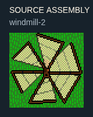

[원본 조각 번호판](images/slates/mastery/windmill-2-parts.png) · 합성 순서와 사각형: catalog.cards[id=windmill-2].patches / sourceParts.

## 풍차 날개 자세 4 (windmill-3)

- 상태: **원본 블록**. 원본 자세의 고정 블록. 설치/애니메이션은 별도.
- 조립: 2×2 원본 블록 한 개가 한 자세다. 각 자세는 따로 배치하며 다른 자세와 겹치지 않는다.
- 주의: 회전 모양을 확인한 정지 샘플이다. 애니메이션 재생·축 정렬·설치 건물까지 검증한 것은 아니다.
- 출처: atlas-v2, 사각형 [50,16,2,2], 32px 단위.

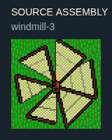

[원본 조각 번호판](images/slates/mastery/windmill-3-parts.png) · 합성 순서와 사각형: catalog.cards[id=windmill-3].patches / sourceParts.

