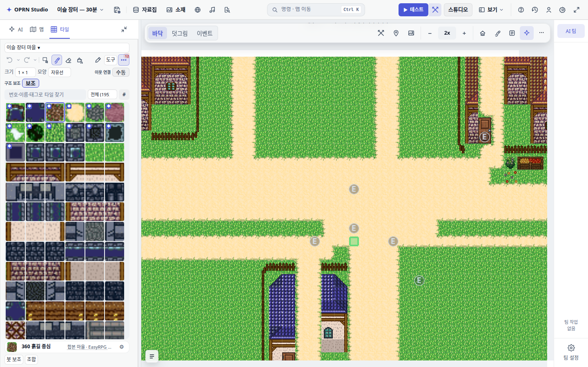
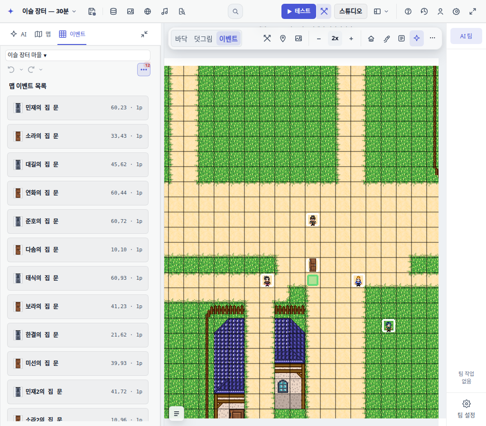

# 캔버스 상단 레이어 선택

> 이 배치는 사용자 피드백으로 철회했다. 현재 배치는 [소재 옆 헤더 전환](2026-09-18-header-layer-switcher.md)을 참고한다.

바닥·덧그림·이벤트를 타일 패널에서 캔버스 도구막대 왼쪽으로 옮겼다.
모든 UI 모드가 같은 전환 컨트롤을 사용하고, 보기·배율 도구는 오른쪽에 유지한다.
레이어 버튼을 누르면 해당 타일 팔레트 또는 이벤트 목록을 열며 왼쪽 탭 이름도
타일 / 이벤트로 바뀐다. 초보 모드에도 이벤트 목록을 표시한다.

## 브라우저 확인

워크트리 Vite 포트 9803, Chromium, 기존 로컬 dev-showcase로 UI만 확인했다.
게임 콘텐츠 저작·원격 저장 작업은 수행하지 않았다.

- 초보·표준·전문가 × 폭 1024·1280·1440px × 바닥·덧그림·이벤트: 27개 조합.
- 세 버튼의 클릭 가능 위치, 단일 렌더, 레이어·도구 상태, 패널 제목·목록 전환 확인.
- 도구막대 가로 넘침 없음. 초보 모드도 캔버스 왼쪽 고정 확인.
- 패널을 접어도 레이어 버튼 표시. 방향키 이동과 Enter 선택 후 포커스 유지, F7 전환 확인.
- 브라우저 pageerror 0건. git diff --check 통과.
- 기존 위치를 가정하던 테스트를 새 소유권에 맞췄다. 세션 AGENTS.md 규칙에 따라
  Vitest, gates, typecheck는 실행하지 않았다.

세션 상세 증거: output/evidence/canvas-layer-switcher/review.json 및 모드·폭별 PNG.
