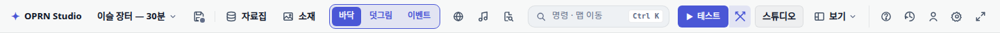
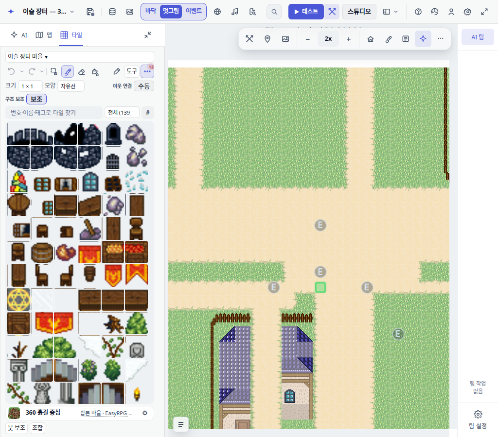

# 소재 옆 헤더 레이어 선택

사용자 피드백에 따라 캔버스 상단 전폭 전환 바를 철회했다.
바닥·덧그림·이벤트는 앱 최상단 헤더의 소재 바로 다음에 강조된 버튼 묶음으로 표시한다.
선택 항목은 진한 강조색이며, 초보 모드에도 소재와 레이어 전환을 함께 노출한다.
캔버스의 보기·배율 도구막대는 이전의 우측 컴팩트 배치로 복원했다.

헤더 재렌더 시 포커스를 복원하고 editorState 구독으로 활성 버튼을 동기화한다.
구독은 헤더를 다시 만들기 전에 해제한다. 왼쪽 타일/이벤트 목록 전환은 유지한다.

Chromium에서 초보·표준·전문가 × 1024·1280·1440px, 9개 조합을 확인했다.
모든 조합에서 소재 바로 뒤 배치, 세 버튼 히트 테스트, 덧그림 선택 표시와 포커스,
캔버스에 레이어 컨트롤이 없는 것, 가로 넘침 없는 것을 확인했다.
방향키·Enter도 확인했으며 pageerror는 0건이다.
기존 테스트의 위치 계약과 OpenWiki를 수정했다. 세션 규칙상 테스트·게이트는 실행하지 않았다.

상세 로컬 증거: output/evidence/header-layer-switcher/review.json.
