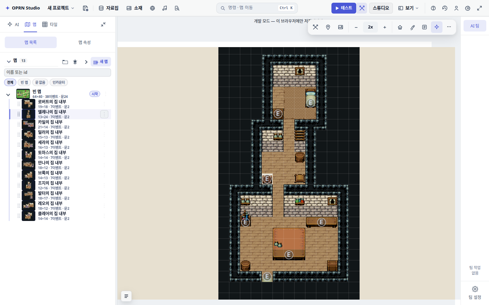

# 맵 목록 클릭 지연 — 실제 프로젝트 복사본 계측

앞선 물 타일 개선은 `editorState.set` 비용만 다뤘다. 실제 목록 클릭은 별도 경로로,
페이드·그리기 대기와 함께 전체 프로젝트 검사 및 숨은 JSON 복사가 반복되고 있었다.

운영 SQLite를 읽기 전용으로 읽은 13맵 프로젝트(64×40 마을, 19×18·13×24 집 내부 등)를
원격 저장 없는 격리 QA 세션에 주입했다. 원본 DB·프로젝트 파일을 수정하지 않았다.
원본 프로젝트 JSON은 커밋하지 않았다.

## 방법과 결과

동일 Vite 개발 서버, Chromium headless/SwiftShader, 1440×900, 표준 모드의 「맵」 탭.
실제 `map-tree-node-*` DOM 행의 click handler를 호출하고 선택된 map id 및 베일의
계산 opacity=0을 다음 animation frame에서 확인했다. 직접 store 변경을 맵 목록 클릭으로
대체하지 않았다. 수치는 브라우저 내 클릭부터 완료 관측까지이며 마우스 자동화 대기나
운영 서버의 네트워크·잠금 왕복을 포함하지 않는다.

| 목적지 | 수정 전 | 수정 후 재확인 |
|---|---:|---:|
| 로버트의 집 내부 | 1028.3 ms | 123.9 ms |
| 마을 | 1027.0 ms | 166.9 ms |
| 엘레나의 집 내부 | 849.9 ms | 117.6 ms |
| 마을 | 1028.1 ms | 197.4 ms |

첫 수정 후 실행도 146.8~203.9 ms였다. [수정 전](map-list-navigation/before.json),
[수정 후와 상태 확인](map-list-navigation/after.json). 양쪽 pageerror 0건.

CPU 샘플에서 cloneJson 458 ms와 serialize 325 ms가
`ruleAuditViolationCount → projectLint → checkRoundtrip` 스택에 있었고,
`projectWithoutEventDrafts` 복사 296 ms 및 숨은 미러 콜백 223 ms도 관측됐다.
전체 프로파일의 일부 자체 시간이며 서로 합쳐 전환별 시간으로 취급하지 않는다.

## 수정과 보존 계약

- 목록의 직접 선택은 동기 전환한다. 조수 전환 베일과 예약된 swap을 먼저 취소한다.
- 규칙 감사 패널/배지는 프로젝트 참조와 store 내용 버전이 같으면 검사 결과를 재사용한다.
- 숨은 자동화 미러는 프로젝트 JSON만 내용 버전별로 재사용하고 editor/history는 새로 직렬화한다.
- 맵 잠금 상태 갱신을 editorState의 패널 갱신 microtask와 합친다.

실제 브라우저에서 조수 전환을 예약한 직후 다른 맵 행을 눌러 700 ms 후에도 선택이
유지되는 것을 확인했다. 미러의 선택 상태와 QA 복사본 편집 후 내용 갱신도 확인했다.
규칙 검사 재사용·편집 무효화, JSON 캐시의 버전/참조/종료 무효화, 즉시 선택 계약을
단위 테스트로 추가했다. 사용자 요청 없이 테스트를 실행하지 않는 AGENTS.md에 따라
Vitest/typecheck/게이트는 미실행이며 브라우저 관측과 `git diff --check`만 수행했다.

