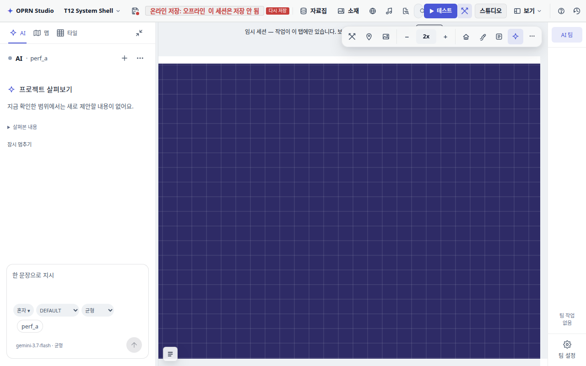

# 편집기 맵 전환 지연 수정 — 2026-09-18

물 타일이 많은 맵을 떠날 때, 타일 쿼터마다 만들어진 Phaser Sprite의 AnimationState가
전역 AnimationManager의 `remove` 이벤트에서 자기 리스너를 개별 해제했다.
EventEmitter는 매번 전체 리스너 배열을 탐색·복사하므로 파괴 비용이 제곱으로 증가했다.

Chromium CPU 프로파일에서 `removeListener`의 해당 파괴 스택 자체 시간이 18.68초였다.
스택: editorState.set → EditScene.redraw → renderEditScene → Container.removeAll →
Sprite/AnimationState.destroy → EventEmitter.removeListener.
9/16 보고서의 컨테이너 배열 비용만으로는 이 병목을 설명할 수 없었다.

## 변경

`src/editor/sharedTileAnimation.ts`가 씬·애니메이션 키당 숨겨진 Sprite 하나로 시계를 유지한다.
타일은 Image이며 공유 Sprite의 `animationupdate` 때 텍스처와 프레임을 따라간다.
새로 칠한 타일도 현재 프레임부터 시작한다. 각 Image는 별도 알파·틴트·가시성·부모를 유지하고,
마지막 Image가 파괴되면 공유 Sprite와 전역 리스너를 함께 해제한다.
호수 쿼터와 일반 애니메이션 타일 모두 같은 경로를 쓴다. 플레이어 렌더러는 변경하지 않았다.

## 브라우저 측정

동일 워크트리의 Vite 개발 서버 + Chromium headless/SwiftShader, 1280×800.
`system-shell-v3.json`을 앱의 `validateProjectV4`로 정규화한 원격 저장 없는 QA 세션.
두 복제 맵에 lower tile 0(애니메이션 물), 매 13칸 upper tile 0을 넣고 이벤트를 비웠다.
`editorState.set({currentMapId})` 앞뒤 `performance.now()`를 측정하고 전환마다 rAF 두 번을 기다렸다.
이는 편집기 선택의 동기 처리 시간이며, 디졸브 연출과 실제 사용자의 전체 프로젝트 시간을 뜻하지 않는다.

| 맵 | 수정 전 왕복 | 수정 후 왕복 (재확인) |
|---|---:|---:|
| 48×48 | 734.4 / 680.9 ms | 95.1 / 102.6 ms |
| 96×96 | 10,005.7 / 13,920.0 ms | 324.1 / 380.4 ms |

첫 수정 후 별도 실행에서도 96×96은 386.8 / 456.2 ms였다. 해당 조건에서 약 96% 이상 감소했다.
크기별 첫 행은 진입/같은 맵 재선택(0 ms 포함)이므로 비교에서 제외했다.
원자료: [before](map-switch-performance/before.json), [after](map-switch-performance/after.json).

실제 Phaser HEADLESS 씬에서 별도로 1,000개 타일을 생성하여 10fps/2프레임 애니메이션을 관측했다.
모든 타일의 프레임이 동기화되었고 두 프레임이 모두 관측되었다. 전역 `remove` 리스너는
1개 증가하고 마지막 타일 파괴 후 0개로 돌아왔다. [관측값](map-switch-performance/animation.json).
편집기 브라우저 pageerror는 수정 전후 모두 0건이었다.

## 검증 범위

공유 시계·추가 타일 동기화·마지막 타일 정리·씬/애니메이션 격리·씬 종료 순서의
단위 회귀 계약을 추가했다. 기존 렌더러 단위 fixture는 시계 모듈을 모킹하여 표현 계약을 유지한다.
사용자가 테스트/게이트 실행을 명시하지 않아 AGENTS.md 지침에 따라 Vitest, typecheck,
전체 게이트는 실행하지 않았다. 브라우저 계측·시각 확인 및 `git diff --check`를 수행했다.
