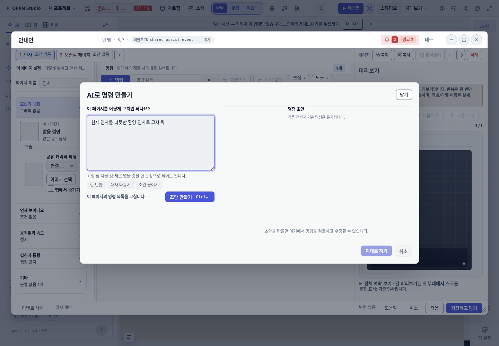
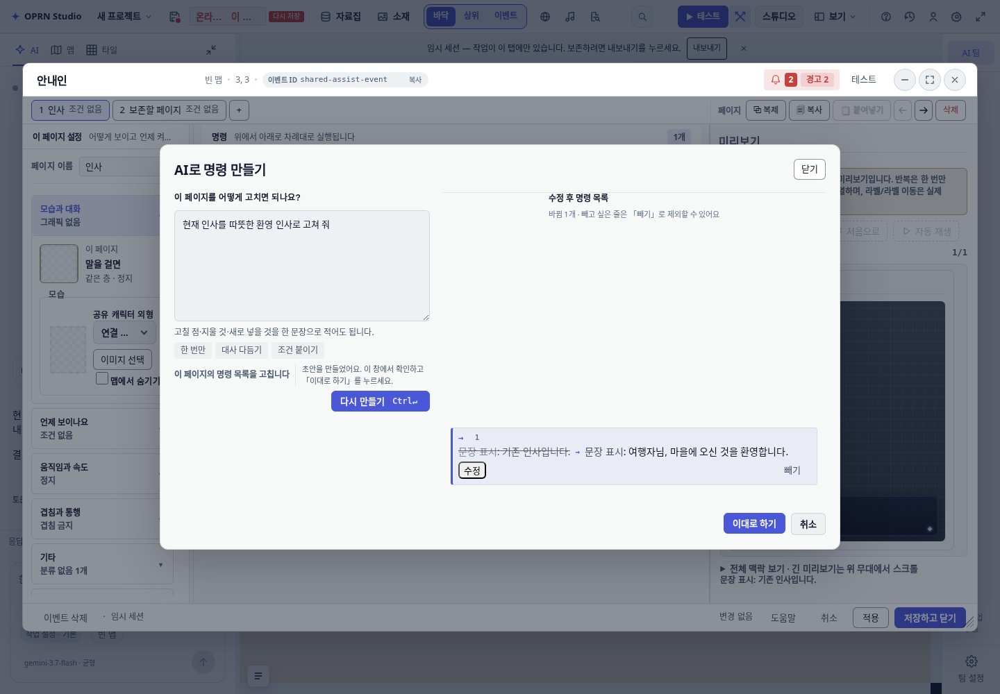
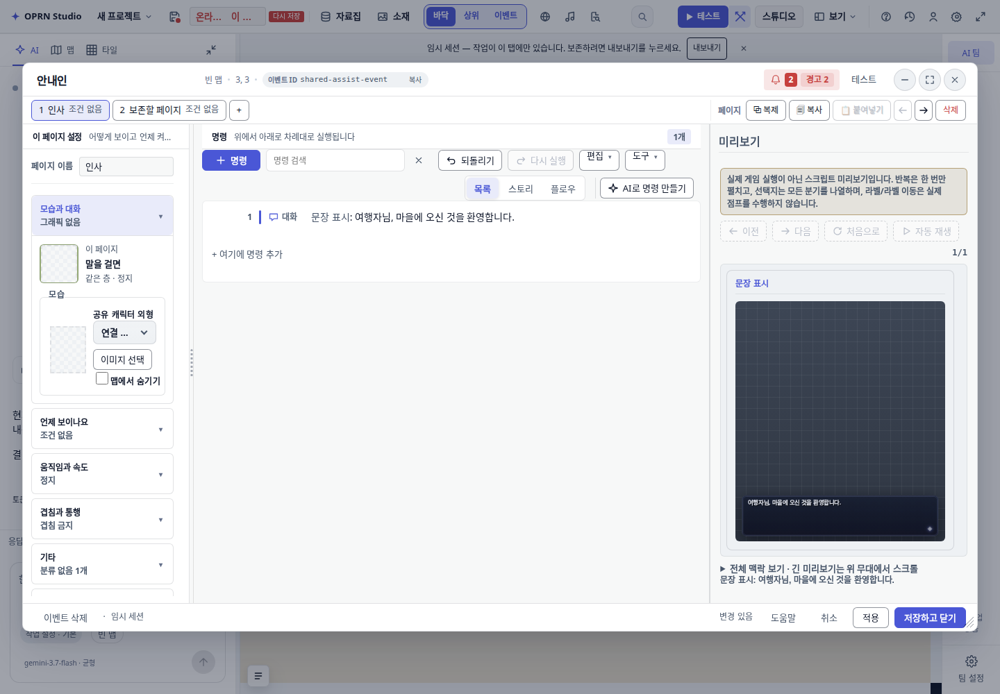
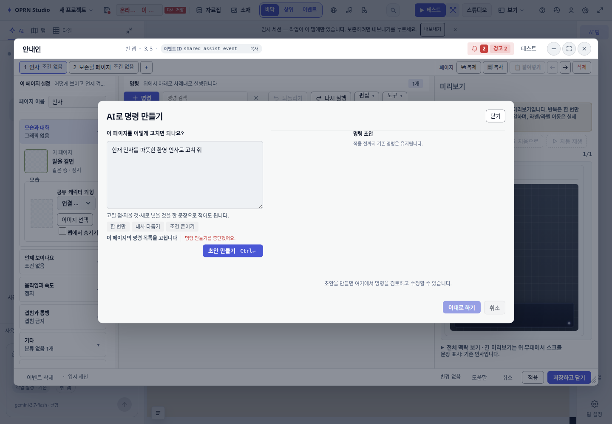

# 이벤트 명령 편집기의 공용 조수 경로

이벤트 편집기의 「AI로 명령 만들기」가 별도 생성기를 직접 호출하던 경로를
`sendAiAssistantMessage → aiChatPanel → aiTurnRunner → AssistantSession`으로 연결했다.
일반 조수도 등록된 `event_command_assist` 도구로 같은 생성/검증기를 사용한다.

## 수정 경계와 결과 소유권

- 호스트가 map/event/page ID, 선택 명령 경로·라벨, edit/append 모드를 전달한다.
- 해당 턴은 `get_event`, `get_database_records`, `run_lint`, `event_command_assist`만 노출한다.
  노출되지 않은 도구를 모델이 호출하거나 다른 페이지·모드를 지정해도 실행에서 거부한다.
- 자율 적용, 프로젝트 위키 준비, NPC 자동 보완을 이 턴에서 차단한다.
- 생성기는 프로젝트 사본에서 기존 리소스·참조·착지·세계관 검증과 최대 3회 수정을 수행한다.
  취소·기준 데이터 변경·대상 페이지 명령 외 변경이 있으면 결과를 발행하지 않는다.
- 공용 제안은 자동 적용하지 않고 이벤트 편집기로 이전한다. 채팅에는 중복 적용 권한을 남기지 않는다.
  기존 diff, 줄 제외, 직접 수정, 한 번의 replaceAll 및 실행 취소를 유지한다.
- 중단 버튼과 편집기 닫기는 공용 턴을 취소한다.

## 검증

집중 검증: `npm test -- test/eventCommandAssist.test.ts test/eventCommandAssistTool.test.ts test/eventCommandScopedSession.test.ts test/toolsExtended.test.ts --maxWorkers=2 --minWorkers=1`
— 4파일 79개 통과(선택 위치 삽입 테스트 추가 전).

브라우저: `E2E_RETRIES=0 npx playwright test test/e2e/event-ai-shared-assistant.spec.ts`
— 1개 통과, 최종 실행 52.5초. 포트 9838의 이 워크트리 서버를 재시작한 뒤 캡처했다.
외부 LLM 응답만 고정했고 브리지, 세션, 도구 실행, 전용 검증, 모달과 store는 실제 구현을 실행했다.
따라서 실제 모델의 자연어 이해 품질·서비스 가용성을 증명하는 테스트는 아니다.
테스트용 최소 프로젝트는 임시 세션에서 사용하며 저작 콘텐츠를 배포하지 않는다.

| 요구 사항 | 근거 |
| --- | --- |
| 공용 조수 경로 | 세션 테스트의 실제 도구 루프 + 브라우저의 제한된 tool catalog 요청 |
| 페이지 제한 | 세션에서 허용되지 않은 도구·다른 페이지 요청 거부, 전체 프로젝트 diff 확인 |
| 선택 명령 전달 | 도구 테스트의 선택 경로/라벨 확인 및 선택 뒤 삽입 |
| 전용 검증 | 실제 생성기의 잘못된 리소스 재시도·최종 거부 테스트 |
| 검토 후 적용 | 적용 전 store 원본 유지, 적용 뒤 대상 명령 변경·다른 페이지 유지 |
| 한 번 되돌리기 | 툴바 undo 한 번으로 원본 복구 |
| 취소 | 생성 응답 대기 중 중단 후 적용 버튼 비활성·원본 유지 |
| 중복 제안 방지 | 편집기 검토 시 공용 브리지 pending proposal이 null임을 확인 |

전체 게이트 결과는 실행 종료 후 아래에 기록한다.

## 브라우저 증거

[호출 및 assertion 영수증](evidence/2026-09-20-event-command-assistant/receipt.json)

