# AI 시공 연출 — 스크린샷 25장

효과음 없이, 발광 대신 밑그림 제도·타일 내려앉기·연필 커서·완료 표식을 사용한다.

실제 편집기 + 재현용 Pi 응답. 실 LLM·원격 DB 저장 검증은 아니다. 두 모드 모두 758셀, 브라우저 오류 0건.

## 기본 모드 — 실제 반영

[검증 기록](../.superpowers/sdd/qa-shots/ai-construction-motion/probe.json)

### 시공 전

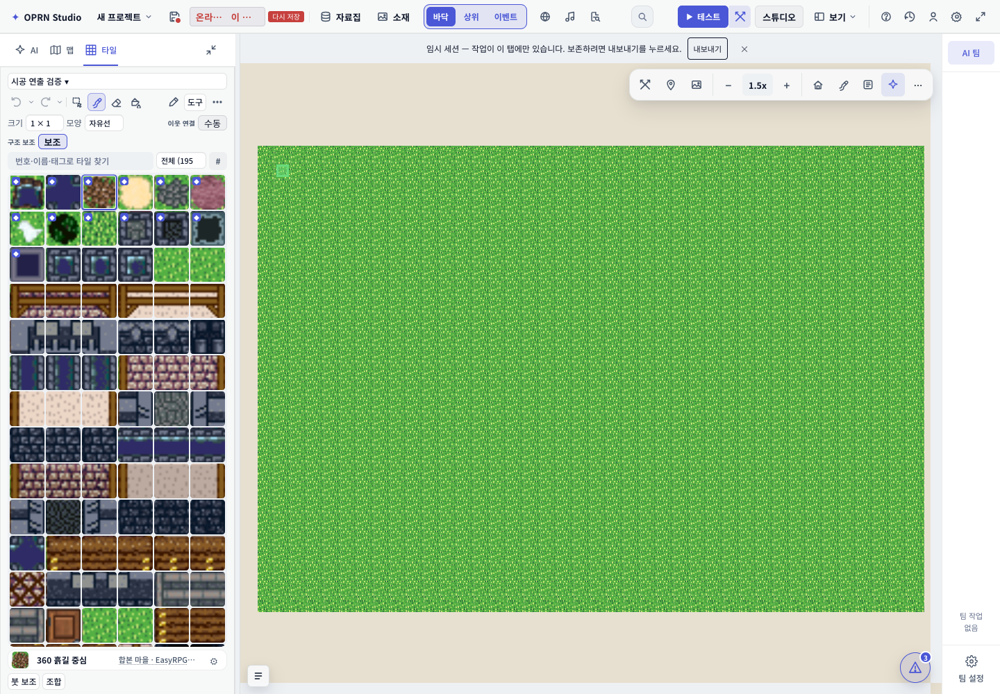

### 밑그림 시작

### 구역별 선 그리기

### 밑그림 완성

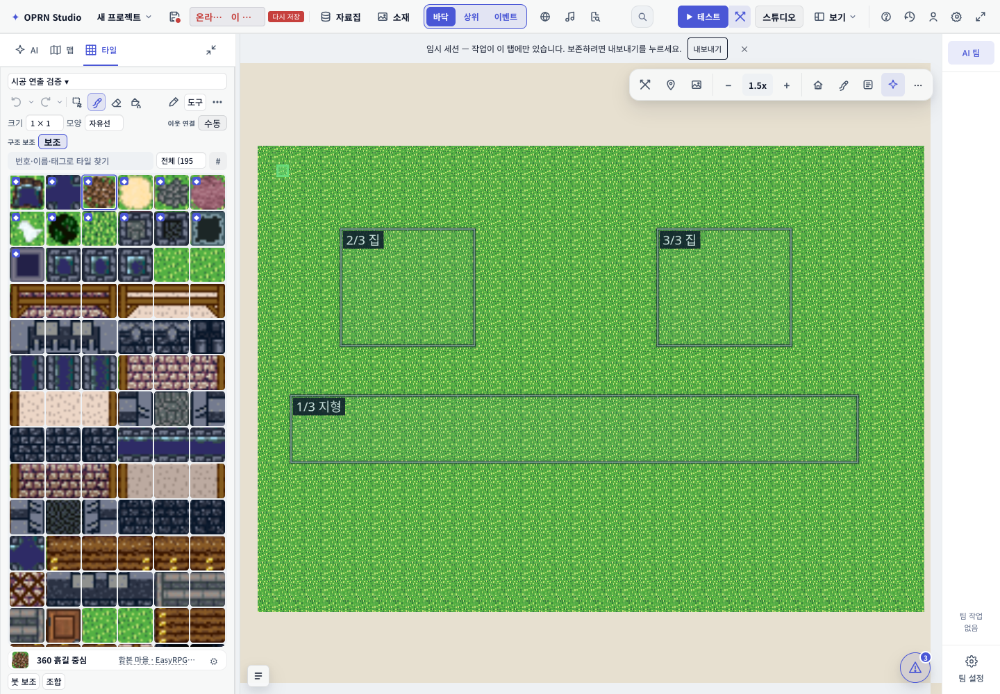

### 타일 공개 시작

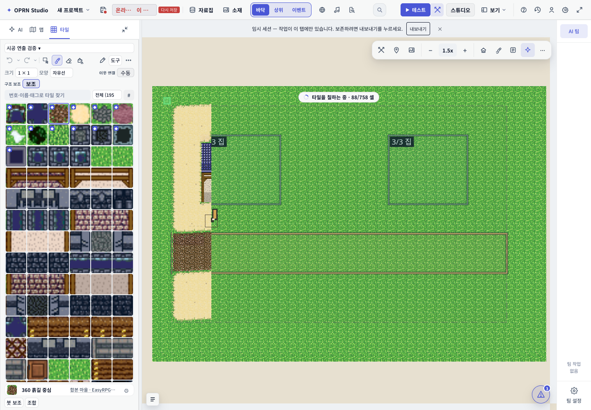

### 좌측 시공

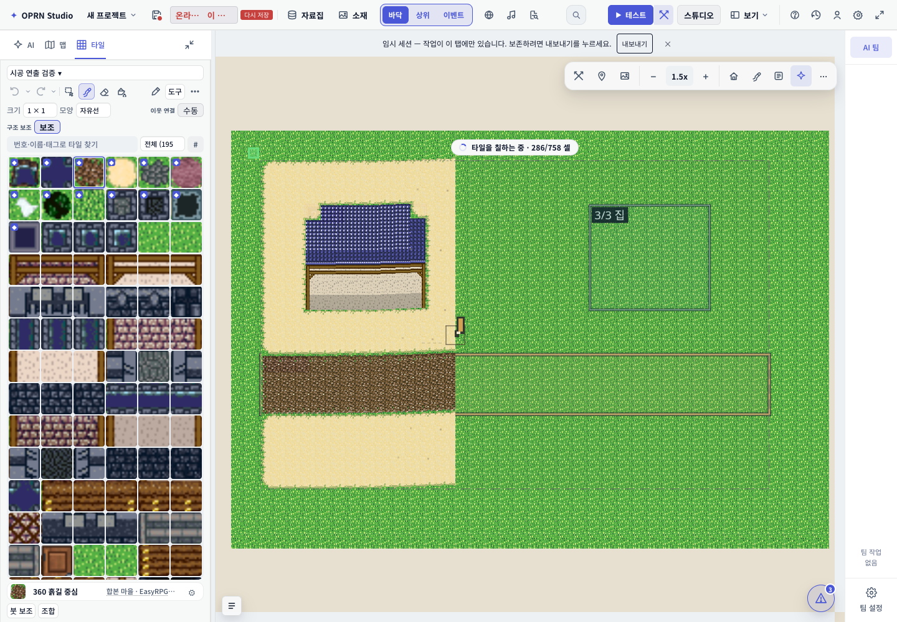

### 중간 시공과 연필 커서

### 건물 시공

### 상위 타일 내려앉기

### 시공 미리보기 완성

### 반영 완료 표식

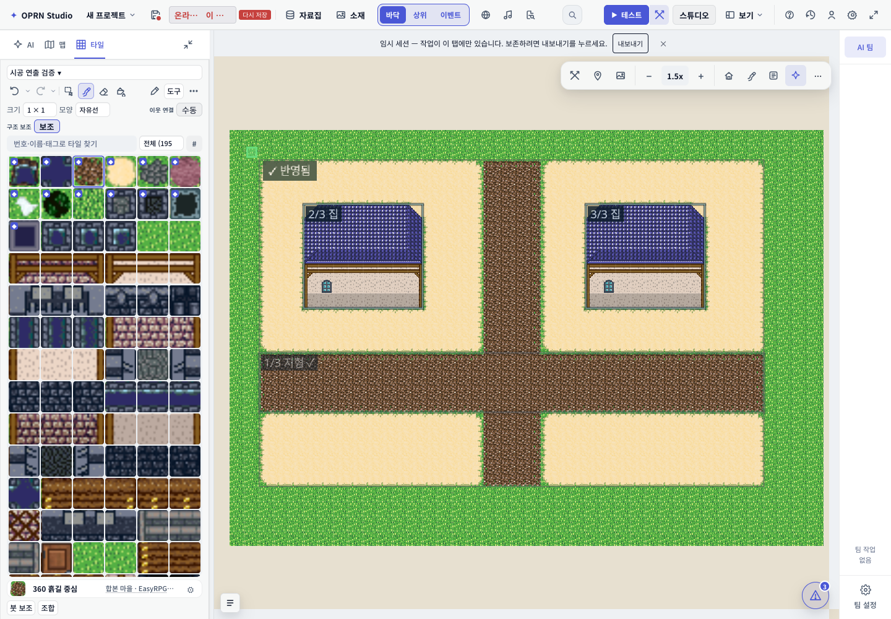

### 반영 후

### 모든 표시 정리

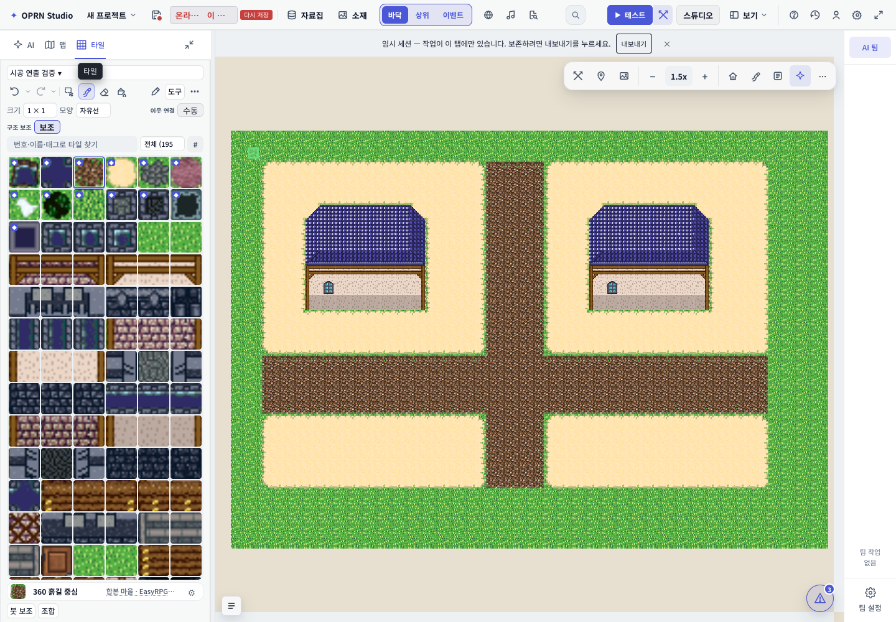

## 검토 모드 — 버리기

[검증 기록](../.superpowers/sdd/qa-shots/ai-construction-motion-review/probe.json)

### 시공 전

### 밑그림 시작

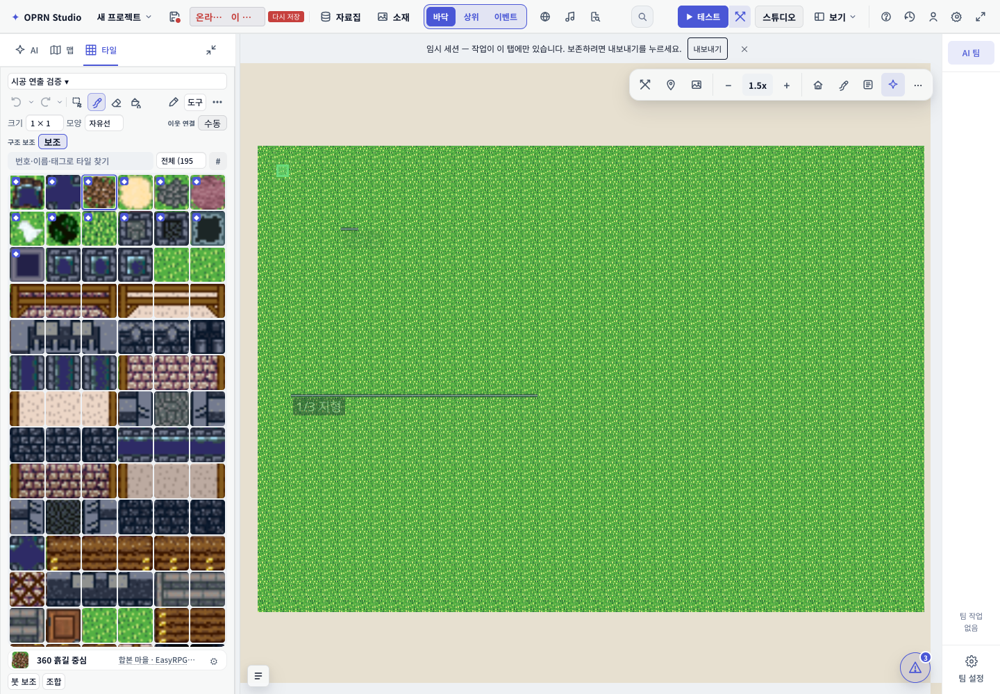

### 구역별 선 그리기

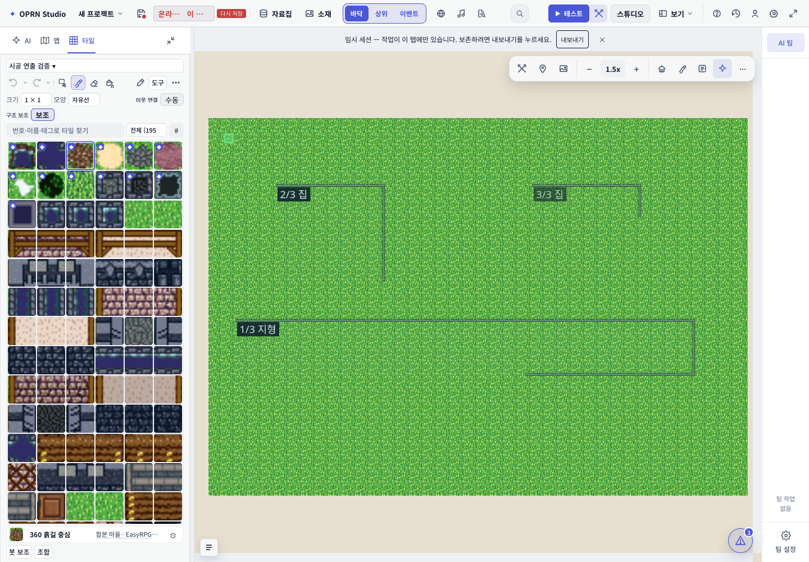

### 밑그림 완성

### 타일 공개 시작

### 좌측 시공

### 중간 시공과 연필 커서

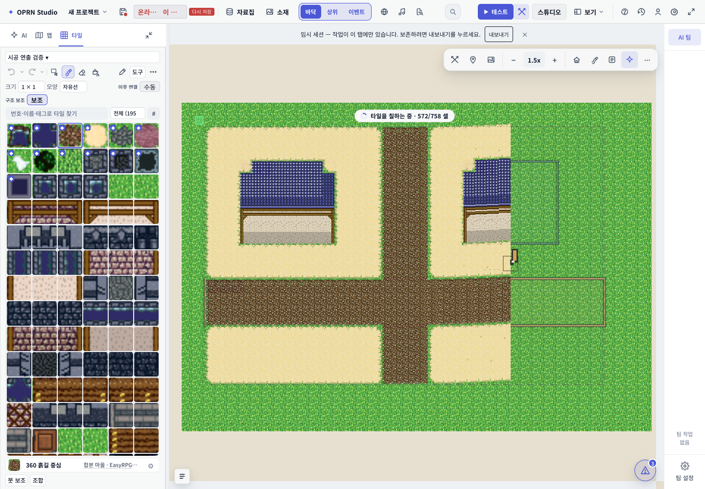

### 건물 시공

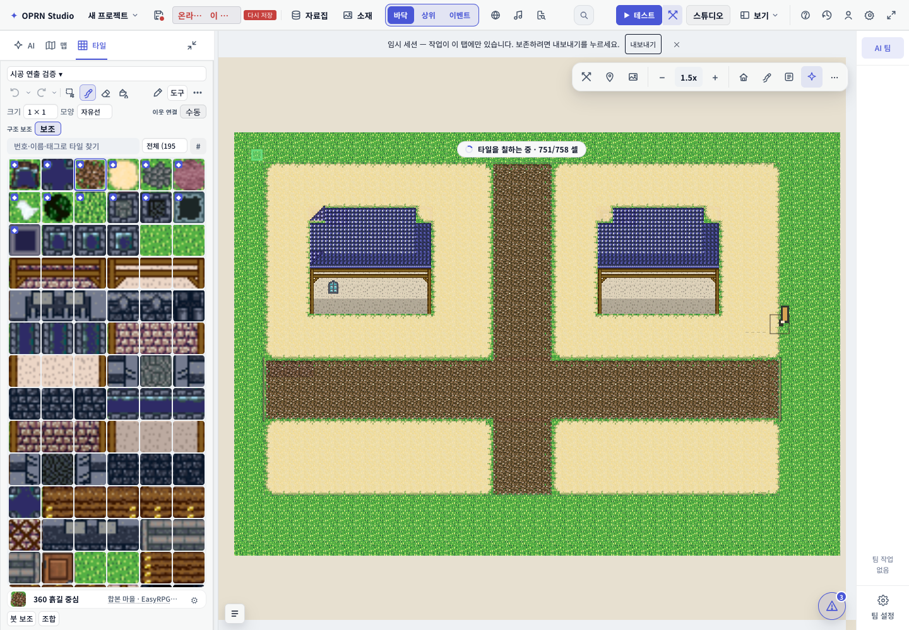

### 상위 타일 내려앉기

### 시공 미리보기 완성

### 검토 후 버리기

### 모든 표시 정리

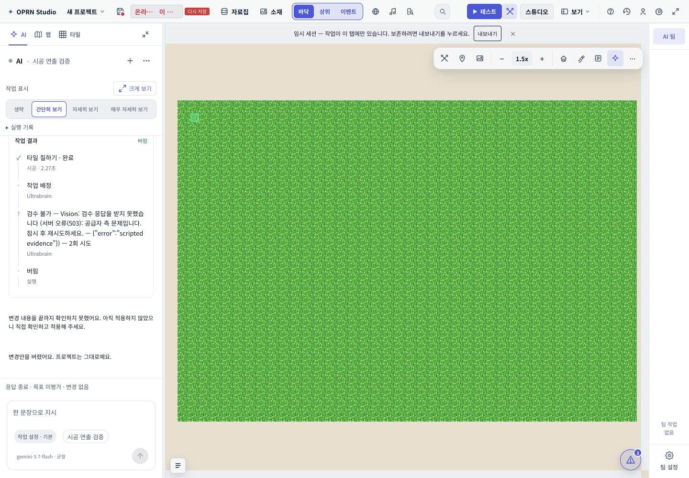
