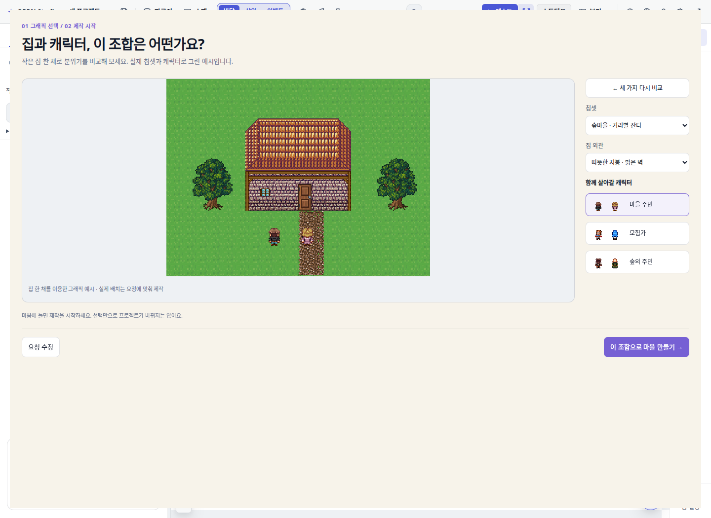
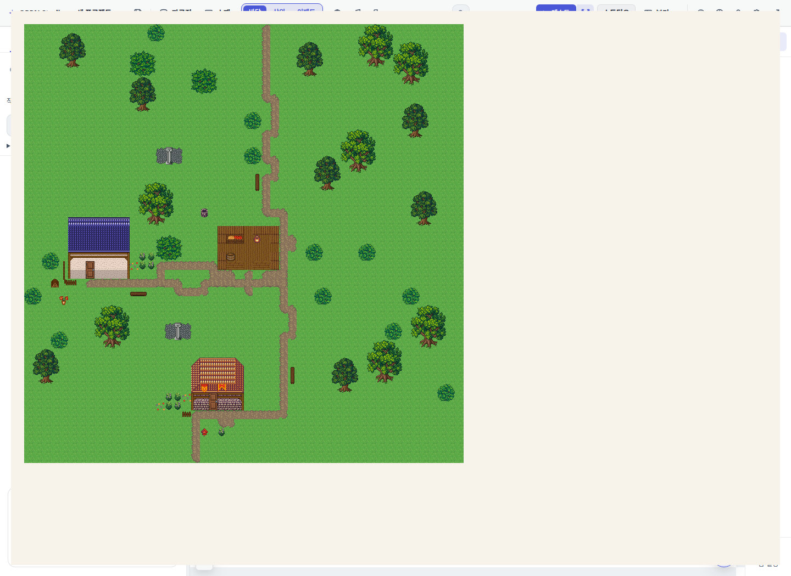

# AI 야외·마을 기본 칩셋 변경

새 야외·마을은 `forest_harmony`(숲마을 · 거리별 잔디)를 기본으로 선택한다. 사용자 선택과 기존 맵의 칩셋은 유지한다. 글로벌 `DEFAULT_TILESET_ID`와 기존 프로젝트 데이터는 변경하지 않는다.

`create_map`, `generate_map` village/forest, `author_village`, 내부 마을 생성, `build_world` town/field를 연결했다. 새 마을의 `target.tilesetId`는 스키마부터 파서·호환성 검사·생성까지 전달된다. cave는 던전 칩셋을 기본으로 사용하고 연결 실내의 기존 시공 경로는 유지한다.

숲마을의 첫 480칸과 레트로 절벽 구간은 기존 시공 번호를 보존한다. 나무는 저장된 `previewMap` 조립과 셀별 레이어를 사용한다. 기존 2×4 dark-tree, 직사각형 숲 벽 반복은 숲마을 킷에서 제외했다. 나무 평가도 완성된 숲마을 나무와 수종을 인식한다. 기존 길·물 시공을 유지하며, 승인 참고 맵의 연속 수관·거리장 조경 전체를 자동으로 복제하는 변경은 아니다.

## 브라우저 관측

Chromium, 1440×1050, 격리 워크트리 Vite. 실제 편집기를 열고 그래픽 선택 컴포넌트와 실제 toolRunner/author_village를 사용했다. 시공 초안은 메모리 안의 코드 QA 데이터로, 앱 store나 원격 프로젝트에 넣지 않았다. 실제 모델 턴이나 배포 서버 검증은 아니다.

- 제작 전 그래픽 기본 선택: `forest_harmony`.
- `create_map`: `forest_harmony`, 하위 300칸 모두 잔디 240.
- `generate_map` forest: `forest_harmony`, POI 3개, 통로 수리 0회.
- 새 마을: 숲마을, 2/2채, 문 연결 2/2, 문 보존 2/2, 길 성분 1, 구조 QA 성공.
- 명시 합본 마을: 기존 칩셋 유지, 2/2채 시공 성공.
- 고정 입구/POI가 있는 cave: `easyrpg_chipset_dungeon`, 통로 수리 0회.
- 숲마을 morphology=green + relief=hills: 4/4채 시공 성공.
- 브라우저 pageerror: 0건. 도구의 기존 정보/경고(덤불 간격, 시간 시스템 꺼짐)는 별개다.

관측 코드: `scripts/qa/capture-ai-forest-default.mjs` (`BASE`로 서버 지정).
구조 결과: [observations.json](../.omo/evidence/ai-forest-default/observations.json).

## 검증 범위

변경 TypeScript의 구문 파싱과 `git diff --check`를 확인했다. 회귀 계약을 `test/aiOutdoorTilesetDefaults.test.ts`에 추가하고, 합본 마을의 기존 팔레트·파사드 fixture는 칩셋을 명시하도록 고쳤다. AGENTS.md의 세션 규칙에 따라 vitest/gates/typecheck는 실행하지 않았다. 위키 색인은 재생성했다.
