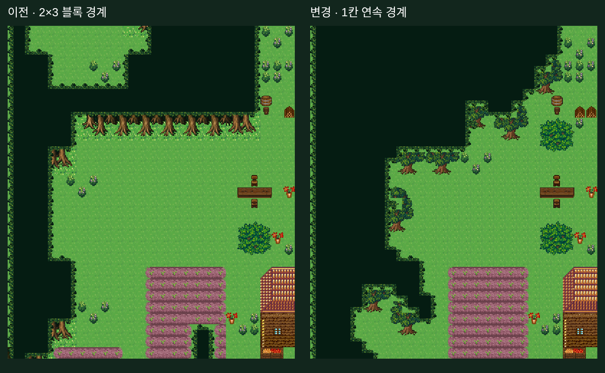
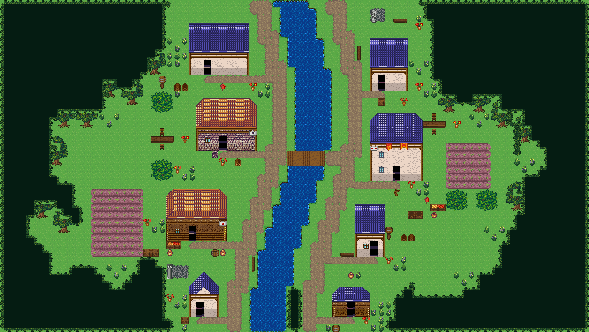

# 연속 경계장으로 만드는 마을 외곽 숲

> **몸통 방식 반려:** 이 기록의 일반 활엽수 교체는 사용자의 기존 굽이숲 몸통 요구를 위반했다.
> 복구 구현과 현재 화면은 [원래 몸통 복구](2026-09-21-restore-original-forest-trunks.md)를 따른다.

## 문제와 구현

이전 방식은 파형의 강도를 바꿔도 2×3 블록 선택과 3행 줄기 마감으로 다시 양자화됐다.
짧은 남쪽 경계에 끝마감이 안 들어가면 수관 행을 삭제했으므로, 곡선이 긴 직선과 큰 계단으로 돌아갔다.

마을 외곽은 `forestContour.ts`로 분리했다. 연속 implicit 공터에 fBm 좌표 변형(domain warp)을 적용하고,
큰 굴곡과 작은 경계 변화를 따로 합성해 1칸마다 평가한다. 8칸 미만 고립 조각만 제거한다.
집 주변 여백도 사각형 대신 둥근 거리 판정으로 보호한다. 밀도는 면적 예산과 필드 문턱을 제어한다.

완성된 기존 `forest-trees:tree` 나무를 경계 아래에 먼저 그린 후 연결 수관을 덮는다.
나무 전체가 빈 영역에 들어갈 때만 배치하며, 줄기 배치 실패로 경계를 삭제하지 않는다.
맵 아래 가장자리에는 숲이 화면 밖으로 이어지므로 강제 2행 뿌리 띠를 만들지 않는다.
실제 나무 스탬프를 맵 밖으로 자르는 방식은 사용하지 않는다.
명시된 숲 띠와 compact 마스크의 기존 Tibo 조립은 유지한다.

## 조사한 근거와 적용 범위

1. Grenier et al., **Real-time Terrain Enhancement with Controlled Procedural Patterns** (2024).
   [Eurographics 원문](https://diglib.eg.org/items/43319e3d-ba25-4762-971b-ac838ec21fb8).
   큰 패턴과 작은 패턴을 나눠 제어한다는 설계 원리를 참고했다. Phasor 노이즈 침식 구현을 이식한 것은 아니다.
2. Venu et al., **Procedural Multiscale Geometry Modeling using Implicit Functions** (2025).
   [논문](https://arxiv.org/abs/2504.09553).
   연속 함수로 형상을 구성하고 여러 스케일의 변화를 합성하는 접근을 2D 경계에 응용했다.
   볼륨 재료 모델링·adaptive sphere tracing·논문 최적화 절차를 재현한 것은 아니다.
3. **FastNoiseLite 공식 문서: Fractal / Domain Warp**.
   [구현 개념](https://github.com/Auburn/FastNoiseLite/wiki/Documentation).
   서로 다른 채널로 좌표를 변형한 다음 필드를 평가한다. fBm/domain warp는 오래된 기반 기법이다.
   이를 최신 발명으로 소개하지 않으며, 라이브러리 코드 복사·의존성 추가 없이 seeded value noise로 구현했다.

위 논문들이 16px 마을의 특정 모양을 보장한다는 주장은 하지 않는다.
곡선 주파수·변형 폭·나무 간격은 이 저장소의 타일과 시각 관측에 맞춘 구현 선택이다.

## 실제 생성·저장·비교

```bash
OUTPUT=output/evidence/forest-contour-research PROJECT_PREFIX=forest-contour-research-20260921-76a3 node scripts/qa/capture-restored-river-village.mjs
```

- Project ID: `forest-contour-research-20260921-76a3-1789964515534`
- SHA-256: `8015a544d98fab7d5f25c6b9a8ef13e3fba9ced5785f937a7772927b7653a69f`
- 생성 전 Supabase 연결 확인 → 새 전용 프로젝트 저장 → 전체 문서·SHA 재조회 일치 확인.
- 재조회 문서를 실제 타일 렌더러로 캡처. 이벤트 스프라이트는 미포함.
- 동일 조건: 집 8채, 주민 4명, 내부 생성, seed 17, 형태·테마·크기 미지정.
- 78×44, 수관 1,335칸, 물 220칸, 다리 10칸, 현관 도달/문 보존 8/8, 길 연결 성분 1.
- 생활 소품 23묶음/90칸, 시장·울타리 0, 브라우저 오류 0.

양쪽 외곽에서 연속 수관의 깊이를 행마다 측정했다(위·아래 3행 제외, 각각 맵 너비의 1/3까지).
이 지표는 경계가 작은 단위로 움직이는지 보는 보조 관측이며 미감 점수는 아니다.

| 경계 | 이전 깊이 종류 / 변화 횟수 / 1칸 변화 | 변경 깊이 종류 / 변화 횟수 / 1칸 변화 |
|---|---|---|
| 서쪽 | 4 / 8 / 0 | 12 / 20 / 14 |
| 동쪽 | 5 / 8 / 0 | 13 / 18 / 10 |

이전과 변경 화면에서 동일 영역 `(x=0, y=64, width=400, height=464)` 픽셀을 확대해 비교했다.
합성은 브라우저 canvas로 두 실제 캡처를 나란히 표시한 것이다. 그림 생성·수정은 하지 않았다.





관측 JSON: `.omo/evidence/forest-contour-research/observations.json`, `comparison.json`.
변경된 TS 구문 분석과 diff 공백 검사는 성공했다.
저장소 세션 규칙에 따라 테스트 스위트·게이트·전체 typecheck는 실행하지 않았다.
