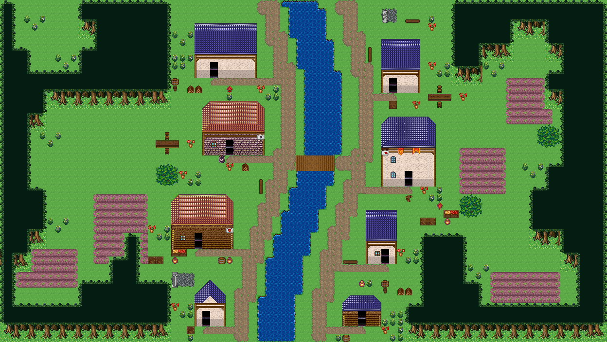

# 굽은 외곽 숲과 생활 소품

숲 후보 수가 적을 때 모든 후보를 채워 직사각형 밭·필지 경계를 따라가던 문제를 수정했다.
이제 숲은 시드 기반 굴곡 경계를 먼저 정하고, 강변형에서는 밭보다 먼저 자리를 잡는다.
집 둘레와 앞마당은 비워 두고, 완전한 수관·줄기 조립만 배치한다.

기존 오브젝트로 화단, 장작·통, 수확 상자, 탁자·의자, 길가 쉼터, 숲 가장자리 꽃덤불을 추가했다.
완성된 묶음 전체가 빈 잔디에 들어갈 때만 배치하며 길·봉인 집·문 앞·이벤트·시작점·스택을 보존한다.
추가 꾸밈은 숲마을 칩셋에서 사용하며 꾸밈 끄기와 minimal 마당은 유지한다.

## 실제 생성과 원격 저장

```bash
OUTPUT=output/evidence/natural-village-edges PROJECT_PREFIX=natural-village-edges-20260921-76a3 node scripts/qa/capture-restored-river-village.mjs
```

형태·테마·크기 지정 없이 집 8채, 주민 4명, 내부 생성, seed 17로 생성했다.
Supabase 연결 확인 후 전용 새 프로젝트에 저장하고, 전체 문서 및 SHA 일치를 재조회로 확인했다.
스크린샷은 재조회 문서를 실제 타일 렌더러로 그린 화면이며 이벤트 스프라이트는 포함하지 않는다.

- Project ID: `natural-village-edges-20260921-76a3-1789962957764`
- SHA-256: `a9dd0e265379218624bd469ef7f75a0e8497e0697f664b21f593e8782dcca024`
- 78×44, 수관 906칸, 물 220칸, 물 위 다리 10칸
- 집 8채, 현관 도달 8/8, 문 보존 8/8, 길 연결 성분 1
- 추가 꾸밈: 장작·통 2, 화단 8, 탁자 2, 수확 상자 2, 쉼터 1, 숲 가장자리 꽃덤불 8 = 23묶음/90칸
- 시장 영역 0, 울타리 0, 브라우저 오류 0
- 변경된 TypeScript 구문 분석, 캡처 스크립트 구문 검사, diff 공백 검사 성공.
- 저장소 세션 규칙에 따라 테스트 스위트·게이트·전체 typecheck는 실행하지 않았다.



관측 원본: `../.omo/evidence/natural-village-edges/observations.json`.
