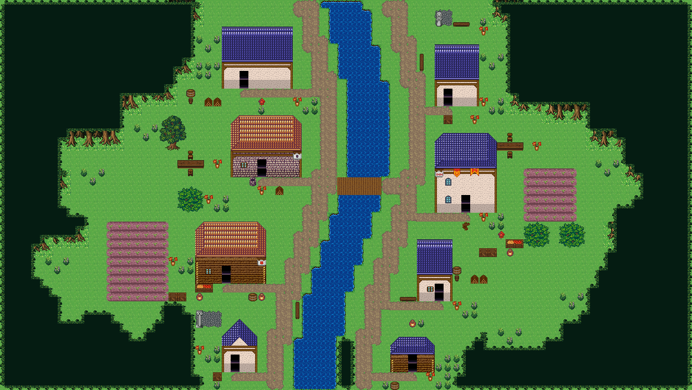

# 굽이숲 원래 몸통 복구 (2026-09-21)

사용자는 숲 외곽의 굴곡을 요청했지만 이전 구현은 연결 숲 밑에 일반 활엽수를 배치해
몸통 모양까지 바꿨다. 이 교체 경로를 제거하고 원래 굽이숲의 연속 몸통과 뿌리로 복구했다.

- `forestTrunkTiles.ts`에 원래 좌/우 끝마감과 2열 반복부를 공유한다. 새 그림·타일 변경 없음.
- 자연 경계와 기존 숲 띠 모두 같은 3행 몸통을 사용한다. `kit.medium`을 경계 몸통으로 전달하지 않는다.
- 모든 몸통은 3행 전체를 놓고 수관이 덮는다. 이미 놓인 몸통이 노출 경계와 그 아래 행까지
  이어지면 이웃 경계가 그 조립을 공유한다. 다른 몸통과 충돌하거나 길·집·스택 등을 침범하면 배치하지 않는다.
- 몸통이 들어가지 않는 돌출부만 1행씩 후퇴시킨다. 연속 경계 함수·둥근 집 여백·생활 소품은 유지한다.
- 맵 하단에서 밖으로 이어지는 숲에 강제 뿌리 띠를 만들지 않는다.

## 실제 생성과 저장

```bash
OUTPUT=output/evidence/restored-original-trunks PROJECT_PREFIX=original-grove-trunks-20260921-76a3 node scripts/qa/capture-restored-river-village.mjs
```

- 프로젝트: `original-grove-trunks-20260921-76a3-1789965905810`
- SHA-256: `95bc46b0e21fcd627e0a8f30afbcf3eb541d38a45cd730c135ceadd34c1723cc`
- 생성 전 Supabase 연결 확인, 전용 프로젝트 저장, 전체 문서와 SHA 재조회 일치.
- 재조회 문서를 실제 맵 타일 렌더러로 캡처. 이벤트 스프라이트 미포함.
- seed 17, 집 8채, 현관 도달/보존 8/8, 연결 길 성분 1, 물 220칸, 다리 10칸.
- 수관 1301칸, 생활 소품 23묶음/90칸, 시장·울타리 0, 브라우저 오류 0.
- TS 구문 분석과 diff 공백 검사 수행. 저장소 세션 규칙에 따라 테스트·게이트·전체 typecheck 미실행.



관측: `.omo/evidence/restored-original-trunks/observations.json`.
