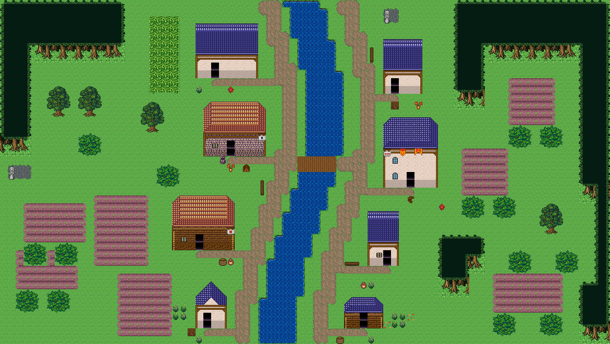

# 강변 마을 기본형 복원

일반 브랜치에 반영되지 않은 Codex 스냅샷 `b9f621011fd7c5ddadd777a9b7246c2092b10b9a`의 강변 생성 변경을 복원했다.
중앙 강·다리·양안 주거를 기본으로 사용하고 시장과 울타리는 명시할 때 추가한다.
현재 main의 굽이숲 연결 수관, 칩셋 명시 선택, 참고 자료 검사와 독립 읽기 동시 실행을 유지했다.
스냅샷에 함께 있던 확정 마을 계약과 강변 숲마을 장소 등록도 복원했다.

## 새 캡처

`node scripts/qa/capture-restored-river-village.mjs`로 현재 도구를 브라우저에서 실행했다.
인자는 새 맵, 집 8채, 주민 4명, 내부 생성, seed 17이며 형태·테마·크기를 지정하지 않았다.
Supabase 저장 후 재조회한 전체 문서와 SHA가 일치함을 확인하고 그 문서를 렌더링했다.

- Project ID: `river-groves-restored-20260921-76a3-1789960908442`
- SHA-256: `aad45cfee7aa3edff3ca1e2427eb12f4f978204e1e72d16c710956b0c5ce1939`
- 78×44, `forest_harmony`, 집 8채, 현관 도달 8/8, 길 연결 성분 1
- 강 영역 1개, 물 220칸, 물 위 다리 10칸, 연결 수관 438칸
- 울타리 0칸, 시장 영역 0개, 브라우저 오류 0건
- 스크린샷은 맵 타일 레이어 캡처이며 이벤트 스프라이트는 포함하지 않는다.
- 별도 테스트 스위트·게이트·전체 typecheck는 실행하지 않았다. 변경된 TS 구문 분석과 diff 공백 검사는 성공했다.

관측 원본: `../.omo/evidence/restored-river-village/observations.json`.
다른 `2026-09-21-river-village-*` 보고서는 스냅샷 당시의 실행 기록이며 위 결과가 이번 통합의 새 증거다.
