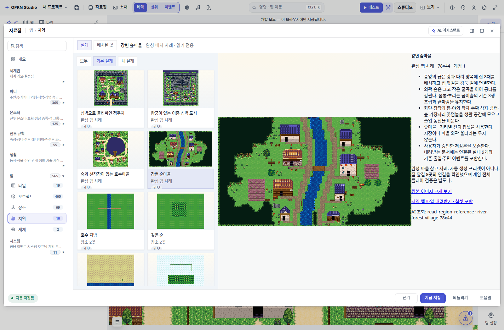

# 강변 숲마을 공용 지역 등록

사용자가 승인한 복구 화면을 「자료집 → 맵 → 지역 → 기본 설계 → 강변 숲마을」에 등록했다.
`REGION_REFERENCES`의 `river-forest-village-78x44`이며, 새 프로젝트에서도 보이는 공용 사례다.

마을을 재생성하지 않고 승인된 Supabase 저장본을 재조회했다. 타일셋 참고문서 exporter로
현재 원본의 `forest_harmony`를 조회한 결과 용도 0개였다. 이번 작업은 기존 타일·이벤트를
보존하는 배포 등록이며 타일 배치는 수행하지 않았다.

- 원본: `original-grove-trunks-20260921-76a3-1789965905810`
- 공용 불변 스냅샷: `oprn-region-river-forest-village-v1`
- 저장 후 전체 JSON 재조회 일치. 원본 프로젝트 재조회도 변경 없음.
- 공용 SHA-256: `b1a335c1caecf3de8381b5c24006b079d8589a1874181135d722068e25ef215c`
- 외부 마을 78×44, 연결된 실내 9개, 기존 출입·주민 이벤트, 칩셋·graft 메타데이터를 보존.
- 미리보기는 승인된 복구 화면. 칩셋 미리보기는 저장된 타일셋의 실제 graft 합성 이미지.

브라우저에서 지역 기본 설계 카드 선택, 1248×704 미리보기 로드,
`강변 숲마을.oprn.json` 다운로드의 전체 문서 일치, AI 행 조회의 전체 상하층 배열 일치를 확인했다.
조회 중 현재 프로젝트 변경 없음, 브라우저 오류 0. JS 구문·TS 파싱·diff 공백 검사 완료.
저장소 세션 규칙에 따라 테스트·게이트·전체 typecheck는 실행하지 않았다.

발행 명령: `node scripts/content/publish-river-forest-region.mjs`.
브라우저 캡처: `node scripts/qa/capture-shared-river-forest-region.mjs`.
발행 스크립트는 기존 공용 스냅샷이 다르면 덮어쓰지 않고 중단한다.

저장 및 브라우저 근거: `.omo/evidence/shared-river-forest-village/`.
