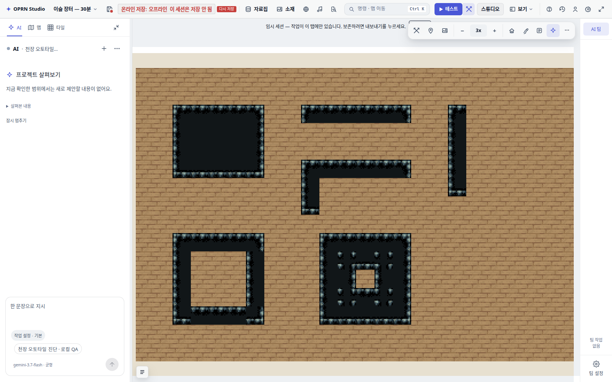

# 실내 천장 오토타일 시각 진단

2026-09-18 · e6490d7e4 · easyrpg_chipset_interior

[이미지 중심 보고서](report.html)

확인된 결함: 기본 천장 그룹 누락, 한 칸 띠의 한쪽 테두리 누락, 오목 코너 소스의 통짜 노출. 기존 방 생성 초기화로 그룹만 등록해도 뒤의 두 문제는 남는다. 실제 마우스 칠하기·지우기·되돌리기를 확인했으며 되돌리기는 정상이다.

별도 로컬 진단 세션에서 재현했다. 사용자 프로젝트 확인·원격 저장·제품 코드 수정·전체 게이트는 수행하지 않았다. 원시 배열과 그룹 목록은 observations.json, 실제 마우스 입력 결과는 mouse-observations.json.
