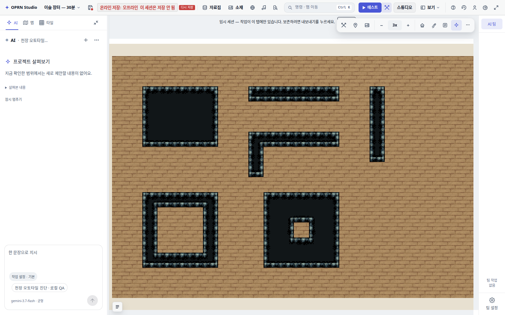

# 천장 오토타일 수정

[스크린샷 전후 비교](report.html)

- 기본 실내 칩셋 초기화에서 천장 그룹을 등록한다.
- 전용 쿼터 렌더로 한 칸 띠와 오목 코너를 합성한다.
- 실제 편집기 6개 도형·마우스 칠하기·지우기·되돌리기 확인.
- vitest/전체 타입 검사/게이트와 런타임 QA는 실행하지 않았다.
- 원격 프로젝트를 수정하지 않은 로컬 진단이다.

