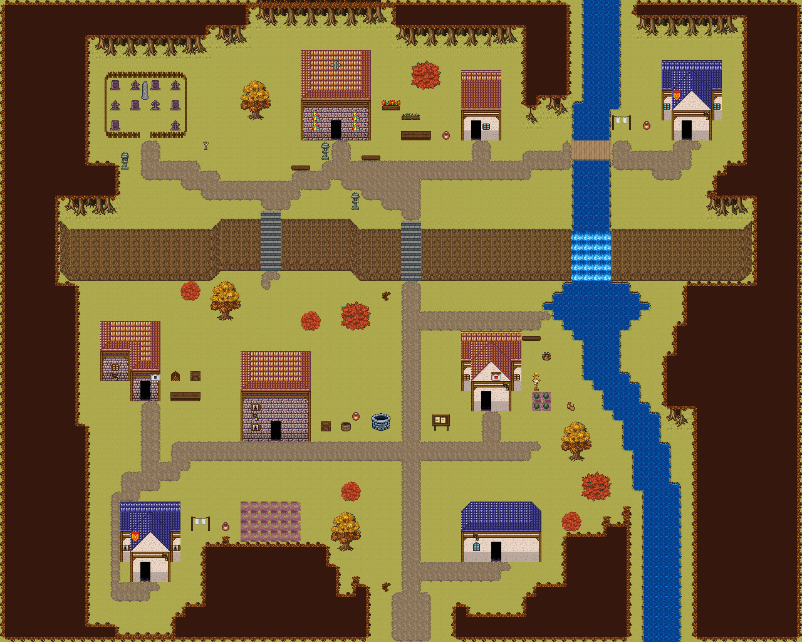

# 가을 종탑 언덕 교구

단풍 숲으로 둘러싸인 언덕 위 종탑 교구. 금빛 풀밭의 계단 길과 묘지, 폭포 아래 소가 가을빛이다. 80×64, tilesetId=forest_harmony_autumn, 원본 숲마을 chapel-hill-parish(tiledata/forest-villages/diverse). 입구 (40,60). 통행 검사 목표 [[47,14],[68,14],[14,40],[27,44],[48,41],[14,58],[49,56]].



## 기후 편집 (원본 숲마을 위에 한 것)
```json
[]
```

## 집 (원본 그대로)
```json
[{"id":"chapel-hill-parish-house-1","role":"사제관","label":"왕궁 도시 · 주황 박공 회벽집 4×7 ②","x":46,"y":7,"w":4,"h":7,"front":{"x":47,"y":14}},{"id":"chapel-hill-parish-house-2","role":"주거","label":"왕궁 도시 · 파랑 박공 회벽집 6×8 ②","x":66,"y":6,"w":6,"h":8,"front":{"x":68,"y":14}},{"id":"chapel-hill-parish-house-3","role":"목수집","label":"오렌지 회벽 l-mirror 집","x":10,"y":32,"w":6,"h":8,"front":{"x":14,"y":40}},{"id":"chapel-hill-parish-house-4","role":"종지기 집","label":"오렌지 회벽 2층 rect-2f 집","x":24,"y":35,"w":7,"h":9,"front":{"x":27,"y":44}},{"id":"chapel-hill-parish-house-5","role":"텃밭집","label":"왕궁 도시 · 주황 박공 회벽집 6×8","x":46,"y":33,"w":6,"h":8,"front":{"x":48,"y":41}},{"id":"chapel-hill-parish-house-6","role":"주거","label":"왕궁 도시 · 파랑 박공 회벽집 6×8 ②","x":12,"y":50,"w":6,"h":8,"front":{"x":14,"y":58}},{"id":"chapel-hill-parish-house-7","role":"밭집","label":"파랑 석벽 rect-wide 집","x":46,"y":50,"w":8,"h":6,"front":{"x":49,"y":56}}]
```

전체 두 레이어는 다음 배열 문서가 정답이다.
