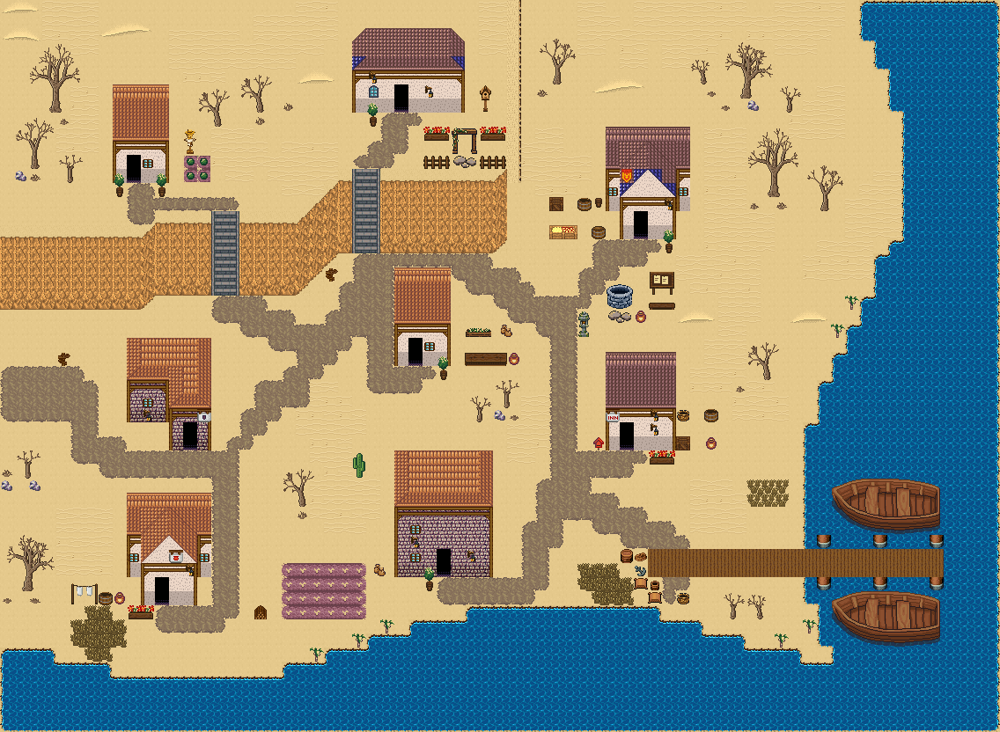

# 모래 물굽이 포구

모래 해안 물굽이를 따라 비껴 앉은 포구 마을. 물가에 야자 몇 그루가 무리 지어 서고 긴 선착장이 바다로 나간다. 뭍 쪽 가장자리에는 바랜 고목 덩이. 71×52, tilesetId=forest_harmony_desert, 원본 숲마을 reed-bay-village(tiledata/forest-villages/diverse). 입구 (5,27). 통행 검사 목표 [[9,13],[28,8],[45,17],[13,32],[29,26],[44,32],[11,43],[31,41]].



## 기후 편집 (원본 숲마을 위에 한 것)
```json
[{"kind":"unflowered","cells":6,"bushes":6,"tiles":[348,288],"rule":"눈·재·모래에는 꽃이 피지 않는다: 덤불에 붙은 꽃은 같은 덤불(289)로, 나머지 꽃은 걷는다"},{"kind":"bare-trees","forestCells":{"before":765,"after":0},"clearedCells":707,"orphanRocks":4,"cliffExtended":30,"ledges":[{"side":"east","x":36,"y":[0,12]}],"forestPlugs":[],"palms":7,"groves":11,"trees":16,"placed":[{"x":54,"y":27,"band":false,"trees":[{"id":"mid-3","x":53,"y":24}],"props":[{"tile":537,"x":52,"y":28},{"tile":2908,"x":54,"y":28},{"tile":2937,"x":52,"y":27}],"grass":0},{"x":20,"y":34,"band":false,"trees":[{"id":"small-2","x":20,"y":32},{"id":"small-2","x":22,"y":32}],"props":[{"tile":537,"x":22,"y":35},{"tile":2908,"x":19,"y":34},{"tile":769,"x":21,"y":35}],"grass":0},{"x":18,"y":6,"band":false,"trees":[{"id":"mid-1","x":17,"y":3},{"id":"small-2","x":20,"y":5}],"props":[{"tile":537,"x":18,"y":7},{"tile":2938,"x":17,"y":7},{"tile":769,"x":16,"y":7}],"grass":0},{"x":38,"y":6,"band":false,"trees":[{"id":"mid-1","x":38,"y":3},{"id":"small-2","x":41,"y":4}],"props":[{"tile":537,"x":38,"y":7},{"tile":2909,"x":39,"y":7}],"grass":0},{"x":57,"y":9,"band":false,"trees":[{"id":"mid-2","x":56,"y":6}],"props":[{"tile":537,"x":59,"y":10},{"tile":2907,"x":57,"y":10}],"grass":21},{"x":0,"y":12,"band":true,"trees":[{"id":"mid-3","x":0,"y":9},{"id":"small-1","x":3,"y":11}],"props":[{"tile":537,"x":1,"y":13},{"tile":2909,"x":0,"y":13}],"grass":0},{"x":1,"y":33,"band":true,"trees":[{"id":"small-2","x":0,"y":31}],"props":[{"tile":537,"x":2,"y":34},{"tile":537,"x":1,"y":34},{"tile":2909,"x":0,"y":34},{"tile":2908,"x":2,"y":33}],"grass":0},{"x":2,"y":2,"band":true,"trees":[{"id":"small-3","x":1,"y":0},{"id":"small-2","x":3,"y":0}],"props":[{"tile":537,"x":3,"y":3},{"tile":537,"x":2,"y":3},{"tile":2937,"x":0,"y":2},{"tile":2937,"x":0,"y":3}],"grass":0},{"x":3,"y":41,"band":true,"trees":[{"id":"big-1","x":1,"y":37}],"props":[{"tile":537,"x":0,"y":41},{"tile":2907,"x":0,"y":42}],"grass":9},{"x":54,"y":43,"band":false,"trees":[{"id":"small-2","x":53,"y":41}],"props":[{"tile":537,"x":55,"y":43},{"tile":2908,"x":52,"y":43}],"grass":0},{"x":36,"y":28,"band":false,"trees":[{"id":"small-3","x":35,"y":26}],"props":[{"tile":537,"x":34,"y":28},{"tile":2909,"x":35,"y":29},{"tile":2938,"x":34,"y":29}],"grass":0}],"rule":"잎 달린 숲·나무 도장(2550~2609·1200~1463·960~1123·289) → 맨땅; 잎 없는 나무(2880~, bare-trees:*) 덩이 — 가장자리 띠 8칸·안쪽 13칸 간격, 큰/중간 한 그루+곁나무 1~2+밑동 옆 바위·마른 덤불(사막 안쪽은 선인장); 집·길·문·계단·다리·울타리 2칸 밖; 물가 야자는 2~3그루 무리"},{"kind":"fill","pieces":19,"scenes":["풀숲","풀숲","풀숲","풀숲","풀숲","풀숲","풀숲","풀숲","풀숲","풀숲","풀숲","풀숲","풀숲","풀숲","풀숲","풀숲","풀숲","풀숲","풀숲"],"meadows":15,"emptiness":{"before":{"maxSq":9,"screen":0.855},"after":{"maxSq":4,"screen":0.38}},"rule":"빈칸 게이트(한 변 5칸 빈 정사각형 없음, 17×13 화면 빈 땅 ≤40%)를 넘을 때까지 덩이 장면(덤불숲·바위와 덤불·키큰 풀 덩이, 가을은 나무·꽃 포함)"}]
```

## 집 (원본 그대로)
```json
[{"id":"reed-bay-village-house-1","role":"텃밭집","label":"왕궁 도시 · 주황 박공 회벽집 4×7 ②","x":8,"y":6,"w":4,"h":7,"front":{"x":9,"y":13}},{"id":"reed-bay-village-house-2","role":"주거","label":"파랑 석벽 rect-wide 집","x":25,"y":2,"w":8,"h":6,"front":{"x":28,"y":8}},{"id":"reed-bay-village-house-3","role":"물자 보관집","label":"왕궁 도시 · 파랑 박공 회벽집 6×8 ②","x":43,"y":9,"w":6,"h":8,"front":{"x":45,"y":17}},{"id":"reed-bay-village-house-4","role":"주거","label":"오렌지 회벽 l-mirror 집","x":9,"y":24,"w":6,"h":8,"front":{"x":13,"y":32}},{"id":"reed-bay-village-house-5","role":"약초 작업집","label":"왕궁 도시 · 주황 박공 회벽집 4×7 ②","x":28,"y":19,"w":4,"h":7,"front":{"x":29,"y":26}},{"id":"reed-bay-village-house-6","role":"어업 준비집","label":"왕궁 도시 · 파랑 회벽집 5×7","x":43,"y":25,"w":5,"h":7,"front":{"x":44,"y":32}},{"id":"reed-bay-village-house-7","role":"주거","label":"왕궁 도시 · 주황 박공 회벽집 6×8","x":9,"y":35,"w":6,"h":8,"front":{"x":11,"y":43}},{"id":"reed-bay-village-house-8","role":"밭 관리집","label":"오렌지 회벽 2층 rect-2f 집","x":28,"y":32,"w":7,"h":9,"front":{"x":31,"y":41}}]
```

전체 두 레이어는 다음 배열 문서가 정답이다.
