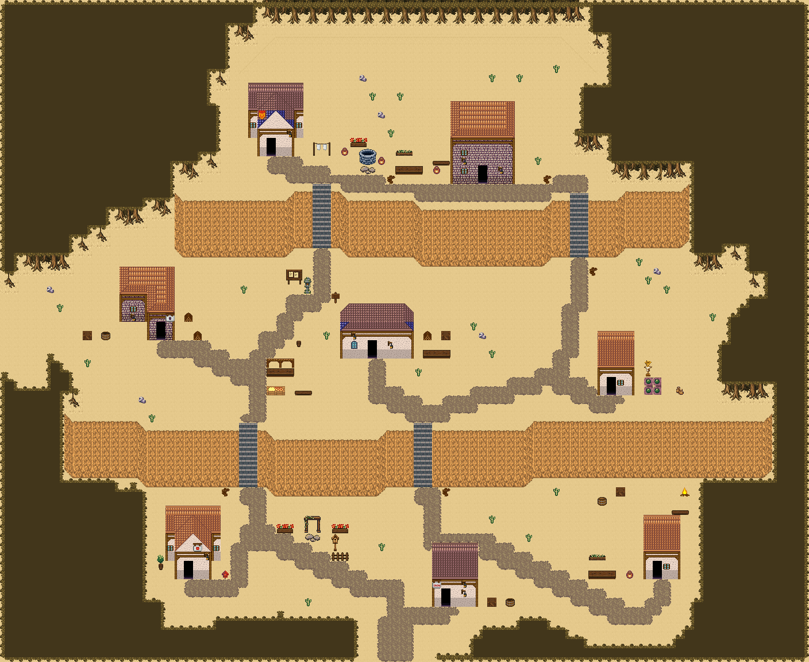

# 사암 층바위 협곡마을

세 높이의 사암 대지를 네 계단이 잇는 협곡 마을. 모래밭 곳곳에 선인장과 바위가 있고 마른 덤불숲이 협곡을 둘러싼다. 88×72, tilesetId=forest_harmony_desert, 원본 숲마을 terrace-cliff-village(tiledata/forest-villages/diverse). 입구 (42,68). 통행 검사 목표 [[29,17],[52,20],[17,37],[40,39],[66,43],[20,63],[48,66],[71,63]].



## 기후 편집 (원본 숲마을 위에 한 것)
```json
[{"kind":"desert","replacedTrees":14,"plants":30,"rule":"나무 덩이 → 발치에 야자(물 5칸 안)·선인장(큰 나무는 바위 하나 더), 물가 야자, 빈 모래밭 선인장"},{"kind":"desert-plant","x":6,"y":33,"tile":769,"why":"replaces 숲 나무 · 활엽수"},{"kind":"desert-plant","x":5,"y":31,"tile":537,"why":"replaces 숲 나무 · 활엽수"},{"kind":"desert-plant","x":69,"y":28,"tile":769,"why":"replaces 숲 나무 · 작은 덤불"},{"kind":"desert-plant","x":16,"y":45,"tile":769,"why":"replaces 숲 나무 · 활엽수"},{"kind":"desert-plant","x":15,"y":43,"tile":537,"why":"replaces 숲 나무 · 활엽수"},{"kind":"desert-plant","x":51,"y":35,"tile":769,"why":"replaces 숲 나무 · 작은 덤불"},{"kind":"desert-plant","x":40,"y":10,"tile":769,"why":"replaces 숲 나무 · 활엽수"},{"kind":"desert-plant","x":39,"y":8,"tile":537,"why":"replaces 숲 나무 · 활엽수"},{"kind":"desert-plant","x":43,"y":10,"tile":769,"why":"replaces 숲 나무 · 둥근 덤불"},{"kind":"desert-plant","x":42,"y":14,"tile":769,"why":"replaces 숲 나무 · 활엽수"},{"kind":"desert-plant","x":41,"y":12,"tile":537,"why":"replaces 숲 나무 · 활엽수"},{"kind":"desert-plant","x":53,"y":8,"tile":769,"why":"replaces 숲 나무 · 둥근 덤불"},{"kind":"desert-plant","x":56,"y":8,"tile":769,"why":"replaces 숲 나무 · 작은 덤불"},{"kind":"desert-plant","x":72,"y":31,"tile":769,"why":"replaces 숲 나무 · 활엽수"},{"kind":"desert-plant","x":71,"y":29,"tile":537,"why":"replaces 숲 나무 · 활엽수"},{"kind":"desert-plant","x":41,"y":59,"tile":769,"why":"replaces 숲 나무 · 둥근 덤불"},{"kind":"desert-plant","x":60,"y":7,"tile":769,"why":"replaces 숲 나무 · 작은 덤불"},{"kind":"desert-plant","x":53,"y":38,"tile":769,"why":"replaces 숲 나무 · 활엽수"},{"kind":"desert-plant","x":52,"y":36,"tile":537,"why":"replaces 숲 나무 · 활엽수"},{"kind":"desert-plant","x":70,"y":30,"tile":769,"why":"replaces 숲 나무 · 작은 덤불"},{"kind":"desert-plant","x":58,"y":17,"tile":769,"why":"open sand"},{"kind":"desert-plant","x":26,"y":31,"tile":769,"why":"open sand"},{"kind":"desert-plant","x":35,"y":36,"tile":769,"why":"open sand"},{"kind":"desert-plant","x":45,"y":40,"tile":769,"why":"open sand"},{"kind":"desert-plant","x":60,"y":53,"tile":769,"why":"open sand"},{"kind":"desert-plant","x":57,"y":58,"tile":769,"why":"open sand"},{"kind":"desert-plant","x":77,"y":34,"tile":769,"why":"open sand"},{"kind":"desert-plant","x":9,"y":39,"tile":769,"why":"open sand"},{"kind":"desert-plant","x":53,"y":56,"tile":769,"why":"open sand"},{"kind":"desert-plant","x":33,"y":65,"tile":769,"why":"open sand"}]
```

## 집 (원본 그대로)
```json
[{"id":"terrace-cliff-village-house-1","role":"주거","label":"왕궁 도시 · 파랑 박공 회벽집 6×8 ②","x":27,"y":9,"w":6,"h":8,"front":{"x":29,"y":17}},{"id":"terrace-cliff-village-house-2","role":"약초 작업집","label":"오렌지 회벽 2층 rect-2f 집","x":49,"y":11,"w":7,"h":9,"front":{"x":52,"y":20}},{"id":"terrace-cliff-village-house-3","role":"물자 보관집","label":"오렌지 회벽 l-mirror 집","x":13,"y":29,"w":6,"h":8,"front":{"x":17,"y":37}},{"id":"terrace-cliff-village-house-4","role":"목공 작업집","label":"파랑 석벽 rect-wide 집","x":37,"y":33,"w":8,"h":6,"front":{"x":40,"y":39}},{"id":"terrace-cliff-village-house-5","role":"텃밭집","label":"왕궁 도시 · 주황 박공 회벽집 4×7 ②","x":65,"y":36,"w":4,"h":7,"front":{"x":66,"y":43}},{"id":"terrace-cliff-village-house-6","role":"주거","label":"왕궁 도시 · 주황 박공 회벽집 6×8","x":18,"y":55,"w":6,"h":8,"front":{"x":20,"y":63}},{"id":"terrace-cliff-village-house-7","role":"물자 보관집","label":"왕궁 도시 · 파랑 회벽집 5×7","x":47,"y":59,"w":5,"h":7,"front":{"x":48,"y":66}},{"id":"terrace-cliff-village-house-8","role":"약초 작업집","label":"왕궁 도시 · 주황 박공 회벽집 4×7 ②","x":70,"y":56,"w":4,"h":7,"front":{"x":71,"y":63}}]
```

전체 두 레이어는 다음 배열 문서가 정답이다.
