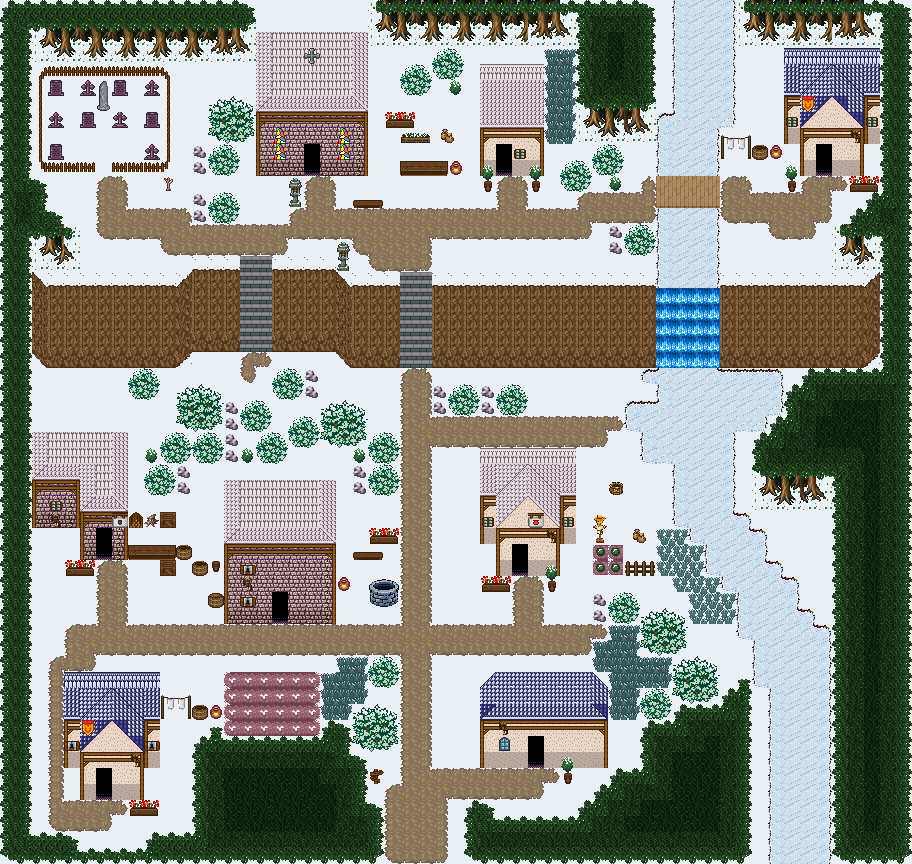

# 종탑 언덕 교구 · 설원

눈 쌓인 언덕 위 종탑 교구. 계단 길과 묘지, 교구 마당이 모두 눈밭이 되고 강과 폭포 아래 소가 얼어붙었다(폭포만 흐른다). 57×54, tilesetId=forest_harmony_snow, 원본 숲마을 chapel-hill-parish(tiledata/forest-villages/diverse). 입구 (25,50). 통행 검사 목표 [[31,11],[51,11],[6,35],[17,39],[32,36],[6,50],[33,48]].



## 기후 편집 (원본 숲마을 위에 한 것)
```json
[{"kind":"unflowered","cells":0,"bushes":0,"tiles":[348,288],"rule":"눈·재·모래에는 꽃이 피지 않는다: 덤불에 붙은 꽃은 같은 덤불(289)로, 나머지 꽃은 걷는다"},{"kind":"snow-bushes","trees":4,"rule":"활엽수 3×4 → 눈 덮인 둥근 덤불 3×3(아래 세 줄), 맨 윗줄은 눈밭"},{"kind":"freeze-river","swappedTiles":223,"rule":"강·소의 물 칸 t → 얼음 칸 ice[t]; 폭포(2700)와 다리는 그대로"},{"kind":"buried-grass","cells":126,"rule":"집·길 곁 키큰 풀 G(짧음) → 바닥; 숲 가 E(짙음)·트인 풀밭 F(밝음)만 남기고 새 덩이도 E·F 만"},{"kind":"fill","pieces":18,"scenes":["덤불 한 쌍","바위와 덤불","바위와 덤불","바위와 덤불","바위와 덤불","작은 덤불숲","바위와 덤불","바위와 덤불","덤불 한 쌍","바위와 덤불","바위와 덤불","바위와 덤불","덤불 한 쌍","바위와 덤불","풀숲","바위와 덤불","풀숲","풀숲"],"emptiness":{"before":{"maxSq":5,"screen":0.584},"after":{"maxSq":4,"screen":0.394}},"rule":"빈칸 게이트(한 변 5칸 빈 정사각형 없음, 17×13 화면 빈 땅 ≤40%)를 넘을 때까지 덩이 장면(덤불숲·바위와 덤불·키큰 풀 덩이, 가을은 나무·꽃 포함)"}]
```

## 집 (원본 그대로)
```json
[{"id":"chapel-hill-parish-house-1","role":"사제관","label":"왕궁 도시 · 주황 박공 회벽집 4×7 ②","x":30,"y":4,"w":4,"h":7,"front":{"x":31,"y":11}},{"id":"chapel-hill-parish-house-2","role":"주거","label":"왕궁 도시 · 파랑 박공 회벽집 6×8 ②","x":49,"y":3,"w":6,"h":8,"front":{"x":51,"y":11}},{"id":"chapel-hill-parish-house-3","role":"목수집","label":"오렌지 회벽 l-mirror 집","x":2,"y":27,"w":6,"h":8,"front":{"x":6,"y":35}},{"id":"chapel-hill-parish-house-4","role":"종지기 집","label":"오렌지 회벽 2층 rect-2f 집","x":14,"y":30,"w":7,"h":9,"front":{"x":17,"y":39}},{"id":"chapel-hill-parish-house-5","role":"텃밭집","label":"왕궁 도시 · 주황 박공 회벽집 6×8","x":30,"y":28,"w":6,"h":8,"front":{"x":32,"y":36}},{"id":"chapel-hill-parish-house-6","role":"주거","label":"왕궁 도시 · 파랑 박공 회벽집 6×8 ②","x":4,"y":42,"w":6,"h":8,"front":{"x":6,"y":50}},{"id":"chapel-hill-parish-house-7","role":"밭집","label":"파랑 석벽 rect-wide 집","x":30,"y":42,"w":8,"h":6,"front":{"x":33,"y":48}}]
```

전체 두 레이어는 다음 배열 문서가 정답이다.
