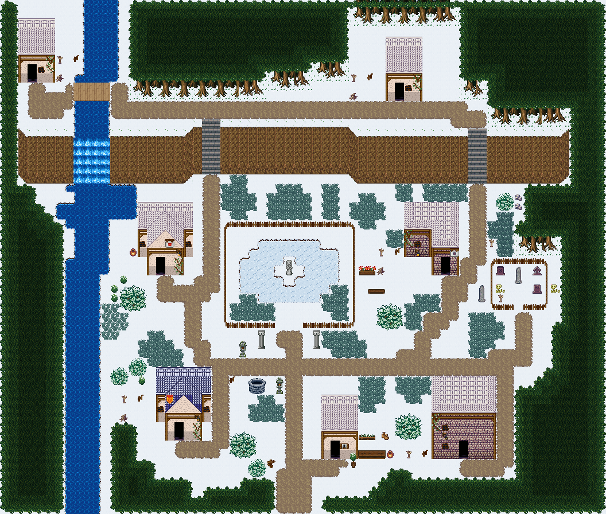

# 얼어붙은 안개못

울타리 친 못이 통째로 얼어 석상 섬까지 걸어 들어갈 수 있는 설원 폐촌. 서쪽 강과 폭포는 얼지 않았다. 66×56, tilesetId=forest_harmony_snow, 원본 숲마을 mistpond-hollow(tiledata/forest-villages/diverse). 입구 (31,52). 통행 검사 목표 [[3,9],[43,11],[17,30],[48,30],[19,48],[50,50],[36,50],[30,32],[31,31]].



## 기후 편집 (원본 숲마을 위에 한 것)
```json
[{"kind":"unflowered","cells":3,"bushes":3,"tiles":[348,288],"rule":"눈·재·모래에는 꽃이 피지 않는다: 덤불에 붙은 꽃은 같은 덤불(289)로, 나머지 꽃은 걷는다"},{"kind":"snow-bushes","trees":2,"rule":"활엽수 3×4 → 눈 덮인 둥근 덤불 3×3(아래 세 줄), 맨 윗줄은 눈밭"},{"kind":"freeze","landmark":"mistpond-hollow-shrine-pond","box":[24,24,15,12],"swappedTiles":62,"rule":"물 칸 t → 얼음 칸 ice[t] (sheets.json snow.ice)"},{"kind":"buried-grass","cells":0,"kept":"G grass kept: without it the village fails the fill gate"},{"kind":"fill","pieces":0,"scenes":[],"emptiness":{"before":{"maxSq":4,"screen":0.38},"after":{"maxSq":4,"screen":0.38}},"rule":"빈칸 게이트(한 변 5칸 빈 정사각형 없음, 17×13 화면 빈 땅 ≤40%)를 넘을 때까지 덩이 장면(덤불숲·바위와 덤불·키큰 풀 덩이, 가을은 나무·꽃 포함)"}]
```

## 집 (원본 그대로)
```json
[{"id":"mistpond-hollow-house-1","role":"폐가","label":"폐가 · 왕궁 도시 · 주황 박공 회벽집 4×7 ②","x":2,"y":2,"w":4,"h":7,"front":{"x":3,"y":9}},{"id":"mistpond-hollow-house-2","role":"폐가","label":"폐가 · 왕궁 도시 · 주황 박공 회벽집 4×7 ②","x":42,"y":4,"w":4,"h":7,"front":{"x":43,"y":11}},{"id":"mistpond-hollow-house-3","role":"폐가","label":"폐가 · 왕궁 도시 · 주황 박공 회벽집 6×8","x":15,"y":22,"w":6,"h":8,"front":{"x":17,"y":30}},{"id":"mistpond-hollow-house-4","role":"폐가","label":"폐가 · 오렌지 회벽 l-mirror 집","x":44,"y":22,"w":6,"h":8,"front":{"x":48,"y":30}},{"id":"mistpond-hollow-house-5","role":"폐가","label":"폐가 · 왕궁 도시 · 파랑 박공 회벽집 6×8 ②","x":17,"y":40,"w":6,"h":8,"front":{"x":19,"y":48}},{"id":"mistpond-hollow-house-6","role":"폐가","label":"폐가 · 오렌지 회벽 2층 rect-2f 집","x":47,"y":41,"w":7,"h":9,"front":{"x":50,"y":50}},{"id":"mistpond-hollow-house-7","role":"못지기 집","label":"왕궁 도시 · 주황 박공 회벽집 4×7 ②","x":35,"y":43,"w":4,"h":7,"front":{"x":36,"y":50}}]
```

전체 두 레이어는 다음 배열 문서가 정답이다.
