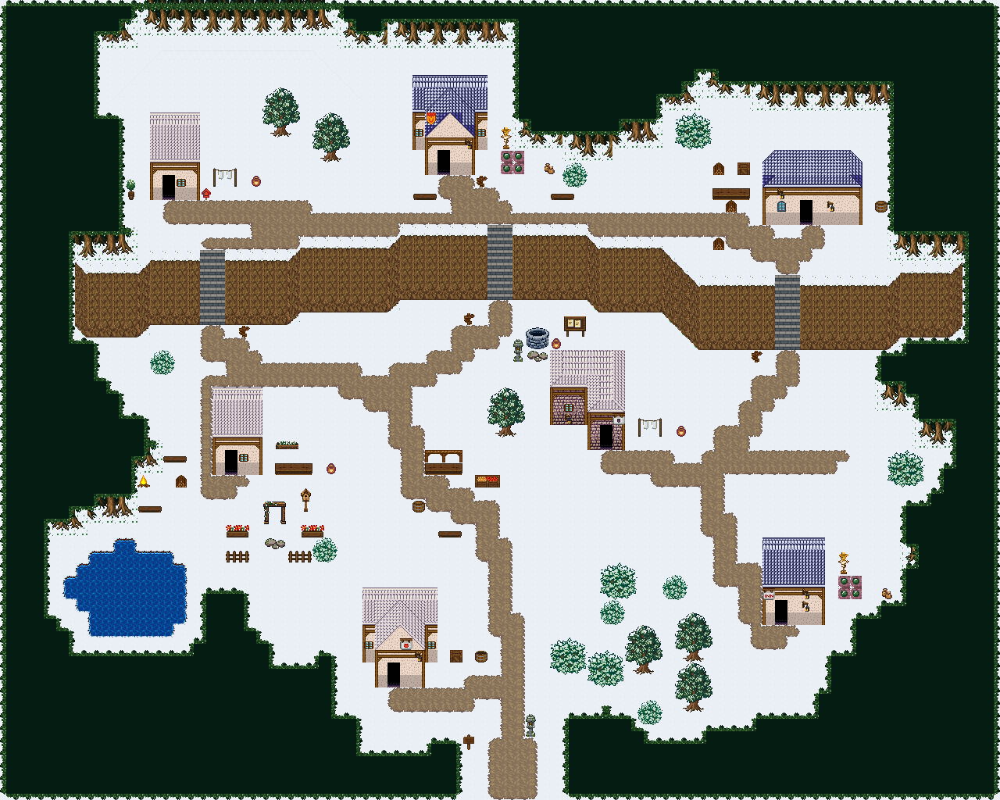

# 솔바람 산촌 · 설원

눈 덮인 산기슭에 흩어진 산촌. 솔숲 수관에 눈이 얹히고 지붕이 하얗게 덮였다. 개울은 얼지 않고 흐른다. 80×64, tilesetId=forest_harmony_snow, 원본 숲마을 pine-hamlets(tiledata/forest-villages/diverse). 입구 (40,60). 통행 검사 목표 [[13,16],[35,14],[64,18],[18,38],[48,36],[62,50],[31,55]].



## 기후 편집 (원본 숲마을 위에 한 것)
```json
[]
```

## 집 (원본 그대로)
```json
[{"id":"pine-hamlets-house-1","role":"주거","label":"왕궁 도시 · 주황 박공 회벽집 4×7 ②","x":12,"y":9,"w":4,"h":7,"front":{"x":13,"y":16}},{"id":"pine-hamlets-house-2","role":"텃밭집","label":"왕궁 도시 · 파랑 박공 회벽집 6×8 ②","x":33,"y":6,"w":6,"h":8,"front":{"x":35,"y":14}},{"id":"pine-hamlets-house-3","role":"목공 작업집","label":"파랑 석벽 rect-wide 집","x":61,"y":12,"w":8,"h":6,"front":{"x":64,"y":18}},{"id":"pine-hamlets-house-4","role":"약초 작업집","label":"왕궁 도시 · 주황 박공 회벽집 4×7 ②","x":17,"y":31,"w":4,"h":7,"front":{"x":18,"y":38}},{"id":"pine-hamlets-house-5","role":"주거","label":"오렌지 회벽 l-mirror 집","x":44,"y":28,"w":6,"h":8,"front":{"x":48,"y":36}},{"id":"pine-hamlets-house-6","role":"텃밭집","label":"왕궁 도시 · 파랑 회벽집 5×7","x":61,"y":43,"w":5,"h":7,"front":{"x":62,"y":50}},{"id":"pine-hamlets-house-7","role":"물자 보관집","label":"왕궁 도시 · 주황 박공 회벽집 6×8","x":29,"y":47,"w":6,"h":8,"front":{"x":31,"y":55}}]
```

전체 두 레이어는 다음 배열 문서가 정답이다.
