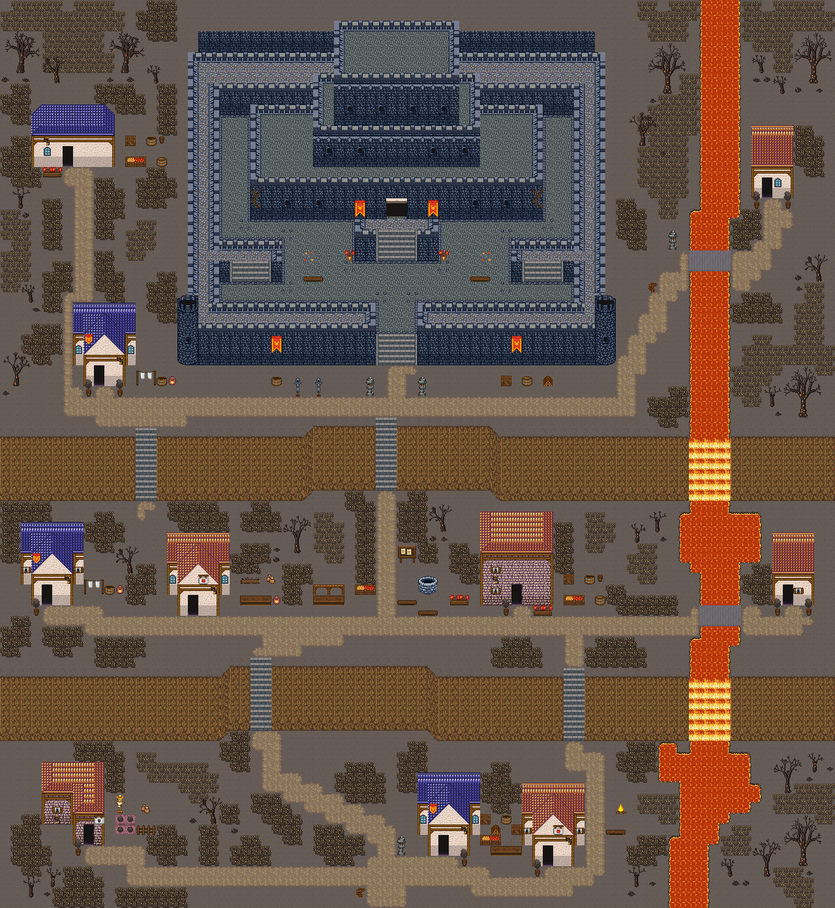

# 잿빛 여울성

재로 덮인 벌판 위 성채 마을. 해자와 여울이 용암으로 바뀌고, 숲이 있던 자리에는 그을린 고목이 덩이로 서 있다. 80×87, tilesetId=forest_harmony_volcano, 원본 숲마을 ford-castle-town(tiledata/forest-villages/diverse). 입구 (36,83). 통행 검사 목표 [[6,16],[73,19],[9,37],[4,58],[18,59],[49,58],[75,58],[8,81],[42,82],[52,83]].



## 기후 편집 (원본 숲마을 위에 한 것)
```json
[{"kind":"unflowered","cells":0,"bushes":0,"tiles":[348,288],"rule":"눈·재·모래에는 꽃이 피지 않는다: 덤불에 붙은 꽃은 같은 덤불(289)로, 나머지 꽃은 걷는다"},{"kind":"bare-trees","forestCells":{"before":1254,"after":0},"clearedCells":1203,"orphanRocks":2,"cliffExtended":84,"ledges":[],"forestPlugs":[],"palms":0,"groves":21,"trees":29,"placed":[{"x":64,"y":1,"band":true,"trees":[{"id":"big-2","x":62,"y":4}],"props":[{"tile":2908,"x":62,"y":9}],"grass":34},{"x":77,"y":80,"band":true,"trees":[{"id":"big-2","x":75,"y":78},{"id":"mid-2","x":72,"y":80}],"props":[{"tile":2908,"x":77,"y":83}],"grass":0},{"x":2,"y":19,"band":true,"trees":[{"id":"small-2","x":1,"y":17}],"props":[{"tile":2907,"x":2,"y":20}],"grass":0},{"x":69,"y":86,"band":true,"trees":[{"id":"small-3","x":69,"y":81}],"props":[{"tile":2907,"x":71,"y":84},{"tile":2937,"x":70,"y":84}],"grass":0},{"x":12,"y":52,"band":false,"trees":[{"id":"mid-3","x":11,"y":51}],"props":[],"grass":0},{"x":77,"y":27,"band":true,"trees":[{"id":"mid-3","x":77,"y":23}],"props":[{"tile":2907,"x":76,"y":26},{"tile":2908,"x":76,"y":27}],"grass":18},{"x":12,"y":1,"band":true,"trees":[{"id":"big-3","x":10,"y":2},{"id":"small-3","x":14,"y":5}],"props":[{"tile":2937,"x":12,"y":7},{"tile":2908,"x":10,"y":7}],"grass":32},{"x":5,"y":84,"band":true,"trees":[{"id":"small-1","x":4,"y":82},{"id":"small-2","x":2,"y":83}],"props":[{"tile":2938,"x":4,"y":85}],"grass":0},{"x":77,"y":39,"band":true,"trees":[{"id":"big-2","x":75,"y":35},{"id":"small-2","x":73,"y":36}],"props":[{"tile":2908,"x":74,"y":39}],"grass":0},{"x":2,"y":0,"band":true,"trees":[{"id":"big-3","x":0,"y":2},{"id":"mid-3","x":4,"y":4}],"props":[{"tile":2937,"x":0,"y":7},{"tile":2909,"x":2,"y":7}],"grass":0},{"x":20,"y":79,"band":false,"trees":[{"id":"mid-3","x":19,"y":75}],"props":[{"tile":2907,"x":22,"y":79},{"tile":2937,"x":18,"y":78}],"grass":0},{"x":3,"y":27,"band":true,"trees":[{"id":"small-3","x":2,"y":26}],"props":[{"tile":2909,"x":3,"y":29}],"grass":0},{"x":78,"y":7,"band":true,"trees":[{"id":"big-2","x":76,"y":3},{"id":"small-3","x":74,"y":6}],"props":[{"tile":2938,"x":78,"y":8},{"tile":2907,"x":76,"y":8}],"grass":0},{"x":63,"y":49,"band":false,"trees":[{"id":"small-2","x":62,"y":48},{"id":"small-1","x":60,"y":49}],"props":[{"tile":2908,"x":63,"y":51}],"grass":0},{"x":42,"y":51,"band":false,"trees":[{"id":"mid-3","x":41,"y":47}],"props":[{"tile":2908,"x":42,"y":51},{"tile":2907,"x":41,"y":51}],"grass":0},{"x":0,"y":36,"band":true,"trees":[{"id":"mid-1","x":0,"y":33}],"props":[{"tile":2908,"x":0,"y":37}],"grass":0},{"x":61,"y":84,"band":true,"trees":[{"id":"small-2","x":60,"y":82}],"props":[{"tile":2938,"x":62,"y":84},{"tile":2937,"x":60,"y":85}],"grass":0},{"x":28,"y":52,"band":false,"trees":[{"id":"mid-2","x":27,"y":49}],"props":[{"tile":2907,"x":26,"y":53},{"tile":2938,"x":26,"y":52}],"grass":0},{"x":61,"y":15,"band":false,"trees":[{"id":"mid-1","x":60,"y":10}],"props":[{"tile":2938,"x":63,"y":14}],"grass":0},{"x":73,"y":0,"band":true,"trees":[{"id":"small-3","x":72,"y":4}],"props":[{"tile":2909,"x":72,"y":7},{"tile":2907,"x":73,"y":7}],"grass":8},{"x":78,"y":72,"band":true,"trees":[{"id":"small-1","x":77,"y":71},{"id":"mid-2","x":74,"y":72}],"props":[{"tile":2908,"x":77,"y":74},{"tile":2938,"x":79,"y":73}],"grass":0}],"rule":"잎 달린 숲·나무 도장(2550~2609·1200~1463·960~1123·289) → 맨땅; 잎 없는 나무(2880~, bare-trees:*) 덩이 — 가장자리 띠 8칸·안쪽 13칸 간격, 큰/중간 한 그루+곁나무 1~2+밑동 옆 바위·마른 덤불(사막 안쪽은 선인장); 집·길·문·계단·다리·울타리 2칸 밖; 물가 야자는 2~3그루 무리"},{"kind":"sheet","lavaCells":401,"basaltBridgeCells":16,"rule":"물 칸은 시트에서 용암으로 칠해져 있다(번호·통행 그대로)"},{"kind":"buried-grass","cells":362,"regrownG":648,"rule":"집·길 곁 키큰 풀 G(짧음) → 바닥; 새 덩이는 E·F 먼저, 숲을 걷어 E·F 만으로 게이트를 못 넘는 집·길 곁에만 G 덩이"},{"kind":"fill","pieces":55,"scenes":["풀숲","풀숲","풀숲","풀숲","풀숲","풀숲","풀숲","풀숲","풀숲","풀숲","풀숲","풀숲","풀숲","풀숲","풀숲","풀숲","풀숲","풀숲","풀숲","풀숲","풀숲","풀숲","풀숲","풀숲","풀숲","풀숲","풀숲","풀숲","풀숲","풀숲","풀숲","풀숲","풀숲","풀숲","풀숲","풀숲","풀숲","풀숲","풀숲","풀숲","풀숲","풀숲","풀숲","풀숲","풀숲","풀숲","풀숲","풀숲","풀숲","풀숲","풀숲","풀숲","풀숲","풀숲","풀숲"],"meadows":17,"emptiness":{"before":{"maxSq":9,"screen":0.819},"after":{"maxSq":4,"screen":0.389}},"rule":"빈칸 게이트(한 변 5칸 빈 정사각형 없음, 17×13 화면 빈 땅 ≤40%)를 넘을 때까지 덩이 장면(덤불숲·바위와 덤불·키큰 풀 덩이, 가을은 나무·꽃 포함)"}]
```

## 집 (원본 그대로)
```json
[{"id":"ford-castle-town-house-1","role":"기사 숙소","label":"파랑 석벽 rect-wide 집","x":3,"y":10,"w":8,"h":6,"front":{"x":6,"y":16}},{"id":"ford-castle-town-house-2","role":"망루지기 집","label":"왕궁 도시 · 주황 박공 회벽집 4×7 ②","x":72,"y":12,"w":4,"h":7,"front":{"x":73,"y":19}},{"id":"ford-castle-town-house-3","role":"병사 숙소","label":"왕궁 도시 · 파랑 박공 회벽집 6×8 ②","x":7,"y":29,"w":6,"h":8,"front":{"x":9,"y":37}},{"id":"ford-castle-town-house-4","role":"주거","label":"왕궁 도시 · 파랑 박공 회벽집 6×8 ②","x":2,"y":50,"w":6,"h":8,"front":{"x":4,"y":58}},{"id":"ford-castle-town-house-5","role":"약방","label":"왕궁 도시 · 주황 박공 회벽집 6×8","x":16,"y":51,"w":6,"h":8,"front":{"x":18,"y":59}},{"id":"ford-castle-town-house-6","role":"성 곳간","label":"오렌지 회벽 2층 rect-2f 집","x":46,"y":49,"w":7,"h":9,"front":{"x":49,"y":58}},{"id":"ford-castle-town-house-7","role":"주거","label":"왕궁 도시 · 주황 박공 회벽집 4×7 ②","x":74,"y":51,"w":4,"h":7,"front":{"x":75,"y":58}},{"id":"ford-castle-town-house-8","role":"텃밭집","label":"오렌지 회벽 l-mirror 집","x":4,"y":73,"w":6,"h":8,"front":{"x":8,"y":81}},{"id":"ford-castle-town-house-9","role":"목수집","label":"왕궁 도시 · 파랑 박공 회벽집 6×8 ②","x":40,"y":74,"w":6,"h":8,"front":{"x":42,"y":82}},{"id":"ford-castle-town-house-10","role":"나루 창고","label":"왕궁 도시 · 주황 박공 회벽집 6×8","x":50,"y":75,"w":6,"h":8,"front":{"x":52,"y":83}}]
```

전체 두 레이어는 다음 배열 문서가 정답이다.
