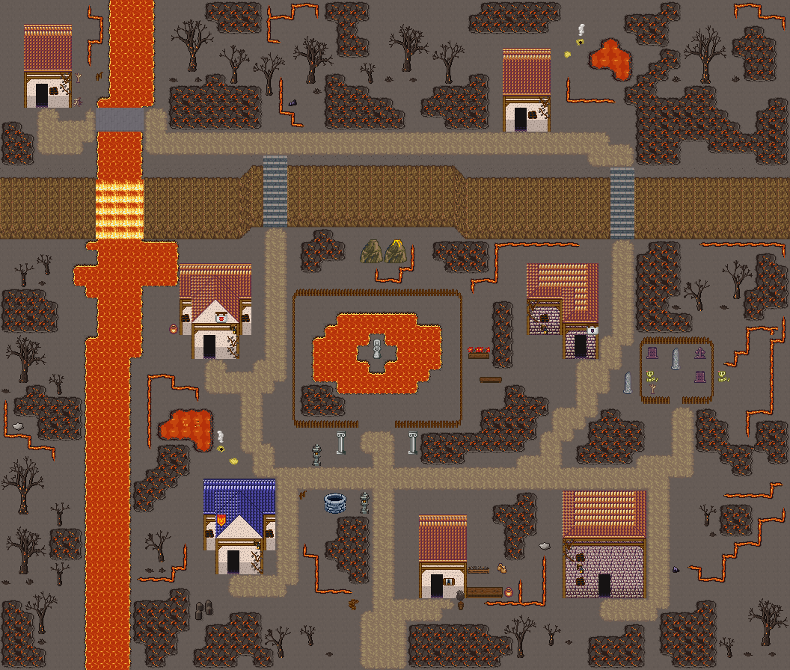

# 용암못 폐촌

울타리 친 못이 끓는 용암못이 된 폐촌. 빈 재밭에 작은 화산 봉우리 한 쌍(잠든 봉우리·분화하는 봉우리)이 솟고, 재밭은 식은 용암 판과 가지 친 용암 균열로 갈라졌다. 그을린 고목 덩이가 폐촌을 둘러싼다. 66×56, tilesetId=forest_harmony_volcano, 원본 숲마을 mistpond-hollow(tiledata/forest-villages/diverse). 입구 (31,52). 통행 검사 목표 [[3,9],[43,11],[17,30],[48,30],[19,48],[50,50],[36,50]].



## 기후 편집 (원본 숲마을 위에 한 것)
```json
[{"kind":"unflowered","cells":3,"bushes":3,"tiles":[348,288],"rule":"눈·재·모래에는 꽃이 피지 않는다: 덤불에 붙은 꽃은 같은 덤불(289)로, 나머지 꽃은 걷는다"},{"kind":"volcanic-peaks","x":30,"y":20,"w":4,"h":2,"upper":[[858,859,918,919],[888,889,948,949]]},{"kind":"bare-trees","forestCells":{"before":1375,"after":0},"clearedCells":1322,"orphanRocks":2,"grassCells":{"before":197,"after":0},"cliffExtended":48,"ledges":[],"forestPlugs":[],"palms":0,"groves":15,"trees":27,"placed":[{"x":1,"y":30,"band":true,"trees":[{"id":"big-3","x":0,"y":27},{"id":"small-3","x":4,"y":30}],"props":[{"tile":2909,"x":0,"y":32}],"grass":0},{"x":46,"y":54,"band":true,"trees":[{"id":"small-1","x":45,"y":51},{"id":"mid-2","x":42,"y":51}],"props":[{"tile":2938,"x":47,"y":53}],"grass":0},{"x":16,"y":3,"band":true,"trees":[{"id":"big-1","x":14,"y":1},{"id":"mid-1","x":18,"y":3}],"props":[{"tile":2909,"x":14,"y":6},{"tile":2908,"x":16,"y":6}],"grass":0},{"x":59,"y":5,"band":false,"trees":[{"id":"big-2","x":57,"y":2}],"props":[{"tile":2937,"x":56,"y":6},{"tile":2907,"x":61,"y":6}],"grass":0},{"x":1,"y":47,"band":true,"trees":[{"id":"big-3","x":0,"y":43},{"id":"small-2","x":4,"y":46}],"props":[{"tile":2907,"x":2,"y":48},{"tile":2909,"x":0,"y":48}],"grass":0},{"x":34,"y":2,"band":true,"trees":[{"id":"big-3","x":32,"y":1},{"id":"small-3","x":30,"y":4},{"id":"mid-2","x":36,"y":3}],"props":[{"tile":2938,"x":34,"y":6},{"tile":2937,"x":32,"y":6}],"grass":0},{"x":26,"y":3,"band":true,"trees":[{"id":"big-3","x":24,"y":2},{"id":"mid-2","x":21,"y":4}],"props":[{"tile":2937,"x":26,"y":7}],"grass":0},{"x":58,"y":43,"band":false,"trees":[{"id":"small-1","x":58,"y":41}],"props":[{"tile":2908,"x":59,"y":44}],"grass":0},{"x":58,"y":25,"band":false,"trees":[{"id":"mid-3","x":57,"y":22},{"id":"mid-1","x":60,"y":21}],"props":[{"tile":2909,"x":56,"y":25},{"tile":2909,"x":60,"y":25}],"grass":0},{"x":14,"y":47,"band":false,"trees":[{"id":"mid-3","x":12,"y":43}],"props":[{"tile":2908,"x":13,"y":47},{"tile":2909,"x":12,"y":47}],"grass":0},{"x":1,"y":39,"band":true,"trees":[{"id":"big-2","x":0,"y":38},{"id":"small-2","x":4,"y":41}],"props":[],"grass":0},{"x":4,"y":22,"band":true,"trees":[{"id":"small-3","x":3,"y":20},{"id":"small-2","x":1,"y":21}],"props":[{"tile":2938,"x":3,"y":23}],"grass":0},{"x":27,"y":55,"band":true,"trees":[{"id":"small-3","x":25,"y":51},{"id":"mid-3","x":22,"y":51}],"props":[{"tile":2938,"x":27,"y":54}],"grass":0},{"x":3,"y":55,"band":true,"trees":[{"id":"mid-2","x":2,"y":49}],"props":[{"tile":2937,"x":3,"y":53}],"grass":0},{"x":65,"y":55,"band":true,"trees":[{"id":"big-3","x":62,"y":49},{"id":"small-3","x":60,"y":52}],"props":[{"tile":2938,"x":64,"y":54},{"tile":2909,"x":62,"y":54}],"grass":0}],"rule":"잎 달린 숲·나무 도장(2550~2609·1200~1463·960~1123·289) → 맨땅; 잎 없는 나무(2880~, bare-trees:*) 덩이 — 가장자리 띠 8칸·안쪽 13칸 간격, 큰/중간 한 그루+곁나무 1~2+밑동 옆 바위·마른 덤불(사막 안쪽은 선인장); 집·길·문·계단·다리·울타리 2칸 밖; 물가 야자는 2~3그루 무리"},{"kind":"sheet","lavaCells":307,"basaltBridgeCells":8,"rule":"물 칸은 시트에서 용암으로 칠해져 있다(번호·통행 그대로)"},{"kind":"ground","pieces":{"pool":2,"fumarole":2,"sulfur":2,"crack":17,"basalt":1,"plate":40,"ash-heap":2,"obsidian":2},"cells":{"crack":169,"plate":706,"fumarole":4,"pool":28,"sulfur":2,"basalt":4,"obsidian":2,"ash-heap":2},"emptiness":{"before":{"maxSq":10,"screen":0.9},"after":{"maxSq":4,"screen":0.389}},"rule":"빈칸 게이트를 땅으로 넘긴다: 식은 용암 판(2×2 덩이, 3×3 이상)·용암 균열(1칸 폭 가지)·작은 용암 웅덩이 1~2(분기공·유황)·현무암 기둥 한 무리, 흑요석·재 더미는 균열 곁에만. 키큰 풀·바위 없음"}]
```

## 집 (원본 그대로)
```json
[{"id":"mistpond-hollow-house-1","role":"폐가","label":"폐가 · 왕궁 도시 · 주황 박공 회벽집 4×7 ②","x":2,"y":2,"w":4,"h":7,"front":{"x":3,"y":9}},{"id":"mistpond-hollow-house-2","role":"폐가","label":"폐가 · 왕궁 도시 · 주황 박공 회벽집 4×7 ②","x":42,"y":4,"w":4,"h":7,"front":{"x":43,"y":11}},{"id":"mistpond-hollow-house-3","role":"폐가","label":"폐가 · 왕궁 도시 · 주황 박공 회벽집 6×8","x":15,"y":22,"w":6,"h":8,"front":{"x":17,"y":30}},{"id":"mistpond-hollow-house-4","role":"폐가","label":"폐가 · 오렌지 회벽 l-mirror 집","x":44,"y":22,"w":6,"h":8,"front":{"x":48,"y":30}},{"id":"mistpond-hollow-house-5","role":"폐가","label":"폐가 · 왕궁 도시 · 파랑 박공 회벽집 6×8 ②","x":17,"y":40,"w":6,"h":8,"front":{"x":19,"y":48}},{"id":"mistpond-hollow-house-6","role":"폐가","label":"폐가 · 오렌지 회벽 2층 rect-2f 집","x":47,"y":41,"w":7,"h":9,"front":{"x":50,"y":50}},{"id":"mistpond-hollow-house-7","role":"못지기 집","label":"왕궁 도시 · 주황 박공 회벽집 4×7 ②","x":35,"y":43,"w":4,"h":7,"front":{"x":36,"y":50}}]
```

전체 두 레이어는 다음 배열 문서가 정답이다.
