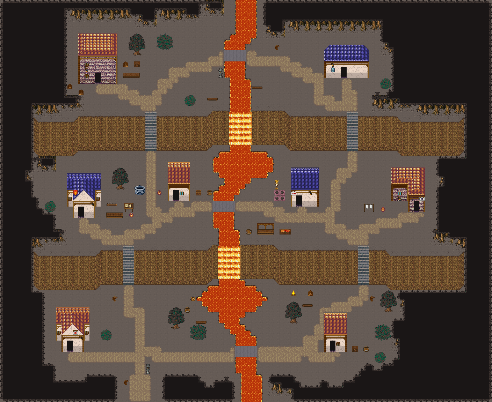

# 두 폭포 · 용암 강마을

용암 강이 마을 한가운데를 흐르다 두 줄 절벽에서 용암 폭포로 떨어진다. 단마다 현무암 다리가 두 강둑을 잇는다. 88×72, tilesetId=forest_harmony_volcano, 원본 숲마을 twin-falls-river-village(tiledata/forest-villages/diverse). 입구 (24,68). 통행 검사 목표 [[17,15],[61,14],[14,39],[31,36],[53,37],[74,38],[12,63],[59,63]].



## 기후 편집 (원본 숲마을 위에 한 것)
```json
[{"kind":"sheet","lavaCells":359,"basaltBridgeCells":24,"rule":"물 칸은 시트에서 용암으로 칠해져 있다(번호·통행 그대로)"}]
```

## 집 (원본 그대로)
```json
[{"id":"twin-falls-river-village-house-1","role":"목공 작업집","label":"오렌지 회벽 2층 rect-2f 집","x":14,"y":6,"w":7,"h":9,"front":{"x":17,"y":15}},{"id":"twin-falls-river-village-house-2","role":"주거","label":"파랑 석벽 rect-wide 집","x":58,"y":8,"w":8,"h":6,"front":{"x":61,"y":14}},{"id":"twin-falls-river-village-house-3","role":"약초 작업집","label":"왕궁 도시 · 파랑 박공 회벽집 6×8 ②","x":12,"y":31,"w":6,"h":8,"front":{"x":14,"y":39}},{"id":"twin-falls-river-village-house-4","role":"물자 보관집","label":"왕궁 도시 · 주황 박공 회벽집 4×7 ②","x":30,"y":29,"w":4,"h":7,"front":{"x":31,"y":36}},{"id":"twin-falls-river-village-house-5","role":"텃밭집","label":"왕궁 도시 · 파랑 회벽집 5×7","x":52,"y":30,"w":5,"h":7,"front":{"x":53,"y":37}},{"id":"twin-falls-river-village-house-6","role":"주거","label":"오렌지 회벽 l-mirror 집","x":70,"y":30,"w":6,"h":8,"front":{"x":74,"y":38}},{"id":"twin-falls-river-village-house-7","role":"밭집","label":"왕궁 도시 · 주황 박공 회벽집 6×8","x":10,"y":55,"w":6,"h":8,"front":{"x":12,"y":63}},{"id":"twin-falls-river-village-house-8","role":"물자 보관집","label":"왕궁 도시 · 주황 박공 회벽집 4×7 ②","x":58,"y":56,"w":4,"h":7,"front":{"x":59,"y":63}}]
```

전체 두 레이어는 다음 배열 문서가 정답이다.
