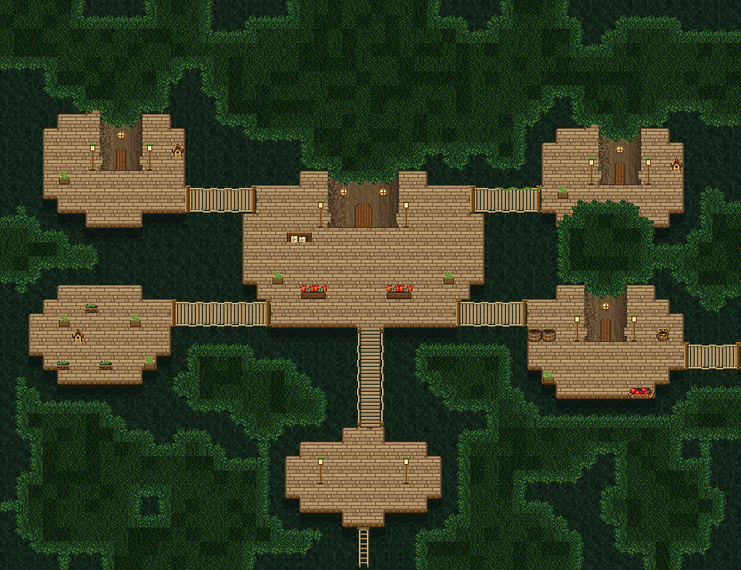

# 엘프 나무 위 마을 — 조립 순서

tilesetId=forest_harmony. 좌표는 0기준, 16px. 나무 위 마을 칸 **3131~3310**는 집 부품(3060~3130) 바로 뒤에 붙는 공용 이식이다 — 새 프로젝트와 기존 프로젝트 모두 불러올 때 자동으로 생긴다. 그림 원본은 scripts/content/elf-treetop.py.

## 순서
1. **깊은 숲 바닥** — 맵 전체 하위를 3288~3291 네 가지로 섞어 깐다(통행 불가). 나무 위에서 내려다본 먼 숲 바닥이다.
2. **데크** — 오토타일 `forest_harmony_treetop_deck_47`(3131~3177, 8방향 연결)로 둥근 덩이를 칠한다. 타원(가로 반지름 5~9, 세로 3~6)이 좋다. **한 줄·한 칸짜리 돌출은 지운다**(계단처럼 튀어나온 턱이 된다). 데크 가장자리 바깥은 투명이라 받침(깊은 숲 3288)이 비친다. 남쪽 가장자리엔 데크 두께(보)가 그려진다.
3. **데크 그늘** — 데크 남쪽 끝 바로 아래 깊은 숲 칸은 그늘 3292.
4. **밧줄 다리** — 가로는 2줄: 윗줄 3191(왼 기둥)·3192/3193(발판, 번갈아)·3194(오른 기둥), 아랫줄 3195·3196/3197·3198. 세로는 2칸 폭: 위 기둥 3199·3200, 발판 3201·3202 / 3203·3204, 아래 기둥 3205·3206. **다리 두 줄(두 칸) 모두 양쪽 데크에 닿아야 한다** — 짧은 줄은 데크를 채워 닿게 한다. 다리 연결 칸은 데크 오토타일에서 연결로 친다(가장자리 테두리가 다리 쪽으로 열린다).
5. **줄기 집** — 3칸 집 묶음 `treetop-trunk-house-3`(3×6, 3221~3238), 장로 나무 `treetop-trunk-house-5`(5×6, 3251~3270). 밑동 줄이 데크 위에 선다(밑동 뿌리 칸은 받침이 데크 몸통). 위 3줄은 **상위 굽이숲 수관**(`forest_harmony_grove_47`)으로 좌우 2칸씩 넓게 덮어, 줄기가 제 수관 속으로 들어가게 한다. 문은 가운데 칸, 문 앞 아래 두 칸은 비운다(문 이동 이벤트는 문 칸).
6. **수관** — 데크·다리·줄기가 없는 곳 상위에 굽이숲 수관을 반지름 3~5의 둥근 덩이로 겹쳐 올린다. **데크·다리 둘레 한 칸은 수관 없이 비워** 깊은 숲이 보이게 한다 — 이 틈이 높이를 만든다. 8방향이 모두 수관인 칸은 속 변형(얕음 2568·2597~2601, 깊음 2602~2607)을 섞는다.
7. **출구** — 입구 데크 남쪽 끝 바로 아래부터 맵 가장자리까지 밧줄 사다리: 위 3281, 가운데 3282(반복), 아래 끝 3283. 맨 아래 칸이 숲 바닥으로 가는 이동 칸. 다른 출구는 가로 밧줄 다리를 맵 가장자리까지 늘린다.
8. **소품**(데크 위에만, 주인 곁에만) — 요정 등불 기둥 3284(상위 등)/3285(하위 기둥)을 줄기 집 문 양옆과 입구 데크 양옆에. 이끼 화분 3287, 가로 다리 윗줄 위 잎 줄 3286. 숲마을 소품: 새집 2622, 약초 화분 2623·2624(정원), 과일 바구니 2628·2629(여관 앞), 꽃 화단 2616·2617(광장 길가), 게시판 2630·2631(장로 문 곁), 나무통 2638.

## 통행
- 데크·다리 발판·사다리: 통행 가능. 깊은 숲·줄기·수관: 통행 불가. 요정 등불·화분·게시판: 통행 불가.
- 수관이 데크 위를 덮는 칸(줄기 뒤)은 수관 때문에 막힌다 — 줄기 뒤 데크는 걸을 수 없는 배경으로 둔다.

## 금지
- 데크를 네모 판으로 깔지 않는다(나무 위가 아니라 마루가 된다). 수관을 한 덩어리 산울타리로 잇지 않는다.
- 데크 사이 깊은 숲 틈을 수관으로 다 메우지 않는다. 데크 위에 소품을 흩뿌리지 않는다(주인 없는 소품 금지).
- 줄기 집 밑동을 깊은 숲 위에 두지 않는다 — 반드시 데크 위.
