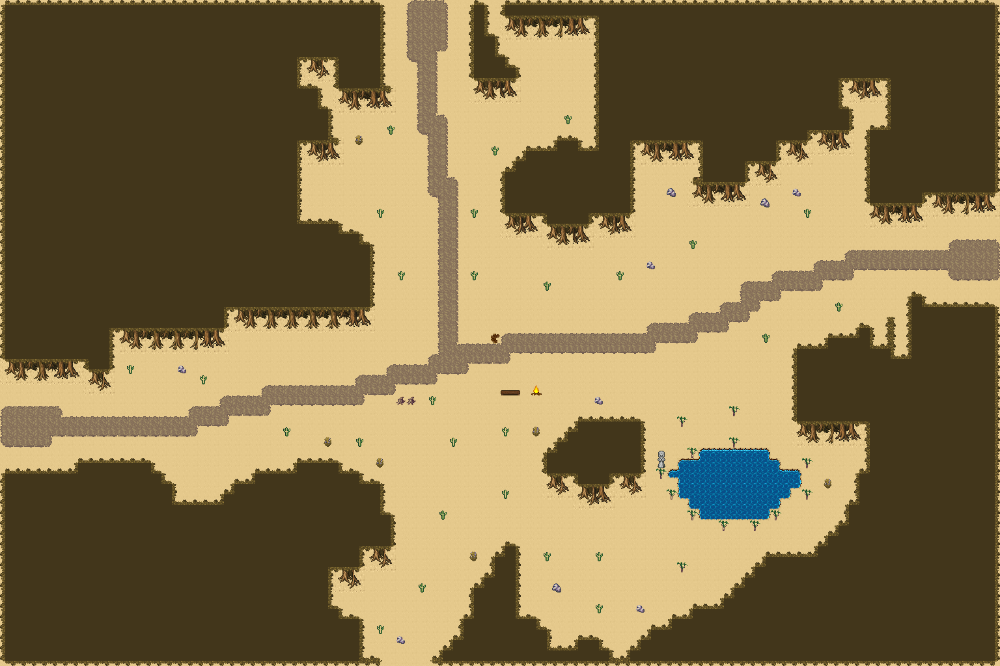

# 오아시스 세 갈래길

마른 덤불숲 사이 모래밭에서 길이 세 갈래로 갈린다. 남동쪽 오아시스 못가에 야자수가 둘러서고 모래밭에 선인장이 흩어져 있다. 96×64, tilesetId=forest_harmony_desert, 원본 숲마을 필드 field-forest-crossroads. 통행 검사 시작 (4,40).



## 출구 — 어느 마을로 이어지나
```json
[{"side":"west","at":40,"meets":"모래 물굽이 포구 서쪽 입구(0,33)","x":0,"y":40},{"side":"north","at":40,"meets":"사암 층바위 협곡마을 남쪽 입구(42,71)","x":40,"y":0},{"side":"east","at":24,"meets":"다음 필드","x":95,"y":24}]
```

## 지형
```json
{"cliffs":[],"stairs":[],"river":null,"bridges":[],"falls":null,"ponds":[[70,46,6,3.6]],"cave":null,"groves":[[30,49,9.6,5.6],[58,43,8,4.8],[30,26,8,5.6],[54,18,8,4.8],[80,37,8,4.8],[16,28,8,4.8]]}
```

## 기후 편집 (숲 필드 위에 한 것)
```json
[{"kind":"desert","replacedTrees":18,"plants":41,"rule":"나무 덩이 → 발치에 야자(물 5칸 안)·선인장(큰 나무는 바위 하나 더), 물가 야자, 빈 모래밭 선인장"},{"kind":"desert-plant","x":48,"y":47,"tile":769,"why":"replaces 숲 나무 · 작은 덤불"},{"kind":"desert-plant","x":65,"y":54,"tile":770,"why":"replaces 숲 나무 · 둥근 덤불"},{"kind":"desert-plant","x":65,"y":40,"tile":770,"why":"replaces 숲 나무 · 둥근 덤불"},{"kind":"desert-plant","x":40,"y":56,"tile":769,"why":"replaces 숲 나무 · 작은 덤불"},{"kind":"desert-plant","x":43,"y":42,"tile":769,"why":"replaces 숲 나무 · 둥근 덤불"},{"kind":"desert-plant","x":54,"y":11,"tile":769,"why":"replaces 숲 나무 · 작은 덤불"},{"kind":"desert-plant","x":57,"y":53,"tile":769,"why":"replaces 숲 나무 · 작은 덤불"},{"kind":"desert-plant","x":52,"y":27,"tile":769,"why":"replaces 숲 나무 · 작은 덤불"},{"kind":"desert-plant","x":66,"y":23,"tile":769,"why":"replaces 숲 나무 · 작은 덤불"},{"kind":"desert-plant","x":36,"y":20,"tile":769,"why":"replaces 숲 나무 · 둥근 덤불"},{"kind":"desert-plant","x":77,"y":20,"tile":769,"why":"replaces 숲 나무 · 활엽수"},{"kind":"desert-plant","x":76,"y":18,"tile":537,"why":"replaces 숲 나무 · 활엽수"},{"kind":"desert-plant","x":42,"y":49,"tile":769,"why":"replaces 숲 나무 · 둥근 덤불"},{"kind":"desert-plant","x":70,"y":39,"tile":770,"why":"replaces 숲 나무 · 작은 덤불"},{"kind":"desert-plant","x":59,"y":26,"tile":769,"why":"replaces 숲 나무 · 작은 덤불"},{"kind":"desert-plant","x":38,"y":26,"tile":769,"why":"replaces 숲 나무 · 작은 덤불"},{"kind":"desert-plant","x":57,"y":58,"tile":769,"why":"replaces 숲 나무 · 작은 덤불"},{"kind":"desert-plant","x":52,"y":53,"tile":769,"why":"replaces 숲 나무 · 작은 덤불"},{"kind":"desert-plant","x":48,"y":41,"tile":769,"why":"replaces 숲 나무 · 작은 덤불"},{"kind":"desert-plant","x":72,"y":50,"tile":770,"why":"shore"},{"kind":"desert-plant","x":70,"y":42,"tile":770,"why":"shore"},{"kind":"desert-plant","x":66,"y":43,"tile":770,"why":"shore"},{"kind":"desert-plant","x":63,"y":45,"tile":770,"why":"shore"},{"kind":"desert-plant","x":77,"y":47,"tile":770,"why":"shore"},{"kind":"desert-plant","x":74,"y":49,"tile":770,"why":"shore"},{"kind":"desert-plant","x":77,"y":44,"tile":770,"why":"shore"},{"kind":"desert-plant","x":66,"y":49,"tile":770,"why":"shore"},{"kind":"desert-plant","x":64,"y":47,"tile":770,"why":"shore"},{"kind":"desert-plant","x":69,"y":50,"tile":770,"why":"shore"},{"kind":"desert-plant","x":73,"y":32,"tile":769,"why":"open sand"},{"kind":"desert-plant","x":19,"y":36,"tile":769,"why":"open sand"},{"kind":"desert-plant","x":27,"y":41,"tile":769,"why":"open sand"},{"kind":"desert-plant","x":37,"y":12,"tile":769,"why":"open sand"},{"kind":"desert-plant","x":45,"y":20,"tile":769,"why":"open sand"},{"kind":"desert-plant","x":34,"y":42,"tile":769,"why":"open sand"},{"kind":"desert-plant","x":47,"y":14,"tile":769,"why":"open sand"},{"kind":"desert-plant","x":45,"y":26,"tile":769,"why":"open sand"},{"kind":"desert-plant","x":80,"y":29,"tile":769,"why":"open sand"},{"kind":"desert-plant","x":12,"y":35,"tile":769,"why":"open sand"},{"kind":"desert-plant","x":41,"y":38,"tile":769,"why":"open sand"},{"kind":"desert-plant","x":36,"y":60,"tile":769,"why":"open sand"}]
```
## 소품과 장식
```json
[{"name":"나무 이정표","kind":"prop","x":47,"y":32,"w":1,"h":1,"upper":[596]},{"name":"벤치","kind":"prop","x":48,"y":37,"w":2,"h":1,"upper":[327,328]},{"name":"통나무 더미","kind":"prop","x":38,"y":38,"w":1,"h":1,"upper":[741]},{"name":"통나무 더미","kind":"prop","x":39,"y":38,"w":1,"h":1,"upper":[741]},{"name":"모닥불","kind":"prop","x":51,"y":37,"w":1,"h":1,"upper":[381]},{"name":"돌 석상","kind":"prop","x":63,"y":43,"w":1,"h":2,"upper":[266,296]},{"name":"돌 무더기","kind":"dressing","x":53,"y":56,"w":1,"h":1,"upper":[29]},{"name":"돌 무더기","kind":"dressing","x":64,"y":18,"w":1,"h":1,"upper":[29]},{"name":"돌 무더기","kind":"dressing","x":73,"y":19,"w":1,"h":1,"upper":[29]},{"name":"회백색 바위 더미","kind":"dressing","x":17,"y":35,"w":1,"h":1,"upper":[537]},{"name":"회백색 바위 더미","kind":"dressing","x":38,"y":61,"w":1,"h":1,"upper":[537]},{"name":"회백색 바위 더미","kind":"dressing","x":62,"y":25,"w":1,"h":1,"upper":[537]},{"name":"회백색 바위 더미","kind":"dressing","x":57,"y":38,"w":1,"h":1,"upper":[537]},{"name":"회백색 바위 더미","kind":"dressing","x":61,"y":58,"w":1,"h":1,"upper":[537]},{"name":"꽃 둥근 관목","kind":"dressing","x":79,"y":46,"w":1,"h":1,"upper":[768]},{"name":"꽃 둥근 관목","kind":"dressing","x":34,"y":13,"w":1,"h":1,"upper":[768]},{"name":"꽃 둥근 관목","kind":"dressing","x":36,"y":44,"w":1,"h":1,"upper":[768]},{"name":"꽃 둥근 관목","kind":"dressing","x":51,"y":41,"w":1,"h":1,"upper":[768]},{"name":"꽃 둥근 관목","kind":"dressing","x":45,"y":53,"w":1,"h":1,"upper":[768]},{"name":"꽃 둥근 관목","kind":"dressing","x":31,"y":42,"w":1,"h":1,"upper":[768]}]
```

## 나무 도장
```json
[]
```

전체 두 레이어는 다음 배열 문서가 정답이다.
