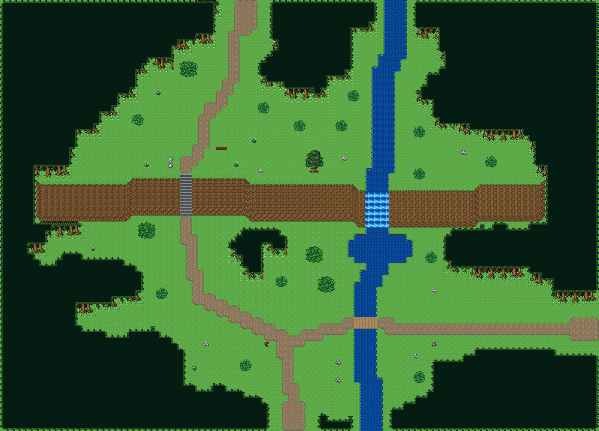

# 여울 건너 벼랑길

숲을 가로지르는 한 줄 절벽 위아래로 길이 나 있다. 북쪽 숲에서 나온 여울이 절벽을 폭포로 넘고, 아랫단 길은 나무다리로 여울을 건너며 계단으로 윗단에 오른다. 100×72, tilesetId=forest_harmony. 통행 검사 시작 (48,67).



## 출구 — 어느 마을로 이어지나
```json
[{"side":"south","at":48,"meets":"여울성 나루 남쪽 입구(48,91)","x":48,"y":71},{"side":"east","at":54,"meets":"다음 필드","x":99,"y":54},{"side":"north","at":40,"meets":"종탑 언덕 교구마을 남쪽 입구(40,63)","x":40,"y":0}]
```

## 지형
```json
{"cliffs":[{"points":[[6,30],[20,30],[22,29],[40,29],[42,30],[58,30],[60,31],[78,31],[80,30],[90,30]],"height":6}],"stairs":[{"x":30,"y":29,"height":6}],"river":{"width":4,"pools":[[63,41,5.5,3.2]],"points":[[66,0],[66,8],[64,12],[64,24],[63,31],[63,44],[61,48],[61,60],[62,66],[62,71]]},"bridges":[{"x":59,"y":53,"w":4,"h":2}],"falls":{"columns":[61,62,63,64],"rimY":31,"tile":2700},"ponds":[],"cave":null,"groves":[[44,42,8,5.6],[18,47,8,4.8],[80,42,8,4.8],[50,12,8,4.8],[80,18,8,4.8],[24,60,8,4.8]]}
```

## 소품과 장식
```json
[{"name":"나무 이정표","kind":"prop","x":44,"y":57,"w":1,"h":1,"upper":[596]},{"name":"돌 석상","kind":"prop","x":28,"y":26,"w":1,"h":2,"upper":[266,296]},{"name":"통나무 더미","kind":"prop","x":72,"y":57,"w":1,"h":1,"upper":[741]},{"name":"벤치","kind":"prop","x":36,"y":24,"w":2,"h":1,"upper":[327,328]},{"name":"돌 무더기","kind":"dressing","x":56,"y":63,"w":1,"h":1,"upper":[29]},{"name":"돌 무더기","kind":"dressing","x":56,"y":60,"w":1,"h":1,"upper":[29]},{"name":"돌 무더기","kind":"dressing","x":77,"y":25,"w":1,"h":1,"upper":[29]},{"name":"회백색 바위 더미","kind":"dressing","x":57,"y":26,"w":1,"h":1,"upper":[537]},{"name":"회백색 바위 더미","kind":"dressing","x":72,"y":48,"w":1,"h":1,"upper":[537]},{"name":"회백색 바위 더미","kind":"dressing","x":34,"y":57,"w":1,"h":1,"upper":[537]},{"name":"회백색 바위 더미","kind":"dressing","x":69,"y":59,"w":1,"h":1,"upper":[537]},{"name":"회백색 바위 더미","kind":"dressing","x":43,"y":28,"w":1,"h":1,"upper":[537]},{"name":"꽃 둥근 관목","kind":"dressing","x":32,"y":61,"w":1,"h":1,"upper":[768]},{"name":"꽃 둥근 관목","kind":"dressing","x":24,"y":27,"w":1,"h":1,"upper":[768]},{"name":"꽃 둥근 관목","kind":"dressing","x":15,"y":41,"w":1,"h":1,"upper":[768]},{"name":"꽃 둥근 관목","kind":"dressing","x":42,"y":23,"w":1,"h":1,"upper":[768]},{"name":"꽃 둥근 관목","kind":"dressing","x":26,"y":15,"w":1,"h":1,"upper":[768]},{"name":"꽃 둥근 관목","kind":"dressing","x":39,"y":27,"w":1,"h":1,"upper":[768]}]
```

## 나무 도장
```json
[{"name":"숲 나무 · 작은 덤불","x":43,"y":17,"w":2,"h":2},{"name":"숲 나무 · 둥근 덤불","x":53,"y":46,"w":3,"h":3},{"name":"숲 나무 · 작은 덤불","x":81,"y":26,"w":2,"h":2},{"name":"숲 나무 · 작은 덤불","x":22,"y":19,"w":2,"h":2},{"name":"숲 나무 · 작은 덤불","x":58,"y":15,"w":2,"h":2},{"name":"숲 나무 · 둥근 덤불","x":23,"y":37,"w":3,"h":3},{"name":"숲 나무 · 작은 덤불","x":69,"y":21,"w":2,"h":2},{"name":"숲 나무 · 작은 덤불","x":49,"y":20,"w":2,"h":2},{"name":"숲 나무 · 작은 덤불","x":40,"y":60,"w":2,"h":2},{"name":"숲 나무 · 활엽수","x":51,"y":25,"w":3,"h":4},{"name":"숲 나무 · 작은 덤불","x":69,"y":28,"w":2,"h":2},{"name":"숲 나무 · 작은 덤불","x":69,"y":62,"w":2,"h":2},{"name":"숲 나무 · 작은 덤불","x":26,"y":48,"w":2,"h":2},{"name":"숲 나무 · 둥근 덤불","x":51,"y":41,"w":3,"h":3},{"name":"숲 나무 · 둥근 덤불","x":30,"y":10,"w":3,"h":3},{"name":"숲 나무 · 작은 덤불","x":56,"y":20,"w":2,"h":2},{"name":"숲 나무 · 작은 덤불","x":46,"y":46,"w":2,"h":2},{"name":"숲 나무 · 작은 덤불","x":71,"y":42,"w":2,"h":2}]
```

전체 두 레이어는 다음 배열 문서가 정답이다.
