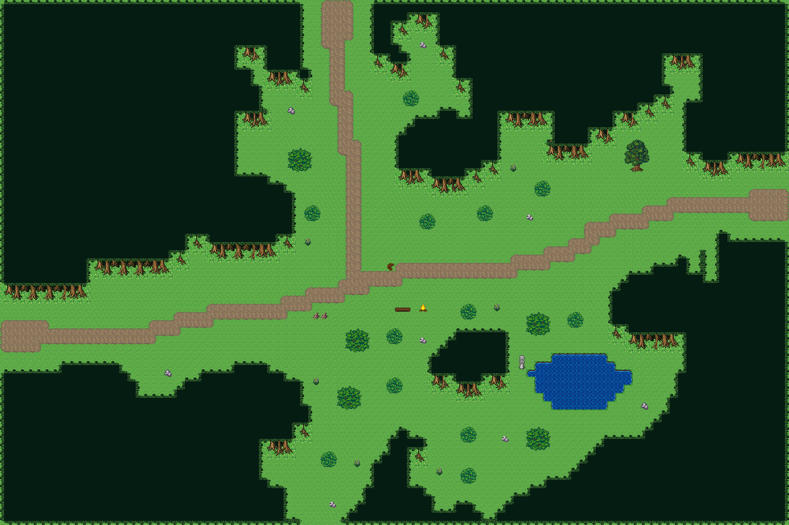

# 숲속 세 갈래길

서쪽에서 들어온 흙길이 숲 사이 빈터에서 북쪽 길과 동쪽 길로 갈라진다. 갈림길에 이정표와 쉼터, 남동쪽 풀밭에 작은 못이 있다. 96×64, tilesetId=forest_harmony. 통행 검사 시작 (4,40).



## 출구 — 어느 마을로 이어지나
```json
[{"side":"west","at":40,"meets":"갈대물굽이 포구 서쪽 입구(0,33)","x":0,"y":40},{"side":"north","at":40,"meets":"솔바람 흩어진 산촌 남쪽 입구(40,63)","x":40,"y":0},{"side":"east","at":24,"meets":"다음 필드","x":95,"y":24}]
```

## 지형
```json
{"cliffs":[],"stairs":[],"river":null,"bridges":[],"falls":null,"ponds":[[70,46,6,3.6]],"cave":null,"groves":[[30,49,9.6,5.6],[58,43,8,4.8],[30,26,8,5.6],[54,18,8,4.8],[80,37,8,4.8],[16,28,8,4.8]]}
```

## 소품과 장식
```json
[{"name":"나무 이정표","kind":"prop","x":47,"y":32,"w":1,"h":1,"upper":[596]},{"name":"벤치","kind":"prop","x":48,"y":37,"w":2,"h":1,"upper":[327,328]},{"name":"통나무 더미","kind":"prop","x":38,"y":38,"w":1,"h":1,"upper":[741]},{"name":"통나무 더미","kind":"prop","x":39,"y":38,"w":1,"h":1,"upper":[741]},{"name":"모닥불","kind":"prop","x":51,"y":37,"w":1,"h":1,"upper":[381]},{"name":"돌 석상","kind":"prop","x":63,"y":43,"w":1,"h":2,"upper":[266,296]},{"name":"돌 무더기","kind":"dressing","x":78,"y":49,"w":1,"h":1,"upper":[29]},{"name":"돌 무더기","kind":"dressing","x":35,"y":13,"w":1,"h":1,"upper":[29]},{"name":"돌 무더기","kind":"dressing","x":20,"y":45,"w":1,"h":1,"upper":[29]},{"name":"회백색 바위 더미","kind":"dressing","x":64,"y":26,"w":1,"h":1,"upper":[537]},{"name":"회백색 바위 더미","kind":"dressing","x":40,"y":61,"w":1,"h":1,"upper":[537]},{"name":"회백색 바위 더미","kind":"dressing","x":51,"y":5,"w":1,"h":1,"upper":[537]},{"name":"회백색 바위 더미","kind":"dressing","x":51,"y":41,"w":1,"h":1,"upper":[537]},{"name":"회백색 바위 더미","kind":"dressing","x":61,"y":53,"w":1,"h":1,"upper":[537]},{"name":"꽃 둥근 관목","kind":"dressing","x":38,"y":46,"w":1,"h":1,"upper":[768]},{"name":"꽃 둥근 관목","kind":"dressing","x":43,"y":56,"w":1,"h":1,"upper":[768]},{"name":"꽃 둥근 관목","kind":"dressing","x":60,"y":37,"w":1,"h":1,"upper":[768]},{"name":"꽃 둥근 관목","kind":"dressing","x":37,"y":29,"w":1,"h":1,"upper":[768]},{"name":"꽃 둥근 관목","kind":"dressing","x":53,"y":57,"w":1,"h":1,"upper":[768]},{"name":"꽃 둥근 관목","kind":"dressing","x":62,"y":20,"w":1,"h":1,"upper":[768]}]
```

## 나무 도장
```json
[{"name":"숲 나무 · 작은 덤불","x":47,"y":46,"w":2,"h":2},{"name":"숲 나무 · 둥근 덤불","x":64,"y":52,"w":3,"h":3},{"name":"숲 나무 · 둥근 덤불","x":64,"y":38,"w":3,"h":3},{"name":"숲 나무 · 작은 덤불","x":39,"y":55,"w":2,"h":2},{"name":"숲 나무 · 둥근 덤불","x":42,"y":40,"w":3,"h":3},{"name":"숲 나무 · 작은 덤불","x":56,"y":52,"w":2,"h":2},{"name":"숲 나무 · 작은 덤불","x":51,"y":26,"w":2,"h":2},{"name":"숲 나무 · 작은 덤불","x":65,"y":22,"w":2,"h":2},{"name":"숲 나무 · 둥근 덤불","x":35,"y":18,"w":3,"h":3},{"name":"숲 나무 · 활엽수","x":76,"y":17,"w":3,"h":4},{"name":"숲 나무 · 둥근 덤불","x":41,"y":47,"w":3,"h":3},{"name":"숲 나무 · 작은 덤불","x":69,"y":38,"w":2,"h":2},{"name":"숲 나무 · 작은 덤불","x":58,"y":25,"w":2,"h":2},{"name":"숲 나무 · 작은 덤불","x":37,"y":25,"w":2,"h":2},{"name":"숲 나무 · 작은 덤불","x":56,"y":57,"w":2,"h":2},{"name":"숲 나무 · 작은 덤불","x":47,"y":40,"w":2,"h":2},{"name":"숲 나무 · 작은 덤불","x":56,"y":37,"w":2,"h":2},{"name":"숲 나무 · 작은 덤불","x":49,"y":11,"w":2,"h":2}]
```

전체 두 레이어는 다음 배열 문서가 정답이다.
