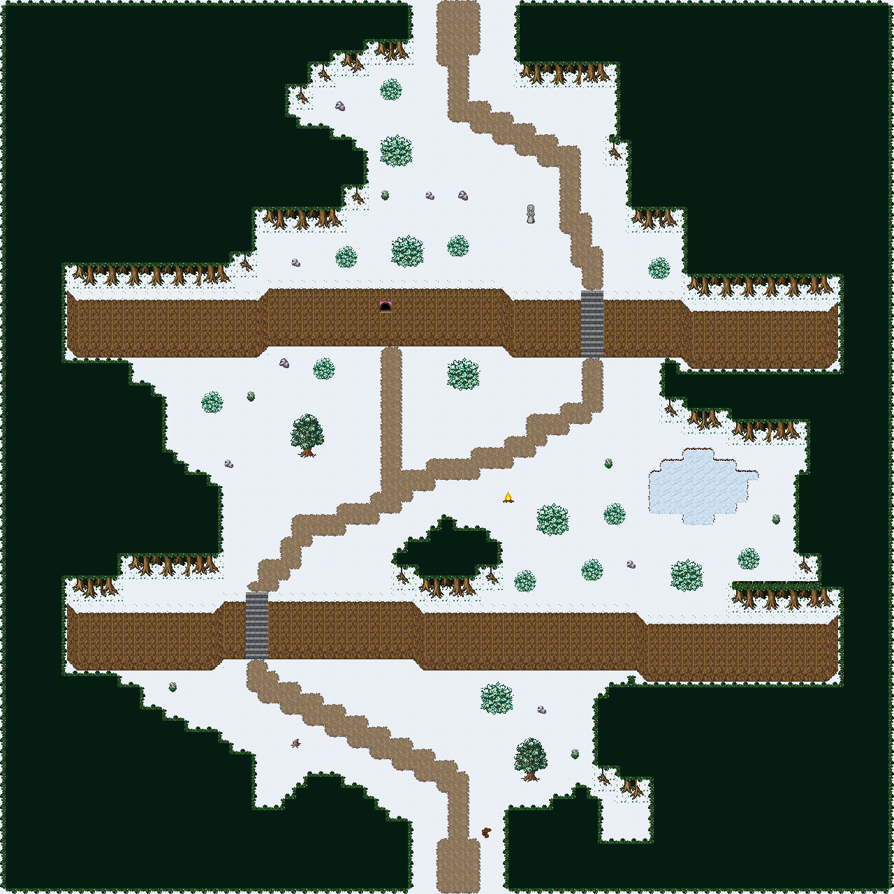

# 눈 덮인 두 단 고갯길

눈 덮인 절벽 두 줄을 계단 두 곳으로 오르는 고갯길. 가운뎃단의 못이 얼어 걸어서 건널 수 있고, 윗단 절벽에 동굴 입구가 있다. 80×80, tilesetId=forest_harmony_snow, 원본 숲마을 필드 field-two-step-pass. 통행 검사 시작 (40,75).



## 출구 — 어느 마을로 이어지나
```json
[{"side":"south","at":40,"meets":"필드 남쪽","x":40,"y":79},{"side":"north","at":40,"meets":"얼어붙은 안개못 남쪽 입구(40,63)","x":40,"y":0}]
```

## 지형
```json
{"cliffs":[{"points":[[6,54],[18,54],[20,53],[36,53],[38,54],[56,54],[58,55],[74,55]],"height":5},{"points":[[6,26],[22,26],[24,25],[44,25],[46,26],[60,26],[62,27],[74,27]],"height":5}],"stairs":[{"x":22,"y":53,"height":5},{"x":52,"y":26,"height":5}],"river":null,"bridges":[],"falls":null,"ponds":[[62,43,5,3.2]],"cave":[34,27],"groves":[[60,65,8,5.6],[15,46,8,4.8],[62,15,8,4.8],[26,15,8,4.8],[40,49,8,4.8],[66,34,8,4.8]]}
```

## 기후 편집 (숲 필드 위에 한 것)
```json
[{"kind":"freeze","pond":[62,43,5,3.2],"swappedTiles":49,"rule":"물 칸 t → 얼음 칸 ice[t] (sheets.json snow.ice)"}]
```
## 소품과 장식
```json
[{"name":"나무 이정표","kind":"prop","x":43,"y":74,"w":1,"h":1,"upper":[596]},{"name":"통나무 더미","kind":"prop","x":26,"y":66,"w":1,"h":1,"upper":[741]},{"name":"돌 석상","kind":"prop","x":47,"y":18,"w":1,"h":2,"upper":[266,296]},{"name":"모닥불","kind":"prop","x":45,"y":44,"w":1,"h":1,"upper":[381]},{"name":"돌 무더기","kind":"dressing","x":30,"y":9,"w":1,"h":1,"upper":[29]},{"name":"돌 무더기","kind":"dressing","x":41,"y":17,"w":1,"h":1,"upper":[29]},{"name":"돌 무더기","kind":"dressing","x":25,"y":32,"w":1,"h":1,"upper":[29]},{"name":"회백색 바위 더미","kind":"dressing","x":48,"y":63,"w":1,"h":1,"upper":[537]},{"name":"회백색 바위 더미","kind":"dressing","x":20,"y":41,"w":1,"h":1,"upper":[537]},{"name":"회백색 바위 더미","kind":"dressing","x":56,"y":50,"w":1,"h":1,"upper":[537]},{"name":"회백색 바위 더미","kind":"dressing","x":26,"y":23,"w":1,"h":1,"upper":[537]},{"name":"회백색 바위 더미","kind":"dressing","x":38,"y":17,"w":1,"h":1,"upper":[537]},{"name":"꽃 둥근 관목","kind":"dressing","x":34,"y":17,"w":1,"h":1,"upper":[768]},{"name":"꽃 둥근 관목","kind":"dressing","x":15,"y":61,"w":1,"h":1,"upper":[768]},{"name":"꽃 둥근 관목","kind":"dressing","x":54,"y":41,"w":1,"h":1,"upper":[768]},{"name":"꽃 둥근 관목","kind":"dressing","x":51,"y":67,"w":1,"h":1,"upper":[768]},{"name":"꽃 둥근 관목","kind":"dressing","x":22,"y":35,"w":1,"h":1,"upper":[768]},{"name":"꽃 둥근 관목","kind":"dressing","x":69,"y":46,"w":1,"h":1,"upper":[768]}]
```

## 나무 도장
```json
[{"name":"숲 나무 · 작은 덤불","x":18,"y":35,"w":2,"h":2},{"name":"숲 나무 · 작은 덤불","x":34,"y":7,"w":2,"h":2},{"name":"숲 나무 · 둥근 덤불","x":43,"y":61,"w":3,"h":3},{"name":"숲 나무 · 작은 덤불","x":52,"y":50,"w":2,"h":2},{"name":"숲 나무 · 둥근 덤불","x":35,"y":21,"w":3,"h":3},{"name":"숲 나무 · 작은 덤불","x":40,"y":21,"w":2,"h":2},{"name":"숲 나무 · 둥근 덤불","x":60,"y":50,"w":3,"h":3},{"name":"숲 나무 · 작은 덤불","x":28,"y":32,"w":2,"h":2},{"name":"숲 나무 · 활엽수","x":46,"y":66,"w":3,"h":4},{"name":"숲 나무 · 활엽수","x":26,"y":37,"w":3,"h":4},{"name":"숲 나무 · 작은 덤불","x":54,"y":45,"w":2,"h":2},{"name":"숲 나무 · 둥근 덤불","x":40,"y":32,"w":3,"h":3},{"name":"숲 나무 · 작은 덤불","x":46,"y":51,"w":2,"h":2},{"name":"숲 나무 · 둥근 덤불","x":34,"y":12,"w":3,"h":3},{"name":"숲 나무 · 작은 덤불","x":66,"y":49,"w":2,"h":2},{"name":"숲 나무 · 둥근 덤불","x":48,"y":45,"w":3,"h":3},{"name":"숲 나무 · 작은 덤불","x":30,"y":22,"w":2,"h":2},{"name":"숲 나무 · 작은 덤불","x":58,"y":23,"w":2,"h":2}]
```

전체 두 레이어는 다음 배열 문서가 정답이다.
