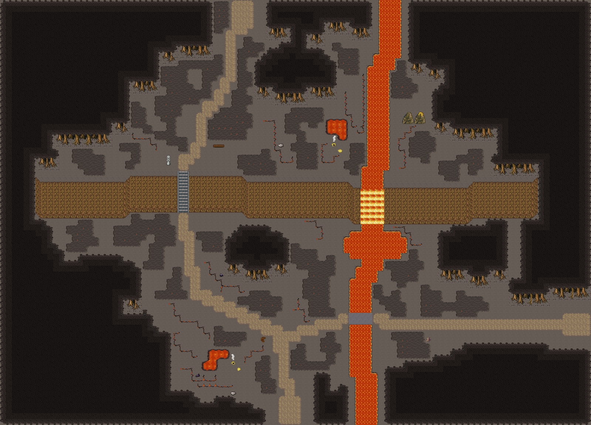

# 용암 강 벼랑길

재 덮인 절벽 위아래로 난 길. 북쪽에서 흘러온 용암 강이 절벽을 용암 폭포로 넘고, 아랫단 길은 현무암 다리로 건넌다. 빈 재밭은 식은 용암 판과 가지 친 용암 균열로 덮이고, 분기공이 김을 뿜는 작은 용암 웅덩이와 화산 봉우리 한 쌍이 있다. 100×72, tilesetId=forest_harmony_volcano, 원본 숲마을 필드 field-ford-cliff-road. 통행 검사 시작 (48,67).



## 출구 — 어느 마을로 이어지나
```json
[{"side":"south","at":48,"meets":"잿빛 여울성 남쪽 입구(48,91)","x":48,"y":71},{"side":"east","at":54,"meets":"다음 필드","x":99,"y":54},{"side":"north","at":40,"meets":"용암못 폐촌 남쪽 입구(40,63)","x":40,"y":0}]
```

## 지형
```json
{"cliffs":[{"points":[[6,30],[20,30],[22,29],[40,29],[42,30],[58,30],[60,31],[78,31],[80,30],[90,30]],"height":6}],"stairs":[{"x":30,"y":29,"height":6}],"river":{"width":4,"pools":[[63,41,5.5,3.2]],"points":[[66,0],[66,8],[64,12],[64,24],[63,31],[63,44],[61,48],[61,60],[62,66],[62,71]]},"bridges":[{"x":59,"y":53,"w":4,"h":2}],"falls":{"columns":[61,62,63,64],"rimY":31,"tile":2700},"ponds":[],"cave":null,"groves":[[44,42,8,5.6],[18,47,8,4.8],[80,42,8,4.8],[50,12,8,4.8],[80,18,8,4.8],[24,60,8,4.8]]}
```

## 기후 편집 (숲 필드 위에 한 것)
```json
[{"kind":"volcanic-peaks","x":68,"y":19,"w":4,"h":2,"upper":[[858,859,918,919],[888,889,948,949]]},{"kind":"ground","clearedCells":127,"pieces":{"pool":2,"fumarole":2,"sulfur":2,"crack":15,"plate":42,"ash-heap":2,"obsidian":2},"cells":{"plate":903,"crack":153,"pool":28,"fumarole":4,"sulfur":2,"ash-heap":2,"obsidian":2},"emptiness":{"maxSq":4,"screen":0.457},"rule":"흩은 바위·꽃 관목과 잎 달린 덤불을 걷고, 빈칸 게이트(필드 ≤5·≤50%)를 땅으로 넘긴다: 식은 용암 판·용암 균열·작은 용암 웅덩이(분기공·유황)·현무암 기둥 한 무리"},{"kind":"sheet","lavaCells":325,"basaltBridgeCells":8,"rule":"물 칸은 시트에서 용암으로 칠해져 있다(번호·통행 그대로)"}]
```
## 소품과 장식
```json
[{"name":"나무 이정표","kind":"prop","x":44,"y":57,"w":1,"h":1,"upper":[596]},{"name":"돌 석상","kind":"prop","x":28,"y":26,"w":1,"h":2,"upper":[266,296]},{"name":"통나무 더미","kind":"prop","x":72,"y":57,"w":1,"h":1,"upper":[741]},{"name":"벤치","kind":"prop","x":36,"y":24,"w":2,"h":1,"upper":[327,328]}]
```

## 나무 도장
```json
[]
```

전체 두 레이어는 다음 배열 문서가 정답이다.
