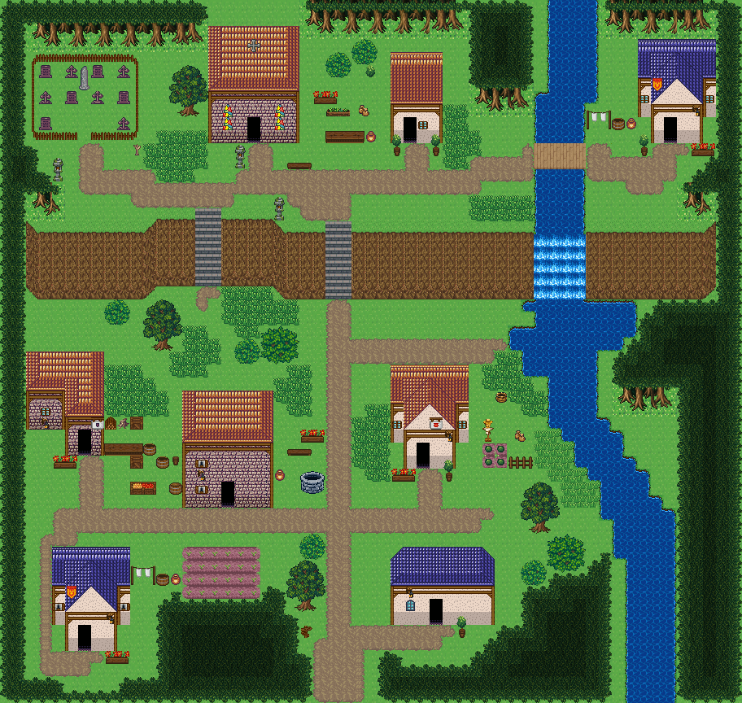

# 종탑 언덕 교구마을

윗단 언덕에 스테인드글라스 교회와 울타리 친 외곽 묘지가 있고, 북쪽에서 온 강이 절벽을 폭포로 넘어 아랫마을을 가로지른다. 시작점 (25,50); 집 7채. 0기준 맵 좌표. 모든 집은 고정 조각이며 회전/잘라내기 금지. cliffs.points는 x가 증가하는 절벽 윗선 꼭짓점, height는 윗선→밑단의 y 차이다. stairs=[x,y,height]는 폭2, 윗선 행 y부터 y+height까지이고 양끝 착지칸은 y-1/y+height+1이다. 이전 plateaus 윤곽은 사용하지 않는다. 몸통·지붕·소품 전체 배열은 다음 부품 문서와 연결한다.



## 랜드마크
```json
[
  {
    "id": "chapel-hill-parish-church",
    "kind": "church",
    "label": "돌벽 교회",
    "x": 16,
    "y": 2,
    "w": 7,
    "h": 9,
    "doors": [
      {
        "x": 19,
        "y": 10
      }
    ]
  },
  {
    "id": "chapel-hill-parish-graveyard",
    "kind": "graveyard",
    "label": "마을 외곽 묘지",
    "x": 2,
    "y": 4,
    "w": 9,
    "h": 7,
    "gate": {
      "x": 6,
      "y": 10,
      "w": 1
    }
  }
]
```


## 입력 계획과 예약할 접근칸
```json
{
  "mapId": "chapel-hill-parish",
  "width": 57,
  "height": 54,
  "seed": 811,
  "start": {
    "x": 25,
    "y": 50
  },
  "yards": [
    {
      "ownerId": "chapel-hill-parish-house-1",
      "kit": "herbs",
      "name": "약초 손질",
      "reason": "교회 옆 사제관에서 제단에 올릴 약초를 기른다",
      "x": 25,
      "y": 8,
      "side": "left",
      "w": 4,
      "h": 3
    },
    {
      "ownerId": "chapel-hill-parish-house-2",
      "kit": "laundry",
      "name": "세탁·건조",
      "reason": "윗단 강 건너 집은 세탁 마당만 둔다",
      "x": 45,
      "y": 8,
      "side": "left",
      "w": 4,
      "h": 2
    },
    {
      "ownerId": "chapel-hill-parish-house-3",
      "kit": "woodwork",
      "name": "목재 가공",
      "reason": "아랫마을 서쪽 목수집이 교회 의자와 관을 짠다",
      "x": 8,
      "y": 32,
      "side": "right",
      "w": 4,
      "h": 3
    },
    {
      "ownerId": "chapel-hill-parish-house-4",
      "kit": "storage",
      "name": "물자 보관",
      "reason": "종지기가 초와 종 밧줄을 보관한다",
      "x": 10,
      "y": 35,
      "side": "left",
      "w": 4,
      "h": 3
    },
    {
      "ownerId": "chapel-hill-parish-house-5",
      "kit": "growing",
      "name": "텃밭 돌보기",
      "reason": "폭포 아래 강둑 평지를 가족 텃밭으로 쓴다",
      "x": 37,
      "y": 32,
      "side": "right",
      "w": 4,
      "h": 4
    },
    {
      "ownerId": "chapel-hill-parish-house-6",
      "kit": "laundry",
      "name": "세탁·건조",
      "reason": "남서쪽 집은 세탁 마당만 둔다",
      "x": 10,
      "y": 43,
      "side": "right",
      "w": 4,
      "h": 2
    }
  ],
  "activitySites": {
    "farm": {
      "x": 14,
      "y": 42,
      "w": 6,
      "h": 4
    }
  },
  "civicPlaces": [
    {
      "id": "churchyard",
      "name": "교회 앞마당",
      "anchor": {
        "type": "landmark",
        "id": "chapel-hill-parish-church",
        "maxDistance": 6
      },
      "items": [
        {
          "id": "churchyard-2",
          "name": "벤치",
          "x": 22,
          "y": 12,
          "purpose": "교회 앞 동쪽 쉼 자리"
        },
        {
          "id": "churchyard-3",
          "name": "돌등",
          "x": 18,
          "y": 11,
          "purpose": "교회 문 서쪽을 밝히는 등"
        },
        {
          "id": "churchyard-4",
          "name": "돌등",
          "x": 21,
          "y": 15,
          "purpose": "교회 문 동쪽을 밝히는 등",
          "near": "돌등"
        },
        {
          "id": "churchyard-5",
          "name": "꽃 화단",
          "x": 24,
          "y": 6,
          "purpose": "교회 벽 옆 제단용 꽃밭"
        }
      ],
      "site": {
        "x": 16,
        "y": 2,
        "w": 7,
        "h": 9,
        "layer": "lower",
        "tiles": [
          376,
          404,
          404,
          404,
          404,
          404,
          377,
          376,
          404,
          404,
          404,
          404,
          404,
          377,
          376,
          404,
          404,
          404,
          404,
          404,
          377,
          376,
          404,
          404,
          404,
          404,
          404,
          377,
          405,
          405,
          405,
          405,
          405,
          405,
          405,
          12,
          13,
          13,
          13,
          13,
          13,
          14,
          42,
          43,
          43,
          43,
          43,
          43,
          44,
          42,
          43,
          43,
          329,
          43,
          43,
          44,
          72,
          73,
          73,
          359,
          73,
          73,
          74
        ]
      }
    },
    {
      "id": "graveyard-gate",
      "name": "묘지 들머리",
      "anchor": {
        "type": "landmark",
        "id": "chapel-hill-parish-graveyard",
        "maxDistance": 6
      },
      "items": [
        {
          "id": "graveyard-gate-1",
          "name": "돌등",
          "x": 4,
          "y": 12,
          "purpose": "묘지 입구를 밝히는 등"
        },
        {
          "id": "graveyard-gate-2",
          "name": "마른 묘목",
          "x": 10,
          "y": 11,
          "purpose": "묘지 울타리 곁 마른 나무"
        }
      ],
      "site": {
        "x": 2,
        "y": 4,
        "w": 9,
        "h": 7,
        "layer": "lower",
        "tiles": [
          240,
          240,
          240,
          240,
          240,
          240,
          240,
          240,
          240,
          240,
          240,
          240,
          240,
          240,
          240,
          240,
          240,
          240,
          240,
          240,
          240,
          240,
          240,
          240,
          240,
          240,
          240,
          240,
          240,
          240,
          240,
          240,
          240,
          240,
          240,
          240,
          240,
          240,
          240,
          240,
          240,
          240,
          240,
          240,
          240,
          240,
          240,
          240,
          240,
          240,
          240,
          240,
          240,
          240,
          240,
          240,
          240,
          240,
          240,
          240,
          240,
          240,
          240
        ]
      }
    },
    {
      "id": "falls-pool",
      "name": "폭포 아래 소",
      "anchor": {
        "type": "road",
        "x": 37,
        "y": 26,
        "maxDistance": 8
      },
      "items": [
        {
          "id": "falls-pool-2",
          "name": "낚시 바구니",
          "x": 38,
          "y": 30,
          "purpose": "폭포 아래 소에서 쓰는 낚시 바구니"
        }
      ],
      "site": {
        "x": 37,
        "y": 26,
        "w": 1,
        "h": 1,
        "layer": "lower",
        "tiles": [
          1498
        ]
      }
    },
    {
      "id": "village-well",
      "name": "아랫마을 공동 우물",
      "anchor": {
        "type": "road",
        "x": 25,
        "y": 39,
        "maxDistance": 8
      },
      "items": [
        {
          "id": "village-well-1",
          "name": "낮은 돌 우물",
          "x": 23,
          "y": 36,
          "purpose": "아랫마을 주민의 급수"
        },
        {
          "id": "village-well-2",
          "name": "항아리",
          "x": 21,
          "y": 36,
          "purpose": "길어 온 물을 담는 용기",
          "near": "낮은 돌 우물"
        },
        {
          "id": "village-well-plaza-1",
          "name": "벤치",
          "x": 22,
          "y": 34,
          "purpose": "우물가에 앉아 쉬는 자리",
          "near": "낮은 돌 우물"
        },
        {
          "id": "village-well-plaza-2",
          "name": "꽃 화단",
          "x": 23,
          "y": 32,
          "purpose": "마을 한가운데를 꾸미는 화단",
          "near": "낮은 돌 우물"
        }
      ],
      "site": {
        "x": 25,
        "y": 39,
        "w": 1,
        "h": 1,
        "layer": "lower",
        "tiles": [
          1503
        ]
      }
    },
    {
      "id": "entry-sign",
      "name": "남쪽 입구 길잡이",
      "anchor": {
        "type": "road",
        "x": 25,
        "y": 50,
        "maxDistance": 10
      },
      "items": [
        {
          "id": "entry-sign-1",
          "name": "나무 이정표",
          "x": 23,
          "y": 48,
          "purpose": "교회로 오르는 길 안내"
        }
      ],
      "site": {
        "x": 25,
        "y": 50,
        "w": 1,
        "h": 1,
        "layer": "lower",
        "tiles": [
          1516
        ]
      }
    },
    {
      "id": "stair-sign",
      "name": "계단 아래 길잡이",
      "anchor": {
        "type": "road",
        "x": 25,
        "y": 23,
        "maxDistance": 10
      },
      "items": [],
      "site": {
        "x": 25,
        "y": 23,
        "w": 1,
        "h": 1,
        "layer": "lower",
        "tiles": [
          1490
        ]
      }
    }
  ],
  "entrance": {
    "x": 25,
    "y": 53
  },
  "crest": null,
  "patches": [
    [
      1,
      25,
      8,
      14,
      10
    ],
    [
      54,
      25,
      8,
      14,
      10
    ],
    [
      50,
      34,
      6,
      10,
      10
    ],
    [
      54,
      48,
      10,
      8,
      9
    ],
    [
      4,
      52,
      8,
      8,
      9
    ]
  ],
  "clearings": [
    [
      19,
      7,
      12,
      8,
      10
    ],
    [
      8,
      7,
      9,
      6,
      9
    ],
    [
      20,
      37,
      20,
      8,
      10
    ]
  ],
  "cliffs": [
    {
      "points": [
        [
          2,
          17
        ],
        [
          11,
          17
        ],
        [
          12,
          16
        ],
        [
          20,
          16
        ],
        [
          22,
          17
        ],
        [
          54,
          17
        ]
      ],
      "height": 5
    }
  ],
  "stairs": [
    [
      15,
      16,
      5
    ],
    [
      25,
      17,
      5
    ]
  ],
  "ponds": [],
  "coast": false,
  "dock": null,
  "cave": null,
  "spine": [
    [
      25,
      50
    ],
    [
      25,
      39
    ],
    [
      25,
      23
    ],
    [
      25,
      16
    ],
    [
      19,
      13
    ],
    [
      12,
      14
    ],
    [
      6,
      13
    ],
    [
      12,
      14
    ],
    [
      16,
      15
    ],
    [
      19,
      13
    ],
    [
      32,
      13
    ],
    [
      40,
      12
    ],
    [
      49,
      13
    ],
    [
      32,
      13
    ],
    [
      25,
      16
    ],
    [
      25,
      27
    ],
    [
      37,
      26
    ],
    [
      25,
      27
    ],
    [
      25,
      39
    ],
    [
      11,
      39
    ],
    [
      6,
      40
    ],
    [
      11,
      39
    ],
    [
      25,
      39
    ],
    [
      36,
      39
    ]
  ],
  "access": [
    {
      "role": "stairs-top",
      "x": 15,
      "y": 15
    },
    {
      "role": "stairs-bottom",
      "x": 15,
      "y": 22
    },
    {
      "role": "stairs-top",
      "x": 25,
      "y": 16
    },
    {
      "role": "stairs-bottom",
      "x": 25,
      "y": 23
    },
    {
      "role": "bridge-west",
      "x": 40,
      "y": 11
    },
    {
      "role": "bridge-east",
      "x": 45,
      "y": 11
    },
    {
      "role": "door-front",
      "x": 31,
      "y": 11
    },
    {
      "role": "door-front",
      "x": 51,
      "y": 11
    },
    {
      "role": "door-front",
      "x": 6,
      "y": 35
    },
    {
      "role": "door-front",
      "x": 17,
      "y": 39
    },
    {
      "role": "door-front",
      "x": 32,
      "y": 36
    },
    {
      "role": "door-front",
      "x": 6,
      "y": 50
    },
    {
      "role": "door-front",
      "x": 33,
      "y": 48
    },
    {
      "role": "landmark-door",
      "x": 19,
      "y": 11,
      "landmarkId": "chapel-hill-parish-church"
    },
    {
      "role": "yard-gate",
      "x": 6,
      "y": 11,
      "landmarkId": "chapel-hill-parish-graveyard"
    },
    {
      "role": "yard-inside",
      "x": 6,
      "y": 9,
      "landmarkId": "chapel-hill-parish-graveyard"
    },
    {
      "role": "map-entrance",
      "x": 24,
      "y": 53
    },
    {
      "role": "map-entrance",
      "x": 25,
      "y": 53
    },
    {
      "role": "map-entrance",
      "x": 26,
      "y": 53
    },
    {
      "role": "map-entrance",
      "x": 24,
      "y": 52
    },
    {
      "role": "map-entrance",
      "x": 25,
      "y": 52
    },
    {
      "role": "map-entrance",
      "x": 26,
      "y": 52
    },
    {
      "role": "map-entrance",
      "x": 24,
      "y": 51
    },
    {
      "role": "map-entrance",
      "x": 25,
      "y": 51
    },
    {
      "role": "map-entrance",
      "x": 26,
      "y": 51
    },
    {
      "role": "map-entrance",
      "x": 24,
      "y": 50
    },
    {
      "role": "map-entrance",
      "x": 25,
      "y": 50
    },
    {
      "role": "map-entrance",
      "x": 26,
      "y": 50
    },
    {
      "role": "map-entrance",
      "x": 24,
      "y": 49
    },
    {
      "role": "map-entrance",
      "x": 25,
      "y": 49
    },
    {
      "role": "map-entrance",
      "x": 26,
      "y": 49
    },
    {
      "role": "civic-use",
      "x": 22,
      "y": 13,
      "placeId": "churchyard",
      "propId": "churchyard-2"
    },
    {
      "role": "civic-use",
      "x": 17,
      "y": 11,
      "placeId": "churchyard",
      "propId": "churchyard-3"
    },
    {
      "role": "civic-use",
      "x": 20,
      "y": 15,
      "placeId": "churchyard",
      "propId": "churchyard-4"
    },
    {
      "role": "civic-use",
      "x": 23,
      "y": 6,
      "placeId": "churchyard",
      "propId": "churchyard-5"
    },
    {
      "role": "civic-use",
      "x": 3,
      "y": 12,
      "placeId": "graveyard-gate",
      "propId": "graveyard-gate-1"
    },
    {
      "role": "civic-use",
      "x": 10,
      "y": 12,
      "placeId": "graveyard-gate",
      "propId": "graveyard-gate-2"
    },
    {
      "role": "civic-use",
      "x": 38,
      "y": 31,
      "placeId": "falls-pool",
      "propId": "falls-pool-2"
    },
    {
      "role": "civic-use",
      "x": 22,
      "y": 36,
      "placeId": "village-well",
      "propId": "village-well-1"
    },
    {
      "role": "civic-use",
      "x": 21,
      "y": 37,
      "placeId": "village-well",
      "propId": "village-well-2"
    },
    {
      "role": "civic-use",
      "x": 23,
      "y": 49,
      "placeId": "entry-sign",
      "propId": "entry-sign-1"
    },
    {
      "role": "civic-use",
      "x": 22,
      "y": 35,
      "placeId": "village-well",
      "propId": "village-well-plaza-1"
    },
    {
      "role": "civic-use",
      "x": 22,
      "y": 32,
      "placeId": "village-well",
      "propId": "village-well-plaza-2"
    }
  ]
}
```


## 건물의 전체 하위·상위
### chapel-hill-parish-house-1
```json
{
  "id": "chapel-hill-parish-house-1",
  "role": "사제관",
  "label": "왕궁 도시 · 주황 박공 회벽집 4×7 ②",
  "window": 85,
  "abandoned": false,
  "vines": [],
  "x": 30,
  "y": 4,
  "w": 4,
  "h": 7,
  "template": 3,
  "doorAt": {
    "x": 31,
    "y": 10
  },
  "front": {
    "x": 31,
    "y": 11
  },
  "activity": "herbs",
  "reason": "교회 옆 사제관에서 제단에 올릴 약초를 기른다",
  "width": 4,
  "height": 7,
  "lowerTiles": [
    [
      374,
      374,
      374,
      374
    ],
    [
      375,
      375,
      375,
      375
    ],
    [
      375,
      375,
      375,
      375
    ],
    [
      405,
      405,
      405,
      405
    ],
    [
      15,
      16,
      16,
      17
    ],
    [
      45,
      329,
      46,
      47
    ],
    [
      75,
      359,
      76,
      77
    ]
  ],
  "upperTiles": [
    [
      -1,
      -1,
      -1,
      -1
    ],
    [
      -1,
      -1,
      -1,
      -1
    ],
    [
      -1,
      -1,
      -1,
      -1
    ],
    [
      -1,
      -1,
      -1,
      -1
    ],
    [
      -1,
      -1,
      -1,
      -1
    ],
    [
      -1,
      -1,
      85,
      -1
    ],
    [
      2632,
      -1,
      -1,
      2632
    ]
  ]
}
```

### chapel-hill-parish-house-2
```json
{
  "id": "chapel-hill-parish-house-2",
  "role": "주거",
  "label": "왕궁 도시 · 파랑 박공 회벽집 6×8 ②",
  "window": 85,
  "abandoned": false,
  "vines": [],
  "x": 49,
  "y": 3,
  "w": 6,
  "h": 8,
  "template": 0,
  "doorAt": {
    "x": 51,
    "y": 10
  },
  "front": {
    "x": 51,
    "y": 11
  },
  "activity": "laundry",
  "reason": "윗단 강 건너 집은 세탁 마당만 둔다",
  "width": 6,
  "height": 8,
  "lowerTiles": [
    [
      436,
      436,
      436,
      436,
      436,
      436
    ],
    [
      437,
      406,
      406,
      407,
      407,
      437
    ],
    [
      467,
      406,
      406,
      407,
      407,
      467
    ],
    [
      15,
      406,
      46,
      46,
      407,
      15
    ],
    [
      45,
      46,
      46,
      46,
      46,
      45
    ],
    [
      75,
      15,
      16,
      16,
      17,
      75
    ],
    [
      240,
      45,
      329,
      46,
      47,
      240
    ],
    [
      240,
      75,
      359,
      76,
      77,
      240
    ]
  ],
  "upperTiles": [
    [
      -1,
      -1,
      -1,
      -1,
      -1,
      -1
    ],
    [
      -1,
      -1,
      356,
      357,
      -1,
      -1
    ],
    [
      -1,
      356,
      -1,
      -1,
      357,
      -1
    ],
    [
      -1,
      208,
      386,
      387,
      -1,
      -1
    ],
    [
      85,
      386,
      -1,
      -1,
      387,
      85
    ],
    [
      -1,
      -1,
      -1,
      -1,
      2645,
      -1
    ],
    [
      -1,
      -1,
      -1,
      -1,
      -1,
      -1
    ],
    [
      2632,
      -1,
      -1,
      -1,
      2611,
      2612
    ]
  ]
}
```

### chapel-hill-parish-house-3
```json
{
  "id": "chapel-hill-parish-house-3",
  "role": "목수집",
  "label": "오렌지 회벽 l-mirror 집",
  "window": 85,
  "abandoned": false,
  "vines": [],
  "x": 2,
  "y": 27,
  "w": 6,
  "h": 8,
  "template": 1,
  "doorAt": {
    "x": 6,
    "y": 34
  },
  "front": {
    "x": 6,
    "y": 35
  },
  "activity": "woodwork",
  "reason": "아랫마을 서쪽 목수집이 교회 의자와 관을 짠다",
  "width": 6,
  "height": 8,
  "lowerTiles": [
    [
      376,
      404,
      404,
      404,
      404,
      377
    ],
    [
      376,
      404,
      404,
      404,
      404,
      377
    ],
    [
      405,
      405,
      405,
      376,
      404,
      377
    ],
    [
      12,
      13,
      14,
      376,
      404,
      377
    ],
    [
      42,
      43,
      44,
      405,
      405,
      405
    ],
    [
      72,
      73,
      74,
      12,
      13,
      14
    ],
    [
      240,
      240,
      240,
      42,
      329,
      44
    ],
    [
      240,
      240,
      240,
      72,
      359,
      74
    ]
  ],
  "upperTiles": [
    [
      -1,
      -1,
      -1,
      -1,
      -1,
      -1
    ],
    [
      -1,
      -1,
      -1,
      -1,
      -1,
      -1
    ],
    [
      384,
      -1,
      -1,
      -1,
      -1,
      -1
    ],
    [
      -1,
      -1,
      -1,
      -1,
      -1,
      -1
    ],
    [
      -1,
      85,
      -1,
      384,
      -1,
      385
    ],
    [
      -1,
      2645,
      -1,
      -1,
      -1,
      472
    ],
    [
      -1,
      -1,
      -1,
      -1,
      -1,
      -1
    ],
    [
      -1,
      -1,
      2611,
      2612,
      -1,
      -1
    ]
  ]
}
```

### chapel-hill-parish-house-4
```json
{
  "id": "chapel-hill-parish-house-4",
  "role": "종지기 집",
  "label": "오렌지 회벽 2층 rect-2f 집",
  "window": 86,
  "abandoned": false,
  "vines": [],
  "x": 14,
  "y": 30,
  "w": 7,
  "h": 9,
  "template": 4,
  "doorAt": {
    "x": 17,
    "y": 38
  },
  "front": {
    "x": 17,
    "y": 39
  },
  "activity": "storage",
  "reason": "종지기가 초와 종 밧줄을 보관한다",
  "width": 7,
  "height": 9,
  "lowerTiles": [
    [
      376,
      404,
      404,
      404,
      404,
      404,
      377
    ],
    [
      376,
      404,
      404,
      404,
      404,
      404,
      377
    ],
    [
      376,
      404,
      404,
      404,
      404,
      404,
      377
    ],
    [
      405,
      405,
      405,
      405,
      405,
      405,
      405
    ],
    [
      12,
      13,
      13,
      13,
      13,
      13,
      14
    ],
    [
      42,
      43,
      43,
      43,
      43,
      43,
      44
    ],
    [
      42,
      43,
      43,
      43,
      43,
      43,
      44
    ],
    [
      42,
      43,
      43,
      329,
      43,
      43,
      44
    ],
    [
      72,
      73,
      73,
      359,
      73,
      73,
      74
    ]
  ],
  "upperTiles": [
    [
      -1,
      -1,
      -1,
      -1,
      -1,
      -1,
      -1
    ],
    [
      -1,
      -1,
      -1,
      -1,
      -1,
      -1,
      -1
    ],
    [
      -1,
      -1,
      -1,
      -1,
      -1,
      -1,
      -1
    ],
    [
      384,
      -1,
      -1,
      -1,
      -1,
      -1,
      385
    ],
    [
      -1,
      -1,
      -1,
      -1,
      -1,
      -1,
      -1
    ],
    [
      -1,
      86,
      -1,
      -1,
      -1,
      -1,
      -1
    ],
    [
      -1,
      2645,
      -1,
      -1,
      -1,
      -1,
      -1
    ],
    [
      -1,
      86,
      -1,
      -1,
      -1,
      -1,
      -1
    ],
    [
      -1,
      -1,
      -1,
      -1,
      -1,
      -1,
      -1
    ]
  ]
}
```

### chapel-hill-parish-house-5
```json
{
  "id": "chapel-hill-parish-house-5",
  "role": "텃밭집",
  "label": "왕궁 도시 · 주황 박공 회벽집 6×8",
  "window": 85,
  "abandoned": false,
  "vines": [],
  "x": 30,
  "y": 28,
  "w": 6,
  "h": 8,
  "template": 2,
  "doorAt": {
    "x": 32,
    "y": 35
  },
  "front": {
    "x": 32,
    "y": 36
  },
  "activity": "growing",
  "reason": "폭포 아래 강둑 평지를 가족 텃밭으로 쓴다",
  "width": 6,
  "height": 8,
  "lowerTiles": [
    [
      374,
      374,
      374,
      374,
      374,
      374
    ],
    [
      375,
      376,
      376,
      377,
      377,
      375
    ],
    [
      405,
      376,
      376,
      377,
      377,
      405
    ],
    [
      15,
      376,
      46,
      46,
      377,
      15
    ],
    [
      45,
      46,
      46,
      46,
      46,
      45
    ],
    [
      75,
      15,
      16,
      16,
      17,
      75
    ],
    [
      240,
      45,
      329,
      46,
      47,
      240
    ],
    [
      240,
      75,
      359,
      76,
      77,
      240
    ]
  ],
  "upperTiles": [
    [
      -1,
      -1,
      -1,
      -1,
      -1,
      -1
    ],
    [
      -1,
      -1,
      354,
      355,
      -1,
      -1
    ],
    [
      -1,
      354,
      -1,
      -1,
      355,
      -1
    ],
    [
      -1,
      -1,
      384,
      385,
      -1,
      -1
    ],
    [
      85,
      384,
      -1,
      473,
      385,
      85
    ],
    [
      -1,
      -1,
      -1,
      -1,
      2645,
      -1
    ],
    [
      -1,
      -1,
      -1,
      -1,
      -1,
      -1
    ],
    [
      2611,
      2612,
      -1,
      -1,
      2632,
      -1
    ]
  ]
}
```

### chapel-hill-parish-house-6
```json
{
  "id": "chapel-hill-parish-house-6",
  "role": "주거",
  "label": "왕궁 도시 · 파랑 박공 회벽집 6×8 ②",
  "window": 86,
  "abandoned": false,
  "vines": [],
  "x": 4,
  "y": 42,
  "w": 6,
  "h": 8,
  "template": 0,
  "doorAt": {
    "x": 6,
    "y": 49
  },
  "front": {
    "x": 6,
    "y": 50
  },
  "activity": "laundry",
  "reason": "남서쪽 집은 세탁 마당만 둔다",
  "width": 6,
  "height": 8,
  "lowerTiles": [
    [
      436,
      436,
      436,
      436,
      436,
      436
    ],
    [
      437,
      406,
      406,
      407,
      407,
      437
    ],
    [
      467,
      406,
      406,
      407,
      407,
      467
    ],
    [
      15,
      406,
      46,
      46,
      407,
      15
    ],
    [
      45,
      46,
      46,
      46,
      46,
      45
    ],
    [
      75,
      15,
      16,
      16,
      17,
      75
    ],
    [
      240,
      45,
      329,
      46,
      47,
      240
    ],
    [
      240,
      75,
      359,
      76,
      77,
      240
    ]
  ],
  "upperTiles": [
    [
      -1,
      -1,
      -1,
      -1,
      -1,
      -1
    ],
    [
      -1,
      -1,
      356,
      357,
      -1,
      -1
    ],
    [
      -1,
      356,
      -1,
      -1,
      357,
      -1
    ],
    [
      -1,
      208,
      386,
      387,
      -1,
      -1
    ],
    [
      86,
      386,
      -1,
      -1,
      387,
      86
    ],
    [
      -1,
      -1,
      -1,
      -1,
      2645,
      -1
    ],
    [
      -1,
      -1,
      -1,
      -1,
      -1,
      -1
    ],
    [
      -1,
      -1,
      -1,
      -1,
      2611,
      2612
    ]
  ]
}
```

### chapel-hill-parish-house-7
```json
{
  "id": "chapel-hill-parish-house-7",
  "role": "밭집",
  "label": "파랑 석벽 rect-wide 집",
  "window": 87,
  "abandoned": false,
  "vines": [],
  "x": 30,
  "y": 42,
  "w": 8,
  "h": 6,
  "template": 7,
  "doorAt": {
    "x": 33,
    "y": 47
  },
  "front": {
    "x": 33,
    "y": 48
  },
  "activity": "field-tending",
  "reason": "바로 옆 밭을 돌본다",
  "width": 8,
  "height": 6,
  "lowerTiles": [
    [
      240,
      406,
      406,
      406,
      406,
      406,
      406,
      240
    ],
    [
      406,
      406,
      406,
      406,
      406,
      406,
      406,
      407
    ],
    [
      467,
      467,
      467,
      467,
      467,
      467,
      467,
      467
    ],
    [
      15,
      16,
      16,
      16,
      16,
      16,
      16,
      17
    ],
    [
      45,
      46,
      46,
      329,
      46,
      46,
      46,
      47
    ],
    [
      75,
      76,
      76,
      359,
      76,
      76,
      76,
      77
    ]
  ],
  "upperTiles": [
    [
      356,
      -1,
      -1,
      -1,
      -1,
      -1,
      -1,
      357
    ],
    [
      -1,
      -1,
      -1,
      -1,
      -1,
      -1,
      -1,
      -1
    ],
    [
      386,
      -1,
      -1,
      -1,
      -1,
      -1,
      -1,
      387
    ],
    [
      -1,
      2645,
      -1,
      -1,
      -1,
      -1,
      -1,
      -1
    ],
    [
      -1,
      87,
      -1,
      -1,
      -1,
      -1,
      -1,
      -1
    ],
    [
      -1,
      -1,
      -1,
      -1,
      -1,
      2632,
      -1,
      -1
    ]
  ]
}
```
