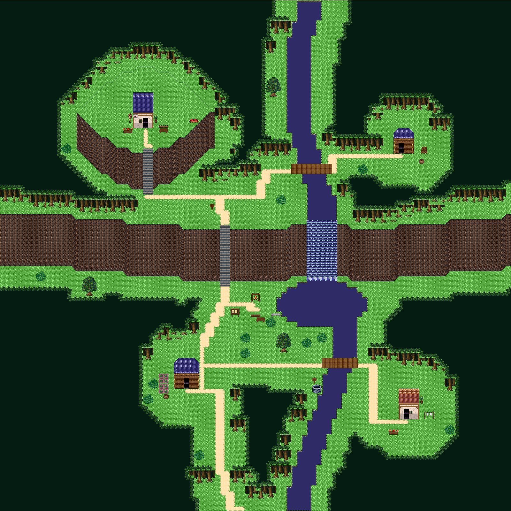
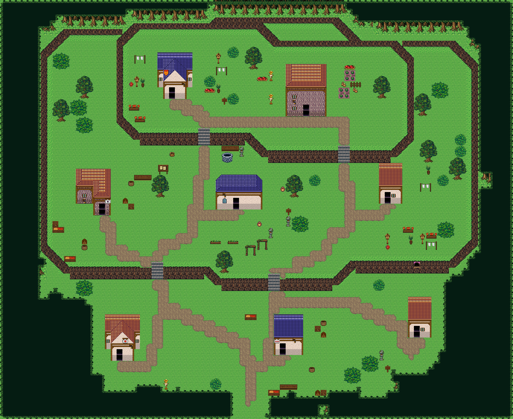

# 큰 폭포 아래 마을의 절벽 문법

개정1의 ‘대지 둘레 얇은 띠·남면 2행’은 사용자가 지적한 잘못된 구성이다. 북·서·동쪽에 같은 띠를 둘러 성벽처럼 닫지 않는다. 굽은 남향 윗선에서 충분한 높이의 면을 내리고, 같은 윤곽을 아래로 평행 이동해 밑단을 닫는다. 좌우 사선 몸통은 서로 다른 그림이다.





## 번호와 레이어 정정
개정3은 바닥240의 색을 유지한다. 참고 마을의 밝은 잔디 원본을 그대로 가져오던 개정2를 폐기한다. 아래 cliffBindings의 키는 열 문법 식별용 옛 원본 번호이며, 현재 그림의 실제 출처는 tileGrafts다. 498/499/528/529/619의 잔디 픽셀만 바닥색으로 맞추고, 암벽 면은 forest_harmony 팔레트로 연결한다. 504/505는 별도 잔디 사선 마감이며 682/711 암벽 면을 대체하는 타일이 아니다. 개정1은 오른쪽 사선 몸통232도 빠뜨렸다.
```json
[
  {
    "sourceChipset": "tex_forest_harmony_grass_joins",
    "sourceTile": 3,
    "targetTile": 2670
  },
  {
    "sourceChipset": "tex_forest_harmony_grass_joins",
    "sourceTile": 4,
    "targetTile": 2671
  },
  {
    "sourceChipset": "tex_forest_harmony_grass_joins",
    "sourceTile": 5,
    "targetTile": 2672
  },
  {
    "sourceChipset": "tex_forest_harmony_grass_joins",
    "sourceTile": 6,
    "targetTile": 2673
  },
  {
    "sourceChipset": "tex_forest_harmony",
    "sourceTile": 558,
    "targetTile": 2674
  },
  {
    "sourceChipset": "tex_forest_harmony",
    "sourceTile": 559,
    "targetTile": 2675
  },
  {
    "sourceChipset": "tex_forest_harmony",
    "sourceTile": 560,
    "targetTile": 2676
  },
  {
    "sourceChipset": "tex_forest_harmony",
    "sourceTile": 588,
    "targetTile": 2677
  },
  {
    "sourceChipset": "tex_forest_harmony",
    "sourceTile": 590,
    "targetTile": 2678
  },
  {
    "sourceChipset": "tex_forest_harmony",
    "sourceTile": 618,
    "targetTile": 2679
  },
  {
    "sourceChipset": "tex_forest_harmony_grass_joins",
    "sourceTile": 7,
    "targetTile": 2680
  },
  {
    "sourceChipset": "tex_forest_harmony",
    "sourceTile": 620,
    "targetTile": 2681
  },
  {
    "sourceChipset": "tex_forest_harmony",
    "sourceTile": 651,
    "targetTile": 2682
  },
  {
    "sourceChipset": "tex_forest_harmony",
    "sourceTile": 652,
    "targetTile": 2683
  },
  {
    "sourceChipset": "tex_forest_harmony",
    "sourceTile": 653,
    "targetTile": 2684
  },
  {
    "sourceChipset": "tex_forest_harmony",
    "sourceTile": 681,
    "targetTile": 2685
  },
  {
    "sourceChipset": "tex_forest_harmony",
    "sourceTile": 682,
    "targetTile": 2686
  },
  {
    "sourceChipset": "tex_forest_harmony",
    "sourceTile": 683,
    "targetTile": 2687
  },
  {
    "sourceChipset": "tex_forest_harmony",
    "sourceTile": 711,
    "targetTile": 2688
  },
  {
    "sourceChipset": "tex_forest_harmony",
    "sourceTile": 854,
    "targetTile": 2689
  },
  {
    "sourceChipset": "tex_easyrpg_chipset_retro_world",
    "sourceTile": 413,
    "targetTile": 2690
  },
  {
    "sourceChipset": "tex_forest_harmony_grass_joins",
    "sourceTile": 8,
    "targetTile": 2691
  },
  {
    "sourceChipset": "tex_forest_harmony_grass_joins",
    "sourceTile": 0,
    "targetTile": 2692
  },
  {
    "sourceChipset": "tex_forest_harmony_grass_joins",
    "sourceTile": 1,
    "targetTile": 2693
  },
  {
    "sourceChipset": "tex_forest_harmony_grass_joins",
    "sourceTile": 9,
    "targetTile": 2694
  },
  {
    "sourceChipset": "tex_easyrpg_chipset_world",
    "sourceTile": 123,
    "targetTile": 2700
  },
  {
    "sourceChipset": "tex_easyrpg_chipset_world",
    "sourceTile": 102,
    "targetTile": 2701
  },
  {
    "sourceChipset": "tex_easyrpg_chipset_world",
    "sourceTile": 103,
    "targetTile": 2702
  }
]
```

```json
{
  "18": 2670,
  "19": 2671,
  "48": 2672,
  "49": 2673,
  "78": 2674,
  "79": 2675,
  "80": 2676,
  "108": 2677,
  "110": 2678,
  "138": 2679,
  "139": 2680,
  "140": 2681,
  "171": 2682,
  "172": 2683,
  "173": 2684,
  "201": 2685,
  "202": 2686,
  "203": 2687,
  "231": 2688,
  "232": 2691,
  "374": 2689,
  "413": 2690
}
```


암벽은 **upper**, 아래 잔디/지면은 **lower에 보존**한다. stairs374는 lower이며 같은 칸 upper=-1이다. 이 표본의 암벽은 통행 불가, 계단은 통행 가능이다. 홈 레이어와 렌더 우선순위는 별개다. old ‘모두 lower’ 설명을 적용하지 않는다.

## 그대로 실행하는 열 조립
1. points의 두 꼭짓점 (x0,y0),(x1,y1) 사이를 y=round(y0+(y1-y0)*(x-x0)/(x1-x0))로 채운다. x는 정수, |y1-y0|≤x1-x0. 한 열만 튀어나와 좌우 캡이 동시에 필요한 꼭짓점은 금지한다.
2. 현재 y가 왼쪽 열보다 크면 왼쪽 사선, 오른쪽 열보다 크면 오른쪽 사선, 나머지는 정면이다. 첫/마지막 열의 바깥 이웃은 현재 y-1로 간주한다.
3. 왼쪽: 원본18 → 231을 h-1번 → 48. 정면: 139 → 172를 h-1번 → 202. 오른쪽: 19 → 232를 h-1번 → 49. 각 열 upper의 y..y+h에 쓴다. 타일 그림을 늘이거나 좌우 반전하지 않는다.
4. 계단 [x,y,h]: lower에 원본374를 폭2·높이h+1 반복하고 upper를 전부 비운다. 착지칸 y-1/y+h+1을 길로 잇는다. 사선 위에 걸치지 않고 두 열의 윗선 높이가 같은 곳에서만 연결한다.
5. 높이는 닫힘에서 나온다(개정8). 한 절벽은 숲에서 숲까지(또는 맵 끝까지) 끊지 않고 잇는다. 끝을 돌아 윗단으로 걸어갈 수 있으면 V자·톱니여도 둔덕이 아니라 홈으로 보인다. 각 끝의 바깥 4열(기본 윗선-3행~밑단+1행, cliffs[i].leftFrom/rightFrom으로 시작 행 지정)을 숲 강제 칸으로 두고 길 경로에서도 막는다. 윤곽은 거의 수평에 1행씩 완만한 굽이; 긴 45° 톱니 V는 쓰지 않는다. 검사: 모든 계단을 막았을 때 시작점에서 윗선 위 칸에 닿으면 terrace-without-stairs.
6. 절벽 전체→계단·입구→집→길→숲→소품. 면이 차지할 모든 칸을 먼저 예약한다. 집·뿌리·문앞을 덮으면 그 배치를 중단한다. 새 표본 높이 h=5 또는6; 원본 표본은 h=7이다.

## 기준 맵에서 그대로 추출한 정상 열
원점과 전체 두 레이어 배열이다. 높이8=윗선1+몸통6+밑단1. upper의 번호는 참고 맵 원본 번호이며 역사적 구조 표본이다. 색은 이 개정3 출력과 다르므로 이 배열을 색 기준으로 재사용하지 않는다. 새 맵은 cliffBindings와 현재 tileGrafts를 함께 사용한다.
```json
{
  "referenceId": "great-falls-100x100",
  "sourceProjectId": "oprn-hill-forest-harmony-20260918-a4e1",
  "mapId": "map_forest_great_falls_100",
  "tilesetId": "tileset_forest_great_falls_100",
  "tileSize": 16,
  "tilesPerRow": 30,
  "columns": [
    {
      "x": 25,
      "y": 29,
      "width": 1,
      "height": 8,
      "side": "left",
      "lowerTiles": [
        240,
        240,
        240,
        240,
        240,
        240,
        240,
        240
      ],
      "upperTiles": [
        498,
        711,
        711,
        711,
        711,
        711,
        711,
        528
      ]
    },
    {
      "x": 26,
      "y": 29,
      "width": 1,
      "height": 8,
      "side": "front",
      "lowerTiles": [
        240,
        240,
        240,
        240,
        240,
        240,
        240,
        240
      ],
      "upperTiles": [
        619,
        652,
        652,
        652,
        652,
        652,
        652,
        682
      ]
    },
    {
      "x": 30,
      "y": 29,
      "width": 1,
      "height": 8,
      "side": "right",
      "lowerTiles": [
        240,
        240,
        240,
        240,
        240,
        240,
        240,
        240
      ],
      "upperTiles": [
        499,
        712,
        712,
        712,
        712,
        712,
        712,
        529
      ]
    }
  ]
}
```


## 실제 입력과 출력
### 솔바람 흩어진 산촌
```json
{
  "cliffs": [
    {
      "points": [
        [
          2,
          19
        ],
        [
          6,
          19
        ],
        [
          7,
          18
        ],
        [
          17,
          18
        ],
        [
          18,
          17
        ],
        [
          25,
          17
        ],
        [
          26,
          16
        ],
        [
          39,
          16
        ],
        [
          41,
          17
        ],
        [
          43,
          17
        ],
        [
          46,
          20
        ],
        [
          57,
          20
        ],
        [
          58,
          19
        ],
        [
          59,
          19
        ]
      ],
      "height": 5
    }
  ],
  "stairs": [
    [
      10,
      18,
      5
    ],
    [
      32,
      16,
      5
    ],
    [
      51,
      20,
      5
    ]
  ]
}
```

### 층바위 절벽마을
```json
{
  "cliffs": [
    {
      "points": [
        [
          2,
          38
        ],
        [
          9,
          38
        ],
        [
          11,
          39
        ],
        [
          20,
          39
        ],
        [
          22,
          40
        ],
        [
          30,
          40
        ],
        [
          31,
          39
        ],
        [
          46,
          39
        ],
        [
          47,
          38
        ],
        [
          62,
          38
        ]
      ],
      "height": 6
    },
    {
      "points": [
        [
          14,
          19
        ],
        [
          20,
          19
        ],
        [
          21,
          18
        ],
        [
          25,
          18
        ],
        [
          27,
          19
        ],
        [
          33,
          19
        ],
        [
          35,
          20
        ],
        [
          48,
          20
        ],
        [
          49,
          19
        ],
        [
          54,
          19
        ],
        [
          55,
          18
        ],
        [
          61,
          18
        ]
      ],
      "height": 6
    }
  ],
  "stairs": [
    [
      23,
      18,
      6
    ],
    [
      50,
      19,
      6
    ],
    [
      18,
      39,
      6
    ],
    [
      34,
      39,
      6
    ]
  ]
}
```

### 두 폭포 강마을
```json
{
  "cliffs": [
    {
      "points": [
        [
          2,
          16
        ],
        [
          8,
          16
        ],
        [
          9,
          15
        ],
        [
          29,
          15
        ],
        [
          30,
          14
        ],
        [
          38,
          14
        ],
        [
          40,
          15
        ],
        [
          54,
          15
        ],
        [
          56,
          16
        ],
        [
          59,
          16
        ]
      ],
      "height": 6
    },
    {
      "points": [
        [
          2,
          39
        ],
        [
          12,
          39
        ],
        [
          13,
          38
        ],
        [
          28,
          38
        ],
        [
          29,
          37
        ],
        [
          38,
          37
        ],
        [
          40,
          38
        ],
        [
          53,
          38
        ],
        [
          55,
          39
        ],
        [
          59,
          39
        ]
      ],
      "height": 6
    }
  ],
  "stairs": [
    [
      19,
      15,
      6
    ],
    [
      49,
      15,
      6
    ],
    [
      15,
      38,
      6
    ],
    [
      50,
      38,
      6
    ]
  ]
}
```

### 갈대물굽이 포구
```json
{
  "cliffs": [
    {
      "points": [
        [
          4,
          16
        ],
        [
          10,
          16
        ],
        [
          11,
          15
        ],
        [
          21,
          15
        ],
        [
          24,
          12
        ],
        [
          35,
          12
        ]
      ],
      "height": 5,
      "rightFrom": 5
    }
  ],
  "stairs": [
    [
      15,
      15,
      5
    ],
    [
      25,
      12,
      5
    ]
  ]
}
```

### 종탑 언덕 교구마을
```json
{
  "cliffs": [
    {
      "points": [
        [
          2,
          17
        ],
        [
          11,
          17
        ],
        [
          12,
          16
        ],
        [
          20,
          16
        ],
        [
          22,
          17
        ],
        [
          54,
          17
        ]
      ],
      "height": 5
    }
  ],
  "stairs": [
    [
      15,
      16,
      5
    ],
    [
      25,
      17,
      5
    ]
  ]
}
```

### 여울성 나루
```json
{
  "cliffs": [
    {
      "points": [
        [
          2,
          41
        ],
        [
          29,
          41
        ],
        [
          30,
          40
        ],
        [
          46,
          40
        ],
        [
          48,
          41
        ],
        [
          77,
          41
        ]
      ],
      "height": 6
    },
    {
      "points": [
        [
          2,
          64
        ],
        [
          21,
          64
        ],
        [
          22,
          63
        ],
        [
          40,
          63
        ],
        [
          42,
          64
        ],
        [
          77,
          64
        ]
      ],
      "height": 6
    }
  ],
  "stairs": [
    [
      36,
      40,
      6
    ],
    [
      13,
      41,
      6
    ],
    [
      24,
      63,
      6
    ],
    [
      54,
      64,
      6
    ]
  ]
}
```

### 안개못 폐촌
```json
{
  "cliffs": [
    {
      "points": [
        [
          2,
          14
        ],
        [
          20,
          14
        ],
        [
          21,
          13
        ],
        [
          37,
          13
        ],
        [
          39,
          14
        ],
        [
          61,
          14
        ]
      ],
      "height": 5
    }
  ],
  "stairs": [
    [
      22,
      13,
      5
    ],
    [
      51,
      14,
      5
    ]
  ]
}
```

전체 출력은 각 rows 문서의 두 레이어 배열을 사용한다. 구현은 scripts/content/lib/village-cliffs.mjs의 cliffColumns/paintVillageCliffs다.


선착장은 갈대물굽이 포구 (46,39), 폭21·높이2. lower 물/땅을 보존하고 upper199를 반복한다. 마지막 (66,39)까지 연결을 검사한다.
