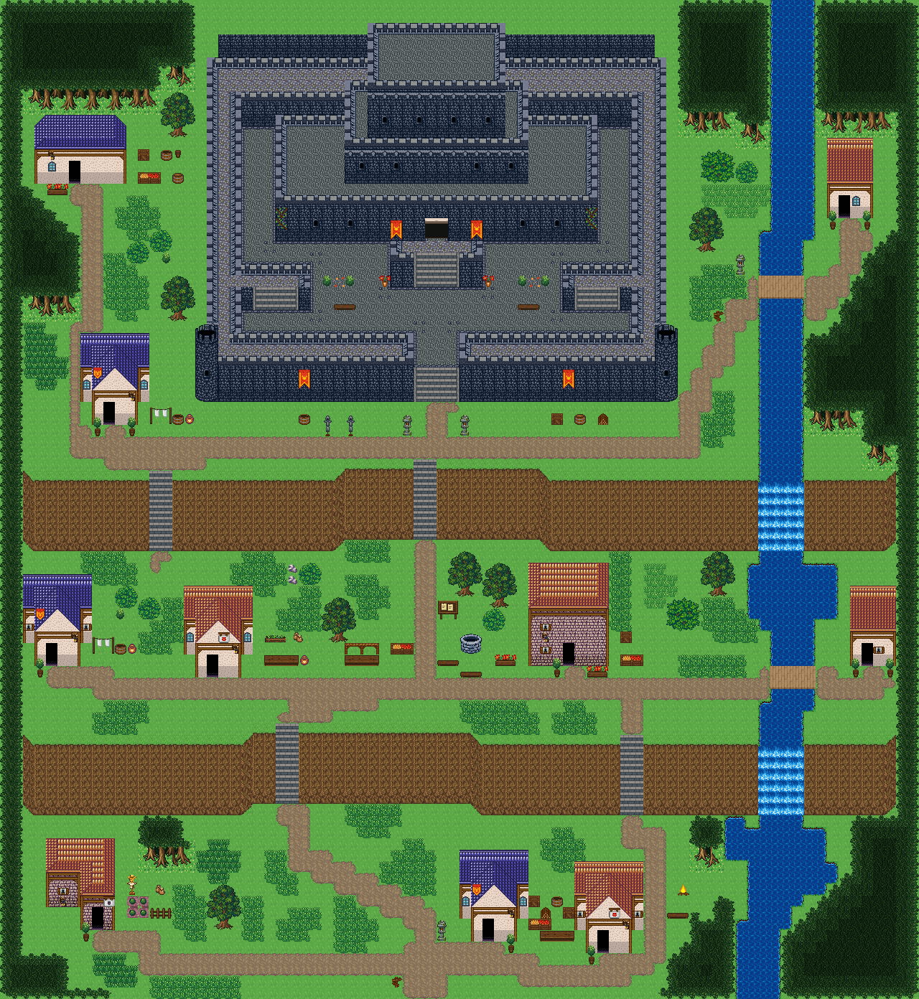

# 여울성 나루

맨 윗단에 두 겹 성벽·둥근 탑·층층 궁을 갖춘 작은 성(왕궁이 있는 이중 성벽 도시의 내성을 줄인 것)이 서고, 동쪽 강이 두 줄 절벽에서 폭포로 떨어지며 성 아랫마을 세 단을 다리로 잇는다. 시작점 (36,83); 집 10채. 0기준 맵 좌표. 모든 집은 고정 조각이며 회전/잘라내기 금지. cliffs.points는 x가 증가하는 절벽 윗선 꼭짓점, height는 윗선→밑단의 y 차이다. stairs=[x,y,height]는 폭2, 윗선 행 y부터 y+height까지이고 양끝 착지칸은 y-1/y+height+1이다. 이전 plateaus 윤곽은 사용하지 않는다. 몸통·지붕·소품 전체 배열은 다음 부품 문서와 연결한다.



## 랜드마크
```json
[
  {
    "id": "ford-castle-town-castle",
    "kind": "castle",
    "label": "작은 성",
    "x": 17,
    "y": 2,
    "w": 42,
    "h": 33,
    "doors": [
      {
        "x": 37,
        "y": 34
      },
      {
        "x": 38,
        "y": 34
      }
    ]
  }
]
```


## 입력 계획과 예약할 접근칸
```json
{
  "mapId": "ford-castle-town",
  "width": 80,
  "height": 87,
  "seed": 907,
  "start": {
    "x": 36,
    "y": 83
  },
  "yards": [
    {
      "ownerId": "ford-castle-town-house-1",
      "kit": "storage",
      "name": "물자 보관",
      "reason": "성 서쪽 기사 숙소에 마구와 보급품을 쌓아 둔다",
      "x": 12,
      "y": 13,
      "side": "right",
      "w": 4,
      "h": 3
    },
    {
      "ownerId": "ford-castle-town-house-3",
      "kit": "laundry",
      "name": "세탁·건조",
      "reason": "성 아래 서쪽 병사 숙소는 빨래 마당만 둔다",
      "x": 13,
      "y": 35,
      "side": "right",
      "w": 4,
      "h": 2
    },
    {
      "ownerId": "ford-castle-town-house-4",
      "kit": "laundry",
      "name": "세탁·건조",
      "reason": "가운데 단 서쪽 집은 세탁 마당만 둔다",
      "x": 8,
      "y": 55,
      "side": "right",
      "w": 4,
      "h": 2
    },
    {
      "ownerId": "ford-castle-town-house-5",
      "kit": "herbs",
      "name": "약초 손질",
      "reason": "성 병사를 돌보는 약초 손질집",
      "x": 23,
      "y": 55,
      "side": "right",
      "w": 4,
      "h": 3
    },
    {
      "ownerId": "ford-castle-town-house-6",
      "kit": "storage",
      "name": "물자 보관",
      "reason": "성으로 올릴 곡식과 물자를 보관한다",
      "x": 54,
      "y": 55,
      "side": "right",
      "w": 4,
      "h": 3
    },
    {
      "ownerId": "ford-castle-town-house-8",
      "kit": "growing",
      "name": "텃밭 돌보기",
      "reason": "아랫단 서쪽 집이 가족 텃밭을 기른다",
      "x": 11,
      "y": 76,
      "side": "right",
      "w": 4,
      "h": 4
    },
    {
      "ownerId": "ford-castle-town-house-9",
      "kit": "woodwork",
      "name": "목재 가공",
      "reason": "나루 배와 다리를 고치는 목수집",
      "x": 47,
      "y": 79,
      "side": "right",
      "w": 3,
      "h": 3
    },
    {
      "ownerId": "ford-castle-town-house-10",
      "kit": "storage",
      "name": "물자 보관",
      "reason": "나루로 들어온 짐을 보관한다",
      "x": 46,
      "y": 78,
      "side": "left",
      "w": 3,
      "h": 3
    }
  ],
  "activitySites": {},
  "civicPlaces": [
    {
      "id": "castle-drill",
      "name": "성 앞 훈련 마당",
      "anchor": {
        "type": "landmark",
        "id": "ford-castle-town-castle",
        "maxDistance": 6
      },
      "items": [
        {
          "id": "castle-drill-1",
          "name": "무기 거치대",
          "x": 28,
          "y": 36,
          "purpose": "성 병사들이 창과 칼을 거는 자리"
        },
        {
          "id": "castle-drill-2",
          "name": "무기 거치대",
          "x": 30,
          "y": 36,
          "purpose": "두 번째 무기 거치대",
          "near": "무기 거치대"
        },
        {
          "id": "castle-drill-3",
          "name": "나무통",
          "x": 26,
          "y": 36,
          "purpose": "훈련 뒤 마실 물통",
          "near": "무기 거치대"
        },
        {
          "id": "castle-drill-4",
          "name": "돌등",
          "x": 35,
          "y": 36,
          "purpose": "성문 서쪽을 밝히는 등"
        },
        {
          "id": "castle-drill-5",
          "name": "돌등",
          "x": 40,
          "y": 36,
          "purpose": "성문 동쪽을 밝히는 등",
          "near": "돌등"
        }
      ],
      "site": {
        "x": 17,
        "y": 2,
        "w": 42,
        "h": 33,
        "layer": "lower",
        "tiles": [
          240,
          240,
          240,
          240,
          240,
          240,
          240,
          240,
          240,
          240,
          240,
          240,
          240,
          240,
          240,
          240,
          240,
          240,
          240,
          240,
          240,
          240,
          240,
          240,
          240,
          240,
          240,
          240,
          240,
          240,
          240,
          240,
          240,
          240,
          240,
          240,
          240,
          240,
          240,
          240,
          240,
          240,
          240,
          240,
          51,
          51,
          51,
          51,
          51,
          51,
          51,
          51,
          51,
          51,
          51,
          51,
          51,
          51,
          51,
          51,
          51,
          51,
          51,
          51,
          51,
          51,
          51,
          51,
          51,
          51,
          51,
          51,
          51,
          51,
          51,
          51,
          51,
          51,
          51,
          51,
          51,
          51,
          240,
          240,
          240,
          240,
          81,
          81,
          81,
          81,
          81,
          81,
          81,
          81,
          81,
          81,
          81,
          81,
          81,
          81,
          81,
          81,
          81,
          81,
          81,
          81,
          81,
          81,
          81,
          81,
          81,
          81,
          81,
          81,
          81,
          81,
          81,
          81,
          81,
          81,
          81,
          81,
          81,
          81,
          240,
          240,
          240,
          21,
          21,
          21,
          21,
          21,
          21,
          21,
          21,
          21,
          21,
          21,
          21,
          21,
          21,
          21,
          21,
          21,
          21,
          21,
          21,
          21,
          21,
          21,
          21,
          21,
          21,
          21,
          21,
          21,
          21,
          21,
          21,
          21,
          21,
          21,
          21,
          21,
          21,
          21,
          21,
          240,
          240,
          21,
          412,
          412,
          412,
          412,
          412,
          412,
          412,
          412,
          412,
          412,
          412,
          412,
          412,
          412,
          412,
          412,
          412,
          412,
          412,
          412,
          412,
          412,
          412,
          412,
          412,
          412,
          412,
          412,
          412,
          412,
          412,
          412,
          412,
          412,
          412,
          412,
          412,
          412,
          21,
          240,
          240,
          21,
          412,
          412,
          412,
          412,
          412,
          412,
          412,
          412,
          412,
          412,
          412,
          412,
          412,
          412,
          412,
          412,
          412,
          412,
          412,
          412,
          412,
          412,
          412,
          412,
          412,
          412,
          412,
          412,
          412,
          412,
          412,
          412,
          412,
          412,
          412,
          412,
          412,
          412,
          21,
          240,
          240,
          21,
          412,
          21,
          21,
          21,
          21,
          21,
          21,
          21,
          21,
          21,
          21,
          21,
          21,
          21,
          21,
          21,
          21,
          21,
          21,
          21,
          21,
          21,
          21,
          21,
          21,
          21,
          21,
          21,
          21,
          21,
          21,
          21,
          21,
          21,
          21,
          21,
          21,
          412,
          21,
          240,
          240,
          21,
          412,
          21,
          51,
          51,
          51,
          51,
          51,
          51,
          51,
          51,
          51,
          51,
          51,
          51,
          51,
          51,
          51,
          51,
          51,
          51,
          51,
          51,
          51,
          51,
          51,
          51,
          51,
          51,
          51,
          51,
          51,
          51,
          51,
          51,
          51,
          51,
          21,
          412,
          21,
          240,
          240,
          21,
          412,
          21,
          81,
          81,
          81,
          81,
          81,
          81,
          81,
          81,
          81,
          81,
          81,
          51,
          51,
          51,
          51,
          51,
          51,
          51,
          51,
          51,
          51,
          51,
          51,
          81,
          81,
          81,
          81,
          81,
          81,
          81,
          81,
          81,
          81,
          81,
          21,
          412,
          21,
          240,
          240,
          21,
          412,
          21,
          276,
          277,
          278,
          21,
          21,
          21,
          21,
          21,
          21,
          21,
          21,
          81,
          81,
          81,
          81,
          81,
          81,
          81,
          81,
          81,
          81,
          81,
          81,
          21,
          21,
          21,
          21,
          21,
          21,
          21,
          21,
          276,
          277,
          278,
          21,
          412,
          21,
          240,
          240,
          21,
          412,
          21,
          306,
          307,
          308,
          21,
          21,
          21,
          21,
          21,
          21,
          108,
          109,
          109,
          109,
          109,
          109,
          109,
          109,
          109,
          109,
          109,
          109,
          109,
          109,
          109,
          110,
          21,
          21,
          21,
          21,
          21,
          21,
          306,
          307,
          308,
          21,
          412,
          21,
          240,
          240,
          21,
          412,
          21,
          306,
          307,
          308,
          21,
          21,
          21,
          21,
          21,
          21,
          21,
          21,
          21,
          21,
          21,
          21,
          21,
          21,
          21,
          21,
          21,
          21,
          21,
          21,
          21,
          21,
          21,
          21,
          21,
          21,
          21,
          21,
          306,
          307,
          308,
          21,
          412,
          21,
          240,
          240,
          21,
          412,
          21,
          306,
          307,
          308,
          21,
          21,
          21,
          21,
          21,
          21,
          51,
          51,
          51,
          51,
          51,
          51,
          51,
          51,
          51,
          51,
          51,
          51,
          51,
          51,
          51,
          51,
          21,
          21,
          21,
          21,
          21,
          21,
          306,
          307,
          308,
          21,
          412,
          21,
          240,
          240,
          21,
          412,
          21,
          306,
          307,
          308,
          21,
          21,
          21,
          21,
          21,
          21,
          81,
          81,
          81,
          81,
          81,
          81,
          81,
          81,
          81,
          81,
          81,
          81,
          81,
          81,
          81,
          81,
          21,
          21,
          21,
          21,
          21,
          21,
          306,
          307,
          308,
          21,
          412,
          21,
          240,
          240,
          21,
          412,
          21,
          306,
          307,
          308,
          21,
          21,
          21,
          21,
          108,
          109,
          109,
          109,
          109,
          109,
          109,
          109,
          109,
          109,
          109,
          109,
          109,
          109,
          109,
          109,
          109,
          109,
          109,
          110,
          21,
          21,
          21,
          21,
          306,
          307,
          308,
          21,
          412,
          21,
          240,
          240,
          21,
          412,
          21,
          306,
          307,
          308,
          21,
          21,
          21,
          21,
          21,
          21,
          21,
          21,
          21,
          21,
          21,
          21,
          21,
          21,
          21,
          21,
          21,
          21,
          21,
          21,
          21,
          21,
          21,
          21,
          21,
          21,
          21,
          21,
          306,
          307,
          308,
          21,
          412,
          21,
          240,
          240,
          21,
          412,
          21,
          306,
          307,
          308,
          51,
          51,
          51,
          51,
          51,
          51,
          51,
          51,
          51,
          51,
          51,
          51,
          51,
          51,
          51,
          51,
          51,
          51,
          51,
          51,
          51,
          51,
          51,
          51,
          51,
          51,
          51,
          51,
          306,
          307,
          308,
          21,
          412,
          21,
          240,
          240,
          21,
          412,
          21,
          306,
          307,
          308,
          51,
          51,
          51,
          51,
          51,
          51,
          51,
          51,
          51,
          51,
          51,
          51,
          51,
          51,
          51,
          51,
          51,
          51,
          51,
          51,
          51,
          51,
          51,
          51,
          51,
          51,
          51,
          51,
          306,
          307,
          308,
          21,
          412,
          21,
          240,
          240,
          21,
          412,
          21,
          306,
          307,
          308,
          81,
          81,
          81,
          81,
          81,
          81,
          81,
          81,
          81,
          81,
          81,
          81,
          81,
          276,
          278,
          81,
          81,
          81,
          81,
          81,
          81,
          81,
          81,
          81,
          81,
          81,
          81,
          81,
          306,
          307,
          308,
          21,
          412,
          21,
          240,
          240,
          21,
          412,
          21,
          306,
          307,
          248,
          277,
          277,
          277,
          277,
          277,
          277,
          277,
          277,
          277,
          278,
          21,
          276,
          277,
          337,
          337,
          277,
          278,
          21,
          276,
          277,
          277,
          277,
          277,
          277,
          277,
          277,
          277,
          277,
          248,
          307,
          308,
          21,
          412,
          21,
          240,
          240,
          21,
          412,
          21,
          336,
          337,
          337,
          337,
          337,
          337,
          248,
          307,
          307,
          307,
          307,
          307,
          308,
          51,
          51,
          111,
          112,
          112,
          113,
          51,
          51,
          306,
          307,
          307,
          307,
          307,
          307,
          248,
          337,
          337,
          337,
          337,
          337,
          338,
          21,
          412,
          21,
          240,
          240,
          21,
          412,
          21,
          21,
          21,
          21,
          21,
          21,
          21,
          306,
          307,
          307,
          307,
          307,
          307,
          308,
          51,
          51,
          111,
          112,
          112,
          113,
          51,
          51,
          306,
          307,
          307,
          307,
          307,
          307,
          308,
          21,
          21,
          21,
          21,
          21,
          21,
          21,
          412,
          21,
          240,
          240,
          21,
          412,
          412,
          412,
          412,
          412,
          412,
          412,
          21,
          306,
          307,
          307,
          307,
          307,
          307,
          308,
          51,
          51,
          111,
          112,
          112,
          113,
          51,
          51,
          306,
          307,
          307,
          307,
          307,
          307,
          308,
          21,
          412,
          412,
          412,
          412,
          412,
          412,
          412,
          21,
          240,
          240,
          21,
          412,
          21,
          51,
          111,
          112,
          112,
          113,
          51,
          306,
          307,
          307,
          307,
          307,
          307,
          248,
          277,
          277,
          277,
          277,
          277,
          277,
          277,
          277,
          248,
          307,
          307,
          307,
          307,
          307,
          308,
          51,
          111,
          112,
          112,
          113,
          51,
          21,
          412,
          21,
          240,
          240,
          21,
          412,
          21,
          81,
          111,
          112,
          112,
          113,
          81,
          306,
          307,
          307,
          307,
          307,
          307,
          307,
          307,
          307,
          307,
          307,
          307,
          307,
          307,
          307,
          307,
          307,
          307,
          307,
          307,
          307,
          308,
          81,
          111,
          112,
          112,
          113,
          81,
          21,
          412,
          21,
          240,
          240,
          21,
          412,
          21,
          276,
          277,
          277,
          277,
          277,
          277,
          248,
          307,
          307,
          307,
          307,
          307,
          307,
          307,
          307,
          307,
          307,
          307,
          307,
          307,
          307,
          307,
          307,
          307,
          307,
          307,
          307,
          248,
          277,
          277,
          277,
          277,
          277,
          278,
          21,
          412,
          21,
          240,
          240,
          21,
          412,
          21,
          336,
          337,
          337,
          337,
          337,
          337,
          337,
          337,
          337,
          337,
          337,
          337,
          337,
          337,
          337,
          248,
          307,
          307,
          248,
          337,
          337,
          337,
          337,
          337,
          337,
          337,
          337,
          337,
          337,
          337,
          337,
          337,
          337,
          338,
          21,
          412,
          21,
          240,
          138,
          139,
          412,
          21,
          21,
          21,
          21,
          21,
          21,
          21,
          21,
          21,
          21,
          21,
          21,
          21,
          21,
          21,
          21,
          306,
          307,
          307,
          308,
          21,
          21,
          21,
          21,
          21,
          21,
          21,
          21,
          21,
          21,
          21,
          21,
          21,
          21,
          21,
          21,
          412,
          138,
          139,
          140,
          141,
          412,
          412,
          412,
          412,
          412,
          412,
          412,
          412,
          412,
          412,
          412,
          412,
          412,
          412,
          412,
          412,
          21,
          306,
          307,
          307,
          308,
          21,
          412,
          412,
          412,
          412,
          412,
          412,
          412,
          412,
          412,
          412,
          412,
          412,
          412,
          412,
          412,
          412,
          140,
          141,
          140,
          141,
          21,
          21,
          21,
          21,
          21,
          21,
          21,
          21,
          21,
          21,
          21,
          21,
          21,
          21,
          21,
          21,
          21,
          336,
          337,
          337,
          338,
          21,
          21,
          21,
          21,
          21,
          21,
          21,
          21,
          21,
          21,
          21,
          21,
          21,
          21,
          21,
          21,
          21,
          140,
          141,
          142,
          143,
          51,
          51,
          51,
          51,
          51,
          51,
          51,
          51,
          51,
          51,
          51,
          51,
          51,
          51,
          51,
          51,
          51,
          111,
          112,
          112,
          113,
          51,
          51,
          51,
          51,
          51,
          51,
          51,
          51,
          51,
          51,
          51,
          51,
          51,
          51,
          51,
          51,
          51,
          142,
          143,
          140,
          141,
          51,
          51,
          51,
          51,
          51,
          51,
          51,
          51,
          51,
          51,
          51,
          51,
          51,
          51,
          51,
          51,
          51,
          111,
          112,
          112,
          113,
          51,
          51,
          51,
          51,
          51,
          51,
          51,
          51,
          51,
          51,
          51,
          51,
          51,
          51,
          51,
          51,
          51,
          140,
          141,
          240,
          81,
          81,
          81,
          81,
          81,
          81,
          81,
          81,
          81,
          81,
          81,
          81,
          81,
          81,
          81,
          81,
          81,
          81,
          111,
          112,
          112,
          113,
          81,
          81,
          81,
          81,
          81,
          81,
          81,
          81,
          81,
          81,
          81,
          81,
          81,
          81,
          81,
          81,
          81,
          81,
          240
        ]
      }
    },
    {
      "id": "castle-stores",
      "name": "성 동쪽 보급터",
      "anchor": {
        "type": "landmark",
        "id": "ford-castle-town-castle",
        "maxDistance": 6
      },
      "items": [
        {
          "id": "castle-stores-1",
          "name": "나무 상자",
          "x": 48,
          "y": 36,
          "purpose": "성으로 들일 보급 상자"
        },
        {
          "id": "castle-stores-2",
          "name": "술통",
          "x": 50,
          "y": 36,
          "purpose": "성 창고에 들일 술통",
          "near": "나무 상자"
        },
        {
          "id": "castle-stores-3",
          "name": "장작 더미",
          "x": 52,
          "y": 36,
          "purpose": "성 부엌에 들일 땔감",
          "near": "나무 상자"
        }
      ],
      "site": {
        "x": 17,
        "y": 2,
        "w": 42,
        "h": 33,
        "layer": "lower",
        "tiles": [
          240,
          240,
          240,
          240,
          240,
          240,
          240,
          240,
          240,
          240,
          240,
          240,
          240,
          240,
          240,
          240,
          240,
          240,
          240,
          240,
          240,
          240,
          240,
          240,
          240,
          240,
          240,
          240,
          240,
          240,
          240,
          240,
          240,
          240,
          240,
          240,
          240,
          240,
          240,
          240,
          240,
          240,
          240,
          240,
          51,
          51,
          51,
          51,
          51,
          51,
          51,
          51,
          51,
          51,
          51,
          51,
          51,
          51,
          51,
          51,
          51,
          51,
          51,
          51,
          51,
          51,
          51,
          51,
          51,
          51,
          51,
          51,
          51,
          51,
          51,
          51,
          51,
          51,
          51,
          51,
          51,
          51,
          240,
          240,
          240,
          240,
          81,
          81,
          81,
          81,
          81,
          81,
          81,
          81,
          81,
          81,
          81,
          81,
          81,
          81,
          81,
          81,
          81,
          81,
          81,
          81,
          81,
          81,
          81,
          81,
          81,
          81,
          81,
          81,
          81,
          81,
          81,
          81,
          81,
          81,
          81,
          81,
          81,
          81,
          240,
          240,
          240,
          21,
          21,
          21,
          21,
          21,
          21,
          21,
          21,
          21,
          21,
          21,
          21,
          21,
          21,
          21,
          21,
          21,
          21,
          21,
          21,
          21,
          21,
          21,
          21,
          21,
          21,
          21,
          21,
          21,
          21,
          21,
          21,
          21,
          21,
          21,
          21,
          21,
          21,
          21,
          21,
          240,
          240,
          21,
          412,
          412,
          412,
          412,
          412,
          412,
          412,
          412,
          412,
          412,
          412,
          412,
          412,
          412,
          412,
          412,
          412,
          412,
          412,
          412,
          412,
          412,
          412,
          412,
          412,
          412,
          412,
          412,
          412,
          412,
          412,
          412,
          412,
          412,
          412,
          412,
          412,
          412,
          21,
          240,
          240,
          21,
          412,
          412,
          412,
          412,
          412,
          412,
          412,
          412,
          412,
          412,
          412,
          412,
          412,
          412,
          412,
          412,
          412,
          412,
          412,
          412,
          412,
          412,
          412,
          412,
          412,
          412,
          412,
          412,
          412,
          412,
          412,
          412,
          412,
          412,
          412,
          412,
          412,
          412,
          21,
          240,
          240,
          21,
          412,
          21,
          21,
          21,
          21,
          21,
          21,
          21,
          21,
          21,
          21,
          21,
          21,
          21,
          21,
          21,
          21,
          21,
          21,
          21,
          21,
          21,
          21,
          21,
          21,
          21,
          21,
          21,
          21,
          21,
          21,
          21,
          21,
          21,
          21,
          21,
          21,
          412,
          21,
          240,
          240,
          21,
          412,
          21,
          51,
          51,
          51,
          51,
          51,
          51,
          51,
          51,
          51,
          51,
          51,
          51,
          51,
          51,
          51,
          51,
          51,
          51,
          51,
          51,
          51,
          51,
          51,
          51,
          51,
          51,
          51,
          51,
          51,
          51,
          51,
          51,
          51,
          51,
          21,
          412,
          21,
          240,
          240,
          21,
          412,
          21,
          81,
          81,
          81,
          81,
          81,
          81,
          81,
          81,
          81,
          81,
          81,
          51,
          51,
          51,
          51,
          51,
          51,
          51,
          51,
          51,
          51,
          51,
          51,
          81,
          81,
          81,
          81,
          81,
          81,
          81,
          81,
          81,
          81,
          81,
          21,
          412,
          21,
          240,
          240,
          21,
          412,
          21,
          276,
          277,
          278,
          21,
          21,
          21,
          21,
          21,
          21,
          21,
          21,
          81,
          81,
          81,
          81,
          81,
          81,
          81,
          81,
          81,
          81,
          81,
          81,
          21,
          21,
          21,
          21,
          21,
          21,
          21,
          21,
          276,
          277,
          278,
          21,
          412,
          21,
          240,
          240,
          21,
          412,
          21,
          306,
          307,
          308,
          21,
          21,
          21,
          21,
          21,
          21,
          108,
          109,
          109,
          109,
          109,
          109,
          109,
          109,
          109,
          109,
          109,
          109,
          109,
          109,
          109,
          110,
          21,
          21,
          21,
          21,
          21,
          21,
          306,
          307,
          308,
          21,
          412,
          21,
          240,
          240,
          21,
          412,
          21,
          306,
          307,
          308,
          21,
          21,
          21,
          21,
          21,
          21,
          21,
          21,
          21,
          21,
          21,
          21,
          21,
          21,
          21,
          21,
          21,
          21,
          21,
          21,
          21,
          21,
          21,
          21,
          21,
          21,
          21,
          21,
          306,
          307,
          308,
          21,
          412,
          21,
          240,
          240,
          21,
          412,
          21,
          306,
          307,
          308,
          21,
          21,
          21,
          21,
          21,
          21,
          51,
          51,
          51,
          51,
          51,
          51,
          51,
          51,
          51,
          51,
          51,
          51,
          51,
          51,
          51,
          51,
          21,
          21,
          21,
          21,
          21,
          21,
          306,
          307,
          308,
          21,
          412,
          21,
          240,
          240,
          21,
          412,
          21,
          306,
          307,
          308,
          21,
          21,
          21,
          21,
          21,
          21,
          81,
          81,
          81,
          81,
          81,
          81,
          81,
          81,
          81,
          81,
          81,
          81,
          81,
          81,
          81,
          81,
          21,
          21,
          21,
          21,
          21,
          21,
          306,
          307,
          308,
          21,
          412,
          21,
          240,
          240,
          21,
          412,
          21,
          306,
          307,
          308,
          21,
          21,
          21,
          21,
          108,
          109,
          109,
          109,
          109,
          109,
          109,
          109,
          109,
          109,
          109,
          109,
          109,
          109,
          109,
          109,
          109,
          109,
          109,
          110,
          21,
          21,
          21,
          21,
          306,
          307,
          308,
          21,
          412,
          21,
          240,
          240,
          21,
          412,
          21,
          306,
          307,
          308,
          21,
          21,
          21,
          21,
          21,
          21,
          21,
          21,
          21,
          21,
          21,
          21,
          21,
          21,
          21,
          21,
          21,
          21,
          21,
          21,
          21,
          21,
          21,
          21,
          21,
          21,
          21,
          21,
          306,
          307,
          308,
          21,
          412,
          21,
          240,
          240,
          21,
          412,
          21,
          306,
          307,
          308,
          51,
          51,
          51,
          51,
          51,
          51,
          51,
          51,
          51,
          51,
          51,
          51,
          51,
          51,
          51,
          51,
          51,
          51,
          51,
          51,
          51,
          51,
          51,
          51,
          51,
          51,
          51,
          51,
          306,
          307,
          308,
          21,
          412,
          21,
          240,
          240,
          21,
          412,
          21,
          306,
          307,
          308,
          51,
          51,
          51,
          51,
          51,
          51,
          51,
          51,
          51,
          51,
          51,
          51,
          51,
          51,
          51,
          51,
          51,
          51,
          51,
          51,
          51,
          51,
          51,
          51,
          51,
          51,
          51,
          51,
          306,
          307,
          308,
          21,
          412,
          21,
          240,
          240,
          21,
          412,
          21,
          306,
          307,
          308,
          81,
          81,
          81,
          81,
          81,
          81,
          81,
          81,
          81,
          81,
          81,
          81,
          81,
          276,
          278,
          81,
          81,
          81,
          81,
          81,
          81,
          81,
          81,
          81,
          81,
          81,
          81,
          81,
          306,
          307,
          308,
          21,
          412,
          21,
          240,
          240,
          21,
          412,
          21,
          306,
          307,
          248,
          277,
          277,
          277,
          277,
          277,
          277,
          277,
          277,
          277,
          278,
          21,
          276,
          277,
          337,
          337,
          277,
          278,
          21,
          276,
          277,
          277,
          277,
          277,
          277,
          277,
          277,
          277,
          277,
          248,
          307,
          308,
          21,
          412,
          21,
          240,
          240,
          21,
          412,
          21,
          336,
          337,
          337,
          337,
          337,
          337,
          248,
          307,
          307,
          307,
          307,
          307,
          308,
          51,
          51,
          111,
          112,
          112,
          113,
          51,
          51,
          306,
          307,
          307,
          307,
          307,
          307,
          248,
          337,
          337,
          337,
          337,
          337,
          338,
          21,
          412,
          21,
          240,
          240,
          21,
          412,
          21,
          21,
          21,
          21,
          21,
          21,
          21,
          306,
          307,
          307,
          307,
          307,
          307,
          308,
          51,
          51,
          111,
          112,
          112,
          113,
          51,
          51,
          306,
          307,
          307,
          307,
          307,
          307,
          308,
          21,
          21,
          21,
          21,
          21,
          21,
          21,
          412,
          21,
          240,
          240,
          21,
          412,
          412,
          412,
          412,
          412,
          412,
          412,
          21,
          306,
          307,
          307,
          307,
          307,
          307,
          308,
          51,
          51,
          111,
          112,
          112,
          113,
          51,
          51,
          306,
          307,
          307,
          307,
          307,
          307,
          308,
          21,
          412,
          412,
          412,
          412,
          412,
          412,
          412,
          21,
          240,
          240,
          21,
          412,
          21,
          51,
          111,
          112,
          112,
          113,
          51,
          306,
          307,
          307,
          307,
          307,
          307,
          248,
          277,
          277,
          277,
          277,
          277,
          277,
          277,
          277,
          248,
          307,
          307,
          307,
          307,
          307,
          308,
          51,
          111,
          112,
          112,
          113,
          51,
          21,
          412,
          21,
          240,
          240,
          21,
          412,
          21,
          81,
          111,
          112,
          112,
          113,
          81,
          306,
          307,
          307,
          307,
          307,
          307,
          307,
          307,
          307,
          307,
          307,
          307,
          307,
          307,
          307,
          307,
          307,
          307,
          307,
          307,
          307,
          308,
          81,
          111,
          112,
          112,
          113,
          81,
          21,
          412,
          21,
          240,
          240,
          21,
          412,
          21,
          276,
          277,
          277,
          277,
          277,
          277,
          248,
          307,
          307,
          307,
          307,
          307,
          307,
          307,
          307,
          307,
          307,
          307,
          307,
          307,
          307,
          307,
          307,
          307,
          307,
          307,
          307,
          248,
          277,
          277,
          277,
          277,
          277,
          278,
          21,
          412,
          21,
          240,
          240,
          21,
          412,
          21,
          336,
          337,
          337,
          337,
          337,
          337,
          337,
          337,
          337,
          337,
          337,
          337,
          337,
          337,
          337,
          248,
          307,
          307,
          248,
          337,
          337,
          337,
          337,
          337,
          337,
          337,
          337,
          337,
          337,
          337,
          337,
          337,
          337,
          338,
          21,
          412,
          21,
          240,
          138,
          139,
          412,
          21,
          21,
          21,
          21,
          21,
          21,
          21,
          21,
          21,
          21,
          21,
          21,
          21,
          21,
          21,
          21,
          306,
          307,
          307,
          308,
          21,
          21,
          21,
          21,
          21,
          21,
          21,
          21,
          21,
          21,
          21,
          21,
          21,
          21,
          21,
          21,
          412,
          138,
          139,
          140,
          141,
          412,
          412,
          412,
          412,
          412,
          412,
          412,
          412,
          412,
          412,
          412,
          412,
          412,
          412,
          412,
          412,
          21,
          306,
          307,
          307,
          308,
          21,
          412,
          412,
          412,
          412,
          412,
          412,
          412,
          412,
          412,
          412,
          412,
          412,
          412,
          412,
          412,
          412,
          140,
          141,
          140,
          141,
          21,
          21,
          21,
          21,
          21,
          21,
          21,
          21,
          21,
          21,
          21,
          21,
          21,
          21,
          21,
          21,
          21,
          336,
          337,
          337,
          338,
          21,
          21,
          21,
          21,
          21,
          21,
          21,
          21,
          21,
          21,
          21,
          21,
          21,
          21,
          21,
          21,
          21,
          140,
          141,
          142,
          143,
          51,
          51,
          51,
          51,
          51,
          51,
          51,
          51,
          51,
          51,
          51,
          51,
          51,
          51,
          51,
          51,
          51,
          111,
          112,
          112,
          113,
          51,
          51,
          51,
          51,
          51,
          51,
          51,
          51,
          51,
          51,
          51,
          51,
          51,
          51,
          51,
          51,
          51,
          142,
          143,
          140,
          141,
          51,
          51,
          51,
          51,
          51,
          51,
          51,
          51,
          51,
          51,
          51,
          51,
          51,
          51,
          51,
          51,
          51,
          111,
          112,
          112,
          113,
          51,
          51,
          51,
          51,
          51,
          51,
          51,
          51,
          51,
          51,
          51,
          51,
          51,
          51,
          51,
          51,
          51,
          140,
          141,
          240,
          81,
          81,
          81,
          81,
          81,
          81,
          81,
          81,
          81,
          81,
          81,
          81,
          81,
          81,
          81,
          81,
          81,
          81,
          111,
          112,
          112,
          113,
          81,
          81,
          81,
          81,
          81,
          81,
          81,
          81,
          81,
          81,
          81,
          81,
          81,
          81,
          81,
          81,
          81,
          81,
          240
        ]
      }
    },
    {
      "id": "top-bridge-watch",
      "name": "윗다리 망보는 자리",
      "anchor": {
        "type": "road",
        "x": 65,
        "y": 25,
        "maxDistance": 8
      },
      "items": [
        {
          "id": "top-bridge-watch-1",
          "name": "돌등",
          "x": 64,
          "y": 22,
          "purpose": "윗다리 서쪽 목 밝히기"
        },
        {
          "id": "top-bridge-watch-2",
          "name": "나무 이정표",
          "x": 62,
          "y": 27,
          "purpose": "강 건너 망루지기 집 안내"
        }
      ],
      "site": {
        "x": 65,
        "y": 25,
        "w": 1,
        "h": 1,
        "layer": "lower",
        "tiles": [
          1475
        ]
      }
    },
    {
      "id": "mid-market",
      "name": "가운데 단 장터",
      "anchor": {
        "type": "road",
        "x": 36,
        "y": 59,
        "maxDistance": 9
      },
      "items": [
        {
          "id": "mid-market-1",
          "name": "장터 노점",
          "x": 30,
          "y": 56,
          "purpose": "성 아랫마을 좌판"
        },
        {
          "id": "mid-market-2",
          "name": "과일 좌판",
          "x": 34,
          "y": 56,
          "purpose": "아랫단 텃밭에서 거둔 과일",
          "near": "장터 노점"
        },
        {
          "id": "mid-market-3",
          "name": "낮은 돌 우물",
          "x": 40,
          "y": 55,
          "purpose": "가운데 단 공동 우물"
        },
        {
          "id": "mid-market-4",
          "name": "게시판",
          "x": 38,
          "y": 52,
          "purpose": "성의 포고문을 붙이는 판"
        },
        {
          "id": "mid-market-plaza-1",
          "name": "벤치",
          "x": 38,
          "y": 57,
          "purpose": "우물가에 앉아 쉬는 자리",
          "near": "낮은 돌 우물"
        },
        {
          "id": "mid-market-plaza-2",
          "name": "꽃 화단",
          "x": 43,
          "y": 56,
          "purpose": "마을 한가운데를 꾸미는 화단",
          "near": "낮은 돌 우물"
        },
        {
          "id": "mid-market-plaza-3",
          "name": "벤치",
          "x": 40,
          "y": 58,
          "purpose": "우물가에 앉아 쉬는 자리",
          "near": "낮은 돌 우물"
        }
      ],
      "site": {
        "x": 36,
        "y": 59,
        "w": 1,
        "h": 1,
        "layer": "lower",
        "tiles": [
          1503
        ]
      }
    },
    {
      "id": "pool-rest",
      "name": "가운데 단 폭포 소",
      "anchor": {
        "type": "road",
        "x": 66,
        "y": 59,
        "maxDistance": 10
      },
      "items": [],
      "site": {
        "x": 66,
        "y": 59,
        "w": 1,
        "h": 1,
        "layer": "lower",
        "tiles": [
          1497
        ]
      }
    },
    {
      "id": "lower-fire",
      "name": "나루 모닥불",
      "anchor": {
        "type": "house",
        "id": "ford-castle-town-house-10",
        "maxDistance": 12
      },
      "items": [
        {
          "id": "lower-fire-1",
          "name": "모닥불",
          "x": 59,
          "y": 77,
          "purpose": "나루 일꾼들이 저녁에 불을 피우는 자리"
        },
        {
          "id": "lower-fire-2",
          "name": "벤치",
          "x": 58,
          "y": 79,
          "purpose": "불가에 앉는 자리",
          "near": "모닥불"
        }
      ],
      "site": {
        "x": 50,
        "y": 75,
        "w": 6,
        "h": 8,
        "layer": "lower",
        "tiles": [
          374,
          374,
          374,
          374,
          374,
          374,
          375,
          376,
          376,
          377,
          377,
          375,
          405,
          376,
          376,
          377,
          377,
          405,
          15,
          376,
          46,
          46,
          377,
          15,
          45,
          46,
          46,
          46,
          46,
          45,
          75,
          15,
          16,
          16,
          17,
          75,
          240,
          45,
          329,
          46,
          47,
          240,
          240,
          75,
          359,
          76,
          77,
          240
        ]
      }
    },
    {
      "id": "entry-sign",
      "name": "남쪽 입구 길잡이",
      "anchor": {
        "type": "road",
        "x": 36,
        "y": 83,
        "maxDistance": 10
      },
      "items": [
        {
          "id": "entry-sign-1",
          "name": "나무 이정표",
          "x": 34,
          "y": 85,
          "purpose": "성으로 오르는 길 안내"
        },
        {
          "id": "entry-sign-2",
          "name": "돌등",
          "x": 38,
          "y": 80,
          "purpose": "입구 길 밝히기"
        }
      ],
      "site": {
        "x": 36,
        "y": 83,
        "w": 1,
        "h": 1,
        "layer": "lower",
        "tiles": [
          1516
        ]
      }
    }
  ],
  "entrance": {
    "x": 36,
    "y": 86
  },
  "crest": null,
  "patches": [
    [
      4,
      10,
      8,
      16,
      10
    ],
    [
      79,
      8,
      8,
      16,
      10
    ],
    [
      4,
      81,
      8,
      8,
      9
    ],
    [
      76,
      83,
      8,
      8,
      9
    ],
    [
      60,
      6,
      5,
      6,
      8
    ]
  ],
  "clearings": [
    [
      37,
      18,
      26,
      16,
      14
    ],
    [
      9,
      18,
      10,
      8,
      9
    ],
    [
      36,
      54,
      30,
      7,
      10
    ],
    [
      28,
      79,
      26,
      6,
      10
    ]
  ],
  "cliffs": [
    {
      "points": [
        [
          2,
          41
        ],
        [
          29,
          41
        ],
        [
          30,
          40
        ],
        [
          46,
          40
        ],
        [
          48,
          41
        ],
        [
          77,
          41
        ]
      ],
      "height": 6
    },
    {
      "points": [
        [
          2,
          64
        ],
        [
          21,
          64
        ],
        [
          22,
          63
        ],
        [
          40,
          63
        ],
        [
          42,
          64
        ],
        [
          77,
          64
        ]
      ],
      "height": 6
    }
  ],
  "stairs": [
    [
      36,
      40,
      6
    ],
    [
      13,
      41,
      6
    ],
    [
      24,
      63,
      6
    ],
    [
      54,
      64,
      6
    ]
  ],
  "ponds": [],
  "coast": false,
  "dock": null,
  "cave": null,
  "spine": [
    [
      36,
      85
    ],
    [
      36,
      79
    ],
    [
      25,
      72
    ],
    [
      25,
      62
    ],
    [
      36,
      59
    ],
    [
      36,
      48
    ],
    [
      36,
      38
    ],
    [
      20,
      38
    ],
    [
      13,
      40
    ],
    [
      9,
      38
    ],
    [
      7,
      20
    ],
    [
      9,
      38
    ],
    [
      20,
      38
    ],
    [
      36,
      38
    ],
    [
      58,
      38
    ],
    [
      63,
      28
    ],
    [
      71,
      26
    ],
    [
      74,
      20
    ],
    [
      71,
      26
    ],
    [
      63,
      28
    ],
    [
      58,
      38
    ],
    [
      36,
      38
    ],
    [
      36,
      48
    ],
    [
      36,
      59
    ],
    [
      11,
      59
    ],
    [
      36,
      59
    ],
    [
      60,
      59
    ],
    [
      66,
      59
    ],
    [
      76,
      59
    ],
    [
      60,
      59
    ],
    [
      54,
      72
    ],
    [
      52,
      84
    ],
    [
      36,
      82
    ],
    [
      12,
      83
    ],
    [
      36,
      82
    ]
  ],
  "access": [
    {
      "role": "stairs-top",
      "x": 36,
      "y": 39
    },
    {
      "role": "stairs-bottom",
      "x": 36,
      "y": 47
    },
    {
      "role": "stairs-top",
      "x": 13,
      "y": 40
    },
    {
      "role": "stairs-bottom",
      "x": 13,
      "y": 48
    },
    {
      "role": "stairs-top",
      "x": 24,
      "y": 62
    },
    {
      "role": "stairs-bottom",
      "x": 24,
      "y": 70
    },
    {
      "role": "stairs-top",
      "x": 54,
      "y": 63
    },
    {
      "role": "stairs-bottom",
      "x": 54,
      "y": 71
    },
    {
      "role": "bridge-west",
      "x": 65,
      "y": 24
    },
    {
      "role": "bridge-east",
      "x": 70,
      "y": 24
    },
    {
      "role": "bridge-west",
      "x": 66,
      "y": 58
    },
    {
      "role": "bridge-east",
      "x": 71,
      "y": 58
    },
    {
      "role": "door-front",
      "x": 6,
      "y": 16
    },
    {
      "role": "door-front",
      "x": 73,
      "y": 19
    },
    {
      "role": "door-front",
      "x": 9,
      "y": 37
    },
    {
      "role": "door-front",
      "x": 4,
      "y": 58
    },
    {
      "role": "door-front",
      "x": 18,
      "y": 59
    },
    {
      "role": "door-front",
      "x": 49,
      "y": 58
    },
    {
      "role": "door-front",
      "x": 75,
      "y": 58
    },
    {
      "role": "door-front",
      "x": 8,
      "y": 81
    },
    {
      "role": "door-front",
      "x": 42,
      "y": 82
    },
    {
      "role": "door-front",
      "x": 52,
      "y": 83
    },
    {
      "role": "landmark-door",
      "x": 37,
      "y": 35,
      "landmarkId": "ford-castle-town-castle"
    },
    {
      "role": "landmark-door",
      "x": 38,
      "y": 35,
      "landmarkId": "ford-castle-town-castle"
    },
    {
      "role": "map-entrance",
      "x": 35,
      "y": 86
    },
    {
      "role": "map-entrance",
      "x": 36,
      "y": 86
    },
    {
      "role": "map-entrance",
      "x": 37,
      "y": 86
    },
    {
      "role": "map-entrance",
      "x": 35,
      "y": 85
    },
    {
      "role": "map-entrance",
      "x": 36,
      "y": 85
    },
    {
      "role": "map-entrance",
      "x": 37,
      "y": 85
    },
    {
      "role": "map-entrance",
      "x": 35,
      "y": 84
    },
    {
      "role": "map-entrance",
      "x": 36,
      "y": 84
    },
    {
      "role": "map-entrance",
      "x": 37,
      "y": 84
    },
    {
      "role": "map-entrance",
      "x": 35,
      "y": 83
    },
    {
      "role": "map-entrance",
      "x": 36,
      "y": 83
    },
    {
      "role": "map-entrance",
      "x": 37,
      "y": 83
    },
    {
      "role": "map-entrance",
      "x": 35,
      "y": 82
    },
    {
      "role": "map-entrance",
      "x": 36,
      "y": 82
    },
    {
      "role": "map-entrance",
      "x": 37,
      "y": 82
    },
    {
      "role": "civic-use",
      "x": 27,
      "y": 36,
      "placeId": "castle-drill",
      "propId": "castle-drill-1"
    },
    {
      "role": "civic-use",
      "x": 29,
      "y": 36,
      "placeId": "castle-drill",
      "propId": "castle-drill-2"
    },
    {
      "role": "civic-use",
      "x": 26,
      "y": 37,
      "placeId": "castle-drill",
      "propId": "castle-drill-3"
    },
    {
      "role": "civic-use",
      "x": 34,
      "y": 36,
      "placeId": "castle-drill",
      "propId": "castle-drill-4"
    },
    {
      "role": "civic-use",
      "x": 39,
      "y": 36,
      "placeId": "castle-drill",
      "propId": "castle-drill-5"
    },
    {
      "role": "civic-use",
      "x": 48,
      "y": 37,
      "placeId": "castle-stores",
      "propId": "castle-stores-1"
    },
    {
      "role": "civic-use",
      "x": 50,
      "y": 37,
      "placeId": "castle-stores",
      "propId": "castle-stores-2"
    },
    {
      "role": "civic-use",
      "x": 52,
      "y": 37,
      "placeId": "castle-stores",
      "propId": "castle-stores-3"
    },
    {
      "role": "civic-use",
      "x": 63,
      "y": 22,
      "placeId": "top-bridge-watch",
      "propId": "top-bridge-watch-1"
    },
    {
      "role": "civic-use",
      "x": 62,
      "y": 28,
      "placeId": "top-bridge-watch",
      "propId": "top-bridge-watch-2"
    },
    {
      "role": "civic-use",
      "x": 29,
      "y": 56,
      "placeId": "mid-market",
      "propId": "mid-market-1"
    },
    {
      "role": "civic-use",
      "x": 34,
      "y": 57,
      "placeId": "mid-market",
      "propId": "mid-market-2"
    },
    {
      "role": "civic-use",
      "x": 39,
      "y": 55,
      "placeId": "mid-market",
      "propId": "mid-market-3"
    },
    {
      "role": "civic-use",
      "x": 37,
      "y": 52,
      "placeId": "mid-market",
      "propId": "mid-market-4"
    },
    {
      "role": "civic-use",
      "x": 59,
      "y": 78,
      "placeId": "lower-fire",
      "propId": "lower-fire-1"
    },
    {
      "role": "civic-use",
      "x": 58,
      "y": 80,
      "placeId": "lower-fire",
      "propId": "lower-fire-2"
    },
    {
      "role": "civic-use",
      "x": 34,
      "y": 86,
      "placeId": "entry-sign",
      "propId": "entry-sign-1"
    },
    {
      "role": "civic-use",
      "x": 37,
      "y": 80,
      "placeId": "entry-sign",
      "propId": "entry-sign-2"
    },
    {
      "role": "civic-use",
      "x": 38,
      "y": 58,
      "placeId": "mid-market",
      "propId": "mid-market-plaza-1"
    },
    {
      "role": "civic-use",
      "x": 42,
      "y": 56,
      "placeId": "mid-market",
      "propId": "mid-market-plaza-2"
    },
    {
      "role": "civic-use",
      "x": 40,
      "y": 59,
      "placeId": "mid-market",
      "propId": "mid-market-plaza-3"
    }
  ]
}
```


## 건물의 전체 하위·상위
### ford-castle-town-house-1
```json
{
  "id": "ford-castle-town-house-1",
  "role": "기사 숙소",
  "label": "파랑 석벽 rect-wide 집",
  "window": 87,
  "abandoned": false,
  "vines": [],
  "x": 3,
  "y": 10,
  "w": 8,
  "h": 6,
  "template": 7,
  "doorAt": {
    "x": 6,
    "y": 15
  },
  "front": {
    "x": 6,
    "y": 16
  },
  "activity": "storage",
  "reason": "성 서쪽 기사 숙소에 마구와 보급품을 쌓아 둔다",
  "width": 8,
  "height": 6,
  "lowerTiles": [
    [
      240,
      406,
      406,
      406,
      406,
      406,
      406,
      240
    ],
    [
      406,
      406,
      406,
      406,
      406,
      406,
      406,
      407
    ],
    [
      467,
      467,
      467,
      467,
      467,
      467,
      467,
      467
    ],
    [
      15,
      16,
      16,
      16,
      16,
      16,
      16,
      17
    ],
    [
      45,
      46,
      46,
      329,
      46,
      46,
      46,
      47
    ],
    [
      75,
      76,
      76,
      359,
      76,
      76,
      76,
      77
    ]
  ],
  "upperTiles": [
    [
      356,
      -1,
      -1,
      -1,
      -1,
      -1,
      -1,
      357
    ],
    [
      -1,
      -1,
      -1,
      -1,
      -1,
      -1,
      -1,
      -1
    ],
    [
      386,
      -1,
      -1,
      -1,
      -1,
      -1,
      -1,
      387
    ],
    [
      -1,
      2645,
      -1,
      -1,
      -1,
      -1,
      -1,
      -1
    ],
    [
      -1,
      87,
      -1,
      -1,
      -1,
      -1,
      -1,
      -1
    ],
    [
      -1,
      2611,
      2612,
      -1,
      -1,
      -1,
      -1,
      -1
    ]
  ]
}
```

### ford-castle-town-house-2
```json
{
  "id": "ford-castle-town-house-2",
  "role": "망루지기 집",
  "label": "왕궁 도시 · 주황 박공 회벽집 4×7 ②",
  "window": 87,
  "abandoned": false,
  "vines": [],
  "x": 72,
  "y": 12,
  "w": 4,
  "h": 7,
  "template": 3,
  "doorAt": {
    "x": 73,
    "y": 18
  },
  "front": {
    "x": 73,
    "y": 19
  },
  "activity": "woodwork",
  "reason": "강 건너 망루지기가 창 자루를 깎는다",
  "width": 4,
  "height": 7,
  "lowerTiles": [
    [
      374,
      374,
      374,
      374
    ],
    [
      375,
      375,
      375,
      375
    ],
    [
      375,
      375,
      375,
      375
    ],
    [
      405,
      405,
      405,
      405
    ],
    [
      15,
      16,
      16,
      17
    ],
    [
      45,
      329,
      46,
      47
    ],
    [
      75,
      359,
      76,
      77
    ]
  ],
  "upperTiles": [
    [
      -1,
      -1,
      -1,
      -1
    ],
    [
      -1,
      -1,
      -1,
      -1
    ],
    [
      -1,
      -1,
      -1,
      -1
    ],
    [
      -1,
      -1,
      -1,
      -1
    ],
    [
      -1,
      -1,
      -1,
      -1
    ],
    [
      -1,
      -1,
      87,
      -1
    ],
    [
      2632,
      -1,
      -1,
      2632
    ]
  ]
}
```

### ford-castle-town-house-3
```json
{
  "id": "ford-castle-town-house-3",
  "role": "병사 숙소",
  "label": "왕궁 도시 · 파랑 박공 회벽집 6×8 ②",
  "window": 87,
  "abandoned": false,
  "vines": [],
  "x": 7,
  "y": 29,
  "w": 6,
  "h": 8,
  "template": 0,
  "doorAt": {
    "x": 9,
    "y": 36
  },
  "front": {
    "x": 9,
    "y": 37
  },
  "activity": "laundry",
  "reason": "성 아래 서쪽 병사 숙소는 빨래 마당만 둔다",
  "width": 6,
  "height": 8,
  "lowerTiles": [
    [
      436,
      436,
      436,
      436,
      436,
      436
    ],
    [
      437,
      406,
      406,
      407,
      407,
      437
    ],
    [
      467,
      406,
      406,
      407,
      407,
      467
    ],
    [
      15,
      406,
      46,
      46,
      407,
      15
    ],
    [
      45,
      46,
      46,
      46,
      46,
      45
    ],
    [
      75,
      15,
      16,
      16,
      17,
      75
    ],
    [
      240,
      45,
      329,
      46,
      47,
      240
    ],
    [
      240,
      75,
      359,
      76,
      77,
      240
    ]
  ],
  "upperTiles": [
    [
      -1,
      -1,
      -1,
      -1,
      -1,
      -1
    ],
    [
      -1,
      -1,
      356,
      357,
      -1,
      -1
    ],
    [
      -1,
      356,
      -1,
      -1,
      357,
      -1
    ],
    [
      -1,
      208,
      386,
      387,
      -1,
      -1
    ],
    [
      87,
      386,
      -1,
      -1,
      387,
      87
    ],
    [
      -1,
      -1,
      -1,
      -1,
      2645,
      -1
    ],
    [
      -1,
      -1,
      -1,
      -1,
      -1,
      -1
    ],
    [
      -1,
      2632,
      -1,
      -1,
      2632,
      -1
    ]
  ]
}
```

### ford-castle-town-house-4
```json
{
  "id": "ford-castle-town-house-4",
  "role": "주거",
  "label": "왕궁 도시 · 파랑 박공 회벽집 6×8 ②",
  "window": 86,
  "abandoned": false,
  "vines": [],
  "x": 2,
  "y": 50,
  "w": 6,
  "h": 8,
  "template": 0,
  "doorAt": {
    "x": 4,
    "y": 57
  },
  "front": {
    "x": 4,
    "y": 58
  },
  "activity": "laundry",
  "reason": "가운데 단 서쪽 집은 세탁 마당만 둔다",
  "width": 6,
  "height": 8,
  "lowerTiles": [
    [
      436,
      436,
      436,
      436,
      436,
      436
    ],
    [
      437,
      406,
      406,
      407,
      407,
      437
    ],
    [
      467,
      406,
      406,
      407,
      407,
      467
    ],
    [
      15,
      406,
      46,
      46,
      407,
      15
    ],
    [
      45,
      46,
      46,
      46,
      46,
      45
    ],
    [
      75,
      15,
      16,
      16,
      17,
      75
    ],
    [
      240,
      45,
      329,
      46,
      47,
      240
    ],
    [
      240,
      75,
      359,
      76,
      77,
      240
    ]
  ],
  "upperTiles": [
    [
      -1,
      -1,
      -1,
      -1,
      -1,
      -1
    ],
    [
      -1,
      -1,
      356,
      357,
      -1,
      -1
    ],
    [
      -1,
      356,
      -1,
      -1,
      357,
      -1
    ],
    [
      -1,
      208,
      386,
      387,
      -1,
      -1
    ],
    [
      86,
      386,
      -1,
      -1,
      387,
      86
    ],
    [
      -1,
      -1,
      -1,
      -1,
      2645,
      -1
    ],
    [
      -1,
      -1,
      -1,
      -1,
      -1,
      -1
    ],
    [
      -1,
      2632,
      -1,
      -1,
      -1,
      -1
    ]
  ]
}
```

### ford-castle-town-house-5
```json
{
  "id": "ford-castle-town-house-5",
  "role": "약방",
  "label": "왕궁 도시 · 주황 박공 회벽집 6×8",
  "window": 87,
  "abandoned": false,
  "vines": [],
  "x": 16,
  "y": 51,
  "w": 6,
  "h": 8,
  "template": 2,
  "doorAt": {
    "x": 18,
    "y": 58
  },
  "front": {
    "x": 18,
    "y": 59
  },
  "activity": "herbs",
  "reason": "성 병사를 돌보는 약초 손질집",
  "width": 6,
  "height": 8,
  "lowerTiles": [
    [
      374,
      374,
      374,
      374,
      374,
      374
    ],
    [
      375,
      376,
      376,
      377,
      377,
      375
    ],
    [
      405,
      376,
      376,
      377,
      377,
      405
    ],
    [
      15,
      376,
      46,
      46,
      377,
      15
    ],
    [
      45,
      46,
      46,
      46,
      46,
      45
    ],
    [
      75,
      15,
      16,
      16,
      17,
      75
    ],
    [
      240,
      45,
      329,
      46,
      47,
      240
    ],
    [
      240,
      75,
      359,
      76,
      77,
      240
    ]
  ],
  "upperTiles": [
    [
      -1,
      -1,
      -1,
      -1,
      -1,
      -1
    ],
    [
      -1,
      -1,
      354,
      355,
      -1,
      -1
    ],
    [
      -1,
      354,
      -1,
      -1,
      355,
      -1
    ],
    [
      -1,
      -1,
      384,
      385,
      -1,
      -1
    ],
    [
      87,
      384,
      -1,
      473,
      385,
      87
    ],
    [
      -1,
      -1,
      -1,
      -1,
      2645,
      -1
    ],
    [
      -1,
      -1,
      -1,
      -1,
      -1,
      -1
    ],
    [
      -1,
      -1,
      -1,
      -1,
      -1,
      -1
    ]
  ]
}
```

### ford-castle-town-house-6
```json
{
  "id": "ford-castle-town-house-6",
  "role": "성 곳간",
  "label": "오렌지 회벽 2층 rect-2f 집",
  "window": 86,
  "abandoned": false,
  "vines": [],
  "x": 46,
  "y": 49,
  "w": 7,
  "h": 9,
  "template": 4,
  "doorAt": {
    "x": 49,
    "y": 57
  },
  "front": {
    "x": 49,
    "y": 58
  },
  "activity": "storage",
  "reason": "성으로 올릴 곡식과 물자를 보관한다",
  "width": 7,
  "height": 9,
  "lowerTiles": [
    [
      376,
      404,
      404,
      404,
      404,
      404,
      377
    ],
    [
      376,
      404,
      404,
      404,
      404,
      404,
      377
    ],
    [
      376,
      404,
      404,
      404,
      404,
      404,
      377
    ],
    [
      405,
      405,
      405,
      405,
      405,
      405,
      405
    ],
    [
      12,
      13,
      13,
      13,
      13,
      13,
      14
    ],
    [
      42,
      43,
      43,
      43,
      43,
      43,
      44
    ],
    [
      42,
      43,
      43,
      43,
      43,
      43,
      44
    ],
    [
      42,
      43,
      43,
      329,
      43,
      43,
      44
    ],
    [
      72,
      73,
      73,
      359,
      73,
      73,
      74
    ]
  ],
  "upperTiles": [
    [
      -1,
      -1,
      -1,
      -1,
      -1,
      -1,
      -1
    ],
    [
      -1,
      -1,
      -1,
      -1,
      -1,
      -1,
      -1
    ],
    [
      -1,
      -1,
      -1,
      -1,
      -1,
      -1,
      -1
    ],
    [
      384,
      -1,
      -1,
      -1,
      -1,
      -1,
      385
    ],
    [
      -1,
      -1,
      -1,
      -1,
      -1,
      -1,
      -1
    ],
    [
      -1,
      86,
      -1,
      -1,
      -1,
      -1,
      -1
    ],
    [
      -1,
      2645,
      -1,
      -1,
      -1,
      -1,
      -1
    ],
    [
      -1,
      86,
      -1,
      -1,
      -1,
      -1,
      -1
    ],
    [
      -1,
      -1,
      2632,
      -1,
      -1,
      2611,
      2612
    ]
  ]
}
```

### ford-castle-town-house-7
```json
{
  "id": "ford-castle-town-house-7",
  "role": "주거",
  "label": "왕궁 도시 · 주황 박공 회벽집 4×7 ②",
  "window": 86,
  "abandoned": false,
  "vines": [],
  "x": 74,
  "y": 51,
  "w": 4,
  "h": 7,
  "template": 5,
  "doorAt": {
    "x": 75,
    "y": 57
  },
  "front": {
    "x": 75,
    "y": 58
  },
  "activity": "laundry",
  "reason": "강 건너 가운데 단 집은 세탁 마당만 둔다",
  "width": 4,
  "height": 7,
  "lowerTiles": [
    [
      374,
      374,
      374,
      374
    ],
    [
      375,
      375,
      375,
      375
    ],
    [
      375,
      375,
      375,
      375
    ],
    [
      405,
      405,
      405,
      405
    ],
    [
      15,
      16,
      16,
      17
    ],
    [
      45,
      329,
      46,
      47
    ],
    [
      75,
      359,
      76,
      77
    ]
  ],
  "upperTiles": [
    [
      -1,
      -1,
      -1,
      -1
    ],
    [
      -1,
      -1,
      -1,
      -1
    ],
    [
      -1,
      -1,
      -1,
      -1
    ],
    [
      -1,
      -1,
      -1,
      -1
    ],
    [
      -1,
      -1,
      -1,
      -1
    ],
    [
      -1,
      -1,
      86,
      -1
    ],
    [
      2632,
      -1,
      -1,
      2632
    ]
  ]
}
```

### ford-castle-town-house-8
```json
{
  "id": "ford-castle-town-house-8",
  "role": "텃밭집",
  "label": "오렌지 회벽 l-mirror 집",
  "window": 86,
  "abandoned": false,
  "vines": [],
  "x": 4,
  "y": 73,
  "w": 6,
  "h": 8,
  "template": 1,
  "doorAt": {
    "x": 8,
    "y": 80
  },
  "front": {
    "x": 8,
    "y": 81
  },
  "activity": "growing",
  "reason": "아랫단 서쪽 집이 가족 텃밭을 기른다",
  "width": 6,
  "height": 8,
  "lowerTiles": [
    [
      376,
      404,
      404,
      404,
      404,
      377
    ],
    [
      376,
      404,
      404,
      404,
      404,
      377
    ],
    [
      405,
      405,
      405,
      376,
      404,
      377
    ],
    [
      12,
      13,
      14,
      376,
      404,
      377
    ],
    [
      42,
      43,
      44,
      405,
      405,
      405
    ],
    [
      72,
      73,
      74,
      12,
      13,
      14
    ],
    [
      240,
      240,
      240,
      42,
      329,
      44
    ],
    [
      240,
      240,
      240,
      72,
      359,
      74
    ]
  ],
  "upperTiles": [
    [
      -1,
      -1,
      -1,
      -1,
      -1,
      -1
    ],
    [
      -1,
      -1,
      -1,
      -1,
      -1,
      -1
    ],
    [
      384,
      -1,
      -1,
      -1,
      -1,
      -1
    ],
    [
      -1,
      -1,
      -1,
      -1,
      -1,
      -1
    ],
    [
      -1,
      86,
      -1,
      384,
      -1,
      385
    ],
    [
      -1,
      2645,
      -1,
      -1,
      -1,
      472
    ],
    [
      -1,
      -1,
      -1,
      -1,
      -1,
      -1
    ],
    [
      -1,
      -1,
      -1,
      2632,
      -1,
      -1
    ]
  ]
}
```

### ford-castle-town-house-9
```json
{
  "id": "ford-castle-town-house-9",
  "role": "목수집",
  "label": "왕궁 도시 · 파랑 박공 회벽집 6×8 ②",
  "window": 87,
  "abandoned": false,
  "vines": [],
  "x": 40,
  "y": 74,
  "w": 6,
  "h": 8,
  "template": 0,
  "doorAt": {
    "x": 42,
    "y": 81
  },
  "front": {
    "x": 42,
    "y": 82
  },
  "activity": "woodwork",
  "reason": "나루 배와 다리를 고치는 목수집",
  "width": 6,
  "height": 8,
  "lowerTiles": [
    [
      436,
      436,
      436,
      436,
      436,
      436
    ],
    [
      437,
      406,
      406,
      407,
      407,
      437
    ],
    [
      467,
      406,
      406,
      407,
      407,
      467
    ],
    [
      15,
      406,
      46,
      46,
      407,
      15
    ],
    [
      45,
      46,
      46,
      46,
      46,
      45
    ],
    [
      75,
      15,
      16,
      16,
      17,
      75
    ],
    [
      240,
      45,
      329,
      46,
      47,
      240
    ],
    [
      240,
      75,
      359,
      76,
      77,
      240
    ]
  ],
  "upperTiles": [
    [
      -1,
      -1,
      -1,
      -1,
      -1,
      -1
    ],
    [
      -1,
      -1,
      356,
      357,
      -1,
      -1
    ],
    [
      -1,
      356,
      -1,
      -1,
      357,
      -1
    ],
    [
      -1,
      208,
      386,
      387,
      -1,
      -1
    ],
    [
      87,
      386,
      -1,
      -1,
      387,
      87
    ],
    [
      -1,
      -1,
      -1,
      -1,
      2645,
      -1
    ],
    [
      -1,
      -1,
      -1,
      -1,
      -1,
      -1
    ],
    [
      -1,
      -1,
      -1,
      -1,
      2632,
      -1
    ]
  ]
}
```

### ford-castle-town-house-10
```json
{
  "id": "ford-castle-town-house-10",
  "role": "나루 창고",
  "label": "왕궁 도시 · 주황 박공 회벽집 6×8",
  "window": 86,
  "abandoned": false,
  "vines": [],
  "x": 50,
  "y": 75,
  "w": 6,
  "h": 8,
  "template": 2,
  "doorAt": {
    "x": 52,
    "y": 82
  },
  "front": {
    "x": 52,
    "y": 83
  },
  "activity": "storage",
  "reason": "나루로 들어온 짐을 보관한다",
  "width": 6,
  "height": 8,
  "lowerTiles": [
    [
      374,
      374,
      374,
      374,
      374,
      374
    ],
    [
      375,
      376,
      376,
      377,
      377,
      375
    ],
    [
      405,
      376,
      376,
      377,
      377,
      405
    ],
    [
      15,
      376,
      46,
      46,
      377,
      15
    ],
    [
      45,
      46,
      46,
      46,
      46,
      45
    ],
    [
      75,
      15,
      16,
      16,
      17,
      75
    ],
    [
      240,
      45,
      329,
      46,
      47,
      240
    ],
    [
      240,
      75,
      359,
      76,
      77,
      240
    ]
  ],
  "upperTiles": [
    [
      -1,
      -1,
      -1,
      -1,
      -1,
      -1
    ],
    [
      -1,
      -1,
      354,
      355,
      -1,
      -1
    ],
    [
      -1,
      354,
      -1,
      -1,
      355,
      -1
    ],
    [
      -1,
      -1,
      384,
      385,
      -1,
      -1
    ],
    [
      86,
      384,
      -1,
      473,
      385,
      86
    ],
    [
      -1,
      -1,
      -1,
      -1,
      2645,
      -1
    ],
    [
      -1,
      -1,
      -1,
      -1,
      -1,
      -1
    ],
    [
      -1,
      2632,
      -1,
      -1,
      -1,
      -1
    ]
  ]
}
```
