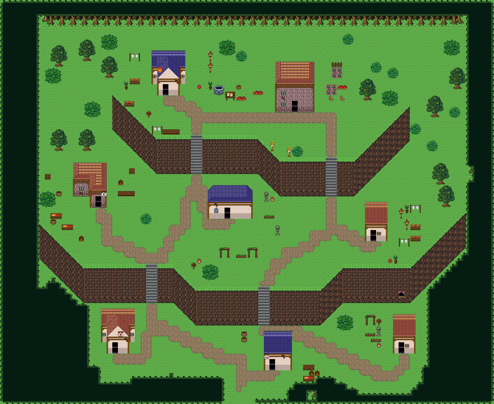

# 사선 잔디 경계와 바닥색

사용자 확정: 기본 바닥240의 그림/색을 유지하고 504·505와 498·499·528·529의 경계를 맞춘다. 원본 시트의 밝은 589로 바닥 전체를 바꾸지 않는다. 공용 tex_forest_harmony_grass_joins는 16px·10열·10칸의 별도 파생 시트다. 기존 forest_harmony 시트 바이트와 이슬여울은 그대로다.




## 정확한 부품 사전

```json
{
  "sourcePath": "public/assets/forest-harmony/chipset.png",
  "sourceSha256": "430f254fe1e0abb081defe98dc3d216d62c58ae59cf60755a0050515dff779bf",
  "floorTile": 240,
  "texture": "tex_forest_harmony_grass_joins",
  "tilesPerRow": 10,
  "count": 10,
  "rockPalette": {
    "108,72,53": [
      139,
      106,
      57
    ],
    "26,22,21": [
      67,
      44,
      30
    ],
    "78,51,36": [
      78,
      51,
      36
    ],
    "74,60,51": [
      107,
      78,
      42
    ],
    "55,38,36": [
      97,
      64,
      38
    ],
    "139,80,52": [
      139,
      80,
      52
    ],
    "36,25,36": [
      81,
      58,
      33
    ],
    "127,93,66": [
      127,
      93,
      66
    ],
    "177,139,87": [
      177,
      139,
      87
    ]
  },
  "tiles": [
    {
      "sourceTile": 504,
      "sourceX": 24,
      "sourceY": 16,
      "targetTile": 0,
      "width": 16,
      "height": 16,
      "alphaUnchanged": true,
      "grassPixels": 138,
      "opaquePixels": 138,
      "change": "grass pixels only"
    },
    {
      "sourceTile": 505,
      "sourceX": 25,
      "sourceY": 16,
      "targetTile": 1,
      "width": 16,
      "height": 16,
      "alphaUnchanged": true,
      "grassPixels": 134,
      "opaquePixels": 134,
      "change": "grass pixels only"
    },
    {
      "sourceTile": 240,
      "sourceX": 0,
      "sourceY": 8,
      "targetTile": 2,
      "width": 16,
      "height": 16,
      "alphaUnchanged": true,
      "grassPixels": 0,
      "opaquePixels": 256,
      "change": "identical floor copy"
    },
    {
      "sourceTile": 498,
      "sourceX": 18,
      "sourceY": 16,
      "targetTile": 3,
      "width": 16,
      "height": 16,
      "alphaUnchanged": true,
      "grassPixels": 122,
      "opaquePixels": 256,
      "change": "grass pixels only"
    },
    {
      "sourceTile": 499,
      "sourceX": 19,
      "sourceY": 16,
      "targetTile": 4,
      "width": 16,
      "height": 16,
      "alphaUnchanged": true,
      "grassPixels": 120,
      "opaquePixels": 256,
      "change": "grass pixels only"
    },
    {
      "sourceTile": 528,
      "sourceX": 18,
      "sourceY": 17,
      "targetTile": 5,
      "width": 16,
      "height": 16,
      "alphaUnchanged": true,
      "grassPixels": 112,
      "opaquePixels": 256,
      "change": "grass pixels only"
    },
    {
      "sourceTile": 529,
      "sourceX": 19,
      "sourceY": 17,
      "targetTile": 6,
      "width": 16,
      "height": 16,
      "alphaUnchanged": true,
      "grassPixels": 114,
      "opaquePixels": 256,
      "change": "grass pixels only"
    },
    {
      "sourceTile": 619,
      "sourceX": 19,
      "sourceY": 20,
      "targetTile": 7,
      "width": 16,
      "height": 16,
      "alphaUnchanged": true,
      "grassPixels": 217,
      "opaquePixels": 256,
      "change": "grass pixels only"
    },
    {
      "sourceTile": 712,
      "sourceX": 22,
      "sourceY": 23,
      "targetTile": 8,
      "width": 16,
      "height": 16,
      "alphaUnchanged": true,
      "grassPixels": 0,
      "opaquePixels": 256,
      "change": "rock palette only"
    },
    {
      "sourceTile": 559,
      "sourceX": 19,
      "sourceY": 18,
      "targetTile": 9,
      "width": 16,
      "height": 16,
      "alphaUnchanged": true,
      "grassPixels": 256,
      "opaquePixels": 256,
      "change": "grass pixels only"
    }
  ]
}
```

```json
{
  "tilesetId": "forest_harmony",
  "grassBindings": {
    "504": 2692,
    "505": 2693,
    "559": 2694
  },
  "grafts": [
    {
      "sourceChipset": "tex_forest_harmony_grass_joins",
      "sourceTile": 3,
      "targetTile": 2670
    },
    {
      "sourceChipset": "tex_forest_harmony_grass_joins",
      "sourceTile": 4,
      "targetTile": 2671
    },
    {
      "sourceChipset": "tex_forest_harmony_grass_joins",
      "sourceTile": 5,
      "targetTile": 2672
    },
    {
      "sourceChipset": "tex_forest_harmony_grass_joins",
      "sourceTile": 6,
      "targetTile": 2673
    },
    {
      "sourceChipset": "tex_forest_harmony_grass_joins",
      "sourceTile": 7,
      "targetTile": 2680
    },
    {
      "sourceChipset": "tex_forest_harmony_grass_joins",
      "sourceTile": 8,
      "targetTile": 2691
    },
    {
      "sourceChipset": "tex_forest_harmony_grass_joins",
      "sourceTile": 0,
      "targetTile": 2692
    },
    {
      "sourceChipset": "tex_forest_harmony_grass_joins",
      "sourceTile": 1,
      "targetTile": 2693
    },
    {
      "sourceChipset": "tex_forest_harmony_grass_joins",
      "sourceTile": 9,
      "targetTile": 2694
    }
  ]
}
```


새 공용 시트 0=504 북서 사선(잔디는 남동쪽), 1=505 북동 사선(잔디는 남서쪽), 2=기존 바닥240 픽셀 그대로. 3/4=498/499 윗 모서리, 5/6=528/529 밑 모서리, 7=619 정면 윗선. 사선 투명 알파는 원본과 동일하며 잔디 세 색 영역만 바닥240 텍스처와 원래 명암 위치로 교체했다. 9=559 수평 반복 잔디. 8=712 오른쪽 암벽: 기존 시트에 남아 있던 어두운 원본 팔레트만 왼쪽711과 맞춘다. 픽셀 위치/형태를 반전하거나 늘이지 않는다. 암벽 모서리의 비잔디 픽셀은 현재 forest_harmony와 같다.

## 레이어 정정과 실행 순서
옛 tileMeta의 504/505 ‘녹색 삼각 지붕’ 설명을 이 용도에 사용하지 않는다. 여기서는 **잔디 경계**다. 새 시트 0/1/9는 lower, layerBacking=2. forest_harmony에 이식한 2692/2693/2694는 lower, layerBacking=240. 상위 소품을 그대로 두고 바닥240 위에 사선만 합성한다. passage=passable, priority=lower. 암벽 3..8은 upper·solid이며 두 속성을 섞지 않는다.

1. 절벽 열·계단→건물→맵 가장자리의 폭3 입구와 길→완전한 잔디 마감→숲→생활 소품 순서다.
2. crest={x,y,width,shoulder}. dx=0..width-1, end=width-1-dx, 배치 좌표=(x+dx,y+max(0,shoulder-min(dx,end))). dx≤shoulder면504, end≤shoulder면505, 나머지는559다. 따라서 왼쪽 올라가는 사선→수평 반복→오른쪽 내려가는 사선으로 끊김 없는 /—\ 모양이 된다.
3. 모든 대상 lower=240, upper=-1, 길 아님을 먼저 확인한다. 한 칸이라도 충돌하면 배치 전체를 거절한다. 잘린 조각을 남기거나 집/뿌리를 덮지 않는다. 전체 조립 주변1칸을 숲/소품에서 예약한다.
4. 이 마감은 북쪽의 낮은 잔디 경계이며 높이5/6의 암벽 면 자체가 아니다. 아래 완성 좌표·전체 배열이 정답이다. 색은 바닥240과 일치하므로 명암 경계는 미세하다.
### 솔바람 흩어진 산촌
```json
[]
```

### 층바위 절벽마을
```json
[]
```

### 두 폭포 강마을
```json
[]
```

### 갈대물굽이 포구
```json
[]
```

### 종탑 언덕 교구마을
```json
[]
```

### 여울성 나루
```json
[]
```

### 안개못 폐촌
```json
[]
```

### 너울목 항구 마을
```json
[]
```


## 입력 → 완전한 두 레이어 출력
개정14(2026-09-24)에서 평평한 잔디 위 마감 줄(crest, 2692~2694)을 모두 걷었다: 덜 깔린 칸처럼 옅은 사다리꼴·사선으로 보였다. 504/505 사선과 모서리는 절벽 윗선 잔디 경계에만 쓴다. 규칙은 마을 채우기 문서 0번.

자동 검사 grass-edge-direction은 반대 사선, grass-color-mismatch는 밝은 원본504/505/559를 잘못 쓴 칸, grass-backing은 받침240 누락의 좌표를 반환한다. grass-crest-gap은 빠진 수평 반복·양쪽 마감, map-entrance-blocked는 맵 가장자리 폭3 통로의 막힌 칸을 반환한다. 정상/오류 그림은 검증 문서 참조. 위의 파생 시트는 모든 새/기존 프로젝트에서 번들 등록되며 문서는 forest_harmony를 공유한다.
