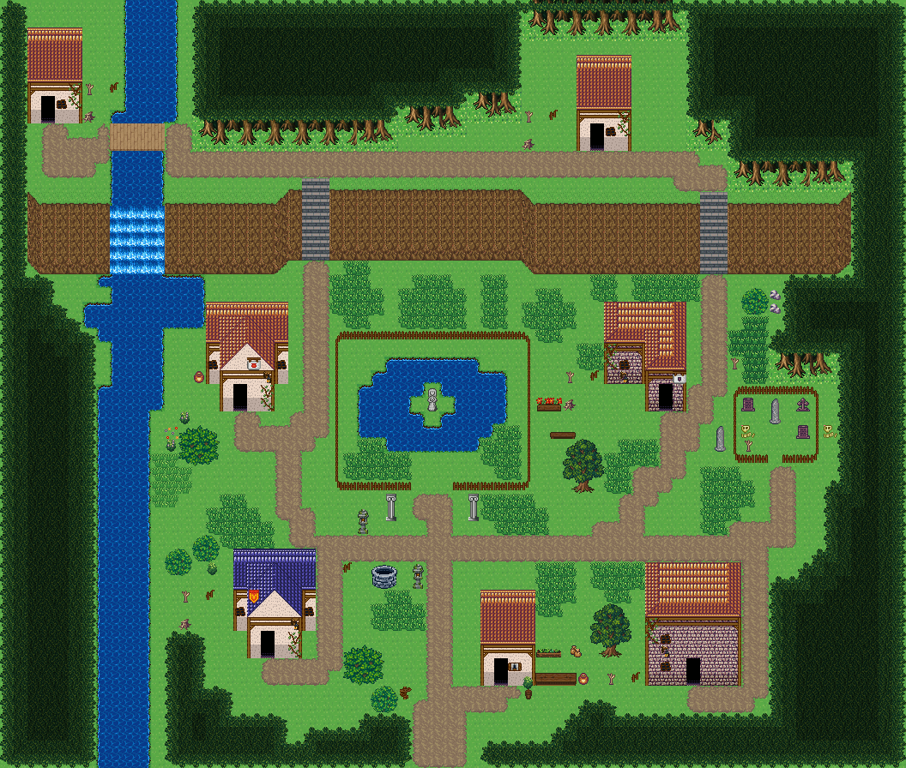

# 안개못 폐촌

사람이 떠난 마을 한가운데 울타리 친 못과 섬 위 석상이 남았고, 서쪽 강이 절벽을 폭포로 넘어 흐르며 외곽에 잊힌 묘지가 있다. 시작점 (31,52); 집 7채. 0기준 맵 좌표. 모든 집은 고정 조각이며 회전/잘라내기 금지. cliffs.points는 x가 증가하는 절벽 윗선 꼭짓점, height는 윗선→밑단의 y 차이다. stairs=[x,y,height]는 폭2, 윗선 행 y부터 y+height까지이고 양끝 착지칸은 y-1/y+height+1이다. 이전 plateaus 윤곽은 사용하지 않는다. 몸통·지붕·소품 전체 배열은 다음 부품 문서와 연결한다.



## 랜드마크
```json
[
  {
    "id": "mistpond-hollow-shrine-pond",
    "kind": "shrine-pond",
    "label": "울타리 친 못과 석상",
    "x": 24,
    "y": 24,
    "w": 15,
    "h": 12,
    "gate": {
      "x": 30,
      "y": 35,
      "w": 3
    }
  },
  {
    "id": "mistpond-hollow-graveyard-small",
    "kind": "graveyard-small",
    "label": "잊힌 묘지",
    "x": 53,
    "y": 28,
    "w": 7,
    "h": 6,
    "gate": {
      "x": 56,
      "y": 33,
      "w": 1
    }
  }
]
```


## 입력 계획과 예약할 접근칸
```json
{
  "mapId": "mistpond-hollow",
  "width": 66,
  "height": 56,
  "seed": 613,
  "start": {
    "x": 31,
    "y": 52
  },
  "yards": [
    {
      "ownerId": "mistpond-hollow-house-1",
      "kit": "abandoned",
      "name": "버려진 마당",
      "reason": "사람이 떠나 마당이 말라 버렸고 부서진 울타리만 남았다",
      "x": 6,
      "y": 6,
      "side": "right",
      "w": 3,
      "h": 3
    },
    {
      "ownerId": "mistpond-hollow-house-2",
      "kit": "abandoned",
      "name": "버려진 마당",
      "reason": "사람이 떠나 마당이 말라 버렸고 부서진 울타리만 남았다",
      "x": 38,
      "y": 8,
      "side": "left",
      "w": 3,
      "h": 3
    },
    {
      "ownerId": "mistpond-hollow-house-4",
      "kit": "abandoned",
      "name": "버려진 마당",
      "reason": "사람이 떠나 마당이 말라 버렸고 부서진 울타리만 남았다",
      "x": 41,
      "y": 27,
      "side": "left",
      "w": 3,
      "h": 3
    },
    {
      "ownerId": "mistpond-hollow-house-5",
      "kit": "abandoned",
      "name": "버려진 마당",
      "reason": "사람이 떠나 마당이 말라 버렸고 부서진 울타리만 남았다",
      "x": 13,
      "y": 43,
      "side": "left",
      "w": 3,
      "h": 3
    },
    {
      "ownerId": "mistpond-hollow-house-6",
      "kit": "abandoned",
      "name": "버려진 마당",
      "reason": "사람이 떠나 마당이 말라 버렸고 부서진 울타리만 남았다",
      "x": 44,
      "y": 49,
      "side": "left",
      "w": 3,
      "h": 1
    },
    {
      "ownerId": "mistpond-hollow-house-7",
      "kit": "herbs",
      "name": "약초 손질",
      "reason": "마지막으로 남은 못지기가 못가 약초를 손질하며 석상을 돌본다",
      "x": 39,
      "y": 47,
      "side": "right",
      "w": 4,
      "h": 3
    }
  ],
  "activitySites": {},
  "civicPlaces": [
    {
      "id": "pond-gate",
      "name": "못 울타리 들머리",
      "anchor": {
        "type": "landmark",
        "id": "mistpond-hollow-shrine-pond",
        "maxDistance": 4
      },
      "items": [
        {
          "id": "pond-gate-1",
          "name": "흰 돌기둥",
          "x": 28,
          "y": 36,
          "purpose": "못 울타리 입구 서쪽 돌기둥"
        },
        {
          "id": "pond-gate-2",
          "name": "흰 돌기둥",
          "x": 34,
          "y": 36,
          "purpose": "못 울타리 입구 동쪽 돌기둥",
          "near": "흰 돌기둥"
        },
        {
          "id": "pond-gate-3",
          "name": "돌등",
          "x": 26,
          "y": 37,
          "purpose": "꺼진 채 남은 입구 등"
        }
      ],
      "site": {
        "x": 24,
        "y": 24,
        "w": 15,
        "h": 12,
        "layer": "lower",
        "tiles": [
          240,
          240,
          240,
          240,
          240,
          240,
          240,
          240,
          240,
          240,
          240,
          240,
          240,
          240,
          240,
          240,
          240,
          240,
          240,
          240,
          240,
          240,
          240,
          240,
          240,
          240,
          240,
          240,
          240,
          240,
          240,
          240,
          240,
          240,
          1537,
          1548,
          1548,
          1548,
          1548,
          1548,
          1543,
          240,
          240,
          240,
          240,
          240,
          240,
          240,
          1537,
          1550,
          1563,
          1561,
          1555,
          1558,
          1563,
          1562,
          1548,
          1543,
          240,
          240,
          240,
          240,
          1537,
          1550,
          1563,
          1561,
          1551,
          240,
          1533,
          1558,
          1563,
          1563,
          1559,
          240,
          240,
          240,
          240,
          1541,
          1563,
          1563,
          1559,
          240,
          240,
          240,
          1541,
          1563,
          1563,
          1559,
          240,
          240,
          240,
          240,
          1541,
          1563,
          1563,
          1562,
          1543,
          240,
          1537,
          1550,
          1563,
          1561,
          1551,
          240,
          240,
          240,
          240,
          1533,
          1555,
          1558,
          1563,
          1562,
          1548,
          1550,
          1563,
          1561,
          1551,
          1128,
          1130,
          240,
          240,
          240,
          1128,
          1130,
          1533,
          1555,
          1555,
          1555,
          1555,
          1555,
          1551,
          1128,
          1161,
          1160,
          240,
          240,
          1128,
          1161,
          1161,
          1129,
          1130,
          240,
          240,
          240,
          240,
          240,
          1188,
          1161,
          1160,
          240,
          240,
          1188,
          1189,
          1189,
          1189,
          1190,
          240,
          240,
          240,
          240,
          240,
          240,
          1188,
          1190,
          240,
          240,
          240,
          240,
          240,
          240,
          240,
          240,
          240,
          240,
          240,
          240,
          240,
          240,
          240,
          240
        ]
      }
    },
    {
      "id": "pond-offering",
      "name": "못가 제물 자리",
      "anchor": {
        "type": "landmark",
        "id": "mistpond-hollow-shrine-pond",
        "maxDistance": 6
      },
      "items": [
        {
          "id": "pond-offering-1",
          "name": "벤치",
          "x": 40,
          "y": 31,
          "purpose": "못지기가 석상을 바라보며 앉는 자리"
        },
        {
          "id": "pond-offering-2",
          "name": "꽃 화단",
          "x": 39,
          "y": 28,
          "purpose": "석상에 바칠 꽃을 기르는 화단"
        }
      ],
      "site": {
        "x": 24,
        "y": 24,
        "w": 15,
        "h": 12,
        "layer": "lower",
        "tiles": [
          240,
          240,
          240,
          240,
          240,
          240,
          240,
          240,
          240,
          240,
          240,
          240,
          240,
          240,
          240,
          240,
          240,
          240,
          240,
          240,
          240,
          240,
          240,
          240,
          240,
          240,
          240,
          240,
          240,
          240,
          240,
          240,
          240,
          240,
          1537,
          1548,
          1548,
          1548,
          1548,
          1548,
          1543,
          240,
          240,
          240,
          240,
          240,
          240,
          240,
          1537,
          1550,
          1563,
          1561,
          1555,
          1558,
          1563,
          1562,
          1548,
          1543,
          240,
          240,
          240,
          240,
          1537,
          1550,
          1563,
          1561,
          1551,
          240,
          1533,
          1558,
          1563,
          1563,
          1559,
          240,
          240,
          240,
          240,
          1541,
          1563,
          1563,
          1559,
          240,
          240,
          240,
          1541,
          1563,
          1563,
          1559,
          240,
          240,
          240,
          240,
          1541,
          1563,
          1563,
          1562,
          1543,
          240,
          1537,
          1550,
          1563,
          1561,
          1551,
          240,
          240,
          240,
          240,
          1533,
          1555,
          1558,
          1563,
          1562,
          1548,
          1550,
          1563,
          1561,
          1551,
          1128,
          1130,
          240,
          240,
          240,
          1128,
          1130,
          1533,
          1555,
          1555,
          1555,
          1555,
          1555,
          1551,
          1128,
          1161,
          1160,
          240,
          240,
          1128,
          1161,
          1161,
          1129,
          1130,
          240,
          240,
          240,
          240,
          240,
          1188,
          1161,
          1160,
          240,
          240,
          1188,
          1189,
          1189,
          1189,
          1190,
          240,
          240,
          240,
          240,
          240,
          240,
          1188,
          1190,
          240,
          240,
          240,
          240,
          240,
          240,
          240,
          240,
          240,
          240,
          240,
          240,
          240,
          240,
          240,
          240
        ]
      }
    },
    {
      "id": "grave-edge",
      "name": "잊힌 묘지 가장자리",
      "anchor": {
        "type": "landmark",
        "id": "mistpond-hollow-graveyard-small",
        "maxDistance": 5
      },
      "items": [
        {
          "id": "grave-edge-1",
          "name": "마른 묘목",
          "x": 53,
          "y": 26,
          "purpose": "묘지 울타리 곁 말라 죽은 나무"
        },
        {
          "id": "grave-edge-2",
          "name": "해골",
          "x": 60,
          "y": 31,
          "purpose": "묘지 밖에 굴러 나온 해골"
        },
        {
          "id": "grave-edge-3",
          "name": "돌 오벨리스크",
          "x": 52,
          "y": 31,
          "purpose": "마을이 비기 전 세운 위령비"
        }
      ],
      "site": {
        "x": 53,
        "y": 28,
        "w": 7,
        "h": 6,
        "layer": "lower",
        "tiles": [
          240,
          240,
          240,
          240,
          240,
          240,
          240,
          240,
          240,
          240,
          240,
          240,
          240,
          240,
          240,
          240,
          240,
          240,
          240,
          240,
          240,
          240,
          240,
          240,
          240,
          240,
          240,
          240,
          240,
          240,
          240,
          240,
          240,
          240,
          240,
          240,
          240,
          240,
          240,
          240,
          240,
          240
        ]
      }
    },
    {
      "id": "dead-well",
      "name": "말라 버린 우물",
      "anchor": {
        "type": "road",
        "x": 31,
        "y": 39,
        "maxDistance": 8
      },
      "items": [
        {
          "id": "dead-well-1",
          "name": "낮은 돌 우물",
          "x": 27,
          "y": 41,
          "purpose": "물이 끊긴 옛 공동 우물"
        },
        {
          "id": "dead-well-2",
          "name": "부서진 울타리",
          "x": 25,
          "y": 41,
          "purpose": "무너진 우물가 울타리",
          "near": "낮은 돌 우물"
        },
        {
          "id": "dead-well-plaza-1",
          "name": "돌등",
          "x": 30,
          "y": 41,
          "purpose": "밤에 우물가를 밝히는 돌등",
          "near": "낮은 돌 우물"
        }
      ],
      "site": {
        "x": 31,
        "y": 39,
        "w": 1,
        "h": 1,
        "layer": "lower",
        "tiles": [
          1503
        ]
      }
    },
    {
      "id": "falls-lookout",
      "name": "폭포 아래 옛 빨래터",
      "anchor": {
        "type": "road",
        "x": 17,
        "y": 32,
        "maxDistance": 10
      },
      "items": [
        {
          "id": "falls-lookout-1",
          "name": "항아리",
          "x": 14,
          "y": 27,
          "purpose": "빨래터에 버려진 물항아리"
        }
      ],
      "site": {
        "x": 17,
        "y": 32,
        "w": 1,
        "h": 1,
        "layer": "lower",
        "tiles": [
          1486
        ]
      }
    },
    {
      "id": "entry-sign",
      "name": "남쪽 입구 길잡이",
      "anchor": {
        "type": "road",
        "x": 31,
        "y": 52,
        "maxDistance": 10
      },
      "items": [
        {
          "id": "entry-sign-1",
          "name": "나무 이정표",
          "x": 29,
          "y": 50,
          "purpose": "글씨가 바랜 마을 이정표"
        }
      ],
      "site": {
        "x": 31,
        "y": 52,
        "w": 1,
        "h": 1,
        "layer": "lower",
        "tiles": [
          1516
        ]
      }
    }
  ],
  "entrance": {
    "x": 31,
    "y": 55
  },
  "crest": null,
  "patches": [
    [
      3,
      35,
      8,
      14,
      10
    ],
    [
      64,
      16,
      6,
      12,
      9
    ],
    [
      62,
      48,
      8,
      8,
      9
    ],
    [
      0,
      52,
      8,
      6,
      9
    ],
    [
      30,
      5,
      9,
      4,
      10
    ]
  ],
  "clearings": [
    [
      31,
      29,
      12,
      10,
      12
    ],
    [
      39,
      47,
      14,
      6,
      9
    ]
  ],
  "cliffs": [
    {
      "points": [
        [
          2,
          14
        ],
        [
          20,
          14
        ],
        [
          21,
          13
        ],
        [
          37,
          13
        ],
        [
          39,
          14
        ],
        [
          61,
          14
        ]
      ],
      "height": 5
    }
  ],
  "stairs": [
    [
      22,
      13,
      5
    ],
    [
      51,
      14,
      5
    ]
  ],
  "ponds": [],
  "coast": false,
  "dock": null,
  "cave": null,
  "spine": [
    [
      31,
      54
    ],
    [
      31,
      39
    ],
    [
      31,
      37
    ],
    [
      31,
      39
    ],
    [
      21,
      38
    ],
    [
      20,
      33
    ],
    [
      22,
      26
    ],
    [
      22,
      20
    ],
    [
      22,
      12
    ],
    [
      15,
      11
    ],
    [
      5,
      11
    ],
    [
      15,
      11
    ],
    [
      22,
      12
    ],
    [
      40,
      12
    ],
    [
      44,
      11
    ],
    [
      51,
      12
    ],
    [
      51,
      21
    ],
    [
      48,
      32
    ],
    [
      41,
      39
    ],
    [
      31,
      39
    ],
    [
      46,
      39
    ],
    [
      51,
      39
    ],
    [
      56,
      37
    ]
  ],
  "access": [
    {
      "role": "stairs-top",
      "x": 22,
      "y": 12
    },
    {
      "role": "stairs-bottom",
      "x": 22,
      "y": 19
    },
    {
      "role": "stairs-top",
      "x": 51,
      "y": 13
    },
    {
      "role": "stairs-bottom",
      "x": 51,
      "y": 20
    },
    {
      "role": "bridge-west",
      "x": 7,
      "y": 9
    },
    {
      "role": "bridge-east",
      "x": 12,
      "y": 9
    },
    {
      "role": "door-front",
      "x": 3,
      "y": 9
    },
    {
      "role": "door-front",
      "x": 43,
      "y": 11
    },
    {
      "role": "door-front",
      "x": 17,
      "y": 30
    },
    {
      "role": "door-front",
      "x": 48,
      "y": 30
    },
    {
      "role": "door-front",
      "x": 19,
      "y": 48
    },
    {
      "role": "door-front",
      "x": 50,
      "y": 50
    },
    {
      "role": "door-front",
      "x": 36,
      "y": 50
    },
    {
      "role": "yard-gate",
      "x": 30,
      "y": 36,
      "landmarkId": "mistpond-hollow-shrine-pond"
    },
    {
      "role": "yard-inside",
      "x": 30,
      "y": 34,
      "landmarkId": "mistpond-hollow-shrine-pond"
    },
    {
      "role": "yard-gate",
      "x": 56,
      "y": 34,
      "landmarkId": "mistpond-hollow-graveyard-small"
    },
    {
      "role": "yard-inside",
      "x": 56,
      "y": 32,
      "landmarkId": "mistpond-hollow-graveyard-small"
    },
    {
      "role": "map-entrance",
      "x": 30,
      "y": 55
    },
    {
      "role": "map-entrance",
      "x": 31,
      "y": 55
    },
    {
      "role": "map-entrance",
      "x": 32,
      "y": 55
    },
    {
      "role": "map-entrance",
      "x": 30,
      "y": 54
    },
    {
      "role": "map-entrance",
      "x": 31,
      "y": 54
    },
    {
      "role": "map-entrance",
      "x": 32,
      "y": 54
    },
    {
      "role": "map-entrance",
      "x": 30,
      "y": 53
    },
    {
      "role": "map-entrance",
      "x": 31,
      "y": 53
    },
    {
      "role": "map-entrance",
      "x": 32,
      "y": 53
    },
    {
      "role": "map-entrance",
      "x": 30,
      "y": 52
    },
    {
      "role": "map-entrance",
      "x": 31,
      "y": 52
    },
    {
      "role": "map-entrance",
      "x": 32,
      "y": 52
    },
    {
      "role": "map-entrance",
      "x": 30,
      "y": 51
    },
    {
      "role": "map-entrance",
      "x": 31,
      "y": 51
    },
    {
      "role": "map-entrance",
      "x": 32,
      "y": 51
    },
    {
      "role": "civic-use",
      "x": 27,
      "y": 36,
      "placeId": "pond-gate",
      "propId": "pond-gate-1"
    },
    {
      "role": "civic-use",
      "x": 33,
      "y": 36,
      "placeId": "pond-gate",
      "propId": "pond-gate-2"
    },
    {
      "role": "civic-use",
      "x": 25,
      "y": 37,
      "placeId": "pond-gate",
      "propId": "pond-gate-3"
    },
    {
      "role": "civic-use",
      "x": 40,
      "y": 32,
      "placeId": "pond-offering",
      "propId": "pond-offering-1"
    },
    {
      "role": "civic-use",
      "x": 39,
      "y": 27,
      "placeId": "pond-offering",
      "propId": "pond-offering-2"
    },
    {
      "role": "civic-use",
      "x": 53,
      "y": 27,
      "placeId": "grave-edge",
      "propId": "grave-edge-1"
    },
    {
      "role": "civic-use",
      "x": 60,
      "y": 32,
      "placeId": "grave-edge",
      "propId": "grave-edge-2"
    },
    {
      "role": "civic-use",
      "x": 51,
      "y": 31,
      "placeId": "grave-edge",
      "propId": "grave-edge-3"
    },
    {
      "role": "civic-use",
      "x": 26,
      "y": 41,
      "placeId": "dead-well",
      "propId": "dead-well-1"
    },
    {
      "role": "civic-use",
      "x": 25,
      "y": 42,
      "placeId": "dead-well",
      "propId": "dead-well-2"
    },
    {
      "role": "civic-use",
      "x": 14,
      "y": 28,
      "placeId": "falls-lookout",
      "propId": "falls-lookout-1"
    },
    {
      "role": "civic-use",
      "x": 29,
      "y": 51,
      "placeId": "entry-sign",
      "propId": "entry-sign-1"
    },
    {
      "role": "civic-use",
      "x": 29,
      "y": 41,
      "placeId": "dead-well",
      "propId": "dead-well-plaza-1"
    }
  ]
}
```


## 건물의 전체 하위·상위
### mistpond-hollow-house-1
```json
{
  "id": "mistpond-hollow-house-1",
  "role": "폐가",
  "label": "폐가 · 왕궁 도시 · 주황 박공 회벽집 4×7 ②",
  "window": 88,
  "abandoned": true,
  "vines": [
    {
      "x": 5,
      "y": 6,
      "tiles": [
        265,
        295
      ]
    }
  ],
  "x": 2,
  "y": 2,
  "w": 4,
  "h": 7,
  "template": 3,
  "doorAt": {
    "x": 3,
    "y": 8
  },
  "front": {
    "x": 3,
    "y": 9
  },
  "activity": "abandoned",
  "reason": "사람이 떠나 마당이 말라 버렸고 부서진 울타리만 남았다",
  "width": 4,
  "height": 7,
  "lowerTiles": [
    [
      374,
      374,
      374,
      374
    ],
    [
      375,
      375,
      375,
      375
    ],
    [
      375,
      375,
      375,
      375
    ],
    [
      405,
      405,
      405,
      405
    ],
    [
      15,
      16,
      16,
      17
    ],
    [
      45,
      329,
      46,
      47
    ],
    [
      75,
      359,
      76,
      77
    ]
  ],
  "upperTiles": [
    [
      -1,
      -1,
      -1,
      -1
    ],
    [
      -1,
      -1,
      -1,
      -1
    ],
    [
      -1,
      -1,
      -1,
      -1
    ],
    [
      -1,
      -1,
      -1,
      -1
    ],
    [
      -1,
      -1,
      -1,
      265
    ],
    [
      -1,
      -1,
      88,
      295
    ],
    [
      -1,
      -1,
      -1,
      -1
    ]
  ]
}
```

### mistpond-hollow-house-2
```json
{
  "id": "mistpond-hollow-house-2",
  "role": "폐가",
  "label": "폐가 · 왕궁 도시 · 주황 박공 회벽집 4×7 ②",
  "window": 88,
  "abandoned": true,
  "vines": [
    {
      "x": 45,
      "y": 8,
      "tiles": [
        265,
        295
      ]
    }
  ],
  "x": 42,
  "y": 4,
  "w": 4,
  "h": 7,
  "template": 3,
  "doorAt": {
    "x": 43,
    "y": 10
  },
  "front": {
    "x": 43,
    "y": 11
  },
  "activity": "abandoned",
  "reason": "사람이 떠나 마당이 말라 버렸고 부서진 울타리만 남았다",
  "width": 4,
  "height": 7,
  "lowerTiles": [
    [
      374,
      374,
      374,
      374
    ],
    [
      375,
      375,
      375,
      375
    ],
    [
      375,
      375,
      375,
      375
    ],
    [
      405,
      405,
      405,
      405
    ],
    [
      15,
      16,
      16,
      17
    ],
    [
      45,
      329,
      46,
      47
    ],
    [
      75,
      359,
      76,
      77
    ]
  ],
  "upperTiles": [
    [
      -1,
      -1,
      -1,
      -1
    ],
    [
      -1,
      -1,
      -1,
      -1
    ],
    [
      -1,
      -1,
      -1,
      -1
    ],
    [
      -1,
      -1,
      -1,
      -1
    ],
    [
      -1,
      -1,
      -1,
      265
    ],
    [
      -1,
      -1,
      88,
      295
    ],
    [
      -1,
      -1,
      -1,
      -1
    ]
  ]
}
```

### mistpond-hollow-house-3
```json
{
  "id": "mistpond-hollow-house-3",
  "role": "폐가",
  "label": "폐가 · 왕궁 도시 · 주황 박공 회벽집 6×8",
  "window": 88,
  "abandoned": true,
  "vines": [
    {
      "x": 19,
      "y": 28,
      "tiles": [
        265,
        295
      ]
    }
  ],
  "x": 15,
  "y": 22,
  "w": 6,
  "h": 8,
  "template": 2,
  "doorAt": {
    "x": 17,
    "y": 29
  },
  "front": {
    "x": 17,
    "y": 30
  },
  "activity": "abandoned",
  "reason": "사람이 떠나 마당이 말라 버렸고 부서진 울타리만 남았다",
  "width": 6,
  "height": 8,
  "lowerTiles": [
    [
      374,
      374,
      374,
      374,
      374,
      374
    ],
    [
      375,
      376,
      376,
      377,
      377,
      375
    ],
    [
      405,
      376,
      376,
      377,
      377,
      405
    ],
    [
      15,
      376,
      46,
      46,
      377,
      15
    ],
    [
      45,
      46,
      46,
      46,
      46,
      45
    ],
    [
      75,
      15,
      16,
      16,
      17,
      75
    ],
    [
      240,
      45,
      329,
      46,
      47,
      240
    ],
    [
      240,
      75,
      359,
      76,
      77,
      240
    ]
  ],
  "upperTiles": [
    [
      -1,
      -1,
      -1,
      -1,
      -1,
      -1
    ],
    [
      -1,
      -1,
      354,
      355,
      -1,
      -1
    ],
    [
      -1,
      354,
      -1,
      -1,
      355,
      -1
    ],
    [
      -1,
      -1,
      384,
      385,
      -1,
      -1
    ],
    [
      88,
      384,
      -1,
      473,
      385,
      88
    ],
    [
      -1,
      -1,
      -1,
      -1,
      2645,
      -1
    ],
    [
      -1,
      -1,
      -1,
      -1,
      265,
      -1
    ],
    [
      -1,
      -1,
      -1,
      -1,
      295,
      -1
    ]
  ]
}
```

### mistpond-hollow-house-4
```json
{
  "id": "mistpond-hollow-house-4",
  "role": "폐가",
  "label": "폐가 · 오렌지 회벽 l-mirror 집",
  "window": 88,
  "abandoned": true,
  "vines": [
    {
      "x": 44,
      "y": 25,
      "tiles": [
        265,
        295
      ]
    }
  ],
  "x": 44,
  "y": 22,
  "w": 6,
  "h": 8,
  "template": 1,
  "doorAt": {
    "x": 48,
    "y": 29
  },
  "front": {
    "x": 48,
    "y": 30
  },
  "activity": "abandoned",
  "reason": "사람이 떠나 마당이 말라 버렸고 부서진 울타리만 남았다",
  "width": 6,
  "height": 8,
  "lowerTiles": [
    [
      376,
      404,
      404,
      404,
      404,
      377
    ],
    [
      376,
      404,
      404,
      404,
      404,
      377
    ],
    [
      405,
      405,
      405,
      376,
      404,
      377
    ],
    [
      12,
      13,
      14,
      376,
      404,
      377
    ],
    [
      42,
      43,
      44,
      405,
      405,
      405
    ],
    [
      72,
      73,
      74,
      12,
      13,
      14
    ],
    [
      240,
      240,
      240,
      42,
      329,
      44
    ],
    [
      240,
      240,
      240,
      72,
      359,
      74
    ]
  ],
  "upperTiles": [
    [
      -1,
      -1,
      -1,
      -1,
      -1,
      -1
    ],
    [
      -1,
      -1,
      -1,
      -1,
      -1,
      -1
    ],
    [
      384,
      -1,
      -1,
      -1,
      -1,
      -1
    ],
    [
      265,
      -1,
      -1,
      -1,
      -1,
      -1
    ],
    [
      295,
      88,
      -1,
      384,
      -1,
      385
    ],
    [
      -1,
      2645,
      -1,
      -1,
      -1,
      472
    ],
    [
      -1,
      -1,
      -1,
      -1,
      -1,
      -1
    ],
    [
      -1,
      -1,
      -1,
      -1,
      -1,
      -1
    ]
  ]
}
```

### mistpond-hollow-house-5
```json
{
  "id": "mistpond-hollow-house-5",
  "role": "폐가",
  "label": "폐가 · 왕궁 도시 · 파랑 박공 회벽집 6×8 ②",
  "window": 88,
  "abandoned": true,
  "vines": [
    {
      "x": 21,
      "y": 46,
      "tiles": [
        265,
        295
      ]
    }
  ],
  "x": 17,
  "y": 40,
  "w": 6,
  "h": 8,
  "template": 0,
  "doorAt": {
    "x": 19,
    "y": 47
  },
  "front": {
    "x": 19,
    "y": 48
  },
  "activity": "abandoned",
  "reason": "사람이 떠나 마당이 말라 버렸고 부서진 울타리만 남았다",
  "width": 6,
  "height": 8,
  "lowerTiles": [
    [
      436,
      436,
      436,
      436,
      436,
      436
    ],
    [
      437,
      406,
      406,
      407,
      407,
      437
    ],
    [
      467,
      406,
      406,
      407,
      407,
      467
    ],
    [
      15,
      406,
      46,
      46,
      407,
      15
    ],
    [
      45,
      46,
      46,
      46,
      46,
      45
    ],
    [
      75,
      15,
      16,
      16,
      17,
      75
    ],
    [
      240,
      45,
      329,
      46,
      47,
      240
    ],
    [
      240,
      75,
      359,
      76,
      77,
      240
    ]
  ],
  "upperTiles": [
    [
      -1,
      -1,
      -1,
      -1,
      -1,
      -1
    ],
    [
      -1,
      -1,
      356,
      357,
      -1,
      -1
    ],
    [
      -1,
      356,
      -1,
      -1,
      357,
      -1
    ],
    [
      -1,
      208,
      386,
      387,
      -1,
      -1
    ],
    [
      88,
      386,
      -1,
      -1,
      387,
      88
    ],
    [
      -1,
      -1,
      -1,
      -1,
      2645,
      -1
    ],
    [
      -1,
      -1,
      -1,
      -1,
      265,
      -1
    ],
    [
      -1,
      -1,
      -1,
      -1,
      295,
      -1
    ]
  ]
}
```

### mistpond-hollow-house-6
```json
{
  "id": "mistpond-hollow-house-6",
  "role": "폐가",
  "label": "폐가 · 오렌지 회벽 2층 rect-2f 집",
  "window": 88,
  "abandoned": true,
  "vines": [
    {
      "x": 47,
      "y": 45,
      "tiles": [
        265,
        295
      ]
    }
  ],
  "x": 47,
  "y": 41,
  "w": 7,
  "h": 9,
  "template": 4,
  "doorAt": {
    "x": 50,
    "y": 49
  },
  "front": {
    "x": 50,
    "y": 50
  },
  "activity": "abandoned",
  "reason": "사람이 떠나 마당이 말라 버렸고 부서진 울타리만 남았다",
  "width": 7,
  "height": 9,
  "lowerTiles": [
    [
      376,
      404,
      404,
      404,
      404,
      404,
      377
    ],
    [
      376,
      404,
      404,
      404,
      404,
      404,
      377
    ],
    [
      376,
      404,
      404,
      404,
      404,
      404,
      377
    ],
    [
      405,
      405,
      405,
      405,
      405,
      405,
      405
    ],
    [
      12,
      13,
      13,
      13,
      13,
      13,
      14
    ],
    [
      42,
      43,
      43,
      43,
      43,
      43,
      44
    ],
    [
      42,
      43,
      43,
      43,
      43,
      43,
      44
    ],
    [
      42,
      43,
      43,
      329,
      43,
      43,
      44
    ],
    [
      72,
      73,
      73,
      359,
      73,
      73,
      74
    ]
  ],
  "upperTiles": [
    [
      -1,
      -1,
      -1,
      -1,
      -1,
      -1,
      -1
    ],
    [
      -1,
      -1,
      -1,
      -1,
      -1,
      -1,
      -1
    ],
    [
      -1,
      -1,
      -1,
      -1,
      -1,
      -1,
      -1
    ],
    [
      384,
      -1,
      -1,
      -1,
      -1,
      -1,
      385
    ],
    [
      265,
      -1,
      -1,
      -1,
      -1,
      -1,
      -1
    ],
    [
      295,
      88,
      -1,
      -1,
      -1,
      -1,
      -1
    ],
    [
      -1,
      2645,
      -1,
      -1,
      -1,
      -1,
      -1
    ],
    [
      -1,
      88,
      -1,
      -1,
      -1,
      -1,
      -1
    ],
    [
      -1,
      -1,
      -1,
      -1,
      -1,
      -1,
      -1
    ]
  ]
}
```

### mistpond-hollow-house-7
```json
{
  "id": "mistpond-hollow-house-7",
  "role": "못지기 집",
  "label": "왕궁 도시 · 주황 박공 회벽집 4×7 ②",
  "window": 86,
  "abandoned": false,
  "vines": [],
  "x": 35,
  "y": 43,
  "w": 4,
  "h": 7,
  "template": 5,
  "doorAt": {
    "x": 36,
    "y": 49
  },
  "front": {
    "x": 36,
    "y": 50
  },
  "activity": "herbs",
  "reason": "마지막으로 남은 못지기가 못가 약초를 손질하며 석상을 돌본다",
  "width": 4,
  "height": 7,
  "lowerTiles": [
    [
      374,
      374,
      374,
      374
    ],
    [
      375,
      375,
      375,
      375
    ],
    [
      375,
      375,
      375,
      375
    ],
    [
      405,
      405,
      405,
      405
    ],
    [
      15,
      16,
      16,
      17
    ],
    [
      45,
      329,
      46,
      47
    ],
    [
      75,
      359,
      76,
      77
    ]
  ],
  "upperTiles": [
    [
      -1,
      -1,
      -1,
      -1
    ],
    [
      -1,
      -1,
      -1,
      -1
    ],
    [
      -1,
      -1,
      -1,
      -1
    ],
    [
      -1,
      -1,
      -1,
      -1
    ],
    [
      -1,
      -1,
      -1,
      -1
    ],
    [
      -1,
      -1,
      86,
      -1
    ],
    [
      -1,
      -1,
      -1,
      2632
    ]
  ]
}
```
