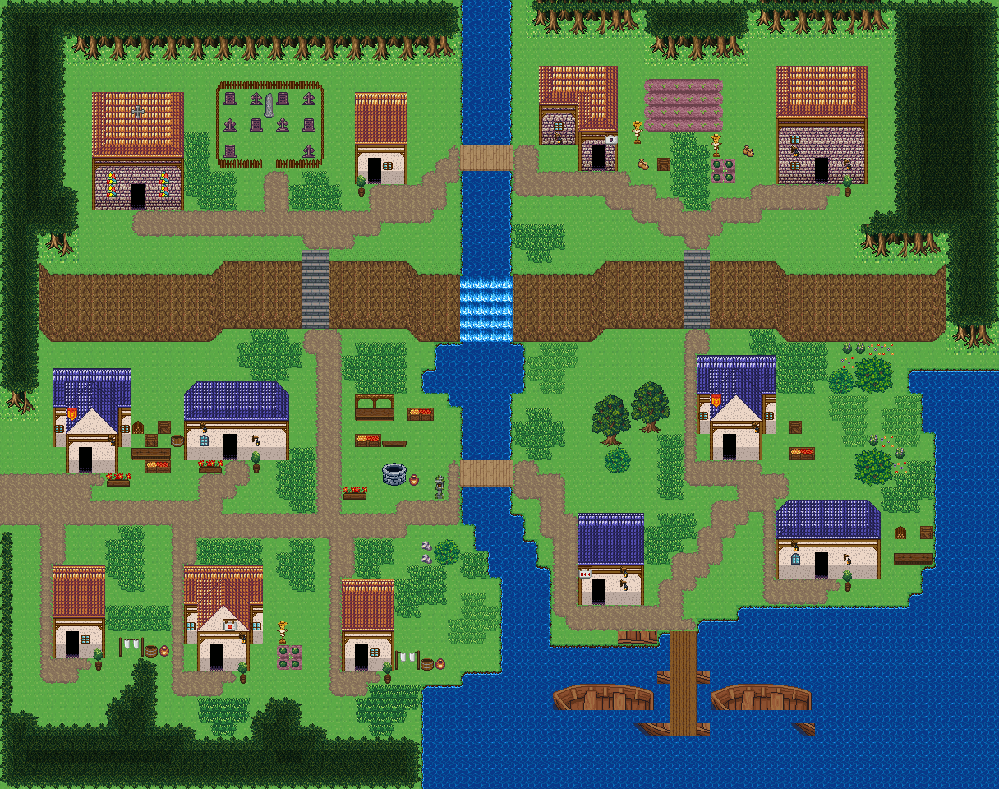

# 너울목 항구 마을

북쪽 숲에서 나온 강이 윗단을 가로질러 절벽을 폭포로 넘고 남동쪽 물굽이로 흘러든다. 윗단 서쪽은 교회와 묘지가 있는 신전 구역, 윗단 동쪽은 밭을 끼고 사는 농가 구역, 아랫단 서쪽은 우물과 좌판이 있는 장터, 아랫단 남동쪽은 긴 부두와 배가 있는 항구다. 두 다리와 두 계단이 한 바퀴 도는 길을 만든다. 시작점 (2,37); 집 11채. 0기준 맵 좌표. 모든 집은 고정 조각이며 회전/잘라내기 금지. cliffs.points는 x가 증가하는 절벽 윗선 꼭짓점, height는 윗선→밑단의 y 차이다. stairs=[x,y,height]는 폭2, 윗선 행 y부터 y+height까지이고 양끝 착지칸은 y-1/y+height+1이다. 이전 plateaus 윤곽은 사용하지 않는다. 몸통·지붕·소품 전체 배열은 다음 부품 문서와 연결한다.



## 랜드마크
```json
[
  {
    "id": "nuleolmok-harbor-town-church",
    "kind": "church",
    "label": "돌벽 교회",
    "x": 7,
    "y": 7,
    "w": 7,
    "h": 9,
    "doors": [
      {
        "x": 10,
        "y": 15
      }
    ]
  },
  {
    "id": "nuleolmok-harbor-town-graveyard",
    "kind": "graveyard",
    "label": "마을 외곽 묘지",
    "x": 16,
    "y": 6,
    "w": 9,
    "h": 7,
    "gate": {
      "x": 20,
      "y": 12,
      "w": 1
    }
  }
]
```


## 입력 계획과 예약할 접근칸
```json
{
  "mapId": "nuleolmok-harbor-town",
  "width": 76,
  "height": 60,
  "seed": 1049,
  "start": {
    "x": 2,
    "y": 37
  },
  "yards": [
    {
      "ownerId": "nuleolmok-harbor-town-house-2",
      "kit": "field-tending",
      "name": "기존 밭 돌보기",
      "reason": "윗단 동쪽 농가 구역 첫 집이 바로 아래 큰 밭(52,14)을 돌본다",
      "x": 48,
      "y": 9,
      "side": "right",
      "w": 3,
      "h": 4
    },
    {
      "ownerId": "nuleolmok-harbor-town-house-3",
      "kit": "growing",
      "name": "텃밭 돌보기",
      "reason": "윗단 동쪽 끝 농가는 집 옆에 제 텃밭을 둔다",
      "x": 54,
      "y": 10,
      "side": "left",
      "w": 4,
      "h": 4
    },
    {
      "ownerId": "nuleolmok-harbor-town-house-4",
      "kit": "storage",
      "name": "물자 보관",
      "reason": "서쪽 입구 옆 집을 장터 좌판에 댈 물자 창고로 쓴다",
      "x": 11,
      "y": 33,
      "side": "right",
      "w": 3,
      "h": 3
    },
    {
      "ownerId": "nuleolmok-harbor-town-house-5",
      "kit": "woodwork",
      "name": "목재 가공",
      "reason": "장터 북쪽 집은 좌판·통을 짜는 목공 마당을 둔다",
      "x": 10,
      "y": 32,
      "side": "left",
      "w": 3,
      "h": 3
    },
    {
      "ownerId": "nuleolmok-harbor-town-house-6",
      "kit": "laundry",
      "name": "세탁·건조",
      "reason": "아랫단 남서쪽 주거 마당은 세탁·건조 공간",
      "x": 9,
      "y": 48,
      "side": "right",
      "w": 4,
      "h": 2
    },
    {
      "ownerId": "nuleolmok-harbor-town-house-7",
      "kit": "growing",
      "name": "텃밭 돌보기",
      "reason": "남서쪽 가운데 집은 집 옆 텃밭을 가꾼다",
      "x": 21,
      "y": 47,
      "side": "right",
      "w": 2,
      "h": 4
    },
    {
      "ownerId": "nuleolmok-harbor-town-house-8",
      "kit": "laundry",
      "name": "세탁·건조",
      "reason": "남서쪽 동쪽 끝 주거는 세탁·건조 마당만 둔다",
      "x": 30,
      "y": 49,
      "side": "right",
      "w": 4,
      "h": 2
    },
    {
      "ownerId": "nuleolmok-harbor-town-house-10",
      "kit": "storage",
      "name": "물자 보관",
      "reason": "동쪽 계단 아래 집을 배에서 내린 짐을 두는 창고로 쓴다",
      "x": 60,
      "y": 32,
      "side": "right",
      "w": 4,
      "h": 3
    },
    {
      "ownerId": "nuleolmok-harbor-town-house-11",
      "kit": "woodwork",
      "name": "목재 가공",
      "reason": "항구 동쪽 물가 집에서 배에 쓸 목재를 다룬다",
      "x": 68,
      "y": 40,
      "side": "right",
      "w": 3,
      "h": 3
    }
  ],
  "activitySites": {
    "dock": {
      "x": 51,
      "y": 48,
      "w": 2,
      "h": 8
    },
    "farm": {
      "x": 49,
      "y": 6,
      "w": 6,
      "h": 4
    }
  },
  "civicPlaces": [
    {
      "id": "market",
      "name": "장터 광장 좌판",
      "anchor": {
        "type": "road",
        "x": 25,
        "y": 33,
        "maxDistance": 9
      },
      "items": [
        {
          "id": "market-1",
          "name": "장터 노점",
          "x": 27,
          "y": 30,
          "purpose": "항구에서 들어온 물건과 밭 작물을 파는 좌판"
        },
        {
          "id": "market-2",
          "name": "과일 좌판",
          "x": 31,
          "y": 31,
          "purpose": "윗단 농가에서 내려온 과일",
          "near": "장터 노점"
        },
        {
          "id": "market-3",
          "name": "과일 상자",
          "x": 27,
          "y": 33,
          "purpose": "좌판에 보충할 과일",
          "near": "장터 노점"
        }
      ],
      "site": {
        "x": 25,
        "y": 33,
        "w": 1,
        "h": 1,
        "layer": "lower",
        "tiles": [
          1512
        ]
      }
    },
    {
      "id": "well",
      "name": "장터 광장 우물",
      "anchor": {
        "type": "road",
        "x": 25,
        "y": 37,
        "maxDistance": 8
      },
      "items": [
        {
          "id": "well-1",
          "name": "낮은 돌 우물",
          "x": 29,
          "y": 35,
          "purpose": "장터와 아랫단 집들의 급수"
        },
        {
          "id": "well-2",
          "name": "항아리",
          "x": 31,
          "y": 36,
          "purpose": "우물물을 담는 용기",
          "near": "낮은 돌 우물"
        },
        {
          "id": "well-plaza-1",
          "name": "벤치",
          "x": 29,
          "y": 33,
          "purpose": "우물가에 앉아 쉬는 자리",
          "near": "낮은 돌 우물"
        },
        {
          "id": "well-plaza-2",
          "name": "꽃 화단",
          "x": 26,
          "y": 36,
          "purpose": "마을 한가운데를 꾸미는 화단",
          "near": "낮은 돌 우물"
        },
        {
          "id": "well-plaza-3",
          "name": "돌등",
          "x": 33,
          "y": 36,
          "purpose": "밤에 우물가를 밝히는 돌등",
          "near": "낮은 돌 우물"
        }
      ],
      "site": {
        "x": 25,
        "y": 37,
        "w": 1,
        "h": 1,
        "layer": "lower",
        "tiles": [
          1512
        ]
      }
    },
    {
      "id": "church-lamps",
      "name": "교회 앞 돌등",
      "anchor": {
        "type": "landmark",
        "id": "nuleolmok-harbor-town-church",
        "maxDistance": 6
      },
      "items": [],
      "site": {
        "x": 7,
        "y": 7,
        "w": 7,
        "h": 9,
        "layer": "lower",
        "tiles": [
          376,
          404,
          404,
          404,
          404,
          404,
          377,
          376,
          404,
          404,
          404,
          404,
          404,
          377,
          376,
          404,
          404,
          404,
          404,
          404,
          377,
          376,
          404,
          404,
          404,
          404,
          404,
          377,
          405,
          405,
          405,
          405,
          405,
          405,
          405,
          12,
          13,
          13,
          13,
          13,
          13,
          14,
          42,
          43,
          43,
          43,
          43,
          43,
          44,
          42,
          43,
          43,
          329,
          43,
          43,
          44,
          72,
          73,
          73,
          359,
          73,
          73,
          74
        ]
      }
    }
  ],
  "entrance": {
    "x": 0,
    "y": 37
  },
  "crest": null,
  "patches": [
    [
      72,
      10,
      8,
      16,
      10
    ],
    [
      66,
      56,
      10,
      6,
      8
    ],
    [
      2,
      12,
      5,
      10,
      8
    ],
    [
      33,
      2,
      10,
      4,
      8
    ]
  ],
  "clearings": [
    [
      19,
      34,
      14,
      8,
      14
    ],
    [
      48,
      38,
      12,
      8,
      12
    ],
    [
      21,
      12,
      14,
      7,
      10
    ],
    [
      52,
      12,
      14,
      6,
      10
    ],
    [
      15,
      48,
      16,
      6,
      10
    ]
  ],
  "cliffs": [
    {
      "points": [
        [
          3,
          20
        ],
        [
          16,
          20
        ],
        [
          17,
          19
        ],
        [
          30,
          19
        ],
        [
          32,
          20
        ],
        [
          45,
          20
        ],
        [
          46,
          19
        ],
        [
          58,
          19
        ],
        [
          60,
          20
        ],
        [
          71,
          20
        ]
      ],
      "height": 5
    }
  ],
  "stairs": [
    [
      23,
      19,
      5
    ],
    [
      52,
      19,
      5
    ]
  ],
  "ponds": [],
  "coast": true,
  "dock": [
    51,
    48,
    2,
    8
  ],
  "cave": null,
  "spine": [
    [
      3,
      37
    ],
    [
      13,
      38
    ],
    [
      25,
      39
    ],
    [
      33,
      38
    ],
    [
      41,
      37
    ],
    [
      50,
      47
    ],
    [
      58,
      36
    ],
    [
      52,
      26
    ],
    [
      52,
      16
    ],
    [
      43,
      13
    ],
    [
      32,
      13
    ],
    [
      25,
      16
    ],
    [
      24,
      26
    ],
    [
      25,
      39
    ]
  ],
  "access": [
    {
      "role": "stairs-top",
      "x": 23,
      "y": 18
    },
    {
      "role": "stairs-bottom",
      "x": 23,
      "y": 25
    },
    {
      "role": "stairs-top",
      "x": 52,
      "y": 18
    },
    {
      "role": "stairs-bottom",
      "x": 52,
      "y": 25
    },
    {
      "role": "bridge-west",
      "x": 34,
      "y": 11
    },
    {
      "role": "bridge-east",
      "x": 39,
      "y": 11
    },
    {
      "role": "bridge-west",
      "x": 34,
      "y": 35
    },
    {
      "role": "bridge-east",
      "x": 39,
      "y": 35
    },
    {
      "role": "door-front",
      "x": 28,
      "y": 14
    },
    {
      "role": "door-front",
      "x": 45,
      "y": 13
    },
    {
      "role": "door-front",
      "x": 62,
      "y": 14
    },
    {
      "role": "door-front",
      "x": 6,
      "y": 36
    },
    {
      "role": "door-front",
      "x": 17,
      "y": 35
    },
    {
      "role": "door-front",
      "x": 5,
      "y": 50
    },
    {
      "role": "door-front",
      "x": 16,
      "y": 51
    },
    {
      "role": "door-front",
      "x": 27,
      "y": 51
    },
    {
      "role": "door-front",
      "x": 45,
      "y": 46
    },
    {
      "role": "door-front",
      "x": 55,
      "y": 35
    },
    {
      "role": "door-front",
      "x": 62,
      "y": 44
    },
    {
      "role": "landmark-door",
      "x": 10,
      "y": 16,
      "landmarkId": "nuleolmok-harbor-town-church"
    },
    {
      "role": "yard-gate",
      "x": 20,
      "y": 13,
      "landmarkId": "nuleolmok-harbor-town-graveyard"
    },
    {
      "role": "yard-inside",
      "x": 20,
      "y": 11,
      "landmarkId": "nuleolmok-harbor-town-graveyard"
    },
    {
      "role": "map-entrance",
      "x": 0,
      "y": 36
    },
    {
      "role": "map-entrance",
      "x": 0,
      "y": 37
    },
    {
      "role": "map-entrance",
      "x": 0,
      "y": 38
    },
    {
      "role": "map-entrance",
      "x": 1,
      "y": 36
    },
    {
      "role": "map-entrance",
      "x": 1,
      "y": 37
    },
    {
      "role": "map-entrance",
      "x": 1,
      "y": 38
    },
    {
      "role": "map-entrance",
      "x": 2,
      "y": 36
    },
    {
      "role": "map-entrance",
      "x": 2,
      "y": 37
    },
    {
      "role": "map-entrance",
      "x": 2,
      "y": 38
    },
    {
      "role": "map-entrance",
      "x": 3,
      "y": 36
    },
    {
      "role": "map-entrance",
      "x": 3,
      "y": 37
    },
    {
      "role": "map-entrance",
      "x": 3,
      "y": 38
    },
    {
      "role": "map-entrance",
      "x": 4,
      "y": 36
    },
    {
      "role": "map-entrance",
      "x": 4,
      "y": 37
    },
    {
      "role": "map-entrance",
      "x": 4,
      "y": 38
    },
    {
      "role": "dock-end",
      "x": 51,
      "y": 55
    },
    {
      "role": "civic-use",
      "x": 26,
      "y": 30,
      "placeId": "market",
      "propId": "market-1"
    },
    {
      "role": "civic-use",
      "x": 31,
      "y": 32,
      "placeId": "market",
      "propId": "market-2"
    },
    {
      "role": "civic-use",
      "x": 27,
      "y": 34,
      "placeId": "market",
      "propId": "market-3"
    },
    {
      "role": "civic-use",
      "x": 28,
      "y": 35,
      "placeId": "well",
      "propId": "well-1"
    },
    {
      "role": "civic-use",
      "x": 31,
      "y": 37,
      "placeId": "well",
      "propId": "well-2"
    },
    {
      "role": "civic-use",
      "x": 29,
      "y": 34,
      "placeId": "well",
      "propId": "well-plaza-1"
    },
    {
      "role": "civic-use",
      "x": 25,
      "y": 36,
      "placeId": "well",
      "propId": "well-plaza-2"
    },
    {
      "role": "civic-use",
      "x": 32,
      "y": 36,
      "placeId": "well",
      "propId": "well-plaza-3"
    }
  ]
}
```


## 건물의 전체 하위·상위
### nuleolmok-harbor-town-house-1
```json
{
  "id": "nuleolmok-harbor-town-house-1",
  "role": "신전 약초집",
  "label": "왕궁 도시 · 주황 박공 회벽집 4×7 ②",
  "window": 85,
  "abandoned": false,
  "vines": [],
  "x": 27,
  "y": 7,
  "w": 4,
  "h": 7,
  "template": 3,
  "doorAt": {
    "x": 28,
    "y": 13
  },
  "front": {
    "x": 28,
    "y": 14
  },
  "activity": "herbs",
  "reason": "윗단 서쪽 신전 구역 끝 집이 교회에 쓸 약초를 기르고 손질한다",
  "width": 4,
  "height": 7,
  "lowerTiles": [
    [
      374,
      374,
      374,
      374
    ],
    [
      375,
      375,
      375,
      375
    ],
    [
      375,
      375,
      375,
      375
    ],
    [
      405,
      405,
      405,
      405
    ],
    [
      15,
      16,
      16,
      17
    ],
    [
      45,
      329,
      46,
      47
    ],
    [
      75,
      359,
      76,
      77
    ]
  ],
  "upperTiles": [
    [
      -1,
      -1,
      -1,
      -1
    ],
    [
      -1,
      -1,
      -1,
      -1
    ],
    [
      -1,
      -1,
      -1,
      -1
    ],
    [
      -1,
      -1,
      -1,
      -1
    ],
    [
      -1,
      -1,
      -1,
      -1
    ],
    [
      -1,
      -1,
      85,
      -1
    ],
    [
      2632,
      -1,
      -1,
      -1
    ]
  ]
}
```

### nuleolmok-harbor-town-house-2
```json
{
  "id": "nuleolmok-harbor-town-house-2",
  "role": "밭 관리집",
  "label": "오렌지 회벽 l-mirror 집",
  "window": 85,
  "abandoned": false,
  "vines": [],
  "x": 41,
  "y": 5,
  "w": 6,
  "h": 8,
  "template": 1,
  "doorAt": {
    "x": 45,
    "y": 12
  },
  "front": {
    "x": 45,
    "y": 13
  },
  "activity": "field-tending",
  "reason": "윗단 동쪽 농가 구역 첫 집이 바로 아래 큰 밭(52,14)을 돌본다",
  "width": 6,
  "height": 8,
  "lowerTiles": [
    [
      376,
      404,
      404,
      404,
      404,
      377
    ],
    [
      376,
      404,
      404,
      404,
      404,
      377
    ],
    [
      405,
      405,
      405,
      376,
      404,
      377
    ],
    [
      12,
      13,
      14,
      376,
      404,
      377
    ],
    [
      42,
      43,
      44,
      405,
      405,
      405
    ],
    [
      72,
      73,
      74,
      12,
      13,
      14
    ],
    [
      240,
      240,
      240,
      42,
      329,
      44
    ],
    [
      240,
      240,
      240,
      72,
      359,
      74
    ]
  ],
  "upperTiles": [
    [
      -1,
      -1,
      -1,
      -1,
      -1,
      -1
    ],
    [
      -1,
      -1,
      -1,
      -1,
      -1,
      -1
    ],
    [
      384,
      -1,
      -1,
      -1,
      -1,
      -1
    ],
    [
      -1,
      -1,
      -1,
      -1,
      -1,
      -1
    ],
    [
      -1,
      85,
      -1,
      384,
      -1,
      385
    ],
    [
      -1,
      2645,
      -1,
      -1,
      -1,
      472
    ],
    [
      -1,
      -1,
      -1,
      -1,
      -1,
      -1
    ],
    [
      -1,
      -1,
      -1,
      -1,
      -1,
      -1
    ]
  ]
}
```

### nuleolmok-harbor-town-house-3
```json
{
  "id": "nuleolmok-harbor-town-house-3",
  "role": "텃밭집",
  "label": "오렌지 회벽 2층 rect-2f 집",
  "window": 85,
  "abandoned": false,
  "vines": [],
  "x": 59,
  "y": 5,
  "w": 7,
  "h": 9,
  "template": 4,
  "doorAt": {
    "x": 62,
    "y": 13
  },
  "front": {
    "x": 62,
    "y": 14
  },
  "activity": "growing",
  "reason": "윗단 동쪽 끝 농가는 집 옆에 제 텃밭을 둔다",
  "width": 7,
  "height": 9,
  "lowerTiles": [
    [
      376,
      404,
      404,
      404,
      404,
      404,
      377
    ],
    [
      376,
      404,
      404,
      404,
      404,
      404,
      377
    ],
    [
      376,
      404,
      404,
      404,
      404,
      404,
      377
    ],
    [
      405,
      405,
      405,
      405,
      405,
      405,
      405
    ],
    [
      12,
      13,
      13,
      13,
      13,
      13,
      14
    ],
    [
      42,
      43,
      43,
      43,
      43,
      43,
      44
    ],
    [
      42,
      43,
      43,
      43,
      43,
      43,
      44
    ],
    [
      42,
      43,
      43,
      329,
      43,
      43,
      44
    ],
    [
      72,
      73,
      73,
      359,
      73,
      73,
      74
    ]
  ],
  "upperTiles": [
    [
      -1,
      -1,
      -1,
      -1,
      -1,
      -1,
      -1
    ],
    [
      -1,
      -1,
      -1,
      -1,
      -1,
      -1,
      -1
    ],
    [
      -1,
      -1,
      -1,
      -1,
      -1,
      -1,
      -1
    ],
    [
      384,
      -1,
      -1,
      -1,
      -1,
      -1,
      385
    ],
    [
      -1,
      -1,
      -1,
      -1,
      -1,
      -1,
      -1
    ],
    [
      -1,
      85,
      -1,
      -1,
      -1,
      -1,
      -1
    ],
    [
      -1,
      2645,
      -1,
      -1,
      -1,
      -1,
      -1
    ],
    [
      -1,
      85,
      -1,
      -1,
      -1,
      2645,
      -1
    ],
    [
      -1,
      -1,
      -1,
      -1,
      -1,
      2632,
      -1
    ]
  ]
}
```

### nuleolmok-harbor-town-house-4
```json
{
  "id": "nuleolmok-harbor-town-house-4",
  "role": "장터 창고",
  "label": "왕궁 도시 · 파랑 박공 회벽집 6×8 ②",
  "window": 85,
  "abandoned": false,
  "vines": [],
  "x": 4,
  "y": 28,
  "w": 6,
  "h": 8,
  "template": 0,
  "doorAt": {
    "x": 6,
    "y": 35
  },
  "front": {
    "x": 6,
    "y": 36
  },
  "activity": "storage",
  "reason": "서쪽 입구 옆 집을 장터 좌판에 댈 물자 창고로 쓴다",
  "width": 6,
  "height": 8,
  "lowerTiles": [
    [
      436,
      436,
      436,
      436,
      436,
      436
    ],
    [
      437,
      406,
      406,
      407,
      407,
      437
    ],
    [
      467,
      406,
      406,
      407,
      407,
      467
    ],
    [
      15,
      406,
      46,
      46,
      407,
      15
    ],
    [
      45,
      46,
      46,
      46,
      46,
      45
    ],
    [
      75,
      15,
      16,
      16,
      17,
      75
    ],
    [
      240,
      45,
      329,
      46,
      47,
      240
    ],
    [
      240,
      75,
      359,
      76,
      77,
      240
    ]
  ],
  "upperTiles": [
    [
      -1,
      -1,
      -1,
      -1,
      -1,
      -1
    ],
    [
      -1,
      -1,
      356,
      357,
      -1,
      -1
    ],
    [
      -1,
      356,
      -1,
      -1,
      357,
      -1
    ],
    [
      -1,
      208,
      386,
      387,
      -1,
      -1
    ],
    [
      85,
      386,
      -1,
      -1,
      387,
      85
    ],
    [
      -1,
      -1,
      -1,
      -1,
      2645,
      -1
    ],
    [
      -1,
      -1,
      -1,
      -1,
      -1,
      -1
    ],
    [
      -1,
      -1,
      -1,
      -1,
      2611,
      2612
    ]
  ]
}
```

### nuleolmok-harbor-town-house-5
```json
{
  "id": "nuleolmok-harbor-town-house-5",
  "role": "목공 작업집",
  "label": "파랑 석벽 rect-wide 집",
  "window": 87,
  "abandoned": false,
  "vines": [],
  "x": 14,
  "y": 29,
  "w": 8,
  "h": 6,
  "template": 7,
  "doorAt": {
    "x": 17,
    "y": 34
  },
  "front": {
    "x": 17,
    "y": 35
  },
  "activity": "woodwork",
  "reason": "장터 북쪽 집은 좌판·통을 짜는 목공 마당을 둔다",
  "width": 8,
  "height": 6,
  "lowerTiles": [
    [
      240,
      406,
      406,
      406,
      406,
      406,
      406,
      240
    ],
    [
      406,
      406,
      406,
      406,
      406,
      406,
      406,
      407
    ],
    [
      467,
      467,
      467,
      467,
      467,
      467,
      467,
      467
    ],
    [
      15,
      16,
      16,
      16,
      16,
      16,
      16,
      17
    ],
    [
      45,
      46,
      46,
      329,
      46,
      46,
      46,
      47
    ],
    [
      75,
      76,
      76,
      359,
      76,
      76,
      76,
      77
    ]
  ],
  "upperTiles": [
    [
      356,
      -1,
      -1,
      -1,
      -1,
      -1,
      -1,
      357
    ],
    [
      -1,
      -1,
      -1,
      -1,
      -1,
      -1,
      -1,
      -1
    ],
    [
      386,
      -1,
      -1,
      -1,
      -1,
      -1,
      -1,
      387
    ],
    [
      -1,
      2645,
      -1,
      -1,
      -1,
      -1,
      -1,
      -1
    ],
    [
      -1,
      87,
      -1,
      -1,
      -1,
      2645,
      -1,
      -1
    ],
    [
      -1,
      2611,
      2612,
      -1,
      -1,
      2632,
      -1,
      -1
    ]
  ]
}
```

### nuleolmok-harbor-town-house-6
```json
{
  "id": "nuleolmok-harbor-town-house-6",
  "role": "주거",
  "label": "왕궁 도시 · 주황 박공 회벽집 4×7 ②",
  "window": 85,
  "abandoned": false,
  "vines": [],
  "x": 4,
  "y": 43,
  "w": 4,
  "h": 7,
  "template": 5,
  "doorAt": {
    "x": 5,
    "y": 49
  },
  "front": {
    "x": 5,
    "y": 50
  },
  "activity": "laundry",
  "reason": "아랫단 남서쪽 주거 마당은 세탁·건조 공간",
  "width": 4,
  "height": 7,
  "lowerTiles": [
    [
      374,
      374,
      374,
      374
    ],
    [
      375,
      375,
      375,
      375
    ],
    [
      375,
      375,
      375,
      375
    ],
    [
      405,
      405,
      405,
      405
    ],
    [
      15,
      16,
      16,
      17
    ],
    [
      45,
      329,
      46,
      47
    ],
    [
      75,
      359,
      76,
      77
    ]
  ],
  "upperTiles": [
    [
      -1,
      -1,
      -1,
      -1
    ],
    [
      -1,
      -1,
      -1,
      -1
    ],
    [
      -1,
      -1,
      -1,
      -1
    ],
    [
      -1,
      -1,
      -1,
      -1
    ],
    [
      -1,
      -1,
      -1,
      -1
    ],
    [
      -1,
      -1,
      85,
      -1
    ],
    [
      -1,
      -1,
      -1,
      2632
    ]
  ]
}
```

### nuleolmok-harbor-town-house-7
```json
{
  "id": "nuleolmok-harbor-town-house-7",
  "role": "텃밭집",
  "label": "왕궁 도시 · 주황 박공 회벽집 6×8",
  "window": 85,
  "abandoned": false,
  "vines": [],
  "x": 14,
  "y": 43,
  "w": 6,
  "h": 8,
  "template": 2,
  "doorAt": {
    "x": 16,
    "y": 50
  },
  "front": {
    "x": 16,
    "y": 51
  },
  "activity": "growing",
  "reason": "남서쪽 가운데 집은 집 옆 텃밭을 가꾼다",
  "width": 6,
  "height": 8,
  "lowerTiles": [
    [
      374,
      374,
      374,
      374,
      374,
      374
    ],
    [
      375,
      376,
      376,
      377,
      377,
      375
    ],
    [
      405,
      376,
      376,
      377,
      377,
      405
    ],
    [
      15,
      376,
      46,
      46,
      377,
      15
    ],
    [
      45,
      46,
      46,
      46,
      46,
      45
    ],
    [
      75,
      15,
      16,
      16,
      17,
      75
    ],
    [
      240,
      45,
      329,
      46,
      47,
      240
    ],
    [
      240,
      75,
      359,
      76,
      77,
      240
    ]
  ],
  "upperTiles": [
    [
      -1,
      -1,
      -1,
      -1,
      -1,
      -1
    ],
    [
      -1,
      -1,
      354,
      355,
      -1,
      -1
    ],
    [
      -1,
      354,
      -1,
      -1,
      355,
      -1
    ],
    [
      -1,
      -1,
      384,
      385,
      -1,
      -1
    ],
    [
      85,
      384,
      -1,
      473,
      385,
      85
    ],
    [
      -1,
      -1,
      -1,
      -1,
      2645,
      -1
    ],
    [
      -1,
      -1,
      -1,
      -1,
      -1,
      -1
    ],
    [
      -1,
      -1,
      -1,
      -1,
      2632,
      -1
    ]
  ]
}
```

### nuleolmok-harbor-town-house-8
```json
{
  "id": "nuleolmok-harbor-town-house-8",
  "role": "주거",
  "label": "왕궁 도시 · 주황 박공 회벽집 4×7 ②",
  "window": 85,
  "abandoned": false,
  "vines": [],
  "x": 26,
  "y": 44,
  "w": 4,
  "h": 7,
  "template": 3,
  "doorAt": {
    "x": 27,
    "y": 50
  },
  "front": {
    "x": 27,
    "y": 51
  },
  "activity": "laundry",
  "reason": "남서쪽 동쪽 끝 주거는 세탁·건조 마당만 둔다",
  "width": 4,
  "height": 7,
  "lowerTiles": [
    [
      374,
      374,
      374,
      374
    ],
    [
      375,
      375,
      375,
      375
    ],
    [
      375,
      375,
      375,
      375
    ],
    [
      405,
      405,
      405,
      405
    ],
    [
      15,
      16,
      16,
      17
    ],
    [
      45,
      329,
      46,
      47
    ],
    [
      75,
      359,
      76,
      77
    ]
  ],
  "upperTiles": [
    [
      -1,
      -1,
      -1,
      -1
    ],
    [
      -1,
      -1,
      -1,
      -1
    ],
    [
      -1,
      -1,
      -1,
      -1
    ],
    [
      -1,
      -1,
      -1,
      -1
    ],
    [
      -1,
      -1,
      -1,
      -1
    ],
    [
      -1,
      -1,
      85,
      -1
    ],
    [
      -1,
      -1,
      -1,
      2632
    ]
  ]
}
```

### nuleolmok-harbor-town-house-9
```json
{
  "id": "nuleolmok-harbor-town-house-9",
  "role": "어업 준비집",
  "label": "왕궁 도시 · 파랑 회벽집 5×7",
  "window": null,
  "abandoned": false,
  "vines": [],
  "x": 44,
  "y": 39,
  "w": 5,
  "h": 7,
  "template": 6,
  "doorAt": {
    "x": 45,
    "y": 45
  },
  "front": {
    "x": 45,
    "y": 46
  },
  "activity": "fishing",
  "reason": "부두 뿌리 바로 위 집에서 어구와 어획 용기를 준비한다",
  "width": 5,
  "height": 7,
  "lowerTiles": [
    [
      436,
      436,
      436,
      436,
      436
    ],
    [
      437,
      437,
      437,
      437,
      437
    ],
    [
      437,
      437,
      437,
      437,
      437
    ],
    [
      467,
      467,
      467,
      467,
      467
    ],
    [
      15,
      16,
      16,
      16,
      17
    ],
    [
      45,
      329,
      46,
      46,
      47
    ],
    [
      75,
      359,
      76,
      76,
      77
    ]
  ],
  "upperTiles": [
    [
      -1,
      -1,
      -1,
      -1,
      -1
    ],
    [
      -1,
      -1,
      -1,
      -1,
      -1
    ],
    [
      -1,
      -1,
      -1,
      -1,
      -1
    ],
    [
      -1,
      -1,
      -1,
      -1,
      -1
    ],
    [
      443,
      -1,
      -1,
      2645,
      -1
    ],
    [
      -1,
      -1,
      -1,
      2645,
      -1
    ],
    [
      -1,
      -1,
      -1,
      -1,
      -1
    ]
  ]
}
```

### nuleolmok-harbor-town-house-10
```json
{
  "id": "nuleolmok-harbor-town-house-10",
  "role": "항구 창고",
  "label": "왕궁 도시 · 파랑 박공 회벽집 6×8 ②",
  "window": 85,
  "abandoned": false,
  "vines": [],
  "x": 53,
  "y": 27,
  "w": 6,
  "h": 8,
  "template": 0,
  "doorAt": {
    "x": 55,
    "y": 34
  },
  "front": {
    "x": 55,
    "y": 35
  },
  "activity": "storage",
  "reason": "동쪽 계단 아래 집을 배에서 내린 짐을 두는 창고로 쓴다",
  "width": 6,
  "height": 8,
  "lowerTiles": [
    [
      436,
      436,
      436,
      436,
      436,
      436
    ],
    [
      437,
      406,
      406,
      407,
      407,
      437
    ],
    [
      467,
      406,
      406,
      407,
      407,
      467
    ],
    [
      15,
      406,
      46,
      46,
      407,
      15
    ],
    [
      45,
      46,
      46,
      46,
      46,
      45
    ],
    [
      75,
      15,
      16,
      16,
      17,
      75
    ],
    [
      240,
      45,
      329,
      46,
      47,
      240
    ],
    [
      240,
      75,
      359,
      76,
      77,
      240
    ]
  ],
  "upperTiles": [
    [
      -1,
      -1,
      -1,
      -1,
      -1,
      -1
    ],
    [
      -1,
      -1,
      356,
      357,
      -1,
      -1
    ],
    [
      -1,
      356,
      -1,
      -1,
      357,
      -1
    ],
    [
      -1,
      208,
      386,
      387,
      -1,
      -1
    ],
    [
      85,
      386,
      -1,
      -1,
      387,
      85
    ],
    [
      -1,
      -1,
      -1,
      -1,
      2645,
      -1
    ],
    [
      -1,
      -1,
      -1,
      -1,
      -1,
      -1
    ],
    [
      -1,
      -1,
      -1,
      -1,
      -1,
      -1
    ]
  ]
}
```

### nuleolmok-harbor-town-house-11
```json
{
  "id": "nuleolmok-harbor-town-house-11",
  "role": "배 목수집",
  "label": "파랑 석벽 rect-wide 집",
  "window": 87,
  "abandoned": false,
  "vines": [],
  "x": 59,
  "y": 38,
  "w": 8,
  "h": 6,
  "template": 7,
  "doorAt": {
    "x": 62,
    "y": 43
  },
  "front": {
    "x": 62,
    "y": 44
  },
  "activity": "woodwork",
  "reason": "항구 동쪽 물가 집에서 배에 쓸 목재를 다룬다",
  "width": 8,
  "height": 6,
  "lowerTiles": [
    [
      240,
      406,
      406,
      406,
      406,
      406,
      406,
      240
    ],
    [
      406,
      406,
      406,
      406,
      406,
      406,
      406,
      407
    ],
    [
      467,
      467,
      467,
      467,
      467,
      467,
      467,
      467
    ],
    [
      15,
      16,
      16,
      16,
      16,
      16,
      16,
      17
    ],
    [
      45,
      46,
      46,
      329,
      46,
      46,
      46,
      47
    ],
    [
      75,
      76,
      76,
      359,
      76,
      76,
      76,
      77
    ]
  ],
  "upperTiles": [
    [
      356,
      -1,
      -1,
      -1,
      -1,
      -1,
      -1,
      357
    ],
    [
      -1,
      -1,
      -1,
      -1,
      -1,
      -1,
      -1,
      -1
    ],
    [
      386,
      -1,
      -1,
      -1,
      -1,
      -1,
      -1,
      387
    ],
    [
      -1,
      2645,
      -1,
      -1,
      -1,
      -1,
      -1,
      -1
    ],
    [
      -1,
      87,
      -1,
      -1,
      -1,
      2645,
      -1,
      -1
    ],
    [
      -1,
      -1,
      -1,
      -1,
      -1,
      2632,
      -1,
      -1
    ]
  ]
}
```
