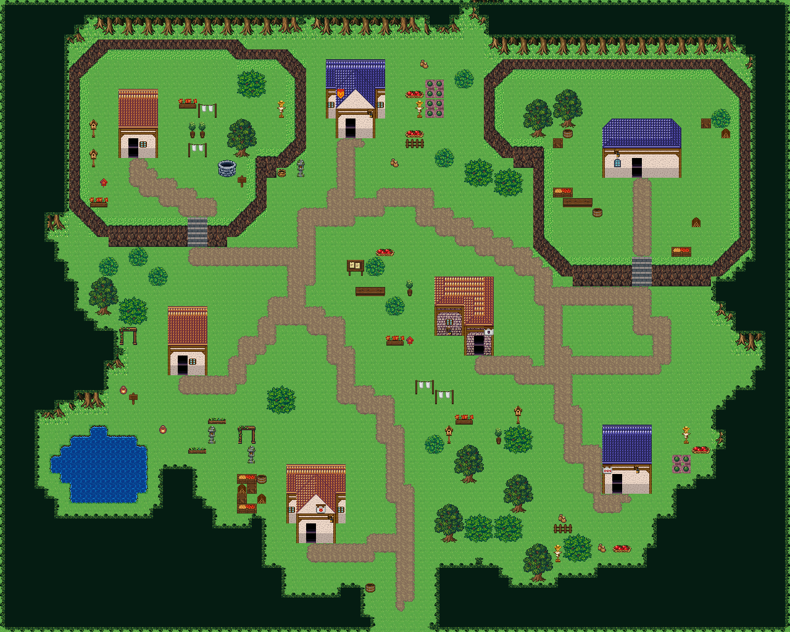

# 솔바람 흩어진 산촌

세 빈터에 흩어진 집, 두 둔덕, 갈라지는 오솔길과 작은 샘. 시작점 (40,60); 집 7채. 0기준 맵 좌표. 모든 집은 고정 조각이며 회전/잘라내기 금지. plateaus는 모서리를 깎은 직사각형의 합집합이며 x1,y1은 배타 끝점. stairs는 폭2·높이3의 시작 열과 가운데 행이다. 몸통·지붕·소품 전체 배열은 다음 부품 문서와 연결한다.



## 입력 계획과 예약할 접근칸
```json
{
  "mapId": "pine-hamlets",
  "width": 80,
  "height": 64,
  "seed": 191,
  "start": {
    "x": 40,
    "y": 60
  },
  "plateaus": [
    {
      "level": 1,
      "parts": [
        {
          "x0": 8,
          "y0": 5,
          "x1": 26,
          "y1": 23,
          "nw": 3,
          "ne": 3,
          "sw": 3,
          "se": 3
        },
        {
          "x0": 20,
          "y0": 6,
          "x1": 30,
          "y1": 16,
          "nw": 2,
          "ne": 2,
          "sw": 2,
          "se": 2
        }
      ]
    },
    {
      "level": 1,
      "parts": [
        {
          "x0": 55,
          "y0": 7,
          "x1": 75,
          "y1": 27,
          "nw": 3,
          "ne": 3,
          "sw": 3,
          "se": 3
        },
        {
          "x0": 50,
          "y0": 7,
          "x1": 61,
          "y1": 15,
          "nw": 2,
          "ne": 2,
          "sw": 2,
          "se": 2
        }
      ]
    }
  ],
  "stairs": [
    [
      19,
      23
    ],
    [
      64,
      27
    ]
  ],
  "ponds": [
    [
      10,
      47,
      5,
      4
    ]
  ],
  "coast": false,
  "dock": null,
  "cave": null,
  "spine": [
    [
      40,
      60
    ],
    [
      40,
      54
    ],
    [
      38,
      43
    ],
    [
      29,
      28
    ],
    [
      30,
      21
    ],
    [
      42,
      19
    ],
    [
      49,
      24
    ],
    [
      56,
      37
    ],
    [
      66,
      36
    ]
  ],
  "access": [
    {
      "role": "stairs-top",
      "x": 19,
      "y": 21
    },
    {
      "role": "stairs-bottom",
      "x": 19,
      "y": 25
    },
    {
      "role": "stairs-top",
      "x": 64,
      "y": 25
    },
    {
      "role": "stairs-bottom",
      "x": 64,
      "y": 29
    },
    {
      "role": "door-front",
      "x": 13,
      "y": 16
    },
    {
      "role": "door-front",
      "x": 35,
      "y": 14
    },
    {
      "role": "door-front",
      "x": 64,
      "y": 18
    },
    {
      "role": "door-front",
      "x": 18,
      "y": 38
    },
    {
      "role": "door-front",
      "x": 48,
      "y": 36
    },
    {
      "role": "door-front",
      "x": 62,
      "y": 50
    },
    {
      "role": "door-front",
      "x": 31,
      "y": 55
    }
  ]
}
```


## 건물의 전체 하위·상위
### pine-hamlets-house-1
```json
{
  "id": "pine-hamlets-house-1",
  "role": "house",
  "label": "왕궁 도시 · 주황 박공 회벽집 4×7 ②",
  "x": 12,
  "y": 9,
  "w": 4,
  "h": 7,
  "template": 3,
  "doorAt": {
    "x": 13,
    "y": 15
  },
  "front": {
    "x": 13,
    "y": 16
  },
  "width": 4,
  "height": 7,
  "lowerTiles": [
    [
      374,
      374,
      374,
      374
    ],
    [
      375,
      375,
      375,
      375
    ],
    [
      375,
      375,
      375,
      375
    ],
    [
      405,
      405,
      405,
      405
    ],
    [
      15,
      16,
      16,
      17
    ],
    [
      45,
      359,
      46,
      47
    ],
    [
      75,
      359,
      76,
      77
    ]
  ],
  "upperTiles": [
    [
      -1,
      -1,
      -1,
      -1
    ],
    [
      -1,
      -1,
      -1,
      -1
    ],
    [
      -1,
      -1,
      -1,
      -1
    ],
    [
      -1,
      -1,
      -1,
      -1
    ],
    [
      -1,
      -1,
      -1,
      -1
    ],
    [
      -1,
      -1,
      85,
      -1
    ],
    [
      -1,
      -1,
      -1,
      -1
    ]
  ]
}
```

### pine-hamlets-house-2
```json
{
  "id": "pine-hamlets-house-2",
  "role": "house",
  "label": "왕궁 도시 · 파랑 박공 회벽집 6×8 ②",
  "x": 33,
  "y": 6,
  "w": 6,
  "h": 8,
  "template": 0,
  "doorAt": {
    "x": 35,
    "y": 13
  },
  "front": {
    "x": 35,
    "y": 14
  },
  "width": 6,
  "height": 8,
  "lowerTiles": [
    [
      436,
      436,
      436,
      436,
      436,
      436
    ],
    [
      437,
      406,
      406,
      407,
      407,
      437
    ],
    [
      467,
      406,
      406,
      407,
      407,
      467
    ],
    [
      15,
      406,
      46,
      46,
      407,
      15
    ],
    [
      45,
      46,
      46,
      46,
      46,
      45
    ],
    [
      75,
      15,
      16,
      16,
      17,
      75
    ],
    [
      240,
      45,
      359,
      46,
      47,
      240
    ],
    [
      240,
      75,
      359,
      76,
      77,
      240
    ]
  ],
  "upperTiles": [
    [
      -1,
      -1,
      -1,
      -1,
      -1,
      -1
    ],
    [
      -1,
      -1,
      356,
      357,
      -1,
      -1
    ],
    [
      -1,
      356,
      -1,
      -1,
      357,
      -1
    ],
    [
      -1,
      208,
      386,
      387,
      -1,
      -1
    ],
    [
      85,
      386,
      -1,
      -1,
      387,
      85
    ],
    [
      -1,
      -1,
      -1,
      -1,
      2645,
      -1
    ],
    [
      -1,
      -1,
      -1,
      -1,
      -1,
      -1
    ],
    [
      -1,
      -1,
      -1,
      -1,
      -1,
      -1
    ]
  ]
}
```

### pine-hamlets-house-3
```json
{
  "id": "pine-hamlets-house-3",
  "role": "house",
  "label": "파랑 석벽 rect-wide 집",
  "x": 61,
  "y": 12,
  "w": 8,
  "h": 6,
  "template": 7,
  "doorAt": {
    "x": 64,
    "y": 17
  },
  "front": {
    "x": 64,
    "y": 18
  },
  "width": 8,
  "height": 6,
  "lowerTiles": [
    [
      240,
      406,
      406,
      406,
      406,
      406,
      406,
      240
    ],
    [
      406,
      406,
      406,
      406,
      406,
      406,
      406,
      407
    ],
    [
      467,
      467,
      467,
      467,
      467,
      467,
      467,
      467
    ],
    [
      15,
      16,
      16,
      16,
      16,
      16,
      16,
      17
    ],
    [
      45,
      46,
      46,
      359,
      46,
      46,
      46,
      47
    ],
    [
      75,
      76,
      76,
      359,
      76,
      76,
      76,
      77
    ]
  ],
  "upperTiles": [
    [
      356,
      -1,
      -1,
      -1,
      -1,
      -1,
      -1,
      357
    ],
    [
      -1,
      -1,
      -1,
      -1,
      -1,
      -1,
      -1,
      -1
    ],
    [
      386,
      -1,
      -1,
      -1,
      -1,
      -1,
      -1,
      387
    ],
    [
      -1,
      2645,
      -1,
      -1,
      -1,
      -1,
      -1,
      -1
    ],
    [
      -1,
      87,
      -1,
      -1,
      -1,
      -1,
      -1,
      -1
    ],
    [
      -1,
      -1,
      -1,
      -1,
      -1,
      -1,
      -1,
      -1
    ]
  ]
}
```

### pine-hamlets-house-4
```json
{
  "id": "pine-hamlets-house-4",
  "role": "house",
  "label": "왕궁 도시 · 주황 박공 회벽집 4×7 ②",
  "x": 17,
  "y": 31,
  "w": 4,
  "h": 7,
  "template": 5,
  "doorAt": {
    "x": 18,
    "y": 37
  },
  "front": {
    "x": 18,
    "y": 38
  },
  "width": 4,
  "height": 7,
  "lowerTiles": [
    [
      374,
      374,
      374,
      374
    ],
    [
      375,
      375,
      375,
      375
    ],
    [
      375,
      375,
      375,
      375
    ],
    [
      405,
      405,
      405,
      405
    ],
    [
      15,
      16,
      16,
      17
    ],
    [
      45,
      359,
      46,
      47
    ],
    [
      75,
      359,
      76,
      77
    ]
  ],
  "upperTiles": [
    [
      -1,
      -1,
      -1,
      -1
    ],
    [
      -1,
      -1,
      -1,
      -1
    ],
    [
      -1,
      -1,
      -1,
      -1
    ],
    [
      -1,
      -1,
      -1,
      -1
    ],
    [
      -1,
      -1,
      -1,
      -1
    ],
    [
      -1,
      -1,
      85,
      -1
    ],
    [
      -1,
      -1,
      -1,
      -1
    ]
  ]
}
```

### pine-hamlets-house-5
```json
{
  "id": "pine-hamlets-house-5",
  "role": "house",
  "label": "오렌지 회벽 l-mirror 집",
  "x": 44,
  "y": 28,
  "w": 6,
  "h": 8,
  "template": 1,
  "doorAt": {
    "x": 48,
    "y": 35
  },
  "front": {
    "x": 48,
    "y": 36
  },
  "width": 6,
  "height": 8,
  "lowerTiles": [
    [
      376,
      404,
      404,
      404,
      404,
      377
    ],
    [
      376,
      404,
      404,
      404,
      404,
      377
    ],
    [
      405,
      405,
      405,
      376,
      404,
      377
    ],
    [
      12,
      13,
      14,
      376,
      404,
      377
    ],
    [
      42,
      43,
      44,
      405,
      405,
      405
    ],
    [
      72,
      73,
      74,
      12,
      13,
      14
    ],
    [
      240,
      240,
      240,
      42,
      359,
      44
    ],
    [
      240,
      240,
      240,
      72,
      359,
      74
    ]
  ],
  "upperTiles": [
    [
      -1,
      -1,
      -1,
      -1,
      -1,
      -1
    ],
    [
      -1,
      -1,
      -1,
      -1,
      -1,
      -1
    ],
    [
      384,
      -1,
      -1,
      -1,
      -1,
      -1
    ],
    [
      -1,
      -1,
      -1,
      -1,
      -1,
      -1
    ],
    [
      -1,
      85,
      -1,
      384,
      -1,
      385
    ],
    [
      -1,
      2645,
      -1,
      -1,
      -1,
      472
    ],
    [
      -1,
      -1,
      -1,
      -1,
      -1,
      -1
    ],
    [
      -1,
      -1,
      -1,
      -1,
      -1,
      -1
    ]
  ]
}
```

### pine-hamlets-house-6
```json
{
  "id": "pine-hamlets-house-6",
  "role": "house",
  "label": "왕궁 도시 · 파랑 회벽집 5×7",
  "x": 61,
  "y": 43,
  "w": 5,
  "h": 7,
  "template": 6,
  "doorAt": {
    "x": 62,
    "y": 49
  },
  "front": {
    "x": 62,
    "y": 50
  },
  "width": 5,
  "height": 7,
  "lowerTiles": [
    [
      436,
      436,
      436,
      436,
      436
    ],
    [
      437,
      437,
      437,
      437,
      437
    ],
    [
      437,
      437,
      437,
      437,
      437
    ],
    [
      467,
      467,
      467,
      467,
      467
    ],
    [
      15,
      16,
      16,
      16,
      17
    ],
    [
      45,
      359,
      46,
      46,
      47
    ],
    [
      75,
      359,
      76,
      76,
      77
    ]
  ],
  "upperTiles": [
    [
      -1,
      -1,
      -1,
      -1,
      -1
    ],
    [
      -1,
      -1,
      -1,
      -1,
      -1
    ],
    [
      -1,
      -1,
      -1,
      -1,
      -1
    ],
    [
      -1,
      -1,
      -1,
      -1,
      -1
    ],
    [
      443,
      -1,
      -1,
      2645,
      -1
    ],
    [
      -1,
      -1,
      -1,
      -1,
      -1
    ],
    [
      -1,
      -1,
      -1,
      -1,
      -1
    ]
  ]
}
```

### pine-hamlets-house-7
```json
{
  "id": "pine-hamlets-house-7",
  "role": "house",
  "label": "왕궁 도시 · 주황 박공 회벽집 6×8",
  "x": 29,
  "y": 47,
  "w": 6,
  "h": 8,
  "template": 2,
  "doorAt": {
    "x": 31,
    "y": 54
  },
  "front": {
    "x": 31,
    "y": 55
  },
  "width": 6,
  "height": 8,
  "lowerTiles": [
    [
      374,
      374,
      374,
      374,
      374,
      374
    ],
    [
      375,
      376,
      376,
      377,
      377,
      375
    ],
    [
      405,
      376,
      376,
      377,
      377,
      405
    ],
    [
      15,
      376,
      46,
      46,
      377,
      15
    ],
    [
      45,
      46,
      46,
      46,
      46,
      45
    ],
    [
      75,
      15,
      16,
      16,
      17,
      75
    ],
    [
      240,
      45,
      359,
      46,
      47,
      240
    ],
    [
      240,
      75,
      359,
      76,
      77,
      240
    ]
  ],
  "upperTiles": [
    [
      -1,
      -1,
      -1,
      -1,
      -1,
      -1
    ],
    [
      -1,
      -1,
      354,
      355,
      -1,
      -1
    ],
    [
      -1,
      354,
      -1,
      -1,
      355,
      -1
    ],
    [
      -1,
      -1,
      384,
      385,
      -1,
      -1
    ],
    [
      85,
      384,
      -1,
      473,
      385,
      85
    ],
    [
      -1,
      -1,
      -1,
      -1,
      2645,
      -1
    ],
    [
      -1,
      -1,
      -1,
      -1,
      -1,
      -1
    ],
    [
      -1,
      -1,
      -1,
      -1,
      -1,
      -1
    ]
  ]
}
```
