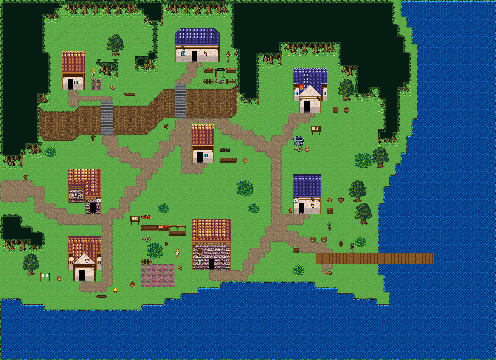

# 갈대물굽이 포구

물굽이를 따라 비껴 앉은 집, 좁은 골목과 긴 선착장. 시작점 (6,33); 집 8채. 0기준 맵 좌표. 모든 집은 고정 조각이며 회전/잘라내기 금지. cliffs.points는 x가 증가하는 절벽 윗선 꼭짓점, height는 윗선→밑단의 y 차이다. stairs=[x,y,height]는 폭2, 윗선 행 y부터 y+height까지이고 양끝 착지칸은 y-1/y+height+1이다. 이전 plateaus 윤곽은 사용하지 않는다. 몸통·지붕·소품 전체 배열은 다음 부품 문서와 연결한다.



## 입력 계획과 예약할 접근칸
```json
{
  "mapId": "reed-bay-village",
  "width": 88,
  "height": 64,
  "seed": 521,
  "start": {
    "x": 6,
    "y": 33
  },
  "yards": [
    {
      "ownerId": "reed-bay-village-house-1",
      "kit": "growing",
      "name": "텃밭 돌보기",
      "reason": "북서 높은 마당을 자급 텃밭으로 지정",
      "x": 16,
      "y": 12,
      "side": "right",
      "w": 5,
      "h": 4
    },
    {
      "ownerId": "reed-bay-village-house-3",
      "kit": "storage",
      "name": "물자 보관",
      "reason": "포구 북쪽 생활권의 물자 보관 거점",
      "x": 59,
      "y": 19,
      "side": "right",
      "w": 3,
      "h": 1
    },
    {
      "ownerId": "reed-bay-village-house-5",
      "kit": "herbs",
      "name": "약초 손질",
      "reason": "중앙 집의 야외 작업은 약초 재배·손질",
      "x": 39,
      "y": 26,
      "side": "right",
      "w": 5,
      "h": 3
    },
    {
      "ownerId": "reed-bay-village-house-6",
      "kit": "fishing",
      "name": "부두 작업 준비",
      "reason": "선착장 진입로 가까운 집에서 어구와 어획 용기 준비; 실제 부두 근접 조건 필요",
      "x": 58,
      "y": 35,
      "side": "right",
      "w": 3,
      "h": 3
    },
    {
      "ownerId": "reed-bay-village-house-7",
      "kit": "laundry",
      "name": "세탁·건조",
      "reason": "남서 물가 주거의 마당은 세탁·건조 공간",
      "x": 7,
      "y": 48,
      "side": "left",
      "w": 4,
      "h": 2
    },
    {
      "ownerId": "reed-bay-village-house-8",
      "kit": "field-tending",
      "name": "기존 밭 돌보기",
      "reason": "이미 있는 서쪽 밭(25,47)을 관리; 새 장식용 밭을 중복 생성하지 않음",
      "x": 31,
      "y": 44,
      "side": "left",
      "w": 2,
      "h": 4
    }
  ],
  "activitySites": {
    "dock": {
      "x": 56,
      "y": 45,
      "w": 21,
      "h": 2
    },
    "farm": {
      "x": 25,
      "y": 47,
      "w": 6,
      "h": 4
    }
  },
  "civicPlaces": [
    {
      "id": "market",
      "name": "밭과 골목 사이 수확물 판매 자리",
      "anchor": {
        "type": "farm",
        "x": 25,
        "y": 47,
        "maxDistance": 11
      },
      "items": [
        {
          "id": "market-1",
          "name": "가로 탁자",
          "x": 25,
          "y": 40,
          "purpose": "수확물을 선별하고 판매하는 작업면"
        },
        {
          "id": "market-2",
          "name": "과일 바구니",
          "x": 25,
          "y": 38,
          "purpose": "소량 판매용 과일 진열",
          "near": "가로 탁자"
        },
        {
          "id": "market-3",
          "name": "과일 상자",
          "x": 28,
          "y": 40,
          "purpose": "판매대에 보충할 과일 저장",
          "near": "가로 탁자"
        },
        {
          "id": "market-4",
          "name": "게시판",
          "x": 23,
          "y": 38,
          "purpose": "판매 자리와 마을 소식 안내"
        },
        {
          "id": "market-5",
          "name": "징검돌",
          "x": 25,
          "y": 42,
          "purpose": "판매자와 손님이 서는 자리",
          "near": "가로 탁자"
        },
        {
          "id": "market-6",
          "name": "나무 울타리",
          "x": 25,
          "y": 46,
          "purpose": "밭 북쪽 경계 보호"
        }
      ],
      "site": {
        "x": 25,
        "y": 47,
        "w": 6,
        "h": 4,
        "layer": "lower",
        "tiles": [
          188,
          188,
          188,
          188,
          188,
          188,
          188,
          188,
          188,
          188,
          188,
          188,
          188,
          188,
          188,
          188,
          188,
          188,
          188,
          188,
          188,
          188,
          188,
          188
        ]
      }
    },
    {
      "id": "well",
      "name": "중앙 골목의 공동 우물",
      "anchor": {
        "type": "road",
        "x": 48,
        "y": 26,
        "maxDistance": 10
      },
      "items": [
        {
          "id": "well-1",
          "name": "낮은 돌 우물",
          "x": 52,
          "y": 24,
          "purpose": "주택과 선착장 이용자의 급수"
        },
        {
          "id": "well-2",
          "name": "항아리",
          "x": 54,
          "y": 26,
          "purpose": "우물물을 담는 용기",
          "near": "낮은 돌 우물"
        },
        {
          "id": "well-3",
          "name": "징검돌",
          "x": 52,
          "y": 26,
          "purpose": "우물 앞 보행 자리",
          "near": "낮은 돌 우물"
        },
        {
          "id": "well-4",
          "name": "게시판",
          "x": 55,
          "y": 22,
          "purpose": "골목 주민의 공동 공지"
        }
      ],
      "site": {
        "x": 48,
        "y": 26,
        "w": 1,
        "h": 1,
        "layer": "lower",
        "tiles": [
          1516
        ]
      }
    },
    {
      "id": "garden",
      "name": "윗집의 환영 정원",
      "anchor": {
        "type": "house",
        "id": "reed-bay-village-house-2",
        "maxDistance": 16
      },
      "items": [
        {
          "id": "garden-1",
          "name": "덩굴 아치",
          "x": 38,
          "y": 12,
          "purpose": "집 옆 정원 입구"
        },
        {
          "id": "garden-2",
          "name": "꽃 화단",
          "x": 36,
          "y": 11,
          "purpose": "정원 입구 화단",
          "near": "덩굴 아치"
        },
        {
          "id": "garden-3",
          "name": "꽃 화단",
          "x": 40,
          "y": 11,
          "purpose": "정원 입구 화단",
          "near": "덩굴 아치"
        },
        {
          "id": "garden-4",
          "name": "징검돌",
          "x": 38,
          "y": 14,
          "purpose": "정원 안 보행 자리",
          "near": "덩굴 아치"
        },
        {
          "id": "garden-5",
          "name": "새집",
          "x": 40,
          "y": 9,
          "purpose": "정원의 조용한 가장자리",
          "near": "꽃 화단"
        },
        {
          "id": "garden-6",
          "name": "나무 울타리",
          "x": 36,
          "y": 14,
          "purpose": "정원 남쪽 경계",
          "near": "꽃 화단"
        },
        {
          "id": "garden-7",
          "name": "나무 울타리",
          "x": 40,
          "y": 14,
          "purpose": "열린 보행 틈을 남긴 정원 경계",
          "near": "꽃 화단"
        }
      ],
      "site": {
        "x": 31,
        "y": 5,
        "w": 8,
        "h": 6,
        "layer": "lower",
        "tiles": [
          240,
          406,
          406,
          406,
          406,
          406,
          406,
          240,
          406,
          406,
          406,
          406,
          406,
          406,
          406,
          407,
          467,
          467,
          467,
          467,
          467,
          467,
          467,
          467,
          15,
          16,
          16,
          16,
          16,
          16,
          16,
          17,
          45,
          46,
          46,
          329,
          46,
          46,
          46,
          47,
          75,
          76,
          76,
          359,
          76,
          76,
          76,
          77
        ]
      }
    },
    {
      "id": "dock",
      "name": "선착장 진입 안내",
      "anchor": {
        "type": "dock",
        "x": 56,
        "y": 45,
        "maxDistance": 8
      },
      "items": [
        {
          "id": "dock-1",
          "name": "표지판",
          "x": 60,
          "y": 42,
          "purpose": "선착장 이용 방향 안내"
        },
        {
          "id": "dock-2",
          "name": "돌등",
          "x": 62,
          "y": 43,
          "purpose": "선착장 진입부 조명"
        }
      ],
      "site": {
        "x": 56,
        "y": 45,
        "w": 21,
        "h": 2,
        "layer": "upper",
        "tiles": [
          199,
          199,
          199,
          199,
          199,
          199,
          199,
          199,
          199,
          199,
          199,
          199,
          199,
          199,
          199,
          199,
          199,
          199,
          199,
          199,
          199,
          199,
          199,
          199,
          199,
          199,
          199,
          199,
          199,
          199,
          199,
          199,
          199,
          199,
          199,
          199,
          199,
          199,
          199,
          199,
          199,
          199
        ]
      }
    },
    {
      "id": "front",
      "name": "여관의 환영 마당",
      "anchor": {
        "type": "house",
        "id": "reed-bay-village-house-6",
        "maxDistance": 10
      },
      "items": [
        {
          "id": "front-1",
          "name": "화분",
          "x": 58,
          "y": 39,
          "purpose": "여관 현관 옆 환영 식물"
        },
        {
          "id": "front-2",
          "name": "우편함",
          "x": 51,
          "y": 37,
          "purpose": "여관 투숙객 우편 수취"
        }
      ],
      "site": {
        "x": 52,
        "y": 31,
        "w": 5,
        "h": 7,
        "layer": "lower",
        "tiles": [
          436,
          436,
          436,
          436,
          436,
          437,
          437,
          437,
          437,
          437,
          437,
          437,
          437,
          437,
          437,
          467,
          467,
          467,
          467,
          467,
          15,
          16,
          16,
          16,
          17,
          45,
          329,
          46,
          46,
          47,
          75,
          359,
          76,
          76,
          77
        ]
      }
    },
    {
      "id": "lamp-2",
      "name": "현관 옆 벽등",
      "anchor": {
        "type": "house",
        "id": "reed-bay-village-house-2",
        "maxDistance": 10
      },
      "items": [
        {
          "id": "lamp-2-1",
          "name": "벽걸이 등불",
          "x": 36,
          "y": 9,
          "purpose": "현관 옆 벽면 조명"
        }
      ],
      "site": {
        "x": 31,
        "y": 5,
        "w": 8,
        "h": 6,
        "layer": "lower",
        "tiles": [
          240,
          406,
          406,
          406,
          406,
          406,
          406,
          240,
          406,
          406,
          406,
          406,
          406,
          406,
          406,
          407,
          467,
          467,
          467,
          467,
          467,
          467,
          467,
          467,
          15,
          16,
          16,
          16,
          16,
          16,
          16,
          17,
          45,
          46,
          46,
          329,
          46,
          46,
          46,
          47,
          75,
          76,
          76,
          359,
          76,
          76,
          76,
          77
        ]
      }
    },
    {
      "id": "lamp-6",
      "name": "현관 옆 벽등",
      "anchor": {
        "type": "house",
        "id": "reed-bay-village-house-6",
        "maxDistance": 10
      },
      "items": [
        {
          "id": "lamp-6-1",
          "name": "벽걸이 등불",
          "x": 55,
          "y": 36,
          "purpose": "현관 옆 벽면 조명"
        }
      ],
      "site": {
        "x": 52,
        "y": 31,
        "w": 5,
        "h": 7,
        "layer": "lower",
        "tiles": [
          436,
          436,
          436,
          436,
          436,
          437,
          437,
          437,
          437,
          437,
          437,
          437,
          437,
          437,
          437,
          467,
          467,
          467,
          467,
          467,
          15,
          16,
          16,
          16,
          17,
          45,
          329,
          46,
          46,
          47,
          75,
          359,
          76,
          76,
          77
        ]
      }
    },
    {
      "id": "lamp-8",
      "name": "현관 옆 벽등",
      "anchor": {
        "type": "house",
        "id": "reed-bay-village-house-8",
        "maxDistance": 10
      },
      "items": [
        {
          "id": "lamp-8-1",
          "name": "벽걸이 등불",
          "x": 39,
          "y": 46,
          "purpose": "현관 옆 벽면 조명"
        }
      ],
      "site": {
        "x": 34,
        "y": 39,
        "w": 7,
        "h": 9,
        "layer": "lower",
        "tiles": [
          376,
          404,
          404,
          404,
          404,
          404,
          377,
          376,
          404,
          404,
          404,
          404,
          404,
          377,
          376,
          404,
          404,
          404,
          404,
          404,
          377,
          405,
          405,
          405,
          405,
          405,
          405,
          405,
          12,
          13,
          13,
          13,
          13,
          13,
          14,
          42,
          43,
          43,
          43,
          43,
          43,
          44,
          42,
          43,
          43,
          43,
          43,
          43,
          44,
          42,
          43,
          43,
          329,
          43,
          43,
          44,
          72,
          73,
          73,
          359,
          73,
          73,
          74
        ]
      }
    },
    {
      "id": "dock-store",
      "name": "선착장 짐 부리는 곳",
      "anchor": {
        "type": "dock",
        "x": 56,
        "y": 45,
        "maxDistance": 8
      },
      "items": [
        {
          "id": "dock-store-1",
          "name": "술통",
          "x": 55,
          "y": 42,
          "purpose": "배에서 내린 물통"
        },
        {
          "id": "dock-store-2",
          "name": "술통",
          "x": 57,
          "y": 42,
          "purpose": "절인 생선을 담은 통",
          "near": "술통"
        },
        {
          "id": "dock-store-3",
          "name": "나무 상자",
          "x": 52,
          "y": 44,
          "purpose": "배로 들여온 짐 상자"
        },
        {
          "id": "dock-store-4",
          "name": "낚시 바구니",
          "x": 58,
          "y": 48,
          "purpose": "선착장 끝에서 쓰는 낚시 바구니"
        }
      ],
      "site": {
        "x": 56,
        "y": 45,
        "w": 21,
        "h": 2,
        "layer": "upper",
        "tiles": [
          199,
          199,
          199,
          199,
          199,
          199,
          199,
          199,
          199,
          199,
          199,
          199,
          199,
          199,
          199,
          199,
          199,
          199,
          199,
          199,
          199,
          199,
          199,
          199,
          199,
          199,
          199,
          199,
          199,
          199,
          199,
          199,
          199,
          199,
          199,
          199,
          199,
          199,
          199,
          199,
          199,
          199
        ]
      }
    },
    {
      "id": "market-stall",
      "name": "밭 옆 판매 자리 노점",
      "anchor": {
        "type": "farm",
        "x": 25,
        "y": 47,
        "maxDistance": 11
      },
      "items": [
        {
          "id": "market-stall-1",
          "name": "장터 노점",
          "x": 30,
          "y": 40,
          "purpose": "밭에서 거둔 채소를 파는 좌판"
        },
        {
          "id": "market-stall-2",
          "name": "작은 오크통",
          "x": 29,
          "y": 43,
          "purpose": "노점 음료 통",
          "near": "장터 노점"
        }
      ],
      "site": {
        "x": 25,
        "y": 47,
        "w": 6,
        "h": 4,
        "layer": "lower",
        "tiles": [
          188,
          188,
          188,
          188,
          188,
          188,
          188,
          188,
          188,
          188,
          188,
          188,
          188,
          188,
          188,
          188,
          188,
          188,
          188,
          188,
          188,
          188,
          188,
          188
        ]
      }
    },
    {
      "id": "west-stair-sign",
      "name": "서쪽 계단 아래 길잡이",
      "anchor": {
        "type": "road",
        "x": 18,
        "y": 24,
        "maxDistance": 10
      },
      "items": [
        {
          "id": "west-stair-sign-1",
          "name": "나무 이정표",
          "x": 16,
          "y": 24,
          "purpose": "윗단 서쪽 집으로 오르는 계단 안내"
        }
      ],
      "site": {
        "x": 18,
        "y": 24,
        "w": 1,
        "h": 1,
        "layer": "lower",
        "tiles": [
          1490
        ]
      }
    },
    {
      "id": "east-stair-sign",
      "name": "동쪽 계단 아래 길잡이",
      "anchor": {
        "type": "road",
        "x": 31,
        "y": 21,
        "maxDistance": 10
      },
      "items": [
        {
          "id": "east-stair-sign-1",
          "name": "나무 이정표",
          "x": 29,
          "y": 22,
          "purpose": "윗단 파랑 지붕 집으로 오르는 계단 안내"
        }
      ],
      "site": {
        "x": 31,
        "y": 21,
        "w": 1,
        "h": 1,
        "layer": "lower",
        "tiles": [
          1490
        ]
      }
    },
    {
      "id": "entry-sign",
      "name": "서쪽 입구 길잡이",
      "anchor": {
        "type": "road",
        "x": 4,
        "y": 33,
        "maxDistance": 10
      },
      "items": [
        {
          "id": "entry-sign-1",
          "name": "나무 이정표",
          "x": 4,
          "y": 31,
          "purpose": "마을 서쪽 입구 방향 안내"
        }
      ],
      "site": {
        "x": 4,
        "y": 33,
        "w": 1,
        "h": 1,
        "layer": "lower",
        "tiles": [
          1516
        ]
      }
    },
    {
      "id": "beach-fire",
      "name": "남쪽 물가 모닥불",
      "anchor": {
        "type": "house",
        "id": "reed-bay-village-house-7",
        "maxDistance": 12
      },
      "items": [
        {
          "id": "beach-fire-1",
          "name": "모닥불",
          "x": 20,
          "y": 51,
          "purpose": "물가에서 저녁에 불을 피우는 자리"
        },
        {
          "id": "beach-fire-2",
          "name": "벤치",
          "x": 17,
          "y": 52,
          "purpose": "물가를 보고 앉는 자리",
          "near": "모닥불"
        },
        {
          "id": "beach-fire-3",
          "name": "장작 더미",
          "x": 23,
          "y": 50,
          "purpose": "모닥불 장작",
          "near": "모닥불"
        }
      ],
      "site": {
        "x": 12,
        "y": 42,
        "w": 6,
        "h": 8,
        "layer": "lower",
        "tiles": [
          374,
          374,
          374,
          374,
          374,
          374,
          375,
          376,
          376,
          377,
          377,
          375,
          405,
          376,
          376,
          377,
          377,
          405,
          15,
          376,
          46,
          46,
          377,
          15,
          45,
          46,
          46,
          46,
          46,
          45,
          75,
          15,
          16,
          16,
          17,
          75,
          240,
          45,
          329,
          46,
          47,
          240,
          240,
          75,
          359,
          76,
          77,
          240
        ]
      }
    },
    {
      "id": "overlook",
      "name": "윗단 절벽 끝 쉼터",
      "anchor": {
        "type": "house",
        "id": "reed-bay-village-house-1",
        "maxDistance": 10
      },
      "items": [
        {
          "id": "overlook-1",
          "name": "벤치",
          "x": 22,
          "y": 16,
          "purpose": "절벽 끝에서 포구를 내려다보는 자리"
        }
      ],
      "site": {
        "x": 11,
        "y": 9,
        "w": 4,
        "h": 7,
        "layer": "lower",
        "tiles": [
          374,
          374,
          374,
          374,
          375,
          375,
          375,
          375,
          375,
          375,
          375,
          375,
          405,
          405,
          405,
          405,
          15,
          16,
          16,
          17,
          45,
          329,
          46,
          47,
          75,
          359,
          76,
          77
        ]
      }
    }
  ],
  "entrance": {
    "x": 0,
    "y": 33
  },
  "crest": {
    "x": 9,
    "y": 4,
    "width": 17,
    "shoulder": 3
  },
  "patches": [
    [
      3,
      12,
      10,
      12,
      12
    ],
    [
      46,
      2,
      14,
      8,
      10
    ],
    [
      66,
      22,
      9,
      12,
      9
    ]
  ],
  "clearings": [
    [
      20,
      8,
      11,
      6,
      8
    ]
  ],
  "cliffs": [
    {
      "points": [
        [
          7,
          19
        ],
        [
          12,
          19
        ],
        [
          14,
          18
        ],
        [
          26,
          18
        ],
        [
          29,
          15
        ],
        [
          41,
          15
        ]
      ],
      "height": 5,
      "rightFrom": 8
    }
  ],
  "stairs": [
    [
      18,
      18,
      5
    ],
    [
      31,
      15,
      5
    ]
  ],
  "ponds": [],
  "coast": true,
  "dock": [
    56,
    45,
    21,
    2
  ],
  "cave": null,
  "spine": [
    [
      6,
      33
    ],
    [
      21,
      36
    ],
    [
      26,
      29
    ],
    [
      19,
      24
    ],
    [
      26,
      29
    ],
    [
      32,
      23
    ],
    [
      48,
      26
    ],
    [
      48,
      40
    ],
    [
      56,
      43
    ],
    [
      57,
      47
    ]
  ],
  "access": [
    {
      "role": "stairs-top",
      "x": 18,
      "y": 17
    },
    {
      "role": "stairs-bottom",
      "x": 18,
      "y": 24
    },
    {
      "role": "stairs-top",
      "x": 31,
      "y": 14
    },
    {
      "role": "stairs-bottom",
      "x": 31,
      "y": 21
    },
    {
      "role": "door-front",
      "x": 12,
      "y": 16
    },
    {
      "role": "door-front",
      "x": 34,
      "y": 11
    },
    {
      "role": "door-front",
      "x": 54,
      "y": 20
    },
    {
      "role": "door-front",
      "x": 16,
      "y": 38
    },
    {
      "role": "door-front",
      "x": 35,
      "y": 29
    },
    {
      "role": "door-front",
      "x": 53,
      "y": 38
    },
    {
      "role": "door-front",
      "x": 14,
      "y": 50
    },
    {
      "role": "door-front",
      "x": 37,
      "y": 48
    },
    {
      "role": "map-entrance",
      "x": 0,
      "y": 32
    },
    {
      "role": "map-entrance",
      "x": 0,
      "y": 33
    },
    {
      "role": "map-entrance",
      "x": 0,
      "y": 34
    },
    {
      "role": "map-entrance",
      "x": 1,
      "y": 32
    },
    {
      "role": "map-entrance",
      "x": 1,
      "y": 33
    },
    {
      "role": "map-entrance",
      "x": 1,
      "y": 34
    },
    {
      "role": "map-entrance",
      "x": 2,
      "y": 32
    },
    {
      "role": "map-entrance",
      "x": 2,
      "y": 33
    },
    {
      "role": "map-entrance",
      "x": 2,
      "y": 34
    },
    {
      "role": "map-entrance",
      "x": 3,
      "y": 32
    },
    {
      "role": "map-entrance",
      "x": 3,
      "y": 33
    },
    {
      "role": "map-entrance",
      "x": 3,
      "y": 34
    },
    {
      "role": "map-entrance",
      "x": 4,
      "y": 32
    },
    {
      "role": "map-entrance",
      "x": 4,
      "y": 33
    },
    {
      "role": "map-entrance",
      "x": 4,
      "y": 34
    },
    {
      "role": "dock-end",
      "x": 76,
      "y": 45
    },
    {
      "role": "civic-use",
      "x": 25,
      "y": 41,
      "placeId": "market",
      "propId": "market-1"
    },
    {
      "role": "civic-use",
      "x": 25,
      "y": 39,
      "placeId": "market",
      "propId": "market-2"
    },
    {
      "role": "civic-use",
      "x": 28,
      "y": 41,
      "placeId": "market",
      "propId": "market-3"
    },
    {
      "role": "civic-use",
      "x": 22,
      "y": 38,
      "placeId": "market",
      "propId": "market-4"
    },
    {
      "role": "civic-use",
      "x": 25,
      "y": 43,
      "placeId": "market",
      "propId": "market-5"
    },
    {
      "role": "civic-use",
      "x": 25,
      "y": 47,
      "placeId": "market",
      "propId": "market-6"
    },
    {
      "role": "civic-use",
      "x": 51,
      "y": 24,
      "placeId": "well",
      "propId": "well-1"
    },
    {
      "role": "civic-use",
      "x": 54,
      "y": 27,
      "placeId": "well",
      "propId": "well-2"
    },
    {
      "role": "civic-use",
      "x": 52,
      "y": 27,
      "placeId": "well",
      "propId": "well-3"
    },
    {
      "role": "civic-use",
      "x": 54,
      "y": 22,
      "placeId": "well",
      "propId": "well-4"
    },
    {
      "role": "civic-use",
      "x": 38,
      "y": 13,
      "placeId": "garden",
      "propId": "garden-1"
    },
    {
      "role": "civic-use",
      "x": 35,
      "y": 11,
      "placeId": "garden",
      "propId": "garden-2"
    },
    {
      "role": "civic-use",
      "x": 39,
      "y": 11,
      "placeId": "garden",
      "propId": "garden-3"
    },
    {
      "role": "civic-use",
      "x": 39,
      "y": 14,
      "placeId": "garden",
      "propId": "garden-4"
    },
    {
      "role": "civic-use",
      "x": 39,
      "y": 9,
      "placeId": "garden",
      "propId": "garden-5"
    },
    {
      "role": "civic-use",
      "x": 35,
      "y": 14,
      "placeId": "garden",
      "propId": "garden-6"
    },
    {
      "role": "civic-use",
      "x": 39,
      "y": 14,
      "placeId": "garden",
      "propId": "garden-7"
    },
    {
      "role": "civic-use",
      "x": 59,
      "y": 42,
      "placeId": "dock",
      "propId": "dock-1"
    },
    {
      "role": "civic-use",
      "x": 61,
      "y": 43,
      "placeId": "dock",
      "propId": "dock-2"
    },
    {
      "role": "civic-use",
      "x": 57,
      "y": 39,
      "placeId": "front",
      "propId": "front-1"
    },
    {
      "role": "civic-use",
      "x": 51,
      "y": 38,
      "placeId": "front",
      "propId": "front-2"
    },
    {
      "role": "civic-use",
      "x": 55,
      "y": 43,
      "placeId": "dock-store",
      "propId": "dock-store-1"
    },
    {
      "role": "civic-use",
      "x": 57,
      "y": 43,
      "placeId": "dock-store",
      "propId": "dock-store-2"
    },
    {
      "role": "civic-use",
      "x": 52,
      "y": 45,
      "placeId": "dock-store",
      "propId": "dock-store-3"
    },
    {
      "role": "civic-use",
      "x": 58,
      "y": 49,
      "placeId": "dock-store",
      "propId": "dock-store-4"
    },
    {
      "role": "civic-use",
      "x": 30,
      "y": 39,
      "placeId": "market-stall",
      "propId": "market-stall-1"
    },
    {
      "role": "civic-use",
      "x": 29,
      "y": 44,
      "placeId": "market-stall",
      "propId": "market-stall-2"
    },
    {
      "role": "civic-use",
      "x": 16,
      "y": 25,
      "placeId": "west-stair-sign",
      "propId": "west-stair-sign-1"
    },
    {
      "role": "civic-use",
      "x": 29,
      "y": 23,
      "placeId": "east-stair-sign",
      "propId": "east-stair-sign-1"
    },
    {
      "role": "civic-use",
      "x": 4,
      "y": 32,
      "placeId": "entry-sign",
      "propId": "entry-sign-1"
    },
    {
      "role": "civic-use",
      "x": 20,
      "y": 52,
      "placeId": "beach-fire",
      "propId": "beach-fire-1"
    },
    {
      "role": "civic-use",
      "x": 17,
      "y": 53,
      "placeId": "beach-fire",
      "propId": "beach-fire-2"
    },
    {
      "role": "civic-use",
      "x": 23,
      "y": 51,
      "placeId": "beach-fire",
      "propId": "beach-fire-3"
    },
    {
      "role": "civic-use",
      "x": 22,
      "y": 17,
      "placeId": "overlook",
      "propId": "overlook-1"
    }
  ]
}
```


## 건물의 전체 하위·상위
### reed-bay-village-house-1
```json
{
  "id": "reed-bay-village-house-1",
  "role": "텃밭집",
  "label": "왕궁 도시 · 주황 박공 회벽집 4×7 ②",
  "x": 11,
  "y": 9,
  "w": 4,
  "h": 7,
  "template": 3,
  "doorAt": {
    "x": 12,
    "y": 15
  },
  "front": {
    "x": 12,
    "y": 16
  },
  "activity": "growing",
  "reason": "북서 높은 마당을 자급 텃밭으로 지정",
  "width": 4,
  "height": 7,
  "lowerTiles": [
    [
      374,
      374,
      374,
      374
    ],
    [
      375,
      375,
      375,
      375
    ],
    [
      375,
      375,
      375,
      375
    ],
    [
      405,
      405,
      405,
      405
    ],
    [
      15,
      16,
      16,
      17
    ],
    [
      45,
      329,
      46,
      47
    ],
    [
      75,
      359,
      76,
      77
    ]
  ],
  "upperTiles": [
    [
      -1,
      -1,
      -1,
      -1
    ],
    [
      -1,
      -1,
      -1,
      -1
    ],
    [
      -1,
      -1,
      -1,
      -1
    ],
    [
      -1,
      -1,
      -1,
      -1
    ],
    [
      -1,
      -1,
      -1,
      -1
    ],
    [
      -1,
      -1,
      85,
      -1
    ],
    [
      -1,
      -1,
      -1,
      -1
    ]
  ]
}
```

### reed-bay-village-house-2
```json
{
  "id": "reed-bay-village-house-2",
  "role": "주거",
  "label": "파랑 석벽 rect-wide 집",
  "x": 31,
  "y": 5,
  "w": 8,
  "h": 6,
  "template": 7,
  "doorAt": {
    "x": 34,
    "y": 10
  },
  "front": {
    "x": 34,
    "y": 11
  },
  "activity": "laundry",
  "reason": "북쪽 주거 집에는 세탁·건조 기능 지정",
  "width": 8,
  "height": 6,
  "lowerTiles": [
    [
      240,
      406,
      406,
      406,
      406,
      406,
      406,
      240
    ],
    [
      406,
      406,
      406,
      406,
      406,
      406,
      406,
      407
    ],
    [
      467,
      467,
      467,
      467,
      467,
      467,
      467,
      467
    ],
    [
      15,
      16,
      16,
      16,
      16,
      16,
      16,
      17
    ],
    [
      45,
      46,
      46,
      329,
      46,
      46,
      46,
      47
    ],
    [
      75,
      76,
      76,
      359,
      76,
      76,
      76,
      77
    ]
  ],
  "upperTiles": [
    [
      356,
      -1,
      -1,
      -1,
      -1,
      -1,
      -1,
      357
    ],
    [
      -1,
      -1,
      -1,
      -1,
      -1,
      -1,
      -1,
      -1
    ],
    [
      386,
      -1,
      -1,
      -1,
      -1,
      -1,
      -1,
      387
    ],
    [
      -1,
      2645,
      -1,
      -1,
      -1,
      -1,
      -1,
      -1
    ],
    [
      -1,
      87,
      -1,
      -1,
      -1,
      2645,
      -1,
      -1
    ],
    [
      -1,
      -1,
      -1,
      -1,
      -1,
      -1,
      -1,
      -1
    ]
  ]
}
```

### reed-bay-village-house-3
```json
{
  "id": "reed-bay-village-house-3",
  "role": "물자 보관집",
  "label": "왕궁 도시 · 파랑 박공 회벽집 6×8 ②",
  "x": 52,
  "y": 12,
  "w": 6,
  "h": 8,
  "template": 0,
  "doorAt": {
    "x": 54,
    "y": 19
  },
  "front": {
    "x": 54,
    "y": 20
  },
  "activity": "storage",
  "reason": "포구 북쪽 생활권의 물자 보관 거점",
  "width": 6,
  "height": 8,
  "lowerTiles": [
    [
      436,
      436,
      436,
      436,
      436,
      436
    ],
    [
      437,
      406,
      406,
      407,
      407,
      437
    ],
    [
      467,
      406,
      406,
      407,
      407,
      467
    ],
    [
      15,
      406,
      46,
      46,
      407,
      15
    ],
    [
      45,
      46,
      46,
      46,
      46,
      45
    ],
    [
      75,
      15,
      16,
      16,
      17,
      75
    ],
    [
      240,
      45,
      329,
      46,
      47,
      240
    ],
    [
      240,
      75,
      359,
      76,
      77,
      240
    ]
  ],
  "upperTiles": [
    [
      -1,
      -1,
      -1,
      -1,
      -1,
      -1
    ],
    [
      -1,
      -1,
      356,
      357,
      -1,
      -1
    ],
    [
      -1,
      356,
      -1,
      -1,
      357,
      -1
    ],
    [
      -1,
      208,
      386,
      387,
      -1,
      -1
    ],
    [
      85,
      386,
      -1,
      -1,
      387,
      85
    ],
    [
      -1,
      -1,
      -1,
      -1,
      2645,
      -1
    ],
    [
      -1,
      -1,
      -1,
      -1,
      -1,
      -1
    ],
    [
      -1,
      -1,
      -1,
      -1,
      -1,
      -1
    ]
  ]
}
```

### reed-bay-village-house-4
```json
{
  "id": "reed-bay-village-house-4",
  "role": "주거",
  "label": "오렌지 회벽 l-mirror 집",
  "x": 12,
  "y": 30,
  "w": 6,
  "h": 8,
  "template": 1,
  "doorAt": {
    "x": 16,
    "y": 37
  },
  "front": {
    "x": 16,
    "y": 38
  },
  "activity": "laundry",
  "reason": "서쪽 입구 인근 주거 마당은 세탁·건조 공간",
  "width": 6,
  "height": 8,
  "lowerTiles": [
    [
      376,
      404,
      404,
      404,
      404,
      377
    ],
    [
      376,
      404,
      404,
      404,
      404,
      377
    ],
    [
      405,
      405,
      405,
      376,
      404,
      377
    ],
    [
      12,
      13,
      14,
      376,
      404,
      377
    ],
    [
      42,
      43,
      44,
      405,
      405,
      405
    ],
    [
      72,
      73,
      74,
      12,
      13,
      14
    ],
    [
      240,
      240,
      240,
      42,
      329,
      44
    ],
    [
      240,
      240,
      240,
      72,
      359,
      74
    ]
  ],
  "upperTiles": [
    [
      -1,
      -1,
      -1,
      -1,
      -1,
      -1
    ],
    [
      -1,
      -1,
      -1,
      -1,
      -1,
      -1
    ],
    [
      384,
      -1,
      -1,
      -1,
      -1,
      -1
    ],
    [
      -1,
      -1,
      -1,
      -1,
      -1,
      -1
    ],
    [
      -1,
      85,
      -1,
      384,
      -1,
      385
    ],
    [
      -1,
      2645,
      -1,
      -1,
      -1,
      472
    ],
    [
      -1,
      -1,
      -1,
      -1,
      -1,
      -1
    ],
    [
      -1,
      -1,
      -1,
      -1,
      -1,
      -1
    ]
  ]
}
```

### reed-bay-village-house-5
```json
{
  "id": "reed-bay-village-house-5",
  "role": "약초 작업집",
  "label": "왕궁 도시 · 주황 박공 회벽집 4×7 ②",
  "x": 34,
  "y": 22,
  "w": 4,
  "h": 7,
  "template": 5,
  "doorAt": {
    "x": 35,
    "y": 28
  },
  "front": {
    "x": 35,
    "y": 29
  },
  "activity": "herbs",
  "reason": "중앙 집의 야외 작업은 약초 재배·손질",
  "width": 4,
  "height": 7,
  "lowerTiles": [
    [
      374,
      374,
      374,
      374
    ],
    [
      375,
      375,
      375,
      375
    ],
    [
      375,
      375,
      375,
      375
    ],
    [
      405,
      405,
      405,
      405
    ],
    [
      15,
      16,
      16,
      17
    ],
    [
      45,
      329,
      46,
      47
    ],
    [
      75,
      359,
      76,
      77
    ]
  ],
  "upperTiles": [
    [
      -1,
      -1,
      -1,
      -1
    ],
    [
      -1,
      -1,
      -1,
      -1
    ],
    [
      -1,
      -1,
      -1,
      -1
    ],
    [
      -1,
      -1,
      -1,
      -1
    ],
    [
      -1,
      -1,
      -1,
      -1
    ],
    [
      -1,
      -1,
      85,
      -1
    ],
    [
      -1,
      -1,
      -1,
      -1
    ]
  ]
}
```

### reed-bay-village-house-6
```json
{
  "id": "reed-bay-village-house-6",
  "role": "어업 준비집",
  "label": "왕궁 도시 · 파랑 회벽집 5×7",
  "x": 52,
  "y": 31,
  "w": 5,
  "h": 7,
  "template": 6,
  "doorAt": {
    "x": 53,
    "y": 37
  },
  "front": {
    "x": 53,
    "y": 38
  },
  "activity": "fishing",
  "reason": "선착장 진입로 가까운 집에서 어구와 어획 용기 준비; 실제 부두 근접 조건 필요",
  "width": 5,
  "height": 7,
  "lowerTiles": [
    [
      436,
      436,
      436,
      436,
      436
    ],
    [
      437,
      437,
      437,
      437,
      437
    ],
    [
      437,
      437,
      437,
      437,
      437
    ],
    [
      467,
      467,
      467,
      467,
      467
    ],
    [
      15,
      16,
      16,
      16,
      17
    ],
    [
      45,
      329,
      46,
      46,
      47
    ],
    [
      75,
      359,
      76,
      76,
      77
    ]
  ],
  "upperTiles": [
    [
      -1,
      -1,
      -1,
      -1,
      -1
    ],
    [
      -1,
      -1,
      -1,
      -1,
      -1
    ],
    [
      -1,
      -1,
      -1,
      -1,
      -1
    ],
    [
      -1,
      -1,
      -1,
      -1,
      -1
    ],
    [
      443,
      -1,
      -1,
      2645,
      -1
    ],
    [
      -1,
      -1,
      -1,
      2645,
      -1
    ],
    [
      -1,
      -1,
      -1,
      -1,
      -1
    ]
  ]
}
```

### reed-bay-village-house-7
```json
{
  "id": "reed-bay-village-house-7",
  "role": "주거",
  "label": "왕궁 도시 · 주황 박공 회벽집 6×8",
  "x": 12,
  "y": 42,
  "w": 6,
  "h": 8,
  "template": 2,
  "doorAt": {
    "x": 14,
    "y": 49
  },
  "front": {
    "x": 14,
    "y": 50
  },
  "activity": "laundry",
  "reason": "남서 물가 주거의 마당은 세탁·건조 공간",
  "width": 6,
  "height": 8,
  "lowerTiles": [
    [
      374,
      374,
      374,
      374,
      374,
      374
    ],
    [
      375,
      376,
      376,
      377,
      377,
      375
    ],
    [
      405,
      376,
      376,
      377,
      377,
      405
    ],
    [
      15,
      376,
      46,
      46,
      377,
      15
    ],
    [
      45,
      46,
      46,
      46,
      46,
      45
    ],
    [
      75,
      15,
      16,
      16,
      17,
      75
    ],
    [
      240,
      45,
      329,
      46,
      47,
      240
    ],
    [
      240,
      75,
      359,
      76,
      77,
      240
    ]
  ],
  "upperTiles": [
    [
      -1,
      -1,
      -1,
      -1,
      -1,
      -1
    ],
    [
      -1,
      -1,
      354,
      355,
      -1,
      -1
    ],
    [
      -1,
      354,
      -1,
      -1,
      355,
      -1
    ],
    [
      -1,
      -1,
      384,
      385,
      -1,
      -1
    ],
    [
      85,
      384,
      -1,
      473,
      385,
      85
    ],
    [
      -1,
      -1,
      -1,
      -1,
      2645,
      -1
    ],
    [
      -1,
      -1,
      -1,
      -1,
      -1,
      -1
    ],
    [
      -1,
      -1,
      -1,
      -1,
      -1,
      -1
    ]
  ]
}
```

### reed-bay-village-house-8
```json
{
  "id": "reed-bay-village-house-8",
  "role": "밭 관리집",
  "label": "오렌지 회벽 2층 rect-2f 집",
  "x": 34,
  "y": 39,
  "w": 7,
  "h": 9,
  "template": 4,
  "doorAt": {
    "x": 37,
    "y": 47
  },
  "front": {
    "x": 37,
    "y": 48
  },
  "activity": "field-tending",
  "reason": "이미 있는 서쪽 밭(25,47)을 관리; 새 장식용 밭을 중복 생성하지 않음",
  "width": 7,
  "height": 9,
  "lowerTiles": [
    [
      376,
      404,
      404,
      404,
      404,
      404,
      377
    ],
    [
      376,
      404,
      404,
      404,
      404,
      404,
      377
    ],
    [
      376,
      404,
      404,
      404,
      404,
      404,
      377
    ],
    [
      405,
      405,
      405,
      405,
      405,
      405,
      405
    ],
    [
      12,
      13,
      13,
      13,
      13,
      13,
      14
    ],
    [
      42,
      43,
      43,
      43,
      43,
      43,
      44
    ],
    [
      42,
      43,
      43,
      43,
      43,
      43,
      44
    ],
    [
      42,
      43,
      43,
      329,
      43,
      43,
      44
    ],
    [
      72,
      73,
      73,
      359,
      73,
      73,
      74
    ]
  ],
  "upperTiles": [
    [
      -1,
      -1,
      -1,
      -1,
      -1,
      -1,
      -1
    ],
    [
      -1,
      -1,
      -1,
      -1,
      -1,
      -1,
      -1
    ],
    [
      -1,
      -1,
      -1,
      -1,
      -1,
      -1,
      -1
    ],
    [
      384,
      -1,
      -1,
      -1,
      -1,
      -1,
      385
    ],
    [
      -1,
      -1,
      -1,
      -1,
      -1,
      -1,
      -1
    ],
    [
      -1,
      85,
      -1,
      -1,
      -1,
      -1,
      -1
    ],
    [
      -1,
      2645,
      -1,
      -1,
      -1,
      -1,
      -1
    ],
    [
      -1,
      85,
      -1,
      -1,
      -1,
      2645,
      -1
    ],
    [
      -1,
      -1,
      -1,
      -1,
      -1,
      -1,
      -1
    ]
  ]
}
```
