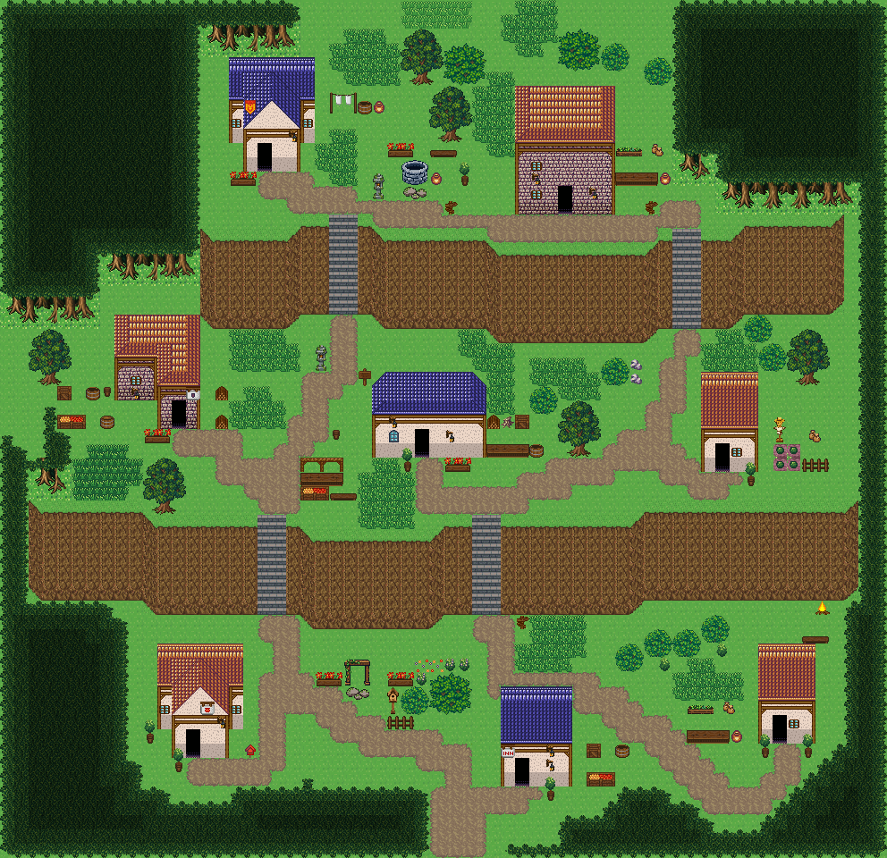

# 층바위 절벽마을

세 높이의 대지, 네 계단과 절벽 아래 작업 마당. 시작점 (31,56); 집 8채. 0기준 맵 좌표. 모든 집은 고정 조각이며 회전/잘라내기 금지. cliffs.points는 x가 증가하는 절벽 윗선 꼭짓점, height는 윗선→밑단의 y 차이다. stairs=[x,y,height]는 폭2, 윗선 행 y부터 y+height까지이고 양끝 착지칸은 y-1/y+height+1이다. 이전 plateaus 윤곽은 사용하지 않는다. 몸통·지붕·소품 전체 배열은 다음 부품 문서와 연결한다.




## 입력 계획과 예약할 접근칸
```json
{
  "mapId": "terrace-cliff-village",
  "width": 62,
  "height": 60,
  "seed": 347,
  "start": {
    "x": 31,
    "y": 56
  },
  "yards": [
    {
      "ownerId": "terrace-cliff-village-house-1",
      "kit": "laundry",
      "name": "세탁·건조",
      "reason": "상단 서쪽 주거 마당은 세탁·건조 공간",
      "x": 23,
      "y": 6,
      "side": "right",
      "w": 4,
      "h": 2
    },
    {
      "ownerId": "terrace-cliff-village-house-2",
      "kit": "herbs",
      "name": "약초 손질",
      "reason": "상단 동쪽 마당에 약초 재배·손질 작업을 지정",
      "x": 43,
      "y": 10,
      "side": "right",
      "w": 4,
      "h": 3
    },
    {
      "ownerId": "terrace-cliff-village-house-3",
      "kit": "storage",
      "name": "물자 보관",
      "reason": "중단 서쪽 길가 집을 물자 보관 거점으로 지정",
      "x": 4,
      "y": 27,
      "side": "left",
      "w": 4,
      "h": 3
    },
    {
      "ownerId": "terrace-cliff-village-house-4",
      "kit": "woodwork",
      "name": "목재 가공",
      "reason": "중단 작업 생활권에 가공 작업대를 지정",
      "x": 34,
      "y": 29,
      "side": "right",
      "w": 4,
      "h": 3
    },
    {
      "ownerId": "terrace-cliff-village-house-5",
      "kit": "growing",
      "name": "텃밭 돌보기",
      "reason": "중단 동쪽 평탄한 마당을 자급 텃밭으로 지정",
      "x": 54,
      "y": 29,
      "side": "right",
      "w": 4,
      "h": 4
    },
    {
      "ownerId": "terrace-cliff-village-house-7",
      "kit": "storage",
      "name": "물자 보관",
      "reason": "남쪽 입구와 연결되는 하단 집에 보관 기능 지정",
      "x": 41,
      "y": 52,
      "side": "right",
      "w": 3,
      "h": 3
    },
    {
      "ownerId": "terrace-cliff-village-house-8",
      "kit": "herbs",
      "name": "약초 손질",
      "reason": "하단 동쪽 집에서 약초를 손질하는 공간 지정",
      "x": 48,
      "y": 49,
      "side": "left",
      "w": 4,
      "h": 3
    }
  ],
  "activitySites": {},
  "civicPlaces": [
    {
      "id": "well",
      "name": "상단 두 집의 공동 우물터",
      "anchor": {
        "type": "road",
        "x": 33,
        "y": 15,
        "maxDistance": 10
      },
      "items": [
        {
          "id": "well-1",
          "name": "낮은 돌 우물",
          "x": 28,
          "y": 11,
          "purpose": "상단 주택에서 계단을 내려가지 않고 물 긷기"
        },
        {
          "id": "well-2",
          "name": "항아리",
          "x": 30,
          "y": 12,
          "purpose": "물을 담아 집으로 옮기는 용기",
          "near": "낮은 돌 우물"
        },
        {
          "id": "well-3",
          "name": "징검돌",
          "x": 28,
          "y": 13,
          "purpose": "급수 작업 발 디딤",
          "near": "낮은 돌 우물"
        },
        {
          "id": "well-4",
          "name": "꽃 화단",
          "x": 27,
          "y": 9,
          "purpose": "주민이 가꾸는 우물터 화단",
          "near": "낮은 돌 우물"
        },
        {
          "id": "well-plaza-1",
          "name": "벤치",
          "x": 30,
          "y": 10,
          "purpose": "우물가에 앉아 쉬는 자리",
          "near": "낮은 돌 우물"
        },
        {
          "id": "well-plaza-2",
          "name": "돌등",
          "x": 26,
          "y": 12,
          "purpose": "밤에 우물가를 밝히는 돌등",
          "near": "낮은 돌 우물"
        },
        {
          "id": "well-plaza-3",
          "name": "화분",
          "x": 32,
          "y": 11,
          "purpose": "우물가를 꾸미는 화분",
          "near": "낮은 돌 우물"
        }
      ],
      "site": {
        "x": 33,
        "y": 15,
        "w": 1,
        "h": 1,
        "layer": "lower",
        "tiles": [
          1480
        ]
      }
    },
    {
      "id": "stairs",
      "name": "중단 계단의 안내 자리",
      "anchor": {
        "type": "road",
        "x": 23,
        "y": 26,
        "maxDistance": 10
      },
      "items": [
        {
          "id": "stairs-2",
          "name": "표지판",
          "x": 25,
          "y": 25,
          "purpose": "상단 주거지와 하단 출구 방향"
        },
        {
          "id": "stairs-3",
          "name": "돌등",
          "x": 22,
          "y": 24,
          "purpose": "계단 하단 야간 조명"
        }
      ],
      "site": {
        "x": 23,
        "y": 26,
        "w": 1,
        "h": 1,
        "layer": "lower",
        "tiles": [
          1500
        ]
      }
    },
    {
      "id": "garden",
      "name": "아랫집의 작은 꽃마당",
      "anchor": {
        "type": "house",
        "id": "terrace-cliff-village-house-6",
        "maxDistance": 16
      },
      "items": [
        {
          "id": "garden-1",
          "name": "덩굴 아치",
          "x": 24,
          "y": 46,
          "purpose": "집에서 꽃마당으로 들어가는 문"
        },
        {
          "id": "garden-2",
          "name": "꽃 화단",
          "x": 22,
          "y": 46,
          "purpose": "마당 입구 화단",
          "near": "덩굴 아치"
        },
        {
          "id": "garden-3",
          "name": "꽃 화단",
          "x": 27,
          "y": 46,
          "purpose": "마당 입구 화단",
          "near": "덩굴 아치"
        },
        {
          "id": "garden-4",
          "name": "징검돌",
          "x": 24,
          "y": 48,
          "purpose": "꽃마당의 보행 자리",
          "near": "덩굴 아치"
        },
        {
          "id": "garden-5",
          "name": "새집",
          "x": 27,
          "y": 48,
          "purpose": "정원의 조용한 새 쉼터",
          "near": "꽃 화단"
        },
        {
          "id": "garden-6",
          "name": "나무 울타리",
          "x": 27,
          "y": 50,
          "purpose": "통로를 가리지 않는 정원 경계",
          "near": "꽃 화단"
        }
      ],
      "site": {
        "x": 11,
        "y": 45,
        "w": 6,
        "h": 8,
        "layer": "lower",
        "tiles": [
          374,
          374,
          374,
          374,
          374,
          374,
          375,
          376,
          376,
          377,
          377,
          375,
          405,
          376,
          376,
          377,
          377,
          405,
          15,
          376,
          46,
          46,
          377,
          15,
          45,
          46,
          46,
          46,
          46,
          45,
          75,
          15,
          16,
          16,
          17,
          75,
          240,
          45,
          329,
          46,
          47,
          240,
          240,
          75,
          359,
          76,
          77,
          240
        ]
      }
    },
    {
      "id": "front",
      "name": "아랫집 현관",
      "anchor": {
        "type": "house",
        "id": "terrace-cliff-village-house-6",
        "maxDistance": 10
      },
      "items": [
        {
          "id": "front-1",
          "name": "우편함",
          "x": 17,
          "y": 52,
          "purpose": "길에서 접근하는 우편 수취"
        },
        {
          "id": "front-2",
          "name": "화분",
          "x": 10,
          "y": 50,
          "purpose": "집 앞을 가꾸는 화분"
        }
      ],
      "site": {
        "x": 11,
        "y": 45,
        "w": 6,
        "h": 8,
        "layer": "lower",
        "tiles": [
          374,
          374,
          374,
          374,
          374,
          374,
          375,
          376,
          376,
          377,
          377,
          375,
          405,
          376,
          376,
          377,
          377,
          405,
          15,
          376,
          46,
          46,
          377,
          15,
          45,
          46,
          46,
          46,
          46,
          45,
          75,
          15,
          16,
          16,
          17,
          75,
          240,
          45,
          329,
          46,
          47,
          240,
          240,
          75,
          359,
          76,
          77,
          240
        ]
      }
    },
    {
      "id": "lamp-2",
      "name": "현관 옆 벽등",
      "anchor": {
        "type": "house",
        "id": "terrace-cliff-village-house-2",
        "maxDistance": 10
      },
      "items": [
        {
          "id": "lamp-2-1",
          "name": "벽걸이 등불",
          "x": 41,
          "y": 13,
          "purpose": "현관 옆 벽면 조명"
        }
      ],
      "site": {
        "x": 36,
        "y": 6,
        "w": 7,
        "h": 9,
        "layer": "lower",
        "tiles": [
          376,
          404,
          404,
          404,
          404,
          404,
          377,
          376,
          404,
          404,
          404,
          404,
          404,
          377,
          376,
          404,
          404,
          404,
          404,
          404,
          377,
          405,
          405,
          405,
          405,
          405,
          405,
          405,
          12,
          13,
          13,
          13,
          13,
          13,
          14,
          42,
          43,
          43,
          43,
          43,
          43,
          44,
          42,
          43,
          43,
          43,
          43,
          43,
          44,
          42,
          43,
          43,
          329,
          43,
          43,
          44,
          72,
          73,
          73,
          359,
          73,
          73,
          74
        ]
      }
    },
    {
      "id": "lamp-4",
      "name": "현관 옆 벽등",
      "anchor": {
        "type": "house",
        "id": "terrace-cliff-village-house-4",
        "maxDistance": 10
      },
      "items": [
        {
          "id": "lamp-4-1",
          "name": "벽걸이 등불",
          "x": 31,
          "y": 30,
          "purpose": "현관 옆 벽면 조명"
        }
      ],
      "site": {
        "x": 26,
        "y": 26,
        "w": 8,
        "h": 6,
        "layer": "lower",
        "tiles": [
          240,
          406,
          406,
          406,
          406,
          406,
          406,
          240,
          406,
          406,
          406,
          406,
          406,
          406,
          406,
          407,
          467,
          467,
          467,
          467,
          467,
          467,
          467,
          467,
          15,
          16,
          16,
          16,
          16,
          16,
          16,
          17,
          45,
          46,
          46,
          329,
          46,
          46,
          46,
          47,
          75,
          76,
          76,
          359,
          76,
          76,
          76,
          77
        ]
      }
    },
    {
      "id": "lamp-7",
      "name": "현관 옆 벽등",
      "anchor": {
        "type": "house",
        "id": "terrace-cliff-village-house-7",
        "maxDistance": 10
      },
      "items": [
        {
          "id": "lamp-7-1",
          "name": "벽걸이 등불",
          "x": 38,
          "y": 53,
          "purpose": "현관 옆 벽면 조명"
        }
      ],
      "site": {
        "x": 35,
        "y": 48,
        "w": 5,
        "h": 7,
        "layer": "lower",
        "tiles": [
          436,
          436,
          436,
          436,
          436,
          437,
          437,
          437,
          437,
          437,
          437,
          437,
          437,
          437,
          437,
          467,
          467,
          467,
          467,
          467,
          15,
          16,
          16,
          16,
          17,
          45,
          329,
          46,
          46,
          47,
          75,
          359,
          76,
          76,
          77
        ]
      }
    },
    {
      "id": "overlook",
      "name": "윗단 절벽 끝 전망 쉼터",
      "anchor": {
        "type": "road",
        "x": 37,
        "y": 15,
        "maxDistance": 10
      },
      "items": [
        {
          "id": "overlook-2",
          "name": "나무 이정표",
          "x": 31,
          "y": 14,
          "purpose": "서쪽 계단으로 내려가는 길 안내"
        },
        {
          "id": "overlook-3",
          "name": "나무 이정표",
          "x": 45,
          "y": 14,
          "purpose": "동쪽 계단으로 내려가는 길 안내"
        }
      ],
      "site": {
        "x": 37,
        "y": 15,
        "w": 1,
        "h": 1,
        "layer": "lower",
        "tiles": [
          1501
        ]
      }
    },
    {
      "id": "mid-east-sign",
      "name": "동쪽 계단 아래 길잡이",
      "anchor": {
        "type": "road",
        "x": 47,
        "y": 24,
        "maxDistance": 10
      },
      "items": [],
      "site": {
        "x": 47,
        "y": 24,
        "w": 1,
        "h": 1,
        "layer": "lower",
        "tiles": [
          1487
        ]
      }
    },
    {
      "id": "lower-signs",
      "name": "아랫단 계단 발치 길잡이",
      "anchor": {
        "type": "road",
        "x": 19,
        "y": 43,
        "maxDistance": 10
      },
      "items": [],
      "site": {
        "x": 19,
        "y": 43,
        "w": 1,
        "h": 1,
        "layer": "lower",
        "tiles": [
          1501
        ]
      }
    },
    {
      "id": "lower-east-sign",
      "name": "아랫단 동쪽 계단 발치",
      "anchor": {
        "type": "road",
        "x": 34,
        "y": 43,
        "maxDistance": 10
      },
      "items": [
        {
          "id": "lower-east-sign-1",
          "name": "나무 이정표",
          "x": 36,
          "y": 43,
          "purpose": "가운데 단으로 오르는 동쪽 계단 안내"
        }
      ],
      "site": {
        "x": 34,
        "y": 43,
        "w": 1,
        "h": 1,
        "layer": "lower",
        "tiles": [
          1501
        ]
      }
    },
    {
      "id": "cave-camp",
      "name": "동쪽 아랫단 불자리",
      "anchor": {
        "type": "house",
        "id": "terrace-cliff-village-house-8",
        "maxDistance": 12
      },
      "items": [
        {
          "id": "cave-camp-1",
          "name": "모닥불",
          "x": 57,
          "y": 42,
          "purpose": "저녁에 동쪽 집 주민이 모이는 불"
        },
        {
          "id": "cave-camp-2",
          "name": "벤치",
          "x": 56,
          "y": 44,
          "purpose": "불가에 앉는 자리",
          "near": "모닥불"
        }
      ],
      "site": {
        "x": 53,
        "y": 45,
        "w": 4,
        "h": 7,
        "layer": "lower",
        "tiles": [
          374,
          374,
          374,
          374,
          375,
          375,
          375,
          375,
          375,
          375,
          375,
          375,
          405,
          405,
          405,
          405,
          15,
          16,
          16,
          17,
          45,
          329,
          46,
          47,
          75,
          359,
          76,
          77
        ]
      }
    },
    {
      "id": "mid-market",
      "name": "가운데 단 장터",
      "anchor": {
        "type": "house",
        "id": "terrace-cliff-village-house-4",
        "maxDistance": 12
      },
      "items": [
        {
          "id": "mid-market-1",
          "name": "장터 노점",
          "x": 21,
          "y": 32,
          "purpose": "세 단 주민이 모두 들르는 가운데 단 좌판"
        },
        {
          "id": "mid-market-2",
          "name": "과일 좌판",
          "x": 21,
          "y": 34,
          "purpose": "윗단 과수에서 딴 과일",
          "near": "장터 노점"
        },
        {
          "id": "mid-market-3",
          "name": "작은 오크통",
          "x": 23,
          "y": 30,
          "purpose": "노점 음료를 담는 통",
          "near": "장터 노점"
        },
        {
          "id": "mid-market-4",
          "name": "벤치",
          "x": 23,
          "y": 34,
          "purpose": "장 보러 온 사람의 쉼 자리"
        }
      ],
      "site": {
        "x": 26,
        "y": 26,
        "w": 8,
        "h": 6,
        "layer": "lower",
        "tiles": [
          240,
          406,
          406,
          406,
          406,
          406,
          406,
          240,
          406,
          406,
          406,
          406,
          406,
          406,
          406,
          407,
          467,
          467,
          467,
          467,
          467,
          467,
          467,
          467,
          15,
          16,
          16,
          16,
          16,
          16,
          16,
          17,
          45,
          46,
          46,
          329,
          46,
          46,
          46,
          47,
          75,
          76,
          76,
          359,
          76,
          76,
          76,
          77
        ]
      }
    },
    {
      "id": "mid-woodpile",
      "name": "가운데 단 서쪽 집 땔감",
      "anchor": {
        "type": "house",
        "id": "terrace-cliff-village-house-3",
        "maxDistance": 10
      },
      "items": [
        {
          "id": "mid-woodpile-1",
          "name": "장작 더미",
          "x": 15,
          "y": 27,
          "purpose": "서쪽 집의 겨울 땔감"
        },
        {
          "id": "mid-woodpile-2",
          "name": "장작 더미",
          "x": 15,
          "y": 29,
          "purpose": "땔감 두 번째 더미",
          "near": "장작 더미"
        }
      ],
      "site": {
        "x": 8,
        "y": 22,
        "w": 6,
        "h": 8,
        "layer": "lower",
        "tiles": [
          376,
          404,
          404,
          404,
          404,
          377,
          376,
          404,
          404,
          404,
          404,
          377,
          405,
          405,
          405,
          376,
          404,
          377,
          12,
          13,
          14,
          376,
          404,
          377,
          42,
          43,
          44,
          405,
          405,
          405,
          72,
          73,
          74,
          12,
          13,
          14,
          240,
          240,
          240,
          42,
          329,
          44,
          240,
          240,
          240,
          72,
          359,
          74
        ]
      }
    }
  ],
  "entrance": {
    "x": 31,
    "y": 59
  },
  "crest": null,
  "patches": [
    [
      8,
      10,
      13,
      10,
      11
    ],
    [
      55,
      7,
      13,
      12,
      11
    ],
    [
      29,
      1,
      12,
      7,
      9
    ]
  ],
  "clearings": [
    [
      33,
      3,
      22,
      6,
      12
    ],
    [
      2,
      27,
      6,
      8,
      7
    ]
  ],
  "cliffs": [
    {
      "points": [
        [
          2,
          35
        ],
        [
          9,
          35
        ],
        [
          11,
          36
        ],
        [
          20,
          36
        ],
        [
          22,
          37
        ],
        [
          30,
          37
        ],
        [
          31,
          36
        ],
        [
          44,
          36
        ],
        [
          45,
          35
        ],
        [
          59,
          35
        ]
      ],
      "height": 6
    },
    {
      "points": [
        [
          14,
          16
        ],
        [
          20,
          16
        ],
        [
          21,
          15
        ],
        [
          25,
          15
        ],
        [
          27,
          16
        ],
        [
          33,
          16
        ],
        [
          35,
          17
        ],
        [
          45,
          17
        ],
        [
          46,
          16
        ],
        [
          51,
          16
        ],
        [
          52,
          15
        ],
        [
          58,
          15
        ]
      ],
      "height": 6
    }
  ],
  "stairs": [
    [
      23,
      15,
      6
    ],
    [
      47,
      16,
      6
    ],
    [
      18,
      36,
      6
    ],
    [
      33,
      36,
      6
    ]
  ],
  "ponds": [],
  "coast": false,
  "dock": null,
  "cave": null,
  "spine": [
    [
      31,
      56
    ],
    [
      31,
      52
    ],
    [
      19,
      46
    ],
    [
      19,
      43
    ],
    [
      19,
      33
    ],
    [
      23,
      25
    ],
    [
      23,
      22
    ],
    [
      23,
      13
    ],
    [
      47,
      14
    ],
    [
      47,
      23
    ],
    [
      45,
      30
    ],
    [
      34,
      34
    ],
    [
      34,
      43
    ],
    [
      34,
      47
    ],
    [
      53,
      55
    ]
  ],
  "access": [
    {
      "role": "stairs-top",
      "x": 23,
      "y": 14
    },
    {
      "role": "stairs-bottom",
      "x": 23,
      "y": 22
    },
    {
      "role": "stairs-top",
      "x": 47,
      "y": 15
    },
    {
      "role": "stairs-bottom",
      "x": 47,
      "y": 23
    },
    {
      "role": "stairs-top",
      "x": 18,
      "y": 35
    },
    {
      "role": "stairs-bottom",
      "x": 18,
      "y": 43
    },
    {
      "role": "stairs-top",
      "x": 33,
      "y": 35
    },
    {
      "role": "stairs-bottom",
      "x": 33,
      "y": 43
    },
    {
      "role": "door-front",
      "x": 18,
      "y": 12
    },
    {
      "role": "door-front",
      "x": 39,
      "y": 15
    },
    {
      "role": "door-front",
      "x": 12,
      "y": 30
    },
    {
      "role": "door-front",
      "x": 29,
      "y": 32
    },
    {
      "role": "door-front",
      "x": 50,
      "y": 33
    },
    {
      "role": "door-front",
      "x": 13,
      "y": 53
    },
    {
      "role": "door-front",
      "x": 36,
      "y": 55
    },
    {
      "role": "door-front",
      "x": 54,
      "y": 52
    },
    {
      "role": "map-entrance",
      "x": 30,
      "y": 59
    },
    {
      "role": "map-entrance",
      "x": 31,
      "y": 59
    },
    {
      "role": "map-entrance",
      "x": 32,
      "y": 59
    },
    {
      "role": "map-entrance",
      "x": 30,
      "y": 58
    },
    {
      "role": "map-entrance",
      "x": 31,
      "y": 58
    },
    {
      "role": "map-entrance",
      "x": 32,
      "y": 58
    },
    {
      "role": "map-entrance",
      "x": 30,
      "y": 57
    },
    {
      "role": "map-entrance",
      "x": 31,
      "y": 57
    },
    {
      "role": "map-entrance",
      "x": 32,
      "y": 57
    },
    {
      "role": "map-entrance",
      "x": 30,
      "y": 56
    },
    {
      "role": "map-entrance",
      "x": 31,
      "y": 56
    },
    {
      "role": "map-entrance",
      "x": 32,
      "y": 56
    },
    {
      "role": "map-entrance",
      "x": 30,
      "y": 55
    },
    {
      "role": "map-entrance",
      "x": 31,
      "y": 55
    },
    {
      "role": "map-entrance",
      "x": 32,
      "y": 55
    },
    {
      "role": "civic-use",
      "x": 27,
      "y": 11,
      "placeId": "well",
      "propId": "well-1"
    },
    {
      "role": "civic-use",
      "x": 30,
      "y": 13,
      "placeId": "well",
      "propId": "well-2"
    },
    {
      "role": "civic-use",
      "x": 28,
      "y": 14,
      "placeId": "well",
      "propId": "well-3"
    },
    {
      "role": "civic-use",
      "x": 26,
      "y": 9,
      "placeId": "well",
      "propId": "well-4"
    },
    {
      "role": "civic-use",
      "x": 24,
      "y": 25,
      "placeId": "stairs",
      "propId": "stairs-2"
    },
    {
      "role": "civic-use",
      "x": 23,
      "y": 24,
      "placeId": "stairs",
      "propId": "stairs-3"
    },
    {
      "role": "civic-use",
      "x": 24,
      "y": 47,
      "placeId": "garden",
      "propId": "garden-1"
    },
    {
      "role": "civic-use",
      "x": 21,
      "y": 46,
      "placeId": "garden",
      "propId": "garden-2"
    },
    {
      "role": "civic-use",
      "x": 26,
      "y": 46,
      "placeId": "garden",
      "propId": "garden-3"
    },
    {
      "role": "civic-use",
      "x": 24,
      "y": 49,
      "placeId": "garden",
      "propId": "garden-4"
    },
    {
      "role": "civic-use",
      "x": 26,
      "y": 48,
      "placeId": "garden",
      "propId": "garden-5"
    },
    {
      "role": "civic-use",
      "x": 27,
      "y": 51,
      "placeId": "garden",
      "propId": "garden-6"
    },
    {
      "role": "civic-use",
      "x": 17,
      "y": 53,
      "placeId": "front",
      "propId": "front-1"
    },
    {
      "role": "civic-use",
      "x": 9,
      "y": 50,
      "placeId": "front",
      "propId": "front-2"
    },
    {
      "role": "civic-use",
      "x": 31,
      "y": 15,
      "placeId": "overlook",
      "propId": "overlook-2"
    },
    {
      "role": "civic-use",
      "x": 45,
      "y": 15,
      "placeId": "overlook",
      "propId": "overlook-3"
    },
    {
      "role": "civic-use",
      "x": 36,
      "y": 44,
      "placeId": "lower-east-sign",
      "propId": "lower-east-sign-1"
    },
    {
      "role": "civic-use",
      "x": 57,
      "y": 43,
      "placeId": "cave-camp",
      "propId": "cave-camp-1"
    },
    {
      "role": "civic-use",
      "x": 55,
      "y": 44,
      "placeId": "cave-camp",
      "propId": "cave-camp-2"
    },
    {
      "role": "civic-use",
      "x": 20,
      "y": 32,
      "placeId": "mid-market",
      "propId": "mid-market-1"
    },
    {
      "role": "civic-use",
      "x": 21,
      "y": 35,
      "placeId": "mid-market",
      "propId": "mid-market-2"
    },
    {
      "role": "civic-use",
      "x": 23,
      "y": 31,
      "placeId": "mid-market",
      "propId": "mid-market-3"
    },
    {
      "role": "civic-use",
      "x": 23,
      "y": 35,
      "placeId": "mid-market",
      "propId": "mid-market-4"
    },
    {
      "role": "civic-use",
      "x": 15,
      "y": 28,
      "placeId": "mid-woodpile",
      "propId": "mid-woodpile-1"
    },
    {
      "role": "civic-use",
      "x": 15,
      "y": 30,
      "placeId": "mid-woodpile",
      "propId": "mid-woodpile-2"
    },
    {
      "role": "civic-use",
      "x": 30,
      "y": 11,
      "placeId": "well",
      "propId": "well-plaza-1"
    },
    {
      "role": "civic-use",
      "x": 25,
      "y": 12,
      "placeId": "well",
      "propId": "well-plaza-2"
    },
    {
      "role": "civic-use",
      "x": 31,
      "y": 11,
      "placeId": "well",
      "propId": "well-plaza-3"
    }
  ]
}
```


## 건물의 전체 하위·상위
### terrace-cliff-village-house-1
```json
{
  "id": "terrace-cliff-village-house-1",
  "role": "주거",
  "label": "왕궁 도시 · 파랑 박공 회벽집 6×8 ②",
  "window": 85,
  "abandoned": false,
  "vines": [],
  "x": 16,
  "y": 4,
  "w": 6,
  "h": 8,
  "template": 0,
  "doorAt": {
    "x": 18,
    "y": 11
  },
  "front": {
    "x": 18,
    "y": 12
  },
  "activity": "laundry",
  "reason": "상단 서쪽 주거 마당은 세탁·건조 공간",
  "width": 6,
  "height": 8,
  "lowerTiles": [
    [
      436,
      436,
      436,
      436,
      436,
      436
    ],
    [
      437,
      406,
      406,
      407,
      407,
      437
    ],
    [
      467,
      406,
      406,
      407,
      407,
      467
    ],
    [
      15,
      406,
      46,
      46,
      407,
      15
    ],
    [
      45,
      46,
      46,
      46,
      46,
      45
    ],
    [
      75,
      15,
      16,
      16,
      17,
      75
    ],
    [
      240,
      45,
      329,
      46,
      47,
      240
    ],
    [
      240,
      75,
      359,
      76,
      77,
      240
    ]
  ],
  "upperTiles": [
    [
      -1,
      -1,
      -1,
      -1,
      -1,
      -1
    ],
    [
      -1,
      -1,
      356,
      357,
      -1,
      -1
    ],
    [
      -1,
      356,
      -1,
      -1,
      357,
      -1
    ],
    [
      -1,
      208,
      386,
      387,
      -1,
      -1
    ],
    [
      85,
      386,
      -1,
      -1,
      387,
      85
    ],
    [
      -1,
      -1,
      -1,
      -1,
      2645,
      -1
    ],
    [
      -1,
      -1,
      -1,
      -1,
      -1,
      -1
    ],
    [
      2611,
      2612,
      -1,
      -1,
      -1,
      -1
    ]
  ]
}
```

### terrace-cliff-village-house-2
```json
{
  "id": "terrace-cliff-village-house-2",
  "role": "약초 작업집",
  "label": "오렌지 회벽 2층 rect-2f 집",
  "window": 85,
  "abandoned": false,
  "vines": [],
  "x": 36,
  "y": 6,
  "w": 7,
  "h": 9,
  "template": 4,
  "doorAt": {
    "x": 39,
    "y": 14
  },
  "front": {
    "x": 39,
    "y": 15
  },
  "activity": "herbs",
  "reason": "상단 동쪽 마당에 약초 재배·손질 작업을 지정",
  "width": 7,
  "height": 9,
  "lowerTiles": [
    [
      376,
      404,
      404,
      404,
      404,
      404,
      377
    ],
    [
      376,
      404,
      404,
      404,
      404,
      404,
      377
    ],
    [
      376,
      404,
      404,
      404,
      404,
      404,
      377
    ],
    [
      405,
      405,
      405,
      405,
      405,
      405,
      405
    ],
    [
      12,
      13,
      13,
      13,
      13,
      13,
      14
    ],
    [
      42,
      43,
      43,
      43,
      43,
      43,
      44
    ],
    [
      42,
      43,
      43,
      43,
      43,
      43,
      44
    ],
    [
      42,
      43,
      43,
      329,
      43,
      43,
      44
    ],
    [
      72,
      73,
      73,
      359,
      73,
      73,
      74
    ]
  ],
  "upperTiles": [
    [
      -1,
      -1,
      -1,
      -1,
      -1,
      -1,
      -1
    ],
    [
      -1,
      -1,
      -1,
      -1,
      -1,
      -1,
      -1
    ],
    [
      -1,
      -1,
      -1,
      -1,
      -1,
      -1,
      -1
    ],
    [
      384,
      -1,
      -1,
      -1,
      -1,
      -1,
      385
    ],
    [
      -1,
      -1,
      -1,
      -1,
      -1,
      -1,
      -1
    ],
    [
      -1,
      85,
      -1,
      -1,
      -1,
      -1,
      -1
    ],
    [
      -1,
      2645,
      -1,
      -1,
      -1,
      -1,
      -1
    ],
    [
      -1,
      85,
      -1,
      -1,
      -1,
      2645,
      -1
    ],
    [
      -1,
      -1,
      -1,
      -1,
      -1,
      -1,
      -1
    ]
  ]
}
```

### terrace-cliff-village-house-3
```json
{
  "id": "terrace-cliff-village-house-3",
  "role": "물자 보관집",
  "label": "오렌지 회벽 l-mirror 집",
  "window": 85,
  "abandoned": false,
  "vines": [],
  "x": 8,
  "y": 22,
  "w": 6,
  "h": 8,
  "template": 1,
  "doorAt": {
    "x": 12,
    "y": 29
  },
  "front": {
    "x": 12,
    "y": 30
  },
  "activity": "storage",
  "reason": "중단 서쪽 길가 집을 물자 보관 거점으로 지정",
  "width": 6,
  "height": 8,
  "lowerTiles": [
    [
      376,
      404,
      404,
      404,
      404,
      377
    ],
    [
      376,
      404,
      404,
      404,
      404,
      377
    ],
    [
      405,
      405,
      405,
      376,
      404,
      377
    ],
    [
      12,
      13,
      14,
      376,
      404,
      377
    ],
    [
      42,
      43,
      44,
      405,
      405,
      405
    ],
    [
      72,
      73,
      74,
      12,
      13,
      14
    ],
    [
      240,
      240,
      240,
      42,
      329,
      44
    ],
    [
      240,
      240,
      240,
      72,
      359,
      74
    ]
  ],
  "upperTiles": [
    [
      -1,
      -1,
      -1,
      -1,
      -1,
      -1
    ],
    [
      -1,
      -1,
      -1,
      -1,
      -1,
      -1
    ],
    [
      384,
      -1,
      -1,
      -1,
      -1,
      -1
    ],
    [
      -1,
      -1,
      -1,
      -1,
      -1,
      -1
    ],
    [
      -1,
      85,
      -1,
      384,
      -1,
      385
    ],
    [
      -1,
      2645,
      -1,
      -1,
      -1,
      472
    ],
    [
      -1,
      -1,
      -1,
      -1,
      -1,
      -1
    ],
    [
      -1,
      -1,
      2611,
      2612,
      -1,
      -1
    ]
  ]
}
```

### terrace-cliff-village-house-4
```json
{
  "id": "terrace-cliff-village-house-4",
  "role": "목공 작업집",
  "label": "파랑 석벽 rect-wide 집",
  "window": 87,
  "abandoned": false,
  "vines": [],
  "x": 26,
  "y": 26,
  "w": 8,
  "h": 6,
  "template": 7,
  "doorAt": {
    "x": 29,
    "y": 31
  },
  "front": {
    "x": 29,
    "y": 32
  },
  "activity": "woodwork",
  "reason": "중단 작업 생활권에 가공 작업대를 지정",
  "width": 8,
  "height": 6,
  "lowerTiles": [
    [
      240,
      406,
      406,
      406,
      406,
      406,
      406,
      240
    ],
    [
      406,
      406,
      406,
      406,
      406,
      406,
      406,
      407
    ],
    [
      467,
      467,
      467,
      467,
      467,
      467,
      467,
      467
    ],
    [
      15,
      16,
      16,
      16,
      16,
      16,
      16,
      17
    ],
    [
      45,
      46,
      46,
      329,
      46,
      46,
      46,
      47
    ],
    [
      75,
      76,
      76,
      359,
      76,
      76,
      76,
      77
    ]
  ],
  "upperTiles": [
    [
      356,
      -1,
      -1,
      -1,
      -1,
      -1,
      -1,
      357
    ],
    [
      -1,
      -1,
      -1,
      -1,
      -1,
      -1,
      -1,
      -1
    ],
    [
      386,
      -1,
      -1,
      -1,
      -1,
      -1,
      -1,
      387
    ],
    [
      -1,
      2645,
      -1,
      -1,
      -1,
      -1,
      -1,
      -1
    ],
    [
      -1,
      87,
      -1,
      -1,
      -1,
      2645,
      -1,
      -1
    ],
    [
      -1,
      -1,
      2632,
      -1,
      -1,
      2611,
      2612,
      -1
    ]
  ]
}
```

### terrace-cliff-village-house-5
```json
{
  "id": "terrace-cliff-village-house-5",
  "role": "텃밭집",
  "label": "왕궁 도시 · 주황 박공 회벽집 4×7 ②",
  "window": 85,
  "abandoned": false,
  "vines": [],
  "x": 49,
  "y": 26,
  "w": 4,
  "h": 7,
  "template": 5,
  "doorAt": {
    "x": 50,
    "y": 32
  },
  "front": {
    "x": 50,
    "y": 33
  },
  "activity": "growing",
  "reason": "중단 동쪽 평탄한 마당을 자급 텃밭으로 지정",
  "width": 4,
  "height": 7,
  "lowerTiles": [
    [
      374,
      374,
      374,
      374
    ],
    [
      375,
      375,
      375,
      375
    ],
    [
      375,
      375,
      375,
      375
    ],
    [
      405,
      405,
      405,
      405
    ],
    [
      15,
      16,
      16,
      17
    ],
    [
      45,
      329,
      46,
      47
    ],
    [
      75,
      359,
      76,
      77
    ]
  ],
  "upperTiles": [
    [
      -1,
      -1,
      -1,
      -1
    ],
    [
      -1,
      -1,
      -1,
      -1
    ],
    [
      -1,
      -1,
      -1,
      -1
    ],
    [
      -1,
      -1,
      -1,
      -1
    ],
    [
      -1,
      -1,
      -1,
      -1
    ],
    [
      -1,
      -1,
      85,
      -1
    ],
    [
      -1,
      -1,
      -1,
      2632
    ]
  ]
}
```

### terrace-cliff-village-house-6
```json
{
  "id": "terrace-cliff-village-house-6",
  "role": "주거",
  "label": "왕궁 도시 · 주황 박공 회벽집 6×8",
  "window": 85,
  "abandoned": false,
  "vines": [],
  "x": 11,
  "y": 45,
  "w": 6,
  "h": 8,
  "template": 2,
  "doorAt": {
    "x": 13,
    "y": 52
  },
  "front": {
    "x": 13,
    "y": 53
  },
  "activity": "laundry",
  "reason": "하단 서쪽 주거 마당은 세탁·건조 공간",
  "width": 6,
  "height": 8,
  "lowerTiles": [
    [
      374,
      374,
      374,
      374,
      374,
      374
    ],
    [
      375,
      376,
      376,
      377,
      377,
      375
    ],
    [
      405,
      376,
      376,
      377,
      377,
      405
    ],
    [
      15,
      376,
      46,
      46,
      377,
      15
    ],
    [
      45,
      46,
      46,
      46,
      46,
      45
    ],
    [
      75,
      15,
      16,
      16,
      17,
      75
    ],
    [
      240,
      45,
      329,
      46,
      47,
      240
    ],
    [
      240,
      75,
      359,
      76,
      77,
      240
    ]
  ],
  "upperTiles": [
    [
      -1,
      -1,
      -1,
      -1,
      -1,
      -1
    ],
    [
      -1,
      -1,
      354,
      355,
      -1,
      -1
    ],
    [
      -1,
      354,
      -1,
      -1,
      355,
      -1
    ],
    [
      -1,
      -1,
      384,
      385,
      -1,
      -1
    ],
    [
      85,
      384,
      -1,
      473,
      385,
      85
    ],
    [
      -1,
      -1,
      -1,
      -1,
      2645,
      -1
    ],
    [
      -1,
      -1,
      -1,
      -1,
      -1,
      -1
    ],
    [
      -1,
      2632,
      -1,
      -1,
      -1,
      -1
    ]
  ]
}
```

### terrace-cliff-village-house-7
```json
{
  "id": "terrace-cliff-village-house-7",
  "role": "물자 보관집",
  "label": "왕궁 도시 · 파랑 회벽집 5×7",
  "window": null,
  "abandoned": false,
  "vines": [],
  "x": 35,
  "y": 48,
  "w": 5,
  "h": 7,
  "template": 6,
  "doorAt": {
    "x": 36,
    "y": 54
  },
  "front": {
    "x": 36,
    "y": 55
  },
  "activity": "storage",
  "reason": "남쪽 입구와 연결되는 하단 집에 보관 기능 지정",
  "width": 5,
  "height": 7,
  "lowerTiles": [
    [
      436,
      436,
      436,
      436,
      436
    ],
    [
      437,
      437,
      437,
      437,
      437
    ],
    [
      437,
      437,
      437,
      437,
      437
    ],
    [
      467,
      467,
      467,
      467,
      467
    ],
    [
      15,
      16,
      16,
      16,
      17
    ],
    [
      45,
      329,
      46,
      46,
      47
    ],
    [
      75,
      359,
      76,
      76,
      77
    ]
  ],
  "upperTiles": [
    [
      -1,
      -1,
      -1,
      -1,
      -1
    ],
    [
      -1,
      -1,
      -1,
      -1,
      -1
    ],
    [
      -1,
      -1,
      -1,
      -1,
      -1
    ],
    [
      -1,
      -1,
      -1,
      -1,
      -1
    ],
    [
      443,
      -1,
      -1,
      2645,
      -1
    ],
    [
      -1,
      -1,
      -1,
      2645,
      -1
    ],
    [
      -1,
      -1,
      -1,
      2632,
      -1
    ]
  ]
}
```

### terrace-cliff-village-house-8
```json
{
  "id": "terrace-cliff-village-house-8",
  "role": "약초 작업집",
  "label": "왕궁 도시 · 주황 박공 회벽집 4×7 ②",
  "window": 85,
  "abandoned": false,
  "vines": [],
  "x": 53,
  "y": 45,
  "w": 4,
  "h": 7,
  "template": 3,
  "doorAt": {
    "x": 54,
    "y": 51
  },
  "front": {
    "x": 54,
    "y": 52
  },
  "activity": "herbs",
  "reason": "하단 동쪽 집에서 약초를 손질하는 공간 지정",
  "width": 4,
  "height": 7,
  "lowerTiles": [
    [
      374,
      374,
      374,
      374
    ],
    [
      375,
      375,
      375,
      375
    ],
    [
      375,
      375,
      375,
      375
    ],
    [
      405,
      405,
      405,
      405
    ],
    [
      15,
      16,
      16,
      17
    ],
    [
      45,
      329,
      46,
      47
    ],
    [
      75,
      359,
      76,
      77
    ]
  ],
  "upperTiles": [
    [
      -1,
      -1,
      -1,
      -1
    ],
    [
      -1,
      -1,
      -1,
      -1
    ],
    [
      -1,
      -1,
      -1,
      -1
    ],
    [
      -1,
      -1,
      -1,
      -1
    ],
    [
      -1,
      -1,
      -1,
      -1
    ],
    [
      -1,
      -1,
      85,
      -1
    ],
    [
      2632,
      -1,
      -1,
      2632
    ]
  ]
}
```
