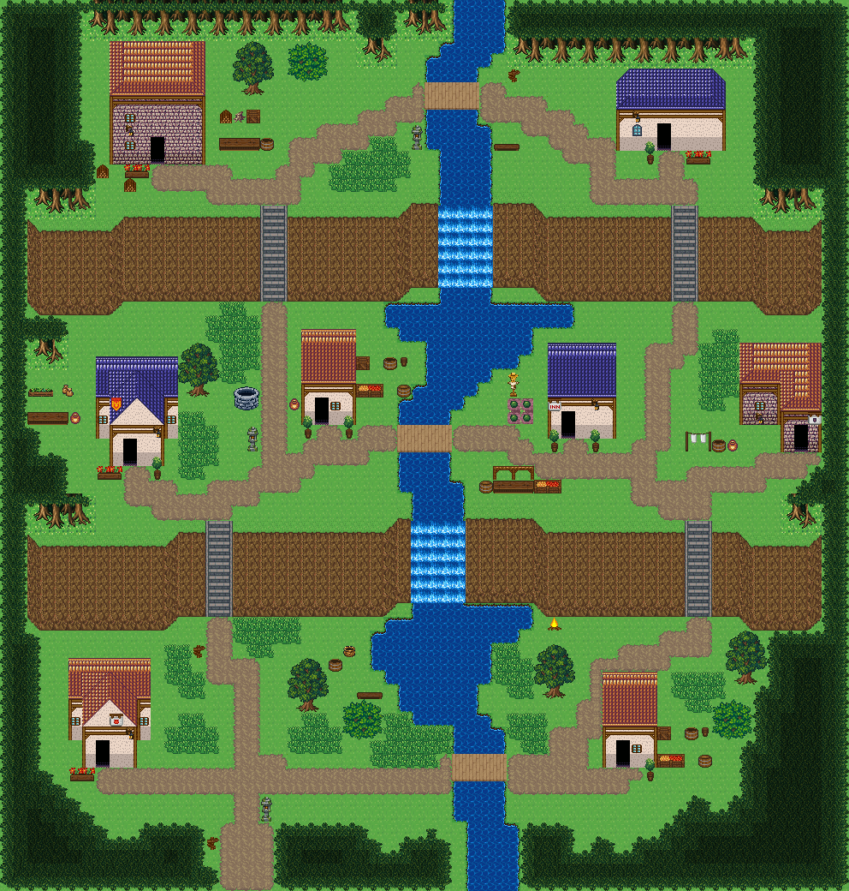

# 두 폭포 강마을

북쪽 숲에서 나온 강이 마을 한가운데를 흐르며 두 줄 절벽에서 폭포로 떨어지고, 단마다 다리가 양쪽 강둑을 잇는다. 시작점 (24,68); 집 8채. 0기준 맵 좌표. 모든 집은 고정 조각이며 회전/잘라내기 금지. cliffs.points는 x가 증가하는 절벽 윗선 꼭짓점, height는 윗선→밑단의 y 차이다. stairs=[x,y,height]는 폭2, 윗선 행 y부터 y+height까지이고 양끝 착지칸은 y-1/y+height+1이다. 이전 plateaus 윤곽은 사용하지 않는다. 몸통·지붕·소품 전체 배열은 다음 부품 문서와 연결한다.




## 입력 계획과 예약할 접근칸
```json
{
  "mapId": "twin-falls-river-village",
  "width": 88,
  "height": 72,
  "seed": 733,
  "start": {
    "x": 24,
    "y": 68
  },
  "yards": [
    {
      "ownerId": "twin-falls-river-village-house-1",
      "kit": "woodwork",
      "name": "목재 가공",
      "reason": "윗단 서쪽 숲 가장자리 집에 목재 손질 마당을 둔다",
      "x": 22,
      "y": 11,
      "side": "right",
      "w": 3,
      "h": 3
    },
    {
      "ownerId": "twin-falls-river-village-house-3",
      "kit": "herbs",
      "name": "약초 손질",
      "reason": "가운데 단 서쪽 숲길 집에서 약초를 손질한다",
      "x": 19,
      "y": 36,
      "side": "right",
      "w": 5,
      "h": 3
    },
    {
      "ownerId": "twin-falls-river-village-house-4",
      "kit": "storage",
      "name": "물자 보관",
      "reason": "폭포 아래 서쪽 다리목 집을 물자 보관 거점으로 둔다",
      "x": 35,
      "y": 34,
      "side": "right",
      "w": 3,
      "h": 1
    },
    {
      "ownerId": "twin-falls-river-village-house-5",
      "kit": "growing",
      "name": "텃밭 돌보기",
      "reason": "가운데 단 동쪽 강둑의 평지를 가족 텃밭으로 쓴다",
      "x": 49,
      "y": 32,
      "side": "left",
      "w": 2,
      "h": 4
    },
    {
      "ownerId": "twin-falls-river-village-house-6",
      "kit": "laundry",
      "name": "세탁·건조",
      "reason": "가운데 단 동쪽 끝 집은 세탁 마당만 둔다",
      "x": 65,
      "y": 36,
      "side": "left",
      "w": 4,
      "h": 2
    },
    {
      "ownerId": "twin-falls-river-village-house-8",
      "kit": "storage",
      "name": "물자 보관",
      "reason": "아랫단 동쪽 다리목 집을 짐 보관 거점으로 둔다",
      "x": 63,
      "y": 62,
      "side": "right",
      "w": 3,
      "h": 1
    }
  ],
  "activitySites": {},
  "civicPlaces": [
    {
      "id": "falls-overlook",
      "name": "윗 폭포 전망 쉼터",
      "anchor": {
        "type": "road",
        "x": 38,
        "y": 10,
        "maxDistance": 12
      },
      "items": [
        {
          "id": "falls-overlook-1",
          "name": "벤치",
          "x": 37,
          "y": 17,
          "purpose": "윗 폭포가 떨어지는 소리를 들으며 쉬는 자리"
        },
        {
          "id": "falls-overlook-2",
          "name": "벤치",
          "x": 45,
          "y": 15,
          "purpose": "강 건너편에서 폭포를 보는 자리"
        },
        {
          "id": "falls-overlook-3",
          "name": "돌등",
          "x": 39,
          "y": 12,
          "purpose": "다리 서쪽 목 밝히기"
        }
      ],
      "site": {
        "x": 38,
        "y": 10,
        "w": 1,
        "h": 1,
        "layer": "lower",
        "tiles": [
          1501
        ]
      }
    },
    {
      "id": "top-bridge-sign",
      "name": "윗다리 길잡이",
      "anchor": {
        "type": "road",
        "x": 48,
        "y": 10,
        "maxDistance": 10
      },
      "items": [
        {
          "id": "top-bridge-sign-1",
          "name": "나무 이정표",
          "x": 49,
          "y": 8,
          "purpose": "윗단 동쪽 집으로 가는 길 안내"
        }
      ],
      "site": {
        "x": 48,
        "y": 10,
        "w": 1,
        "h": 1,
        "layer": "lower",
        "tiles": [
          1501
        ]
      }
    },
    {
      "id": "well",
      "name": "가운데 단 공동 우물",
      "anchor": {
        "type": "road",
        "x": 30,
        "y": 38,
        "maxDistance": 10
      },
      "items": [
        {
          "id": "well-1",
          "name": "낮은 돌 우물",
          "x": 24,
          "y": 33,
          "purpose": "가운데 단 서쪽 주민의 급수"
        },
        {
          "id": "well-2",
          "name": "항아리",
          "x": 28,
          "y": 34,
          "purpose": "길어 온 물을 담는 용기",
          "near": "낮은 돌 우물"
        },
        {
          "id": "well-3",
          "name": "게시판",
          "x": 22,
          "y": 36,
          "purpose": "우물에 모인 주민의 마을 공지"
        }
      ],
      "site": {
        "x": 30,
        "y": 38,
        "w": 1,
        "h": 1,
        "layer": "lower",
        "tiles": [
          1500
        ]
      }
    },
    {
      "id": "bridge-market",
      "name": "가운데 다리목 장터",
      "anchor": {
        "type": "road",
        "x": 46,
        "y": 37,
        "maxDistance": 10
      },
      "items": [
        {
          "id": "bridge-market-1",
          "name": "장터 노점",
          "x": 46,
          "y": 40,
          "purpose": "강 양쪽 주민이 만나는 다리목 좌판"
        },
        {
          "id": "bridge-market-2",
          "name": "과일 좌판",
          "x": 50,
          "y": 41,
          "purpose": "가운데 단 텃밭에서 거둔 과일",
          "near": "장터 노점"
        },
        {
          "id": "bridge-market-3",
          "name": "술통",
          "x": 44,
          "y": 41,
          "purpose": "장터 음료 통",
          "near": "장터 노점"
        }
      ],
      "site": {
        "x": 46,
        "y": 37,
        "w": 1,
        "h": 1,
        "layer": "lower",
        "tiles": [
          1508
        ]
      }
    },
    {
      "id": "lower-pool-fishing",
      "name": "아랫 소 낚시터",
      "anchor": {
        "type": "road",
        "x": 36,
        "y": 63,
        "maxDistance": 12
      },
      "items": [
        {
          "id": "lower-pool-fishing-1",
          "name": "낚시 바구니",
          "x": 34,
          "y": 53,
          "purpose": "폭포 아래 소에서 쓰는 낚시 바구니"
        },
        {
          "id": "lower-pool-fishing-2",
          "name": "나무통",
          "x": 33,
          "y": 55,
          "purpose": "잡은 물고기를 담는 통",
          "near": "낚시 바구니"
        },
        {
          "id": "lower-pool-fishing-3",
          "name": "벤치",
          "x": 35,
          "y": 57,
          "purpose": "소를 바라보며 낚싯대를 드리우는 자리"
        }
      ],
      "site": {
        "x": 36,
        "y": 63,
        "w": 1,
        "h": 1,
        "layer": "lower",
        "tiles": [
          1501
        ]
      }
    },
    {
      "id": "pool-fire",
      "name": "아랫 소 동쪽 모닥불",
      "anchor": {
        "type": "house",
        "id": "twin-falls-river-village-house-8",
        "maxDistance": 14
      },
      "items": [
        {
          "id": "pool-fire-1",
          "name": "모닥불",
          "x": 52,
          "y": 52,
          "purpose": "폭포 아래에서 저녁에 불을 피우는 자리"
        },
        {
          "id": "pool-fire-2",
          "name": "벤치",
          "x": 54,
          "y": 54,
          "purpose": "불가에 앉는 자리",
          "near": "모닥불"
        },
        {
          "id": "pool-fire-3",
          "name": "장작 더미",
          "x": 55,
          "y": 52,
          "purpose": "모닥불 장작",
          "near": "모닥불"
        }
      ],
      "site": {
        "x": 58,
        "y": 56,
        "w": 4,
        "h": 7,
        "layer": "lower",
        "tiles": [
          374,
          374,
          374,
          374,
          375,
          375,
          375,
          375,
          375,
          375,
          375,
          375,
          405,
          405,
          405,
          405,
          15,
          16,
          16,
          17,
          45,
          329,
          46,
          47,
          75,
          359,
          76,
          77
        ]
      }
    },
    {
      "id": "woodyard",
      "name": "윗단 목공집 땔감",
      "anchor": {
        "type": "house",
        "id": "twin-falls-river-village-house-1",
        "maxDistance": 10
      },
      "items": [
        {
          "id": "woodyard-1",
          "name": "장작 더미",
          "x": 12,
          "y": 15,
          "purpose": "목공 작업에서 나온 장작"
        },
        {
          "id": "woodyard-2",
          "name": "장작 더미",
          "x": 14,
          "y": 16,
          "purpose": "겨울 땔감 두 번째 더미",
          "near": "장작 더미"
        }
      ],
      "site": {
        "x": 14,
        "y": 6,
        "w": 7,
        "h": 9,
        "layer": "lower",
        "tiles": [
          376,
          404,
          404,
          404,
          404,
          404,
          377,
          376,
          404,
          404,
          404,
          404,
          404,
          377,
          376,
          404,
          404,
          404,
          404,
          404,
          377,
          405,
          405,
          405,
          405,
          405,
          405,
          405,
          12,
          13,
          13,
          13,
          13,
          13,
          14,
          42,
          43,
          43,
          43,
          43,
          43,
          44,
          42,
          43,
          43,
          43,
          43,
          43,
          44,
          42,
          43,
          43,
          329,
          43,
          43,
          44,
          72,
          73,
          73,
          359,
          73,
          73,
          74
        ]
      }
    },
    {
      "id": "entry-sign",
      "name": "남쪽 입구 길잡이",
      "anchor": {
        "type": "road",
        "x": 24,
        "y": 68,
        "maxDistance": 10
      },
      "items": [
        {
          "id": "entry-sign-1",
          "name": "나무 이정표",
          "x": 22,
          "y": 68,
          "purpose": "마을 남쪽 입구 방향 안내"
        },
        {
          "id": "entry-sign-2",
          "name": "돌등",
          "x": 26,
          "y": 65,
          "purpose": "입구 길 밝히기"
        }
      ],
      "site": {
        "x": 24,
        "y": 68,
        "w": 1,
        "h": 1,
        "layer": "lower",
        "tiles": [
          1516
        ]
      }
    },
    {
      "id": "stair-signs-w",
      "name": "서쪽 계단 길잡이",
      "anchor": {
        "type": "road",
        "x": 22,
        "y": 52,
        "maxDistance": 10
      },
      "items": [
        {
          "id": "stair-signs-w-1",
          "name": "나무 이정표",
          "x": 20,
          "y": 53,
          "purpose": "가운데 단으로 오르는 서쪽 계단 안내"
        }
      ],
      "site": {
        "x": 22,
        "y": 52,
        "w": 1,
        "h": 1,
        "layer": "lower",
        "tiles": [
          1494
        ]
      }
    },
    {
      "id": "stair-signs-e",
      "name": "동쪽 계단 길잡이",
      "anchor": {
        "type": "road",
        "x": 64,
        "y": 52,
        "maxDistance": 10
      },
      "items": [
        {
          "id": "stair-signs-e-1",
          "name": "나무 이정표",
          "x": 66,
          "y": 53,
          "purpose": "가운데 단으로 오르는 동쪽 계단 안내"
        }
      ],
      "site": {
        "x": 64,
        "y": 52,
        "w": 1,
        "h": 1,
        "layer": "lower",
        "tiles": [
          1494
        ]
      }
    }
  ],
  "entrance": {
    "x": 24,
    "y": 71
  },
  "crest": null,
  "patches": [
    [
      4,
      10,
      10,
      12,
      10
    ],
    [
      84,
      10,
      10,
      12,
      10
    ],
    [
      4,
      60,
      8,
      10,
      9
    ],
    [
      84,
      62,
      8,
      10,
      9
    ]
  ],
  "clearings": [
    [
      26,
      12,
      12,
      6,
      8
    ],
    [
      62,
      12,
      12,
      6,
      8
    ],
    [
      20,
      34,
      12,
      6,
      8
    ],
    [
      62,
      34,
      12,
      6,
      8
    ],
    [
      24,
      60,
      12,
      6,
      8
    ],
    [
      62,
      60,
      12,
      6,
      8
    ]
  ],
  "cliffs": [
    {
      "points": [
        [
          6,
          21
        ],
        [
          12,
          21
        ],
        [
          14,
          20
        ],
        [
          36,
          20
        ],
        [
          38,
          19
        ],
        [
          50,
          19
        ],
        [
          52,
          20
        ],
        [
          70,
          20
        ],
        [
          72,
          21
        ],
        [
          82,
          21
        ]
      ],
      "height": 6
    },
    {
      "points": [
        [
          6,
          45
        ],
        [
          16,
          45
        ],
        [
          18,
          44
        ],
        [
          36,
          44
        ],
        [
          38,
          43
        ],
        [
          48,
          43
        ],
        [
          50,
          44
        ],
        [
          68,
          44
        ],
        [
          70,
          45
        ],
        [
          82,
          45
        ]
      ],
      "height": 6
    }
  ],
  "stairs": [
    [
      26,
      20,
      6
    ],
    [
      62,
      20,
      6
    ],
    [
      22,
      44,
      6
    ],
    [
      64,
      44,
      6
    ]
  ],
  "ponds": [],
  "coast": false,
  "dock": null,
  "cave": null,
  "spine": [
    [
      24,
      70
    ],
    [
      24,
      60
    ],
    [
      22,
      52
    ],
    [
      22,
      42
    ],
    [
      30,
      38
    ],
    [
      26,
      28
    ],
    [
      26,
      18
    ],
    [
      30,
      12
    ],
    [
      38,
      10
    ],
    [
      48,
      10
    ],
    [
      56,
      15
    ],
    [
      62,
      18
    ],
    [
      62,
      28
    ],
    [
      50,
      38
    ],
    [
      64,
      42
    ],
    [
      64,
      52
    ],
    [
      54,
      62
    ],
    [
      36,
      63
    ],
    [
      24,
      60
    ]
  ],
  "access": [
    {
      "role": "stairs-top",
      "x": 26,
      "y": 19
    },
    {
      "role": "stairs-bottom",
      "x": 26,
      "y": 27
    },
    {
      "role": "stairs-top",
      "x": 62,
      "y": 19
    },
    {
      "role": "stairs-bottom",
      "x": 62,
      "y": 27
    },
    {
      "role": "stairs-top",
      "x": 22,
      "y": 43
    },
    {
      "role": "stairs-bottom",
      "x": 22,
      "y": 51
    },
    {
      "role": "stairs-top",
      "x": 64,
      "y": 43
    },
    {
      "role": "stairs-bottom",
      "x": 64,
      "y": 51
    },
    {
      "role": "bridge-west",
      "x": 39,
      "y": 9
    },
    {
      "role": "bridge-east",
      "x": 44,
      "y": 9
    },
    {
      "role": "bridge-west",
      "x": 37,
      "y": 36
    },
    {
      "role": "bridge-east",
      "x": 42,
      "y": 36
    },
    {
      "role": "bridge-west",
      "x": 41,
      "y": 62
    },
    {
      "role": "bridge-east",
      "x": 46,
      "y": 62
    },
    {
      "role": "door-front",
      "x": 17,
      "y": 15
    },
    {
      "role": "door-front",
      "x": 61,
      "y": 14
    },
    {
      "role": "door-front",
      "x": 14,
      "y": 39
    },
    {
      "role": "door-front",
      "x": 31,
      "y": 36
    },
    {
      "role": "door-front",
      "x": 53,
      "y": 37
    },
    {
      "role": "door-front",
      "x": 74,
      "y": 38
    },
    {
      "role": "door-front",
      "x": 12,
      "y": 63
    },
    {
      "role": "door-front",
      "x": 59,
      "y": 63
    },
    {
      "role": "map-entrance",
      "x": 23,
      "y": 71
    },
    {
      "role": "map-entrance",
      "x": 24,
      "y": 71
    },
    {
      "role": "map-entrance",
      "x": 25,
      "y": 71
    },
    {
      "role": "map-entrance",
      "x": 23,
      "y": 70
    },
    {
      "role": "map-entrance",
      "x": 24,
      "y": 70
    },
    {
      "role": "map-entrance",
      "x": 25,
      "y": 70
    },
    {
      "role": "map-entrance",
      "x": 23,
      "y": 69
    },
    {
      "role": "map-entrance",
      "x": 24,
      "y": 69
    },
    {
      "role": "map-entrance",
      "x": 25,
      "y": 69
    },
    {
      "role": "map-entrance",
      "x": 23,
      "y": 68
    },
    {
      "role": "map-entrance",
      "x": 24,
      "y": 68
    },
    {
      "role": "map-entrance",
      "x": 25,
      "y": 68
    },
    {
      "role": "map-entrance",
      "x": 23,
      "y": 67
    },
    {
      "role": "map-entrance",
      "x": 24,
      "y": 67
    },
    {
      "role": "map-entrance",
      "x": 25,
      "y": 67
    },
    {
      "role": "civic-use",
      "x": 37,
      "y": 18,
      "placeId": "falls-overlook",
      "propId": "falls-overlook-1"
    },
    {
      "role": "civic-use",
      "x": 45,
      "y": 16,
      "placeId": "falls-overlook",
      "propId": "falls-overlook-2"
    },
    {
      "role": "civic-use",
      "x": 38,
      "y": 12,
      "placeId": "falls-overlook",
      "propId": "falls-overlook-3"
    },
    {
      "role": "civic-use",
      "x": 49,
      "y": 9,
      "placeId": "top-bridge-sign",
      "propId": "top-bridge-sign-1"
    },
    {
      "role": "civic-use",
      "x": 23,
      "y": 33,
      "placeId": "well",
      "propId": "well-1"
    },
    {
      "role": "civic-use",
      "x": 28,
      "y": 35,
      "placeId": "well",
      "propId": "well-2"
    },
    {
      "role": "civic-use",
      "x": 21,
      "y": 36,
      "placeId": "well",
      "propId": "well-3"
    },
    {
      "role": "civic-use",
      "x": 45,
      "y": 40,
      "placeId": "bridge-market",
      "propId": "bridge-market-1"
    },
    {
      "role": "civic-use",
      "x": 50,
      "y": 42,
      "placeId": "bridge-market",
      "propId": "bridge-market-2"
    },
    {
      "role": "civic-use",
      "x": 44,
      "y": 42,
      "placeId": "bridge-market",
      "propId": "bridge-market-3"
    },
    {
      "role": "civic-use",
      "x": 34,
      "y": 54,
      "placeId": "lower-pool-fishing",
      "propId": "lower-pool-fishing-1"
    },
    {
      "role": "civic-use",
      "x": 33,
      "y": 56,
      "placeId": "lower-pool-fishing",
      "propId": "lower-pool-fishing-2"
    },
    {
      "role": "civic-use",
      "x": 34,
      "y": 57,
      "placeId": "lower-pool-fishing",
      "propId": "lower-pool-fishing-3"
    },
    {
      "role": "civic-use",
      "x": 52,
      "y": 53,
      "placeId": "pool-fire",
      "propId": "pool-fire-1"
    },
    {
      "role": "civic-use",
      "x": 54,
      "y": 55,
      "placeId": "pool-fire",
      "propId": "pool-fire-2"
    },
    {
      "role": "civic-use",
      "x": 55,
      "y": 53,
      "placeId": "pool-fire",
      "propId": "pool-fire-3"
    },
    {
      "role": "civic-use",
      "x": 12,
      "y": 16,
      "placeId": "woodyard",
      "propId": "woodyard-1"
    },
    {
      "role": "civic-use",
      "x": 13,
      "y": 16,
      "placeId": "woodyard",
      "propId": "woodyard-2"
    },
    {
      "role": "civic-use",
      "x": 22,
      "y": 69,
      "placeId": "entry-sign",
      "propId": "entry-sign-1"
    },
    {
      "role": "civic-use",
      "x": 25,
      "y": 65,
      "placeId": "entry-sign",
      "propId": "entry-sign-2"
    },
    {
      "role": "civic-use",
      "x": 20,
      "y": 54,
      "placeId": "stair-signs-w",
      "propId": "stair-signs-w-1"
    },
    {
      "role": "civic-use",
      "x": 66,
      "y": 54,
      "placeId": "stair-signs-e",
      "propId": "stair-signs-e-1"
    }
  ]
}
```


## 건물의 전체 하위·상위
### twin-falls-river-village-house-1
```json
{
  "id": "twin-falls-river-village-house-1",
  "role": "목공 작업집",
  "label": "오렌지 회벽 2층 rect-2f 집",
  "window": 85,
  "abandoned": false,
  "vines": [],
  "x": 14,
  "y": 6,
  "w": 7,
  "h": 9,
  "template": 4,
  "doorAt": {
    "x": 17,
    "y": 14
  },
  "front": {
    "x": 17,
    "y": 15
  },
  "activity": "woodwork",
  "reason": "윗단 서쪽 숲 가장자리 집에 목재 손질 마당을 둔다",
  "width": 7,
  "height": 9,
  "lowerTiles": [
    [
      376,
      404,
      404,
      404,
      404,
      404,
      377
    ],
    [
      376,
      404,
      404,
      404,
      404,
      404,
      377
    ],
    [
      376,
      404,
      404,
      404,
      404,
      404,
      377
    ],
    [
      405,
      405,
      405,
      405,
      405,
      405,
      405
    ],
    [
      12,
      13,
      13,
      13,
      13,
      13,
      14
    ],
    [
      42,
      43,
      43,
      43,
      43,
      43,
      44
    ],
    [
      42,
      43,
      43,
      43,
      43,
      43,
      44
    ],
    [
      42,
      43,
      43,
      329,
      43,
      43,
      44
    ],
    [
      72,
      73,
      73,
      359,
      73,
      73,
      74
    ]
  ],
  "upperTiles": [
    [
      -1,
      -1,
      -1,
      -1,
      -1,
      -1,
      -1
    ],
    [
      -1,
      -1,
      -1,
      -1,
      -1,
      -1,
      -1
    ],
    [
      -1,
      -1,
      -1,
      -1,
      -1,
      -1,
      -1
    ],
    [
      384,
      -1,
      -1,
      -1,
      -1,
      -1,
      385
    ],
    [
      -1,
      -1,
      -1,
      -1,
      -1,
      -1,
      -1
    ],
    [
      -1,
      85,
      -1,
      -1,
      -1,
      -1,
      -1
    ],
    [
      -1,
      2645,
      -1,
      -1,
      -1,
      -1,
      -1
    ],
    [
      -1,
      85,
      -1,
      -1,
      -1,
      -1,
      -1
    ],
    [
      -1,
      -1,
      -1,
      -1,
      -1,
      -1,
      -1
    ]
  ]
}
```

### twin-falls-river-village-house-2
```json
{
  "id": "twin-falls-river-village-house-2",
  "role": "주거",
  "label": "파랑 석벽 rect-wide 집",
  "window": 87,
  "abandoned": false,
  "vines": [],
  "x": 58,
  "y": 8,
  "w": 8,
  "h": 6,
  "template": 7,
  "doorAt": {
    "x": 61,
    "y": 13
  },
  "front": {
    "x": 61,
    "y": 14
  },
  "activity": "laundry",
  "reason": "윗단 동쪽 강가 집은 세탁·건조 마당만 둔다",
  "width": 8,
  "height": 6,
  "lowerTiles": [
    [
      240,
      406,
      406,
      406,
      406,
      406,
      406,
      240
    ],
    [
      406,
      406,
      406,
      406,
      406,
      406,
      406,
      407
    ],
    [
      467,
      467,
      467,
      467,
      467,
      467,
      467,
      467
    ],
    [
      15,
      16,
      16,
      16,
      16,
      16,
      16,
      17
    ],
    [
      45,
      46,
      46,
      329,
      46,
      46,
      46,
      47
    ],
    [
      75,
      76,
      76,
      359,
      76,
      76,
      76,
      77
    ]
  ],
  "upperTiles": [
    [
      356,
      -1,
      -1,
      -1,
      -1,
      -1,
      -1,
      357
    ],
    [
      -1,
      -1,
      -1,
      -1,
      -1,
      -1,
      -1,
      -1
    ],
    [
      386,
      -1,
      -1,
      -1,
      -1,
      -1,
      -1,
      387
    ],
    [
      -1,
      2645,
      -1,
      -1,
      -1,
      -1,
      -1,
      -1
    ],
    [
      -1,
      87,
      -1,
      -1,
      -1,
      -1,
      -1,
      -1
    ],
    [
      -1,
      -1,
      -1,
      -1,
      -1,
      -1,
      -1,
      -1
    ]
  ]
}
```

### twin-falls-river-village-house-3
```json
{
  "id": "twin-falls-river-village-house-3",
  "role": "약초 작업집",
  "label": "왕궁 도시 · 파랑 박공 회벽집 6×8 ②",
  "window": 85,
  "abandoned": false,
  "vines": [],
  "x": 12,
  "y": 31,
  "w": 6,
  "h": 8,
  "template": 0,
  "doorAt": {
    "x": 14,
    "y": 38
  },
  "front": {
    "x": 14,
    "y": 39
  },
  "activity": "herbs",
  "reason": "가운데 단 서쪽 숲길 집에서 약초를 손질한다",
  "width": 6,
  "height": 8,
  "lowerTiles": [
    [
      436,
      436,
      436,
      436,
      436,
      436
    ],
    [
      437,
      406,
      406,
      407,
      407,
      437
    ],
    [
      467,
      406,
      406,
      407,
      407,
      467
    ],
    [
      15,
      406,
      46,
      46,
      407,
      15
    ],
    [
      45,
      46,
      46,
      46,
      46,
      45
    ],
    [
      75,
      15,
      16,
      16,
      17,
      75
    ],
    [
      240,
      45,
      329,
      46,
      47,
      240
    ],
    [
      240,
      75,
      359,
      76,
      77,
      240
    ]
  ],
  "upperTiles": [
    [
      -1,
      -1,
      -1,
      -1,
      -1,
      -1
    ],
    [
      -1,
      -1,
      356,
      357,
      -1,
      -1
    ],
    [
      -1,
      356,
      -1,
      -1,
      357,
      -1
    ],
    [
      -1,
      208,
      386,
      387,
      -1,
      -1
    ],
    [
      85,
      386,
      -1,
      -1,
      387,
      85
    ],
    [
      -1,
      -1,
      -1,
      -1,
      2645,
      -1
    ],
    [
      -1,
      -1,
      -1,
      -1,
      -1,
      -1
    ],
    [
      -1,
      -1,
      -1,
      -1,
      -1,
      -1
    ]
  ]
}
```

### twin-falls-river-village-house-4
```json
{
  "id": "twin-falls-river-village-house-4",
  "role": "물자 보관집",
  "label": "왕궁 도시 · 주황 박공 회벽집 4×7 ②",
  "window": 85,
  "abandoned": false,
  "vines": [],
  "x": 30,
  "y": 29,
  "w": 4,
  "h": 7,
  "template": 5,
  "doorAt": {
    "x": 31,
    "y": 35
  },
  "front": {
    "x": 31,
    "y": 36
  },
  "activity": "storage",
  "reason": "폭포 아래 서쪽 다리목 집을 물자 보관 거점으로 둔다",
  "width": 4,
  "height": 7,
  "lowerTiles": [
    [
      374,
      374,
      374,
      374
    ],
    [
      375,
      375,
      375,
      375
    ],
    [
      375,
      375,
      375,
      375
    ],
    [
      405,
      405,
      405,
      405
    ],
    [
      15,
      16,
      16,
      17
    ],
    [
      45,
      329,
      46,
      47
    ],
    [
      75,
      359,
      76,
      77
    ]
  ],
  "upperTiles": [
    [
      -1,
      -1,
      -1,
      -1
    ],
    [
      -1,
      -1,
      -1,
      -1
    ],
    [
      -1,
      -1,
      -1,
      -1
    ],
    [
      -1,
      -1,
      -1,
      -1
    ],
    [
      -1,
      -1,
      -1,
      -1
    ],
    [
      -1,
      -1,
      85,
      -1
    ],
    [
      -1,
      -1,
      -1,
      -1
    ]
  ]
}
```

### twin-falls-river-village-house-5
```json
{
  "id": "twin-falls-river-village-house-5",
  "role": "텃밭집",
  "label": "왕궁 도시 · 파랑 회벽집 5×7",
  "window": null,
  "abandoned": false,
  "vines": [],
  "x": 52,
  "y": 30,
  "w": 5,
  "h": 7,
  "template": 6,
  "doorAt": {
    "x": 53,
    "y": 36
  },
  "front": {
    "x": 53,
    "y": 37
  },
  "activity": "growing",
  "reason": "가운데 단 동쪽 강둑의 평지를 가족 텃밭으로 쓴다",
  "width": 5,
  "height": 7,
  "lowerTiles": [
    [
      436,
      436,
      436,
      436,
      436
    ],
    [
      437,
      437,
      437,
      437,
      437
    ],
    [
      437,
      437,
      437,
      437,
      437
    ],
    [
      467,
      467,
      467,
      467,
      467
    ],
    [
      15,
      16,
      16,
      16,
      17
    ],
    [
      45,
      329,
      46,
      46,
      47
    ],
    [
      75,
      359,
      76,
      76,
      77
    ]
  ],
  "upperTiles": [
    [
      -1,
      -1,
      -1,
      -1,
      -1
    ],
    [
      -1,
      -1,
      -1,
      -1,
      -1
    ],
    [
      -1,
      -1,
      -1,
      -1,
      -1
    ],
    [
      -1,
      -1,
      -1,
      -1,
      -1
    ],
    [
      443,
      -1,
      -1,
      2645,
      -1
    ],
    [
      -1,
      -1,
      -1,
      -1,
      -1
    ],
    [
      -1,
      -1,
      -1,
      -1,
      -1
    ]
  ]
}
```

### twin-falls-river-village-house-6
```json
{
  "id": "twin-falls-river-village-house-6",
  "role": "주거",
  "label": "오렌지 회벽 l-mirror 집",
  "window": 85,
  "abandoned": false,
  "vines": [],
  "x": 70,
  "y": 30,
  "w": 6,
  "h": 8,
  "template": 1,
  "doorAt": {
    "x": 74,
    "y": 37
  },
  "front": {
    "x": 74,
    "y": 38
  },
  "activity": "laundry",
  "reason": "가운데 단 동쪽 끝 집은 세탁 마당만 둔다",
  "width": 6,
  "height": 8,
  "lowerTiles": [
    [
      376,
      404,
      404,
      404,
      404,
      377
    ],
    [
      376,
      404,
      404,
      404,
      404,
      377
    ],
    [
      405,
      405,
      405,
      376,
      404,
      377
    ],
    [
      12,
      13,
      14,
      376,
      404,
      377
    ],
    [
      42,
      43,
      44,
      405,
      405,
      405
    ],
    [
      72,
      73,
      74,
      12,
      13,
      14
    ],
    [
      240,
      240,
      240,
      42,
      329,
      44
    ],
    [
      240,
      240,
      240,
      72,
      359,
      74
    ]
  ],
  "upperTiles": [
    [
      -1,
      -1,
      -1,
      -1,
      -1,
      -1
    ],
    [
      -1,
      -1,
      -1,
      -1,
      -1,
      -1
    ],
    [
      384,
      -1,
      -1,
      -1,
      -1,
      -1
    ],
    [
      -1,
      -1,
      -1,
      -1,
      -1,
      -1
    ],
    [
      -1,
      85,
      -1,
      384,
      -1,
      385
    ],
    [
      -1,
      2645,
      -1,
      -1,
      -1,
      472
    ],
    [
      -1,
      -1,
      -1,
      -1,
      -1,
      -1
    ],
    [
      -1,
      -1,
      -1,
      -1,
      -1,
      -1
    ]
  ]
}
```

### twin-falls-river-village-house-7
```json
{
  "id": "twin-falls-river-village-house-7",
  "role": "밭집",
  "label": "왕궁 도시 · 주황 박공 회벽집 6×8",
  "window": 85,
  "abandoned": false,
  "vines": [],
  "x": 10,
  "y": 55,
  "w": 6,
  "h": 8,
  "template": 2,
  "doorAt": {
    "x": 12,
    "y": 62
  },
  "front": {
    "x": 12,
    "y": 63
  },
  "activity": "field-tending",
  "reason": "아랫단 서쪽 집이 바로 옆 밭을 돌본다",
  "width": 6,
  "height": 8,
  "lowerTiles": [
    [
      374,
      374,
      374,
      374,
      374,
      374
    ],
    [
      375,
      376,
      376,
      377,
      377,
      375
    ],
    [
      405,
      376,
      376,
      377,
      377,
      405
    ],
    [
      15,
      376,
      46,
      46,
      377,
      15
    ],
    [
      45,
      46,
      46,
      46,
      46,
      45
    ],
    [
      75,
      15,
      16,
      16,
      17,
      75
    ],
    [
      240,
      45,
      329,
      46,
      47,
      240
    ],
    [
      240,
      75,
      359,
      76,
      77,
      240
    ]
  ],
  "upperTiles": [
    [
      -1,
      -1,
      -1,
      -1,
      -1,
      -1
    ],
    [
      -1,
      -1,
      354,
      355,
      -1,
      -1
    ],
    [
      -1,
      354,
      -1,
      -1,
      355,
      -1
    ],
    [
      -1,
      -1,
      384,
      385,
      -1,
      -1
    ],
    [
      85,
      384,
      -1,
      473,
      385,
      85
    ],
    [
      -1,
      -1,
      -1,
      -1,
      2645,
      -1
    ],
    [
      -1,
      -1,
      -1,
      -1,
      -1,
      -1
    ],
    [
      -1,
      -1,
      -1,
      -1,
      -1,
      -1
    ]
  ]
}
```

### twin-falls-river-village-house-8
```json
{
  "id": "twin-falls-river-village-house-8",
  "role": "물자 보관집",
  "label": "왕궁 도시 · 주황 박공 회벽집 4×7 ②",
  "window": 85,
  "abandoned": false,
  "vines": [],
  "x": 58,
  "y": 56,
  "w": 4,
  "h": 7,
  "template": 3,
  "doorAt": {
    "x": 59,
    "y": 62
  },
  "front": {
    "x": 59,
    "y": 63
  },
  "activity": "storage",
  "reason": "아랫단 동쪽 다리목 집을 짐 보관 거점으로 둔다",
  "width": 4,
  "height": 7,
  "lowerTiles": [
    [
      374,
      374,
      374,
      374
    ],
    [
      375,
      375,
      375,
      375
    ],
    [
      375,
      375,
      375,
      375
    ],
    [
      405,
      405,
      405,
      405
    ],
    [
      15,
      16,
      16,
      17
    ],
    [
      45,
      329,
      46,
      47
    ],
    [
      75,
      359,
      76,
      77
    ]
  ],
  "upperTiles": [
    [
      -1,
      -1,
      -1,
      -1
    ],
    [
      -1,
      -1,
      -1,
      -1
    ],
    [
      -1,
      -1,
      -1,
      -1
    ],
    [
      -1,
      -1,
      -1,
      -1
    ],
    [
      -1,
      -1,
      -1,
      -1
    ],
    [
      -1,
      -1,
      85,
      -1
    ],
    [
      -1,
      -1,
      -1,
      -1
    ]
  ]
}
```
