# 정상·오류와 자동 좌표 검사

```bash
node scripts/content/validate-diverse-villages.mjs project.json terrace-cliff-village
```

4개 동결 표본과 같은 번호/배치를 비교하고, 잔디 사선의 방향·색 판본·바닥 받침을 검사하며 절벽 열 문법으로 사선 몸통·밑단·계단 끝을 별도 검사하는 읽기 전용 도구다. 임의 마을을 잘못된 마을이라고 판정하지 않는다. 성공 exit0, 오류 exit1. 최대128개와 전체 수를 반환한다. 엔진 타일 통행만 검사하며 NPC/실내/이벤트/미적 품질은 판정하지 않는다.
```json
[
  {
    "valid": true,
    "mapId": "pine-hamlets",
    "totalErrors": 0,
    "errors": [],
    "truncated": false,
    "scope": "Frozen reference arrays, source grafts, engine tile reachability. No event execution or aesthetic scoring."
  },
  {
    "valid": true,
    "mapId": "terrace-cliff-village",
    "totalErrors": 0,
    "errors": [],
    "truncated": false,
    "scope": "Frozen reference arrays, source grafts, engine tile reachability. No event execution or aesthetic scoring."
  },
  {
    "valid": true,
    "mapId": "twin-falls-river-village",
    "totalErrors": 0,
    "errors": [],
    "truncated": false,
    "scope": "Frozen reference arrays, source grafts, engine tile reachability. No event execution or aesthetic scoring."
  },
  {
    "valid": true,
    "mapId": "reed-bay-village",
    "totalErrors": 0,
    "errors": [],
    "truncated": false,
    "scope": "Frozen reference arrays, source grafts, engine tile reachability. No event execution or aesthetic scoring."
  },
  {
    "valid": true,
    "mapId": "chapel-hill-parish",
    "totalErrors": 0,
    "errors": [],
    "truncated": false,
    "scope": "Frozen reference arrays, source grafts, engine tile reachability. No event execution or aesthetic scoring."
  },
  {
    "valid": true,
    "mapId": "ford-castle-town",
    "totalErrors": 0,
    "errors": [],
    "truncated": false,
    "scope": "Frozen reference arrays, source grafts, engine tile reachability. No event execution or aesthetic scoring."
  },
  {
    "valid": true,
    "mapId": "mistpond-hollow",
    "totalErrors": 0,
    "errors": [],
    "truncated": false,
    "scope": "Frozen reference arrays, source grafts, engine tile reachability. No event execution or aesthetic scoring."
  }
]
```

## cut-root
```json
{
  "input": {
    "code": "cut-root",
    "mapId": "terrace-cliff-village",
    "x": 50,
    "y": 13,
    "layer": "lower",
    "tile": 1430,
    "replacement": 240
  },
  "result": {
    "valid": false,
    "mapId": "terrace-cliff-village",
    "totalErrors": 1,
    "errors": [
      {
        "code": "cut-root",
        "x": 50,
        "y": 13,
        "layer": "lower",
        "expected": 1430,
        "actual": 240
      }
    ],
    "truncated": false,
    "scope": "Frozen reference arrays, source grafts, engine tile reachability. No event execution or aesthetic scoring."
  }
}
```

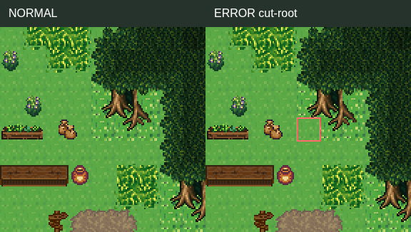

## missing-trunk
```json
{
  "input": {
    "code": "missing-trunk",
    "mapId": "terrace-cliff-village",
    "x": 50,
    "y": 12,
    "layer": "lower",
    "tile": 1426,
    "replacement": 240
  },
  "result": {
    "valid": false,
    "mapId": "terrace-cliff-village",
    "totalErrors": 1,
    "errors": [
      {
        "code": "missing-trunk",
        "x": 50,
        "y": 12,
        "layer": "lower",
        "expected": 1426,
        "actual": 240
      }
    ],
    "truncated": false,
    "scope": "Frozen reference arrays, source grafts, engine tile reachability. No event execution or aesthetic scoring."
  }
}
```

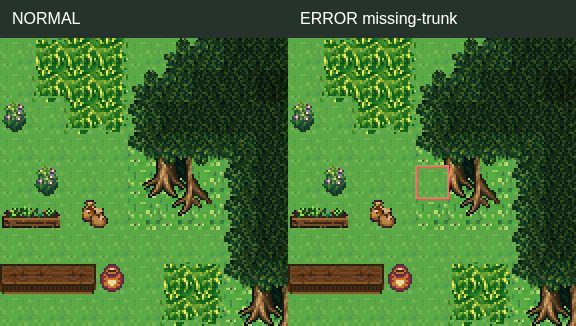

## wrong-edge-direction
```json
{
  "input": {
    "code": "wrong-edge-direction",
    "mapId": "terrace-cliff-village",
    "x": 50,
    "y": 11,
    "layer": "upper",
    "tile": 2577,
    "replacement": 2589
  },
  "result": {
    "valid": false,
    "mapId": "terrace-cliff-village",
    "totalErrors": 1,
    "errors": [
      {
        "code": "wrong-edge-direction",
        "x": 50,
        "y": 11,
        "layer": "upper",
        "expected": 2577,
        "actual": 2589
      }
    ],
    "truncated": false,
    "scope": "Frozen reference arrays, source grafts, engine tile reachability. No event execution or aesthetic scoring."
  }
}
```

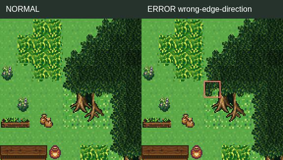

## wrong-layer
```json
{
  "input": {
    "code": "wrong-layer",
    "mapId": "terrace-cliff-village",
    "x": 23,
    "y": 9,
    "layer": "upper",
    "tile": 2620,
    "replacement": -1,
    "move": true
  },
  "result": {
    "valid": false,
    "mapId": "terrace-cliff-village",
    "totalErrors": 4,
    "errors": [
      {
        "code": "tile-mismatch",
        "x": 23,
        "y": 9,
        "layer": "lower",
        "expected": 240,
        "actual": 2620
      },
      {
        "code": "wrong-layer",
        "x": 23,
        "y": 9,
        "layer": "upper",
        "expected": 2620,
        "actual": -1
      },
      {
        "code": "prop-purpose-anchor-missing",
        "x": 25,
        "y": 10
      },
      {
        "code": "prop-purpose-anchor-missing",
        "x": 26,
        "y": 10
      }
    ],
    "truncated": false,
    "scope": "Frozen reference arrays, source grafts, engine tile reachability. No event execution or aesthetic scoring."
  }
}
```

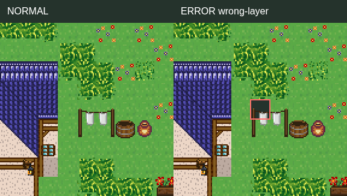

## blocked-entrance
```json
{
  "input": {
    "code": "blocked-entrance",
    "mapId": "terrace-cliff-village",
    "x": 18,
    "y": 15,
    "layer": "upper",
    "tile": -1,
    "replacement": 237
  },
  "result": {
    "valid": false,
    "mapId": "terrace-cliff-village",
    "totalErrors": 3,
    "errors": [
      {
        "code": "tile-mismatch",
        "x": 18,
        "y": 15,
        "layer": "upper",
        "expected": -1,
        "actual": 237
      },
      {
        "code": "unowned-prop",
        "x": 18,
        "y": 15
      },
      {
        "code": "blocked-entrance",
        "x": 18,
        "y": 15,
        "role": "door-front"
      }
    ],
    "truncated": false,
    "scope": "Frozen reference arrays, source grafts, engine tile reachability. No event execution or aesthetic scoring."
  }
}
```

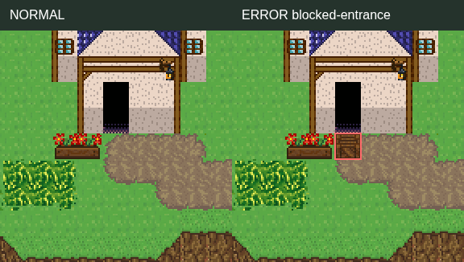

## cliff-face-direction
```json
{
  "input": {
    "code": "cliff-face-direction",
    "mapId": "terrace-cliff-village",
    "x": 62,
    "y": 40,
    "layer": "upper",
    "tile": 2691,
    "replacement": 2688
  },
  "result": {
    "valid": false,
    "mapId": "terrace-cliff-village",
    "totalErrors": 2,
    "errors": [
      {
        "code": "tile-mismatch",
        "x": 62,
        "y": 40,
        "layer": "upper",
        "expected": 2691,
        "actual": 2688
      },
      {
        "code": "cliff-face-direction",
        "x": 62,
        "y": 40,
        "expectedUpper": 2691,
        "actualUpper": 2688
      }
    ],
    "truncated": false,
    "scope": "Frozen reference arrays, source grafts, engine tile reachability. No event execution or aesthetic scoring."
  }
}
```

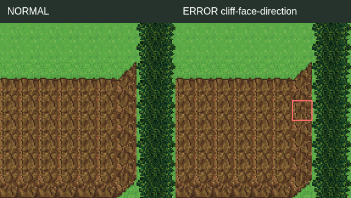

## cliff-toe-gap
```json
{
  "input": {
    "code": "cliff-toe-gap",
    "mapId": "terrace-cliff-village",
    "x": 40,
    "y": 45,
    "layer": "upper",
    "tile": 2686,
    "replacement": -1
  },
  "result": {
    "valid": false,
    "mapId": "terrace-cliff-village",
    "totalErrors": 2,
    "errors": [
      {
        "code": "tile-mismatch",
        "x": 40,
        "y": 45,
        "layer": "upper",
        "expected": 2686,
        "actual": -1
      },
      {
        "code": "cliff-toe-gap",
        "x": 40,
        "y": 45,
        "expectedUpper": 2686,
        "actualUpper": -1
      }
    ],
    "truncated": false,
    "scope": "Frozen reference arrays, source grafts, engine tile reachability. No event execution or aesthetic scoring."
  }
}
```

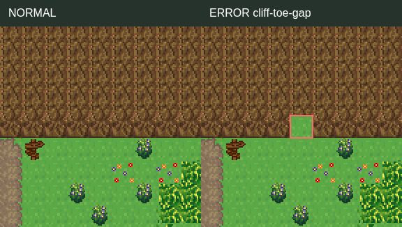

## cliff-stair-gap
```json
{
  "input": {
    "code": "cliff-stair-gap",
    "mapId": "terrace-cliff-village",
    "x": 50,
    "y": 25,
    "layer": "lower",
    "tile": 2689,
    "replacement": 240
  },
  "result": {
    "valid": false,
    "mapId": "terrace-cliff-village",
    "totalErrors": 2,
    "errors": [
      {
        "code": "tile-mismatch",
        "x": 50,
        "y": 25,
        "layer": "lower",
        "expected": 2689,
        "actual": 240
      },
      {
        "code": "cliff-stair-gap",
        "x": 50,
        "y": 25,
        "expectedUpper": -1,
        "actualUpper": -1,
        "expectedLower": 2689,
        "actualLower": 240
      }
    ],
    "truncated": false,
    "scope": "Frozen reference arrays, source grafts, engine tile reachability. No event execution or aesthetic scoring."
  }
}
```

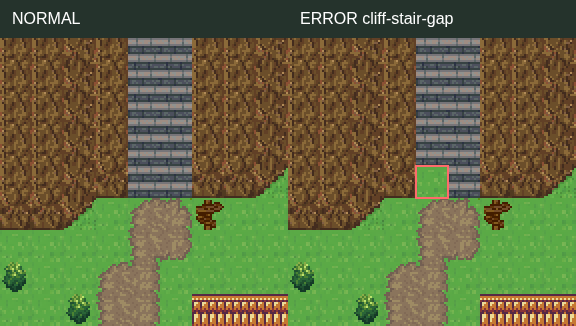

## terrace-without-stairs
```json
{
  "input": {
    "code": "terrace-without-stairs",
    "mapId": "pine-hamlets",
    "x": 0,
    "y": 16,
    "layer": "lower",
    "tile": 240,
    "replacement": 240,
    "rects": [
      {
        "x": 0,
        "y": 16,
        "w": 7,
        "h": 3
      },
      {
        "x": 0,
        "y": 19,
        "w": 2,
        "h": 6
      },
      {
        "x": 0,
        "y": 25,
        "w": 10,
        "h": 2
      }
    ],
    "errorX": 2,
    "errorY": 19
  },
  "result": {
    "valid": false,
    "mapId": "pine-hamlets",
    "totalErrors": 48,
    "errors": [
      {
        "code": "wrong-edge-direction",
        "x": 0,
        "y": 16,
        "layer": "upper",
        "expected": 2583,
        "actual": -1
      },
      {
        "code": "wrong-edge-direction",
        "x": 1,
        "y": 16,
        "layer": "upper",
        "expected": 2595,
        "actual": -1
      },
      {
        "code": "missing-trunk",
        "x": 2,
        "y": 16,
        "layer": "lower",
        "expected": 1422,
        "actual": 240
      },
      {
        "code": "wrong-edge-direction",
        "x": 2,
        "y": 16,
        "layer": "upper",
        "expected": 2592,
        "actual": -1
      },
      {
        "code": "missing-trunk",
        "x": 3,
        "y": 16,
        "layer": "lower",
        "expected": 1423,
        "actual": 240
      },
      {
        "code": "wrong-edge-direction",
        "x": 3,
        "y": 16,
        "layer": "upper",
        "expected": 2592,
        "actual": -1
      },
      {
        "code": "missing-trunk",
        "x": 4,
        "y": 16,
        "layer": "lower",
        "expected": 1454,
        "actual": 240
      },
      {
        "code": "wrong-edge-direction",
        "x": 4,
        "y": 16,
        "layer": "upper",
        "expected": 2590,
        "actual": -1
      },
      {
        "code": "missing-trunk",
        "x": 5,
        "y": 16,
        "layer": "lower",
        "expected": 1455,
        "actual": 240
      },
      {
        "code": "wrong-edge-direction",
        "x": 5,
        "y": 16,
        "layer": "upper",
        "expected": 2555,
        "actual": -1
      },
      {
        "code": "wrong-edge-direction",
        "x": 0,
        "y": 17,
        "layer": "upper",
        "expected": 2583,
        "actual": -1
      },
      {
        "code": "wrong-edge-direction",
        "x": 1,
        "y": 17,
        "layer": "upper",
        "expected": 2594,
        "actual": -1
      },
      {
        "code": "missing-trunk",
        "x": 2,
        "y": 17,
        "layer": "lower",
        "expected": 1426,
        "actual": 240
      },
      {
        "code": "missing-trunk",
        "x": 3,
        "y": 17,
        "layer": "lower",
        "expected": 1427,
        "actual": 240
      },
      {
        "code": "missing-trunk",
        "x": 4,
        "y": 17,
        "layer": "lower",
        "expected": 1458,
        "actual": 240
      },
      {
        "code": "missing-trunk",
        "x": 5,
        "y": 17,
        "layer": "lower",
        "expected": 1459,
        "actual": 240
      },
      {
        "code": "wrong-edge-direction",
        "x": 0,
        "y": 18,
        "layer": "upper",
        "expected": 2583,
        "actual": -1
      },
      {
        "code": "wrong-edge-direction",
        "x": 1,
        "y": 18,
        "layer": "upper",
        "expected": 2594,
        "actual": -1
      },
      {
        "code": "cut-root",
        "x": 2,
        "y": 18,
        "layer": "lower",
        "expected": 1430,
        "actual": 240
      },
      {
        "code": "cut-root",
        "x": 3,
        "y": 18,
        "layer": "lower",
        "expected": 1431,
        "actual": 240
      },
      {
        "code": "cut-root",
        "x": 4,
        "y": 18,
        "layer": "lower",
        "expected": 1462,
        "actual": 240
      },
      {
        "code": "cut-root",
        "x": 5,
        "y": 18,
        "layer": "lower",
        "expected": 1463,
        "actual": 240
      },
      {
        "code": "wrong-edge-direction",
        "x": 0,
        "y": 19,
        "layer": "upper",
        "expected": 2583,
        "actual": -1
      },
      {
        "code": "wrong-edge-direction",
        "x": 1,
        "y": 19,
        "layer": "upper",
        "expected": 2594,
        "actual": -1
      },
      {
        "code": "wrong-edge-direction",
        "x": 0,
        "y": 20,
        "layer": "upper",
        "expected": 2583,
        "actual": -1
      },
      {
        "code": "wrong-edge-direction",
        "x": 1,
        "y": 20,
        "layer": "upper",
        "expected": 2594,
        "actual": -1
      },
      {
        "code": "wrong-edge-direction",
        "x": 0,
        "y": 21,
        "layer": "upper",
        "expected": 2583,
        "actual": -1
      },
      {
        "code": "wrong-edge-direction",
        "x": 1,
        "y": 21,
        "layer": "upper",
        "expected": 2594,
        "actual": -1
      },
      {
        "code": "wrong-edge-direction",
        "x": 0,
        "y": 22,
        "layer": "upper",
        "expected": 2583,
        "actual": -1
      },
      {
        "code": "wrong-edge-direction",
        "x": 1,
        "y": 22,
        "layer": "upper",
        "expected": 2594,
        "actual": -1
      },
      {
        "code": "wrong-edge-direction",
        "x": 0,
        "y": 23,
        "layer": "upper",
        "expected": 2583,
        "actual": -1
      },
      {
        "code": "wrong-edge-direction",
        "x": 1,
        "y": 23,
        "layer": "upper",
        "expected": 2594,
        "actual": -1
      },
      {
        "code": "wrong-edge-direction",
        "x": 0,
        "y": 24,
        "layer": "upper",
        "expected": 2583,
        "actual": -1
      },
      {
        "code": "wrong-edge-direction",
        "x": 1,
        "y": 24,
        "layer": "upper",
        "expected": 2594,
        "actual": -1
      },
      {
        "code": "wrong-edge-direction",
        "x": 0,
        "y": 25,
        "layer": "upper",
        "expected": 2583,
        "actual": -1
      },
      {
        "code": "wrong-edge-direction",
        "x": 1,
        "y": 25,
        "layer": "upper",
        "expected": 2596,
        "actual": -1
      },
      {
        "code": "wrong-edge-direction",
        "x": 2,
        "y": 25,
        "layer": "upper",
        "expected": 2587,
        "actual": -1
      },
      {
        "code": "wrong-edge-direction",
        "x": 3,
        "y": 25,
        "layer": "upper",
        "expected": 2584,
        "actual": -1
      },
      {
        "code": "tile-mismatch",
        "x": 6,
        "y": 25,
        "layer": "lower",
        "expected": 1073,
        "actual": 240
      },
      {
        "code": "tile-mismatch",
        "x": 7,
        "y": 25,
        "layer": "lower",
        "expected": 1074,
        "actual": 240
      },
      {
        "code": "wrong-edge-direction",
        "x": 0,
        "y": 26,
        "layer": "upper",
        "expected": 2583,
        "actual": -1
      },
      {
        "code": "wrong-edge-direction",
        "x": 1,
        "y": 26,
        "layer": "upper",
        "expected": 2601,
        "actual": -1
      },
      {
        "code": "wrong-edge-direction",
        "x": 2,
        "y": 26,
        "layer": "upper",
        "expected": 2599,
        "actual": -1
      },
      {
        "code": "wrong-edge-direction",
        "x": 3,
        "y": 26,
        "layer": "upper",
        "expected": 2596,
        "actual": -1
      },
      {
        "code": "wrong-edge-direction",
        "x": 4,
        "y": 26,
        "layer": "upper",
        "expected": 2584,
        "actual": -1
      },
      {
        "code": "tile-mismatch",
        "x": 6,
        "y": 26,
        "layer": "lower",
        "expected": 1103,
        "actual": 240
      },
      {
        "code": "tile-mismatch",
        "x": 7,
        "y": 26,
        "layer": "lower",
        "expected": 1104,
        "actual": 240
      },
      {
        "code": "terrace-without-stairs",
        "x": 2,
        "y": 19,
        "reached": {
          "x": 2,
          "y": 18
        }
      }
    ],
    "truncated": false,
    "scope": "Frozen reference arrays, source grafts, engine tile reachability. No event execution or aesthetic scoring."
  }
}
```

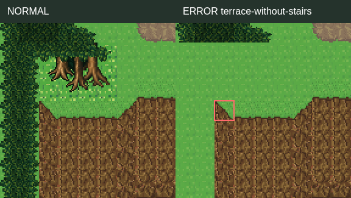

## waterfall-gap
```json
{
  "input": {
    "code": "waterfall-gap",
    "mapId": "twin-falls-river-village",
    "x": 32,
    "y": 17,
    "layer": "lower",
    "tile": 2700,
    "replacement": 240
  },
  "result": {
    "valid": false,
    "mapId": "twin-falls-river-village",
    "totalErrors": 2,
    "errors": [
      {
        "code": "tile-mismatch",
        "x": 32,
        "y": 17,
        "layer": "lower",
        "expected": 2700,
        "actual": 240
      },
      {
        "code": "waterfall-gap",
        "x": 32,
        "y": 17,
        "expectedLower": 2700,
        "actualLower": 240,
        "actualUpper": -1
      }
    ],
    "truncated": false,
    "scope": "Frozen reference arrays, source grafts, engine tile reachability. No event execution or aesthetic scoring."
  }
}
```

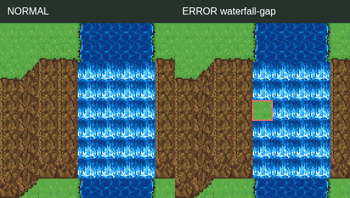

## grass-edge-direction
```json
{
  "input": {
    "code": "grass-edge-direction",
    "mapId": "terrace-cliff-village",
    "x": 15,
    "y": 5,
    "layer": "lower",
    "tile": 2692,
    "replacement": 2693
  },
  "result": {
    "valid": false,
    "mapId": "terrace-cliff-village",
    "totalErrors": 3,
    "errors": [
      {
        "code": "tile-mismatch",
        "x": 15,
        "y": 5,
        "layer": "lower",
        "expected": 2692,
        "actual": 2693
      },
      {
        "code": "grass-edge-direction",
        "x": 15,
        "y": 5,
        "expected": 2692,
        "actual": 2693
      },
      {
        "code": "grass-crest-gap",
        "x": 15,
        "y": 5,
        "sourceTile": 504
      }
    ],
    "truncated": false,
    "scope": "Frozen reference arrays, source grafts, engine tile reachability. No event execution or aesthetic scoring."
  }
}
```

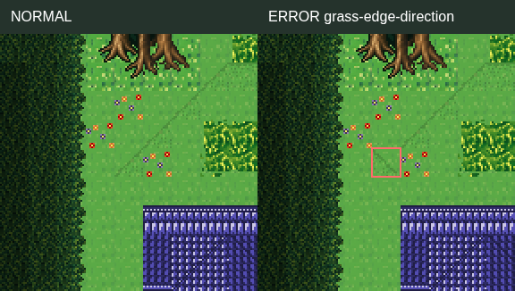

## grass-color-mismatch
```json
{
  "input": {
    "code": "grass-color-mismatch",
    "mapId": "terrace-cliff-village",
    "x": 15,
    "y": 5,
    "layer": "lower",
    "tile": 2692,
    "replacement": 504
  },
  "result": {
    "valid": false,
    "mapId": "terrace-cliff-village",
    "totalErrors": 3,
    "errors": [
      {
        "code": "tile-mismatch",
        "x": 15,
        "y": 5,
        "layer": "lower",
        "expected": 2692,
        "actual": 504
      },
      {
        "code": "grass-color-mismatch",
        "x": 15,
        "y": 5,
        "expected": 2692,
        "actual": 504
      },
      {
        "code": "grass-crest-gap",
        "x": 15,
        "y": 5,
        "sourceTile": 504
      }
    ],
    "truncated": false,
    "scope": "Frozen reference arrays, source grafts, engine tile reachability. No event execution or aesthetic scoring."
  }
}
```

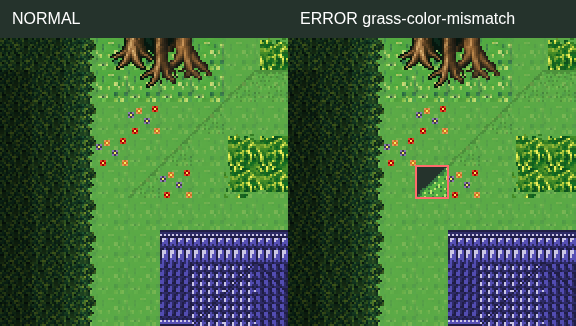

## grass-crest-gap
```json
{
  "input": {
    "code": "grass-crest-gap",
    "mapId": "terrace-cliff-village",
    "x": 19,
    "y": 2,
    "layer": "lower",
    "tile": 2694,
    "replacement": 240
  },
  "result": {
    "valid": false,
    "mapId": "terrace-cliff-village",
    "totalErrors": 3,
    "errors": [
      {
        "code": "tile-mismatch",
        "x": 19,
        "y": 2,
        "layer": "lower",
        "expected": 2694,
        "actual": 240
      },
      {
        "code": "grass-edge-direction",
        "x": 19,
        "y": 2,
        "expected": 2694,
        "actual": 240
      },
      {
        "code": "grass-crest-gap",
        "x": 19,
        "y": 2,
        "sourceTile": 559
      }
    ],
    "truncated": false,
    "scope": "Frozen reference arrays, source grafts, engine tile reachability. No event execution or aesthetic scoring."
  }
}
```

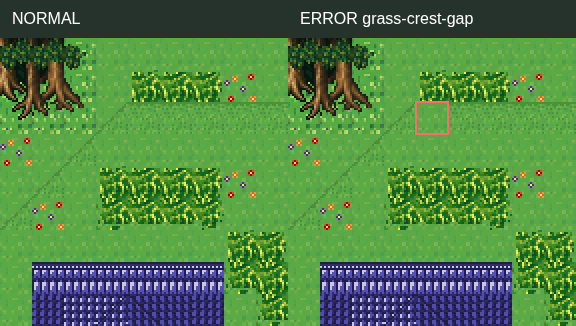

## map-entrance-blocked
```json
{
  "input": {
    "code": "map-entrance-blocked",
    "mapId": "terrace-cliff-village",
    "x": 31,
    "y": 62,
    "layer": "upper",
    "tile": -1,
    "replacement": 237
  },
  "result": {
    "valid": false,
    "mapId": "terrace-cliff-village",
    "totalErrors": 4,
    "errors": [
      {
        "code": "tile-mismatch",
        "x": 31,
        "y": 62,
        "layer": "upper",
        "expected": -1,
        "actual": 237
      },
      {
        "code": "unowned-prop",
        "x": 31,
        "y": 62
      },
      {
        "code": "map-entrance-blocked",
        "x": 31,
        "y": 62
      },
      {
        "code": "blocked-entrance",
        "x": 31,
        "y": 62,
        "role": "map-entrance"
      }
    ],
    "truncated": false,
    "scope": "Frozen reference arrays, source grafts, engine tile reachability. No event execution or aesthetic scoring."
  }
}
```

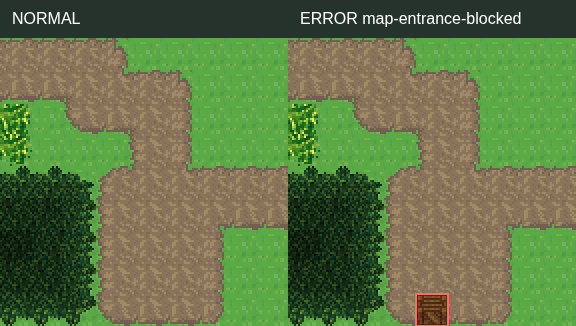

## unowned-prop
```json
{
  "input": {
    "code": "unowned-prop",
    "mapId": "terrace-cliff-village",
    "x": 36,
    "y": 31,
    "layer": "upper",
    "tile": -1,
    "replacement": 2638
  },
  "result": {
    "valid": false,
    "mapId": "terrace-cliff-village",
    "totalErrors": 2,
    "errors": [
      {
        "code": "tile-mismatch",
        "x": 36,
        "y": 31,
        "layer": "upper",
        "expected": -1,
        "actual": 2638
      },
      {
        "code": "unowned-prop",
        "x": 36,
        "y": 31
      }
    ],
    "truncated": false,
    "scope": "Frozen reference arrays, source grafts, engine tile reachability. No event execution or aesthetic scoring."
  }
}
```

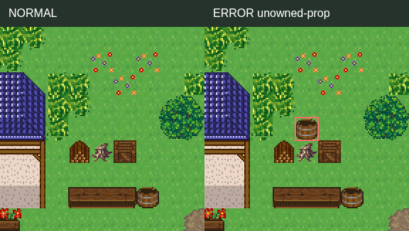

## scarecrow-without-garden
```json
{
  "input": {
    "code": "scarecrow-without-garden",
    "mapId": "terrace-cliff-village",
    "x": 57,
    "y": 34,
    "layer": "upper",
    "tile": 2613,
    "replacement": -1,
    "errorX": 57,
    "errorY": 32
  },
  "result": {
    "valid": false,
    "mapId": "terrace-cliff-village",
    "totalErrors": 4,
    "errors": [
      {
        "code": "tile-mismatch",
        "x": 57,
        "y": 34,
        "layer": "upper",
        "expected": 2613,
        "actual": -1
      },
      {
        "code": "scarecrow-without-garden",
        "x": 57,
        "y": 32
      },
      {
        "code": "prop-purpose-anchor-missing",
        "x": 59,
        "y": 33
      },
      {
        "code": "prop-purpose-anchor-missing",
        "x": 59,
        "y": 35
      }
    ],
    "truncated": false,
    "scope": "Frozen reference arrays, source grafts, engine tile reachability. No event execution or aesthetic scoring."
  }
}
```

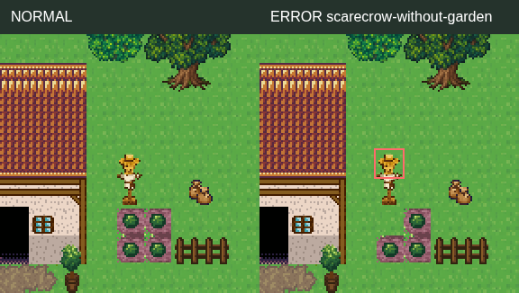

## prop-purpose-anchor-missing
```json
{
  "input": {
    "code": "prop-purpose-anchor-missing",
    "mapId": "terrace-cliff-village",
    "x": 35,
    "y": 34,
    "layer": "upper",
    "tile": 234,
    "replacement": -1,
    "errorX": 35,
    "errorY": 32
  },
  "result": {
    "valid": false,
    "mapId": "terrace-cliff-village",
    "totalErrors": 5,
    "errors": [
      {
        "code": "tile-mismatch",
        "x": 35,
        "y": 34,
        "layer": "upper",
        "expected": 234,
        "actual": -1
      },
      {
        "code": "prop-purpose-anchor-missing",
        "x": 35,
        "y": 32
      },
      {
        "code": "prop-purpose-anchor-missing",
        "x": 36,
        "y": 32
      },
      {
        "code": "prop-purpose-anchor-missing",
        "x": 37,
        "y": 32
      },
      {
        "code": "prop-purpose-anchor-missing",
        "x": 38,
        "y": 34
      }
    ],
    "truncated": false,
    "scope": "Frozen reference arrays, source grafts, engine tile reachability. No event execution or aesthetic scoring."
  }
}
```

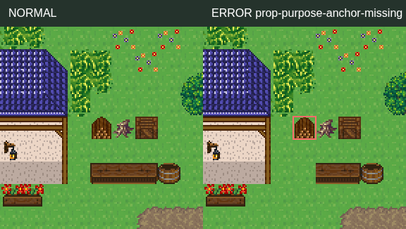

## civic-anchor-missing
```json
{
  "input": {
    "code": "civic-anchor-missing",
    "mapId": "reed-bay-village",
    "x": 43,
    "y": 20,
    "layer": "upper",
    "tile": 2639,
    "replacement": -1,
    "errorX": 45,
    "errorY": 22
  },
  "result": {
    "valid": false,
    "mapId": "reed-bay-village",
    "totalErrors": 6,
    "errors": [
      {
        "code": "tile-mismatch",
        "x": 43,
        "y": 20,
        "layer": "upper",
        "expected": 2639,
        "actual": -1
      },
      {
        "code": "civic-part-missing",
        "x": 43,
        "y": 20
      },
      {
        "code": "civic-anchor-missing",
        "x": 45,
        "y": 22
      },
      {
        "code": "civic-anchor-missing",
        "x": 43,
        "y": 22
      },
      {
        "code": "civic-anchor-missing",
        "x": 46,
        "y": 21
      },
      {
        "code": "civic-anchor-missing",
        "x": 41,
        "y": 22
      }
    ],
    "truncated": false,
    "scope": "Frozen reference arrays, source grafts, engine tile reachability. No event execution or aesthetic scoring."
  }
}
```

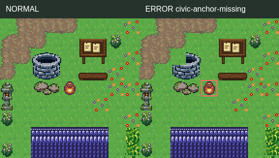

## civic-use-blocked
```json
{
  "input": {
    "code": "civic-use-blocked",
    "mapId": "reed-bay-village",
    "x": 42,
    "y": 20,
    "layer": "upper",
    "tile": -1,
    "replacement": 237
  },
  "result": {
    "valid": false,
    "mapId": "reed-bay-village",
    "totalErrors": 4,
    "errors": [
      {
        "code": "tile-mismatch",
        "x": 42,
        "y": 20,
        "layer": "upper",
        "expected": -1,
        "actual": 237
      },
      {
        "code": "unowned-prop",
        "x": 42,
        "y": 20
      },
      {
        "code": "blocked-entrance",
        "x": 42,
        "y": 20,
        "role": "civic-use"
      },
      {
        "code": "civic-use-blocked",
        "x": 42,
        "y": 20,
        "name": "낮은 돌 우물"
      }
    ],
    "truncated": false,
    "scope": "Frozen reference arrays, source grafts, engine tile reachability. No event execution or aesthetic scoring."
  }
}
```

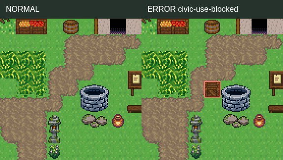

## wall-light-backing
```json
{
  "input": {
    "code": "wall-light-backing",
    "mapId": "reed-bay-village",
    "x": 30,
    "y": 6,
    "layer": "lower",
    "tile": 46,
    "replacement": 240
  },
  "result": {
    "valid": false,
    "mapId": "reed-bay-village",
    "totalErrors": 10,
    "errors": [
      {
        "code": "tile-mismatch",
        "x": 30,
        "y": 6,
        "layer": "lower",
        "expected": 46,
        "actual": 240
      },
      {
        "code": "civic-anchor-missing",
        "x": 32,
        "y": 9
      },
      {
        "code": "civic-anchor-missing",
        "x": 30,
        "y": 8
      },
      {
        "code": "civic-anchor-missing",
        "x": 34,
        "y": 8
      },
      {
        "code": "civic-anchor-missing",
        "x": 32,
        "y": 11
      },
      {
        "code": "civic-anchor-missing",
        "x": 34,
        "y": 6
      },
      {
        "code": "civic-anchor-missing",
        "x": 30,
        "y": 11
      },
      {
        "code": "civic-anchor-missing",
        "x": 34,
        "y": 11
      },
      {
        "code": "civic-anchor-missing",
        "x": 30,
        "y": 6
      },
      {
        "code": "wall-light-backing",
        "x": 30,
        "y": 6
      }
    ],
    "truncated": false,
    "scope": "Frozen reference arrays, source grafts, engine tile reachability. No event execution or aesthetic scoring."
  }
}
```

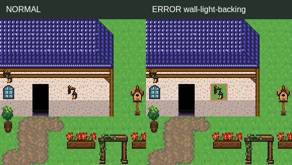

## mixed-windows
```json
{
  "input": {
    "code": "mixed-windows",
    "mapId": "ford-castle-town",
    "x": 4,
    "y": 14,
    "layer": "upper",
    "tile": 87,
    "replacement": 85
  },
  "result": {
    "valid": false,
    "mapId": "ford-castle-town",
    "totalErrors": 2,
    "errors": [
      {
        "code": "tile-mismatch",
        "x": 4,
        "y": 14,
        "layer": "upper",
        "expected": 87,
        "actual": 85
      },
      {
        "code": "mixed-windows",
        "x": 4,
        "y": 14,
        "house": "ford-castle-town-house-1",
        "expected": 87,
        "actual": 85
      }
    ],
    "truncated": false,
    "scope": "Frozen reference arrays, source grafts, engine tile reachability. No event execution or aesthetic scoring."
  }
}
```

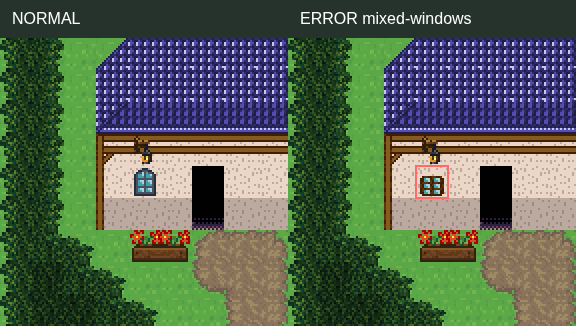

## landmark-sealed
```json
{
  "input": {
    "code": "landmark-sealed",
    "mapId": "chapel-hill-parish",
    "x": 6,
    "y": 10,
    "layer": "upper",
    "tile": -1,
    "replacement": 439,
    "errorX": 6,
    "errorY": 9
  },
  "result": {
    "valid": false,
    "mapId": "chapel-hill-parish",
    "totalErrors": 2,
    "errors": [
      {
        "code": "tile-mismatch",
        "x": 6,
        "y": 10,
        "layer": "upper",
        "expected": -1,
        "actual": 439
      },
      {
        "code": "landmark-sealed",
        "x": 6,
        "y": 9,
        "role": "yard-inside",
        "landmark": "chapel-hill-parish-graveyard"
      }
    ],
    "truncated": false,
    "scope": "Frozen reference arrays, source grafts, engine tile reachability. No event execution or aesthetic scoring."
  }
}
```

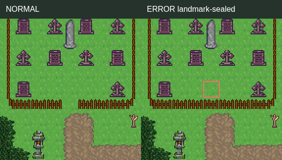
