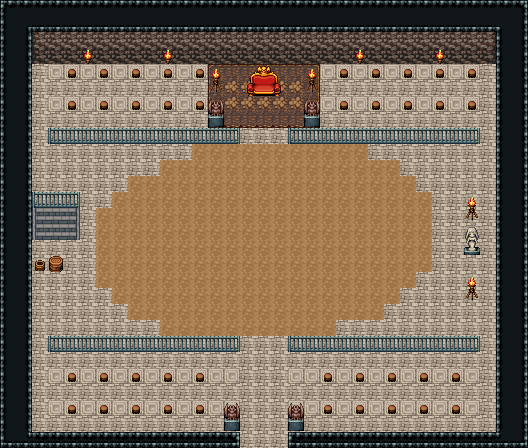

# 투기장 · 경기장

모래 경기장을 석조 관중석이 두른 투기장. 북쪽 관중석 가운데 갈색 단 위 우승자 관람석(왕좌·화로 둘·가고일 둘), 관중석은 무늬 석판 층마다 걸상이 줄지어 놓였고 경기장 앞을 쇠 난간이 막는다(관람석 앞과 남쪽 입장 통로만 트였다). 남쪽 테두리 문 틈이 관중 출입문이고 입장 통로 양옆을 가고일이 지킨다. 서쪽 관중석 아래 난간 뒤 돌계단은 투사 대기실(interior-arena-waiting-room)로 내려가고 곁에 물통·나무통, 동쪽엔 승리의 여신상과 화로 둘. 모래(82)는 일부러 비워 둔 싸움터다. 33×28, tilesetId=oprn_dungeon_stone. 입구 (16,27). 통행 검사 목표 [[16,14],[3,15],[28,15],[16,8],[4,24],[28,5]].

출구: (16,27) → outside 남쪽 관중 출입문 → 투기장 바깥 · (3,14) → interior-arena-waiting-room (16,6) 서쪽 투사 계단(내려감) → 투기장 대기실 동벽 계단 앞



## 놓은 소품 (저작 순서)
(x,y)는 왼쪽 위, tiles는 행 단위 번호. 이식 칸(480~)은 공통 규칙 문서의 이식표.
```json
[
  {
    "prop": "왕좌",
    "x": 15,
    "y": 4,
    "w": 3,
    "h": 2,
    "layer": "upper",
    "tiles": [
      [
        447,
        448,
        449
      ],
      [
        477,
        478,
        479
      ]
    ]
  },
  {
    "prop": "화로",
    "x": 13,
    "y": 4,
    "w": 1,
    "h": 2,
    "layer": "upper",
    "tiles": [
      [
        263
      ],
      [
        293
      ]
    ]
  },
  {
    "prop": "화로",
    "x": 19,
    "y": 4,
    "w": 1,
    "h": 2,
    "layer": "upper",
    "tiles": [
      [
        263
      ],
      [
        293
      ]
    ]
  },
  {
    "prop": "가고일 석상",
    "x": 13,
    "y": 6,
    "w": 1,
    "h": 2,
    "layer": "upper",
    "tiles": [
      [
        146
      ],
      [
        176
      ]
    ]
  },
  {
    "prop": "가고일 석상",
    "x": 19,
    "y": 6,
    "w": 1,
    "h": 2,
    "layer": "upper",
    "tiles": [
      [
        146
      ],
      [
        176
      ]
    ]
  },
  {
    "prop": "걸상",
    "x": 4,
    "y": 4,
    "w": 1,
    "h": 1,
    "layer": "upper",
    "tiles": [
      [
        356
      ]
    ]
  },
  {
    "prop": "걸상",
    "x": 6,
    "y": 4,
    "w": 1,
    "h": 1,
    "layer": "upper",
    "tiles": [
      [
        356
      ]
    ]
  },
  {
    "prop": "걸상",
    "x": 8,
    "y": 4,
    "w": 1,
    "h": 1,
    "layer": "upper",
    "tiles": [
      [
        356
      ]
    ]
  },
  {
    "prop": "걸상",
    "x": 10,
    "y": 4,
    "w": 1,
    "h": 1,
    "layer": "upper",
    "tiles": [
      [
        356
      ]
    ]
  },
  {
    "prop": "걸상",
    "x": 12,
    "y": 4,
    "w": 1,
    "h": 1,
    "layer": "upper",
    "tiles": [
      [
        356
      ]
    ]
  },
  {
    "prop": "걸상",
    "x": 21,
    "y": 4,
    "w": 1,
    "h": 1,
    "layer": "upper",
    "tiles": [
      [
        356
      ]
    ]
  },
  {
    "prop": "걸상",
    "x": 23,
    "y": 4,
    "w": 1,
    "h": 1,
    "layer": "upper",
    "tiles": [
      [
        356
      ]
    ]
  },
  {
    "prop": "걸상",
    "x": 25,
    "y": 4,
    "w": 1,
    "h": 1,
    "layer": "upper",
    "tiles": [
      [
        356
      ]
    ]
  },
  {
    "prop": "걸상",
    "x": 27,
    "y": 4,
    "w": 1,
    "h": 1,
    "layer": "upper",
    "tiles": [
      [
        356
      ]
    ]
  },
  {
    "prop": "걸상",
    "x": 29,
    "y": 4,
    "w": 1,
    "h": 1,
    "layer": "upper",
    "tiles": [
      [
        356
      ]
    ]
  },
  {
    "prop": "걸상",
    "x": 4,
    "y": 6,
    "w": 1,
    "h": 1,
    "layer": "upper",
    "tiles": [
      [
        356
      ]
    ]
  },
  {
    "prop": "걸상",
    "x": 6,
    "y": 6,
    "w": 1,
    "h": 1,
    "layer": "upper",
    "tiles": [
      [
        356
      ]
    ]
  },
  {
    "prop": "걸상",
    "x": 8,
    "y": 6,
    "w": 1,
    "h": 1,
    "layer": "upper",
    "tiles": [
      [
        356
      ]
    ]
  },
  {
    "prop": "걸상",
    "x": 10,
    "y": 6,
    "w": 1,
    "h": 1,
    "layer": "upper",
    "tiles": [
      [
        356
      ]
    ]
  },
  {
    "prop": "걸상",
    "x": 12,
    "y": 6,
    "w": 1,
    "h": 1,
    "layer": "upper",
    "tiles": [
      [
        356
      ]
    ]
  },
  {
    "prop": "걸상",
    "x": 21,
    "y": 6,
    "w": 1,
    "h": 1,
    "layer": "upper",
    "tiles": [
      [
        356
      ]
    ]
  },
  {
    "prop": "걸상",
    "x": 23,
    "y": 6,
    "w": 1,
    "h": 1,
    "layer": "upper",
    "tiles": [
      [
        356
      ]
    ]
  },
  {
    "prop": "걸상",
    "x": 25,
    "y": 6,
    "w": 1,
    "h": 1,
    "layer": "upper",
    "tiles": [
      [
        356
      ]
    ]
  },
  {
    "prop": "걸상",
    "x": 27,
    "y": 6,
    "w": 1,
    "h": 1,
    "layer": "upper",
    "tiles": [
      [
        356
      ]
    ]
  },
  {
    "prop": "걸상",
    "x": 29,
    "y": 6,
    "w": 1,
    "h": 1,
    "layer": "upper",
    "tiles": [
      [
        356
      ]
    ]
  },
  {
    "prop": "걸상",
    "x": 4,
    "y": 23,
    "w": 1,
    "h": 1,
    "layer": "upper",
    "tiles": [
      [
        356
      ]
    ]
  },
  {
    "prop": "걸상",
    "x": 6,
    "y": 23,
    "w": 1,
    "h": 1,
    "layer": "upper",
    "tiles": [
      [
        356
      ]
    ]
  },
  {
    "prop": "걸상",
    "x": 8,
    "y": 23,
    "w": 1,
    "h": 1,
    "layer": "upper",
    "tiles": [
      [
        356
      ]
    ]
  },
  {
    "prop": "걸상",
    "x": 10,
    "y": 23,
    "w": 1,
    "h": 1,
    "layer": "upper",
    "tiles": [
      [
        356
      ]
    ]
  },
  {
    "prop": "걸상",
    "x": 12,
    "y": 23,
    "w": 1,
    "h": 1,
    "layer": "upper",
    "tiles": [
      [
        356
      ]
    ]
  },
  {
    "prop": "걸상",
    "x": 20,
    "y": 23,
    "w": 1,
    "h": 1,
    "layer": "upper",
    "tiles": [
      [
        356
      ]
    ]
  },
  {
    "prop": "걸상",
    "x": 22,
    "y": 23,
    "w": 1,
    "h": 1,
    "layer": "upper",
    "tiles": [
      [
        356
      ]
    ]
  },
  {
    "prop": "걸상",
    "x": 24,
    "y": 23,
    "w": 1,
    "h": 1,
    "layer": "upper",
    "tiles": [
      [
        356
      ]
    ]
  },
  {
    "prop": "걸상",
    "x": 26,
    "y": 23,
    "w": 1,
    "h": 1,
    "layer": "upper",
    "tiles": [
      [
        356
      ]
    ]
  },
  {
    "prop": "걸상",
    "x": 28,
    "y": 23,
    "w": 1,
    "h": 1,
    "layer": "upper",
    "tiles": [
      [
        356
      ]
    ]
  },
  {
    "prop": "걸상",
    "x": 4,
    "y": 25,
    "w": 1,
    "h": 1,
    "layer": "upper",
    "tiles": [
      [
        356
      ]
    ]
  },
  {
    "prop": "걸상",
    "x": 6,
    "y": 25,
    "w": 1,
    "h": 1,
    "layer": "upper",
    "tiles": [
      [
        356
      ]
    ]
  },
  {
    "prop": "걸상",
    "x": 8,
    "y": 25,
    "w": 1,
    "h": 1,
    "layer": "upper",
    "tiles": [
      [
        356
      ]
    ]
  },
  {
    "prop": "걸상",
    "x": 10,
    "y": 25,
    "w": 1,
    "h": 1,
    "layer": "upper",
    "tiles": [
      [
        356
      ]
    ]
  },
  {
    "prop": "걸상",
    "x": 12,
    "y": 25,
    "w": 1,
    "h": 1,
    "layer": "upper",
    "tiles": [
      [
        356
      ]
    ]
  },
  {
    "prop": "걸상",
    "x": 20,
    "y": 25,
    "w": 1,
    "h": 1,
    "layer": "upper",
    "tiles": [
      [
        356
      ]
    ]
  },
  {
    "prop": "걸상",
    "x": 22,
    "y": 25,
    "w": 1,
    "h": 1,
    "layer": "upper",
    "tiles": [
      [
        356
      ]
    ]
  },
  {
    "prop": "걸상",
    "x": 24,
    "y": 25,
    "w": 1,
    "h": 1,
    "layer": "upper",
    "tiles": [
      [
        356
      ]
    ]
  },
  {
    "prop": "걸상",
    "x": 26,
    "y": 25,
    "w": 1,
    "h": 1,
    "layer": "upper",
    "tiles": [
      [
        356
      ]
    ]
  },
  {
    "prop": "걸상",
    "x": 28,
    "y": 25,
    "w": 1,
    "h": 1,
    "layer": "upper",
    "tiles": [
      [
        356
      ]
    ]
  },
  {
    "prop": "쇠창살 왼끝",
    "x": 3,
    "y": 8,
    "w": 1,
    "h": 1,
    "layer": "upper",
    "tiles": [
      [
        234
      ]
    ]
  },
  {
    "prop": "쇠창살",
    "x": 4,
    "y": 8,
    "w": 1,
    "h": 1,
    "layer": "upper",
    "tiles": [
      [
        235
      ]
    ]
  },
  {
    "prop": "쇠창살",
    "x": 5,
    "y": 8,
    "w": 1,
    "h": 1,
    "layer": "upper",
    "tiles": [
      [
        235
      ]
    ]
  },
  {
    "prop": "쇠창살",
    "x": 6,
    "y": 8,
    "w": 1,
    "h": 1,
    "layer": "upper",
    "tiles": [
      [
        235
      ]
    ]
  },
  {
    "prop": "쇠창살",
    "x": 7,
    "y": 8,
    "w": 1,
    "h": 1,
    "layer": "upper",
    "tiles": [
      [
        235
      ]
    ]
  },
  {
    "prop": "쇠창살",
    "x": 8,
    "y": 8,
    "w": 1,
    "h": 1,
    "layer": "upper",
    "tiles": [
      [
        235
      ]
    ]
  },
  {
    "prop": "쇠창살",
    "x": 9,
    "y": 8,
    "w": 1,
    "h": 1,
    "layer": "upper",
    "tiles": [
      [
        235
      ]
    ]
  },
  {
    "prop": "쇠창살",
    "x": 10,
    "y": 8,
    "w": 1,
    "h": 1,
    "layer": "upper",
    "tiles": [
      [
        235
      ]
    ]
  },
  {
    "prop": "쇠창살",
    "x": 11,
    "y": 8,
    "w": 1,
    "h": 1,
    "layer": "upper",
    "tiles": [
      [
        235
      ]
    ]
  },
  {
    "prop": "쇠창살",
    "x": 12,
    "y": 8,
    "w": 1,
    "h": 1,
    "layer": "upper",
    "tiles": [
      [
        235
      ]
    ]
  },
  {
    "prop": "쇠창살",
    "x": 13,
    "y": 8,
    "w": 1,
    "h": 1,
    "layer": "upper",
    "tiles": [
      [
        235
      ]
    ]
  },
  {
    "prop": "쇠창살 오른끝",
    "x": 14,
    "y": 8,
    "w": 1,
    "h": 1,
    "layer": "upper",
    "tiles": [
      [
        236
      ]
    ]
  },
  {
    "prop": "쇠창살 왼끝",
    "x": 18,
    "y": 8,
    "w": 1,
    "h": 1,
    "layer": "upper",
    "tiles": [
      [
        234
      ]
    ]
  },
  {
    "prop": "쇠창살",
    "x": 19,
    "y": 8,
    "w": 1,
    "h": 1,
    "layer": "upper",
    "tiles": [
      [
        235
      ]
    ]
  },
  {
    "prop": "쇠창살",
    "x": 20,
    "y": 8,
    "w": 1,
    "h": 1,
    "layer": "upper",
    "tiles": [
      [
        235
      ]
    ]
  },
  {
    "prop": "쇠창살",
    "x": 21,
    "y": 8,
    "w": 1,
    "h": 1,
    "layer": "upper",
    "tiles": [
      [
        235
      ]
    ]
  },
  {
    "prop": "쇠창살",
    "x": 22,
    "y": 8,
    "w": 1,
    "h": 1,
    "layer": "upper",
    "tiles": [
      [
        235
      ]
    ]
  },
  {
    "prop": "쇠창살",
    "x": 23,
    "y": 8,
    "w": 1,
    "h": 1,
    "layer": "upper",
    "tiles": [
      [
        235
      ]
    ]
  },
  {
    "prop": "쇠창살",
    "x": 24,
    "y": 8,
    "w": 1,
    "h": 1,
    "layer": "upper",
    "tiles": [
      [
        235
      ]
    ]
  },
  {
    "prop": "쇠창살",
    "x": 25,
    "y": 8,
    "w": 1,
    "h": 1,
    "layer": "upper",
    "tiles": [
      [
        235
      ]
    ]
  },
  {
    "prop": "쇠창살",
    "x": 26,
    "y": 8,
    "w": 1,
    "h": 1,
    "layer": "upper",
    "tiles": [
      [
        235
      ]
    ]
  },
  {
    "prop": "쇠창살",
    "x": 27,
    "y": 8,
    "w": 1,
    "h": 1,
    "layer": "upper",
    "tiles": [
      [
        235
      ]
    ]
  },
  {
    "prop": "쇠창살",
    "x": 28,
    "y": 8,
    "w": 1,
    "h": 1,
    "layer": "upper",
    "tiles": [
      [
        235
      ]
    ]
  },
  {
    "prop": "쇠창살 오른끝",
    "x": 29,
    "y": 8,
    "w": 1,
    "h": 1,
    "layer": "upper",
    "tiles": [
      [
        236
      ]
    ]
  },
  {
    "prop": "쇠창살 왼끝",
    "x": 3,
    "y": 21,
    "w": 1,
    "h": 1,
    "layer": "upper",
    "tiles": [
      [
        234
      ]
    ]
  },
  {
    "prop": "쇠창살",
    "x": 4,
    "y": 21,
    "w": 1,
    "h": 1,
    "layer": "upper",
    "tiles": [
      [
        235
      ]
    ]
  },
  {
    "prop": "쇠창살",
    "x": 5,
    "y": 21,
    "w": 1,
    "h": 1,
    "layer": "upper",
    "tiles": [
      [
        235
      ]
    ]
  },
  {
    "prop": "쇠창살",
    "x": 6,
    "y": 21,
    "w": 1,
    "h": 1,
    "layer": "upper",
    "tiles": [
      [
        235
      ]
    ]
  },
  {
    "prop": "쇠창살",
    "x": 7,
    "y": 21,
    "w": 1,
    "h": 1,
    "layer": "upper",
    "tiles": [
      [
        235
      ]
    ]
  },
  {
    "prop": "쇠창살",
    "x": 8,
    "y": 21,
    "w": 1,
    "h": 1,
    "layer": "upper",
    "tiles": [
      [
        235
      ]
    ]
  },
  {
    "prop": "쇠창살",
    "x": 9,
    "y": 21,
    "w": 1,
    "h": 1,
    "layer": "upper",
    "tiles": [
      [
        235
      ]
    ]
  },
  {
    "prop": "쇠창살",
    "x": 10,
    "y": 21,
    "w": 1,
    "h": 1,
    "layer": "upper",
    "tiles": [
      [
        235
      ]
    ]
  },
  {
    "prop": "쇠창살",
    "x": 11,
    "y": 21,
    "w": 1,
    "h": 1,
    "layer": "upper",
    "tiles": [
      [
        235
      ]
    ]
  },
  {
    "prop": "쇠창살",
    "x": 12,
    "y": 21,
    "w": 1,
    "h": 1,
    "layer": "upper",
    "tiles": [
      [
        235
      ]
    ]
  },
  {
    "prop": "쇠창살",
    "x": 13,
    "y": 21,
    "w": 1,
    "h": 1,
    "layer": "upper",
    "tiles": [
      [
        235
      ]
    ]
  },
  {
    "prop": "쇠창살 오른끝",
    "x": 14,
    "y": 21,
    "w": 1,
    "h": 1,
    "layer": "upper",
    "tiles": [
      [
        236
      ]
    ]
  },
  {
    "prop": "쇠창살 왼끝",
    "x": 18,
    "y": 21,
    "w": 1,
    "h": 1,
    "layer": "upper",
    "tiles": [
      [
        234
      ]
    ]
  },
  {
    "prop": "쇠창살",
    "x": 19,
    "y": 21,
    "w": 1,
    "h": 1,
    "layer": "upper",
    "tiles": [
      [
        235
      ]
    ]
  },
  {
    "prop": "쇠창살",
    "x": 20,
    "y": 21,
    "w": 1,
    "h": 1,
    "layer": "upper",
    "tiles": [
      [
        235
      ]
    ]
  },
  {
    "prop": "쇠창살",
    "x": 21,
    "y": 21,
    "w": 1,
    "h": 1,
    "layer": "upper",
    "tiles": [
      [
        235
      ]
    ]
  },
  {
    "prop": "쇠창살",
    "x": 22,
    "y": 21,
    "w": 1,
    "h": 1,
    "layer": "upper",
    "tiles": [
      [
        235
      ]
    ]
  },
  {
    "prop": "쇠창살",
    "x": 23,
    "y": 21,
    "w": 1,
    "h": 1,
    "layer": "upper",
    "tiles": [
      [
        235
      ]
    ]
  },
  {
    "prop": "쇠창살",
    "x": 24,
    "y": 21,
    "w": 1,
    "h": 1,
    "layer": "upper",
    "tiles": [
      [
        235
      ]
    ]
  },
  {
    "prop": "쇠창살",
    "x": 25,
    "y": 21,
    "w": 1,
    "h": 1,
    "layer": "upper",
    "tiles": [
      [
        235
      ]
    ]
  },
  {
    "prop": "쇠창살",
    "x": 26,
    "y": 21,
    "w": 1,
    "h": 1,
    "layer": "upper",
    "tiles": [
      [
        235
      ]
    ]
  },
  {
    "prop": "쇠창살",
    "x": 27,
    "y": 21,
    "w": 1,
    "h": 1,
    "layer": "upper",
    "tiles": [
      [
        235
      ]
    ]
  },
  {
    "prop": "쇠창살",
    "x": 28,
    "y": 21,
    "w": 1,
    "h": 1,
    "layer": "upper",
    "tiles": [
      [
        235
      ]
    ]
  },
  {
    "prop": "쇠창살 오른끝",
    "x": 29,
    "y": 21,
    "w": 1,
    "h": 1,
    "layer": "upper",
    "tiles": [
      [
        236
      ]
    ]
  },
  {
    "prop": "계단 난간",
    "x": 2,
    "y": 12,
    "w": 3,
    "h": 1,
    "layer": "upper",
    "tiles": [
      [
        234,
        235,
        236
      ]
    ]
  },
  {
    "prop": "내려가는 돌계단",
    "x": 2,
    "y": 13,
    "w": 3,
    "h": 2,
    "layer": "lower",
    "tiles": [
      [
        483,
        484,
        485
      ],
      [
        483,
        484,
        485
      ]
    ]
  },
  {
    "prop": "물통",
    "x": 2,
    "y": 16,
    "w": 1,
    "h": 1,
    "layer": "upper",
    "tiles": [
      [
        419
      ]
    ]
  },
  {
    "prop": "나무통",
    "x": 3,
    "y": 16,
    "w": 1,
    "h": 1,
    "layer": "upper",
    "tiles": [
      [
        417
      ]
    ]
  },
  {
    "prop": "여신 석상",
    "x": 29,
    "y": 14,
    "w": 1,
    "h": 2,
    "layer": "upper",
    "tiles": [
      [
        145
      ],
      [
        175
      ]
    ]
  },
  {
    "prop": "화로",
    "x": 29,
    "y": 12,
    "w": 1,
    "h": 2,
    "layer": "upper",
    "tiles": [
      [
        263
      ],
      [
        293
      ]
    ]
  },
  {
    "prop": "화로",
    "x": 29,
    "y": 17,
    "w": 1,
    "h": 2,
    "layer": "upper",
    "tiles": [
      [
        263
      ],
      [
        293
      ]
    ]
  },
  {
    "prop": "가고일 석상",
    "x": 14,
    "y": 25,
    "w": 1,
    "h": 2,
    "layer": "upper",
    "tiles": [
      [
        146
      ],
      [
        176
      ]
    ]
  },
  {
    "prop": "가고일 석상",
    "x": 18,
    "y": 25,
    "w": 1,
    "h": 2,
    "layer": "upper",
    "tiles": [
      [
        146
      ],
      [
        176
      ]
    ]
  },
  {
    "prop": "벽 횃불",
    "x": 5,
    "y": 3,
    "w": 1,
    "h": 1,
    "layer": "upper",
    "tiles": [
      [
        264
      ]
    ]
  },
  {
    "prop": "벽 횃불",
    "x": 10,
    "y": 3,
    "w": 1,
    "h": 1,
    "layer": "upper",
    "tiles": [
      [
        264
      ]
    ]
  },
  {
    "prop": "벽 횃불",
    "x": 22,
    "y": 3,
    "w": 1,
    "h": 1,
    "layer": "upper",
    "tiles": [
      [
        264
      ]
    ]
  },
  {
    "prop": "벽 횃불",
    "x": 27,
    "y": 3,
    "w": 1,
    "h": 1,
    "layer": "upper",
    "tiles": [
      [
        264
      ]
    ]
  }
]
```

전체 두 레이어는 다음 배열 문서가 정답이다.
