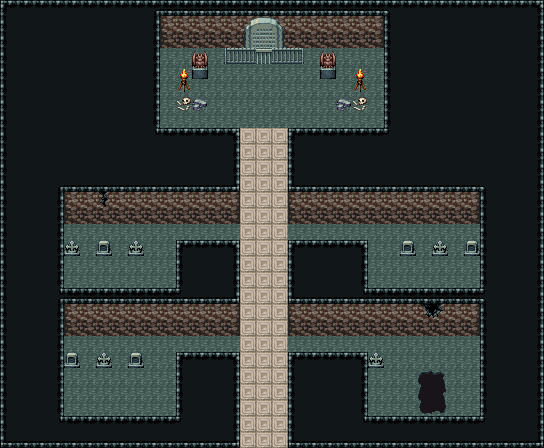

# 지하 묘지 · 납골 회랑

석판 참배길이 입구에서 북쪽 납골당까지 곧게 이어지고, 두 갈래 회랑이 가로지르는 지하 묘지. 회랑 아래 매장실 넷에 비석 둘~셋씩, 회랑 벽엔 금이 갔다. 남동쪽 매장실은 바닥이 무너져 불규칙한 구덩이가 벌어졌고, 북쪽 납골당은 해골 더미 사이로 창살과 봉인된 석실 문(가고일 둘)이 막고 있다. 34×28, tilesetId=oprn_dungeon_stone. 입구 (16,27). 통행 검사 목표 [[16,5],[5,16],[28,16],[7,24],[5,14]].

출구: (16,27) → outside 남쪽 계단참 → 지상 묘지



## 놓은 소품 (저작 순서)
(x,y)는 왼쪽 위, tiles는 행 단위 번호. 이식 칸(480~)은 공통 규칙 문서의 이식표.
```json
[
  {
    "prop": "석조 아치 문",
    "x": 15,
    "y": 1,
    "w": 3,
    "h": 2,
    "layer": "upper",
    "tiles": [
      [
        438,
        439,
        440
      ],
      [
        468,
        469,
        470
      ]
    ]
  },
  {
    "prop": "쇠창살 왼끝",
    "x": 14,
    "y": 3,
    "w": 1,
    "h": 1,
    "layer": "upper",
    "tiles": [
      [
        234
      ]
    ]
  },
  {
    "prop": "쇠창살",
    "x": 15,
    "y": 3,
    "w": 1,
    "h": 1,
    "layer": "upper",
    "tiles": [
      [
        235
      ]
    ]
  },
  {
    "prop": "창살 문",
    "x": 16,
    "y": 3,
    "w": 1,
    "h": 1,
    "layer": "upper",
    "tiles": [
      [
        205
      ]
    ]
  },
  {
    "prop": "쇠창살",
    "x": 17,
    "y": 3,
    "w": 1,
    "h": 1,
    "layer": "upper",
    "tiles": [
      [
        235
      ]
    ]
  },
  {
    "prop": "쇠창살 오른끝",
    "x": 18,
    "y": 3,
    "w": 1,
    "h": 1,
    "layer": "upper",
    "tiles": [
      [
        236
      ]
    ]
  },
  {
    "prop": "가고일 석상",
    "x": 12,
    "y": 3,
    "w": 1,
    "h": 2,
    "layer": "upper",
    "tiles": [
      [
        146
      ],
      [
        176
      ]
    ]
  },
  {
    "prop": "가고일 석상",
    "x": 20,
    "y": 3,
    "w": 1,
    "h": 2,
    "layer": "upper",
    "tiles": [
      [
        146
      ],
      [
        176
      ]
    ]
  },
  {
    "prop": "화로",
    "x": 11,
    "y": 4,
    "w": 1,
    "h": 2,
    "layer": "upper",
    "tiles": [
      [
        263
      ],
      [
        293
      ]
    ]
  },
  {
    "prop": "화로",
    "x": 22,
    "y": 4,
    "w": 1,
    "h": 2,
    "layer": "upper",
    "tiles": [
      [
        263
      ],
      [
        293
      ]
    ]
  },
  {
    "prop": "해골과 뼈",
    "x": 11,
    "y": 6,
    "w": 1,
    "h": 1,
    "layer": "upper",
    "tiles": [
      [
        299
      ]
    ]
  },
  {
    "prop": "잔돌 더미",
    "x": 12,
    "y": 6,
    "w": 1,
    "h": 1,
    "layer": "upper",
    "tiles": [
      [
        383
      ]
    ]
  },
  {
    "prop": "해골과 뼈",
    "x": 22,
    "y": 6,
    "w": 1,
    "h": 1,
    "layer": "upper",
    "tiles": [
      [
        299
      ]
    ]
  },
  {
    "prop": "잔돌 더미",
    "x": 21,
    "y": 6,
    "w": 1,
    "h": 1,
    "layer": "upper",
    "tiles": [
      [
        383
      ]
    ]
  },
  {
    "prop": "벽 균열",
    "x": 6,
    "y": 12,
    "w": 1,
    "h": 1,
    "layer": "upper",
    "tiles": [
      [
        267
      ]
    ]
  },
  {
    "prop": "벽 균열 큰",
    "x": 26,
    "y": 19,
    "w": 2,
    "h": 1,
    "layer": "upper",
    "tiles": [
      [
        268,
        269
      ]
    ]
  },
  {
    "prop": "십자 비석",
    "x": 4,
    "y": 15,
    "w": 1,
    "h": 1,
    "layer": "upper",
    "tiles": [
      [
        147
      ]
    ]
  },
  {
    "prop": "석판 비석",
    "x": 6,
    "y": 15,
    "w": 1,
    "h": 1,
    "layer": "upper",
    "tiles": [
      [
        148
      ]
    ]
  },
  {
    "prop": "십자 비석",
    "x": 8,
    "y": 15,
    "w": 1,
    "h": 1,
    "layer": "upper",
    "tiles": [
      [
        147
      ]
    ]
  },
  {
    "prop": "석판 비석",
    "x": 25,
    "y": 15,
    "w": 1,
    "h": 1,
    "layer": "upper",
    "tiles": [
      [
        148
      ]
    ]
  },
  {
    "prop": "십자 비석",
    "x": 27,
    "y": 15,
    "w": 1,
    "h": 1,
    "layer": "upper",
    "tiles": [
      [
        147
      ]
    ]
  },
  {
    "prop": "석판 비석",
    "x": 29,
    "y": 15,
    "w": 1,
    "h": 1,
    "layer": "upper",
    "tiles": [
      [
        148
      ]
    ]
  },
  {
    "prop": "석판 비석",
    "x": 4,
    "y": 22,
    "w": 1,
    "h": 1,
    "layer": "upper",
    "tiles": [
      [
        148
      ]
    ]
  },
  {
    "prop": "십자 비석",
    "x": 6,
    "y": 22,
    "w": 1,
    "h": 1,
    "layer": "upper",
    "tiles": [
      [
        147
      ]
    ]
  },
  {
    "prop": "석판 비석",
    "x": 8,
    "y": 22,
    "w": 1,
    "h": 1,
    "layer": "upper",
    "tiles": [
      [
        148
      ]
    ]
  },
  {
    "prop": "십자 비석",
    "x": 23,
    "y": 22,
    "w": 1,
    "h": 1,
    "layer": "upper",
    "tiles": [
      [
        147
      ]
    ]
  }
]
```

전체 두 레이어는 다음 배열 문서가 정답이다.
